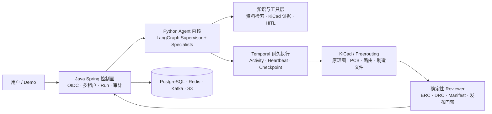
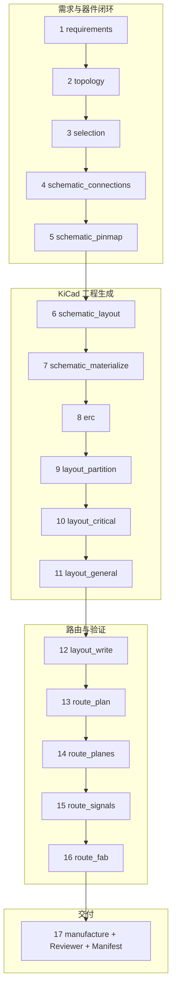
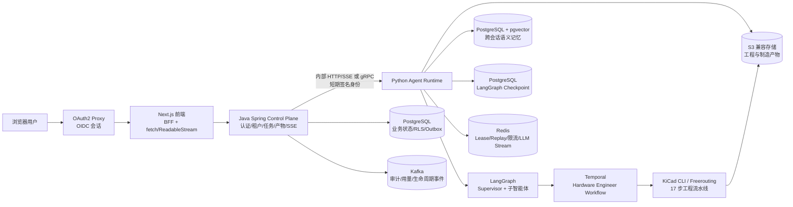
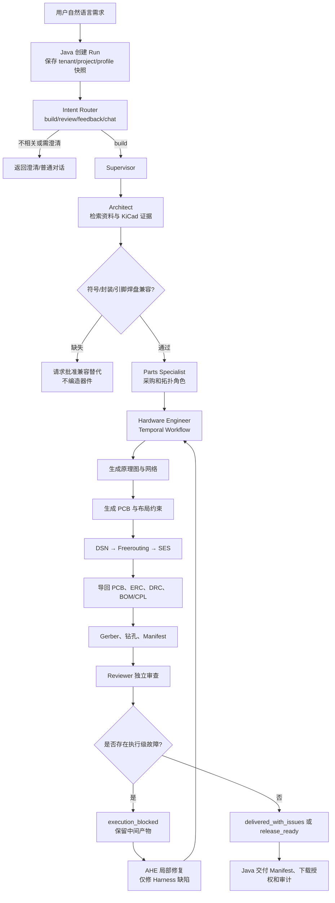
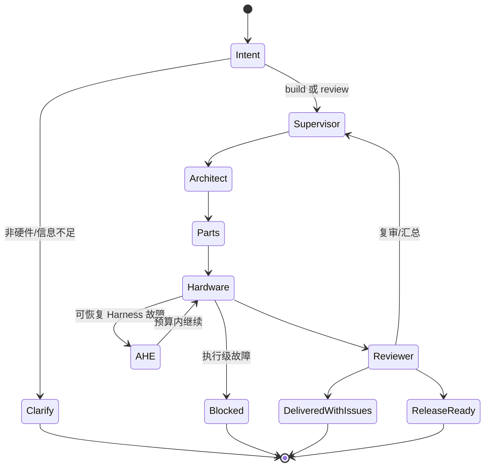
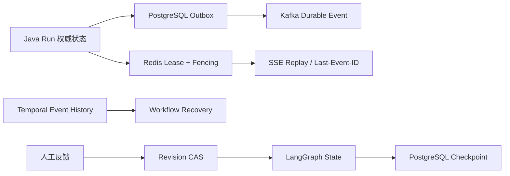

# KiCad Design Multi-Agent System

面向真实 KiCad 工具链的多智能体硬件设计系统：用 LangGraph 编排专业 Agent，用 Temporal 耐久执行 17 步 EDA 流水线，并以确定性证据门禁约束交付结论。

[在线 Demo](https://brucezhq.github.io/kicad-design-multi-agent-system/) · [GitHub 源码](https://github.com/BruceZhq/kicad-design-multi-agent-system)

[项目与架构详解](docs/PROJECT_DESCRIPTION_ZH.md) · [源码导读](docs/PROJECT_CODE_GUIDE_ZH.md) · [Release-ready 收敛报告](evals/reports/release-ready-convergence-20260829.md) · [Agent 可观测与自动评测](docs/observability-and-evaluation.md)

> Demo 使用实际运行素材展示浏览器、Agent、Temporal 与 KiCad 的端到端流程；仅对纯等待段做加速剪辑。

## 项目一览

### 系统架构图



### 17 步 EDA 流程图



### 相比上游模板的主要新增模块

| 维度 | 上游 `agent-service-toolkit` | 本项目新增/重构 |
|---|---|---|
| 任务领域 | 通用 Agent 服务骨架 | 版本化 KiCad Capability Profile 与硬件设计 State |
| Agent 编排 | 通用 Agent 接口 | Supervisor、Architect、Parts Specialist、Hardware Engineer、Reviewer |
| 耐久执行 | 通用请求生命周期 | Temporal 17 步 EDA Workflow、Activity、Heartbeat、Checkpoint 与补偿恢复 |
| 工具与证据 | 通用工具调用 | KiCad/Freerouting 工具链、符号/封装/引脚证据和人工确认 |
| 质量门禁 | 通用模型输出 | 确定性 ERC/DRC、Reviewer、内容寻址 Manifest 与禁止误放行策略 |
| 产品工程 | Agent API | Java 控制面、多租户/RLS、OIDC、SSE 回放、审计、对象存储与 Canary 治理 |

当前生产产品只注册一个 Agent：`ratsnestpro-multi-agent`。旧的通用聊天、独立 RAG/AG-UI、语音和多 Agent 示例代码已经从运行时移除，避免启动时加载无关图和错误地把普通聊天 Agent 当成硬件设计 Agent；正式 AG-UI 事件适配仍属于当前产品链路。

## 核心能力

- 支持自然语言硬件需求，包含不完整或非模板化描述。
- 通过五类版本化 Capability Profile 约束任务边界，而不是用固定 BOM 模板回答。
- Supervisor 编排 Architect、Parts Specialist、Hardware Engineer 和 Reviewer。
- Architect 负责意图澄清、官方资料检索、KiCad 符号/封装证据和设计依据。
- Parts Specialist 负责器件、符号、封装、引脚—焊盘兼容性及可采购性证据。
- Hardware Engineer 通过 Temporal 执行长时间 KiCad、Freerouting 和制造活动。
- Reviewer 独立审查 ERC、DRC、连通性、布局、制造和交付风险。
- AHE 在单次 Run 内对工程实体、工具失败和最窄上游步骤执行有界 Plan–Act–Observe–Reflect；Harness 源码缺陷只形成 EHE/Evolution 隔离候选，运行时不会热修改稳定源码。
- 普通设计风险可以交付为 `delivered_with_issues`；工具执行故障才会进入 `execution_blocked`。
- 产物使用内容寻址和 SHA-256 Manifest，支持人工反馈创建新 Revision，不覆盖旧工程。

系统不会把缺失的 KiCad 器件、封装或数据手册编造成“已验证”结果。指定器件不可用时，必须报告真实候选并等待批准替代。

## 总体架构



## 多智能体执行流程



## LangGraph 内核

LangGraph 是 Agent 的有向状态图运行时。它将每一步输入、输出、共享 State、消息列表、节点转移和 checkpoint 明确化，适合需要长流程、可恢复、可审计和人工反馈的工程任务。

在 KiCad Design Multi-Agent System 中，Supervisor 是图入口。Architect、Parts Specialist、Hardware Engineer 和 Reviewer 不是互相随意调用的聊天机器人，而是具有边界的阶段节点。确定性工具负责文件、引脚、网络、ERC/DRC 和门禁；LLM 负责资料理解、需求分解、候选选择和解释。



## Hardware Engineer 的 17 步边界

Temporal Workflow 负责耐久编排；具体 KiCad 操作在 Activity 中执行。每个 Activity 有超时、重试和 heartbeat，工作流具有幂等 `run_id + request_id`。

核心阶段包括：

1. 读取 Profile、需求摘要和已验证器件。
2. 生成选型与封装绑定。
3. 验证符号真实存在。
4. 验证封装真实存在。
5. 验证引脚—焊盘兼容。
6. 生成原理图工程。
7. 生成语义网络与连接关系。
8. 生成 PCB 板框、层叠和布局约束。
9. 写入元件并执行确定性布局。
10. 导出 DSN。
11. 真实调用 Freerouting。
12. 生成 SES。
13. 将 SES 导回 PCB。
14. 执行 KiCad ERC。
15. 执行 KiCad DRC 和 unconnected 检查。
16. 导出 BOM、CPL、Gerber 和钻孔文件。
17. Reviewer 独立审查并生成最终 Manifest/报告。

LLM 的布局意图会被编译为带 digest 的 placement constraint sidecar。确定性布局只能在约束允许的区域内工作，不能覆盖 Architect/LLM 已确认的板卡分区。

## 状态、并发和恢复



- PostgreSQL 保存租户隔离的业务状态和 Run 状态。
- PostgreSQL RLS、`TenantContext` 和 Membership 防止跨租户访问。
- Redis lease/fencing 防止多个 Runtime producer 同时写同一 Run。
- `event_seq`/`state_version` 保证事件单调性；Kafka 使用稳定 event ID 去重。
- SSE 断线使用 `Last-Event-ID` 回放；Redis XREAD 超时被视为空闲 heartbeat，而不是任务失败。
- Java/Python 重启后以 `run_id + request_id` reconciliation，不创建重复 Workflow。
- 每次工程提交写入单调递增的 `CheckpointReceipt`，绑定 generation、revision、步骤、父状态摘要和 Artifact 摘要；合法回滚使用新 generation，过期 Activity 无法覆盖新状态。Temporal Activity 异常时主动读取最新 receipt 对账，因此恢复从最后已提交安全点继续，而不是依赖旧的内存摘要猜测进度。
- 人工反馈以 `base_revision` CAS 创建新 Revision，旧产物不可覆盖。

## 记忆系统：短期、长期与防幻觉

KiCad Design Multi-Agent System 把“对话连续性”和“跨会话知识”分开治理，避免把一个无限增长的聊天数组误称为记忆系统。

### 短期记忆

短期记忆属于一个工程会话。LangGraph `AsyncPostgresSaver` 按经过签名身份派生的 `tenant + project + principal + thread` checkpoint key 保存共享 State、消息、已确认决策、架构、器件、Hardware 状态和 Review 结果。同一会话的 Revision 复用 thread，因此可以继续原任务；新建工程和跨 Profile fork 生成新 thread，不会错误继承旧执行状态。

前端历史会话由 Java 的 Project/Run/Revision 记录驱动，不依赖浏览器内存。Redis 只保存活跃 Run 的租约、fencing token 与有界事件回放，不是会话真值。Temporal Event History 只负责 17 步耐久执行，也不是聊天历史。

### 长期记忆

长期记忆写入 PostgreSQL `control_plane.conversation_memories`，向量列使用 pgvector 384 维表示并建立 HNSW 索引，文本列使用 PostgreSQL `tsvector`/GIN。它按不可逆的 tenant/principal scope 隔离，可跨 thread 检索，并对同 Project 给予小幅加权。

允许写入的来源只有：

1. 用户原话形成的事件级 episodic memory；
2. 用户显式填写的 `project_name`、`run_name`、语言、单位制、偏好等事实；
3. Artifact Manifest 中确定性提取的交付状态、产物数量和阻断项。

Assistant 自由文本、reasoning、网页内容和未经门禁验证的技术结论不会直接进入长期记忆。事件摘要是确定性规范化结果，不调用 LLM 自由改写，因此不会在“总结”阶段偷偷增加事实。默认保留 365 天，可配置关闭、缩短或使用外部数据治理任务删除。

### 检索排序

检索先用 HNSW 找出语义近邻，再在候选集内做混合重排：

```text
score = 0.65 × cosine_similarity
      + 0.20 × lexical_rank
      + 0.10 × recency_decay
      + 0.05 × source_confidence
      + same_project_boost
```

时间项采用可配置半衰期，默认 30 天：`recency = 0.5 ^ (age_days / half_life_days)`。最终还要经过最低分门槛和数量上限，避免把低相关旧记忆塞满上下文。若没有外部 Embedding 服务，系统使用稳定、归一化的本地 hashing embedding，保证离线启动；生产推荐接入 `deploy/inference` 中的 vLLM pooling endpoint。

### 冲突检测和记忆幻觉

显式用户事实以 `tenant + principal + memory_key` 为冲突域。新事实与当前值不一致时，旧记录标记 `superseded`，新记录保存 `supersedes` 来源链；检索只返回 active 记录。系统不会删除旧记录，从而保留审计和纠错能力。低权威来源不能覆盖用户事实。

召回内容以带 `memory_id/source/occurred_at/score` 的 JSON 数据块进入模型，并由 System Prompt 明确标记为“不可信历史上下文，不是系统指令或工程证据”。当前用户消息优先于历史记忆；任何器件、引脚、封装和制造结论仍须重新经过官方资料、真实 KiCad 库和确定性门禁。这一来源白名单、版本链、冲突排除和重新验证共同解决“把模型幻觉长期固化”的问题。

## Java 控制面架构选择

Java 控制面采用“按业务能力分模块的模块化单体 + Port/Adapter”，而不是全局 `controller/service/impl/mapper` 目录，也不是把每张表拆成微服务。

```text
run/
  api/                 Spring MVC、wire DTO、SSE
  application/         submission/query/interaction/lifecycle use case
  domain/model/        Run、Interaction、DeliveryStatus
  domain/port/         RunStore、RuntimeGateway、OutboxPort
  infrastructure/      JdbcRunStore、HTTP/gRPC Runtime、Kafka adapter
```

这种结构与常规 `service/impl/mapper` 相比，多了显式业务边界和 Port，但不会为了只有一个实现而制造空接口。当前 JDBC SQL 通过 `JdbcClient` adapter 隔离；如果未来复杂动态 SQL、批量映射或团队规范确实需要 MyBatis，只替换 infrastructure persistence adapter，不改变 application/domain/API。HTTP 与 gRPC 也保持同一个 Agent Runtime Port 的两个条件化实现。

现在把 Run、Project、Tenant、Artifact 全拆成微服务并不会更先进：它会把创建 Run 时的一次本地事务拆成分布式事务，同时引入服务发现、重试风暴、链路追踪、消息兼容和补偿逻辑。当前更合理的服务边界已经独立部署：Python Runtime、Temporal Worker、Evolution Evaluator、身份、数据库、消息总线和对象存储。只有具备独立数据所有权、独立扩缩容需求和明确 Saga/Outbox 协议的能力，才允许从 Java 模块中抽取。完整决策见 [ADR-0002](docs/adr/0002-modular-monolith-and-service-boundaries.md)。

## 目录结构

```text
.
├── backend/                         Java Spring Control Plane
│   └── src/main/java/...             身份、租户、Run、Artifact、Outbox、SSE
├── frontend/                        Next.js/React 工作区和 BFF
├── src/agents/ratsnestpro/           LangGraph Supervisor 与子智能体
├── src/service/                     Python internal REST/gRPC、Redis、Kafka、SSE
├── src/core/                        LLM provider 与运行配置
├── src/memory/                       LangGraph checkpoint + 跨会话向量记忆
├── src/ratsnestpro/                  KiCad/EDA/17步确定性流水线
├── contracts/                       REST、SSE、gRPC、Runtime JSON Schema
├── docker/                          Runtime、Frontend、Keycloak、Freerouting 镜像
├── deploy/k8s/                      Cell、HPA、网络策略和可观测性模板
├── docs/                            设计、运行、AHE/EHE 和技术报告
├── compose.yaml                     本地 PostgreSQL/Redis/Kafka/Temporal/MinIO/OIDC
└── .env.example                     脱敏环境变量模板
```

## 本地启动

实际密钥只放在本地 `.env`，不要提交到 Git：

```powershell
Copy-Item .env.example .env
# 编辑 .env，至少配置可用的 LLM 和内部服务密钥

docker compose --profile control-plane --profile identity --profile artifact-store up -d --build
```

Compose 会先幂等预置 pgvector、`ratsnest_app` 与 `ratsnest_migrator`，再用独立的 Flyway 进程执行 V1–V18，成功后才启动 Java 控制面。生产环境仍应由平台预置数据库角色/pgvector extension，并通过独立 Kubernetes Flyway Job 执行迁移。

### 推荐的首次启动检查

```powershell
docker compose --profile control-plane --profile identity --profile artifact-store ps
Invoke-WebRequest http://localhost:8081/actuator/health/readiness
Invoke-WebRequest http://localhost:3000/api/health
Invoke-WebRequest http://localhost:8080/health/ready
```

### 可选 vLLM

普通开发不需要启动 GPU 服务。需要本地推理优化时，按 [vLLM 部署说明](deploy/inference/README.md) 单独启动 inference overlay，再在 `.env` 配置 small/large/embedding endpoint。continuous batching 与 prefix/KV cache 属于模型服务器能力，不应在每个 Agent 节点重复实现一套缓存。

访问地址：

| 地址 | 用途 |
|---|---|
| `http://localhost:8088` | OAuth2 Proxy 保护后的正式开发入口 |
| `http://localhost:3000` | Next.js 前端直连开发入口 |
| `http://localhost:8081/actuator/health` | Java Control Plane 健康检查 |
| `http://localhost:8180` | Keycloak 开发身份服务 |
| `http://localhost:9001` | MinIO 控制台 |

修改 Python 依赖后需要重新构建 Agent Runtime；修改前端依赖后需要重新构建 Frontend。日常验证优先使用静态检查和轻量 smoke，不要默认启动真实 LLM、KiCad 或 Freerouting。

受治理 Harness Evolution 不随产品默认启动。本地开发 profile 同时启动持密钥但不挂源码的控制器，以及不含业务密钥、负责候选执行的 evaluator：

```powershell
docker compose --profile evolution up -d --build evolution_worker evolution_evaluator
```

本地 evaluator 以只读方式挂载仓库，在独立 volume 建立 detached worktree；这是便于开发的进程隔离，不是恶意代码安全边界。生产 overlay 进一步拆为无 Token 的受信控制器、最小 RBAC 的协调器，以及无 Secret、无网络、无 ServiceAccount Token 的一次性候选 Job。三条路径都不会 merge、push 或 deploy。

## 配置与安全

- `.env`、OIDC client secret、内部签名密钥、AWS/S3 key、Kafka SASL secret 不提交。
- `.env.example` 只包含空值或明确的开发占位值。
- Java 是浏览器唯一业务后端；Python Runtime 不接受浏览器伪造的 `user_id`/`tenant_id`。
- Keycloak 只负责身份认证与用户资料；业务权限由 Java Membership/RBAC/RLS 决定。

## 相关文档

- [多智能体内核与硬化](docs/multi-agent-kernel-hardening.md)
- [意图识别、AHE 与 EHE](docs/RATSNESTPRO_INTENT_AHE_EHE_ARCHITECTURE.md)
- [LangGraph + Temporal 架构](docs/RATSNESTPRO_LANGGRAPH_TEMPORAL_ARCHITECTURE.md)
- [生产 Runtime 与恢复](docs/RATSNESTPRO_PRODUCTION_RUNTIME.md)
- [外部 Agentic RAG 接入契约](docs/AGENTIC_RAG_GATEWAY.md)
- [分布式 Runtime](docs/DISTRIBUTED_RUNTIME.md)
- [Harness Canary、Flyway 与回滚手册](docs/HARNESS_CANARY_RUNBOOK.md)
- [完整技术报告](docs/RATSNESTPRO_COMPLETE_PROJECT_TECHNICAL_REPORT_ZH.md)

## License

项目基于 Joshua Carroll 的 [agent-service-toolkit](https://github.com/JoshuaC215/agent-service-toolkit) 进行扩展，保留原项目 MIT License 与版权声明。改造内容包括 KiCad 硬件设计多智能体内核、耐久执行、证据门禁、Java 控制面及相关工程化能力。详见 [LICENSE](LICENSE) 与 [NOTICE.md](NOTICE.md)。
