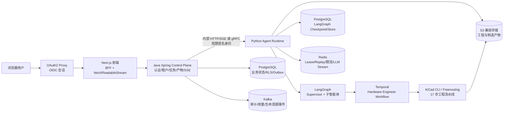
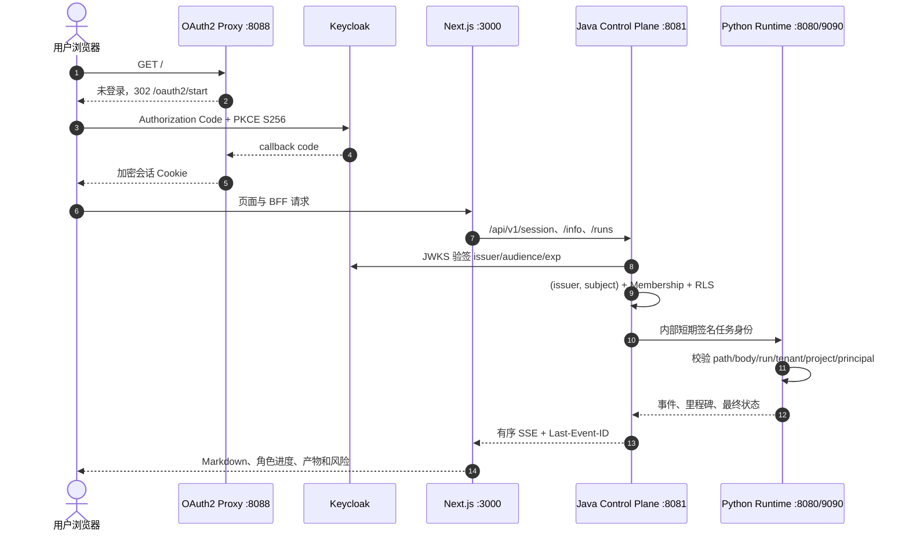
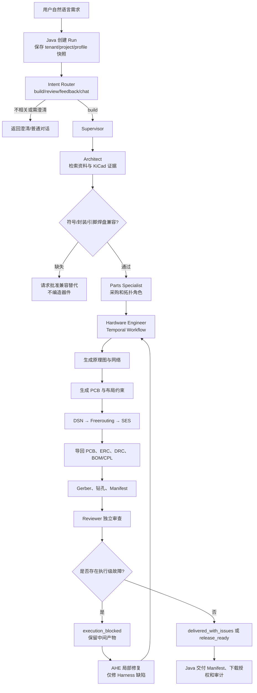
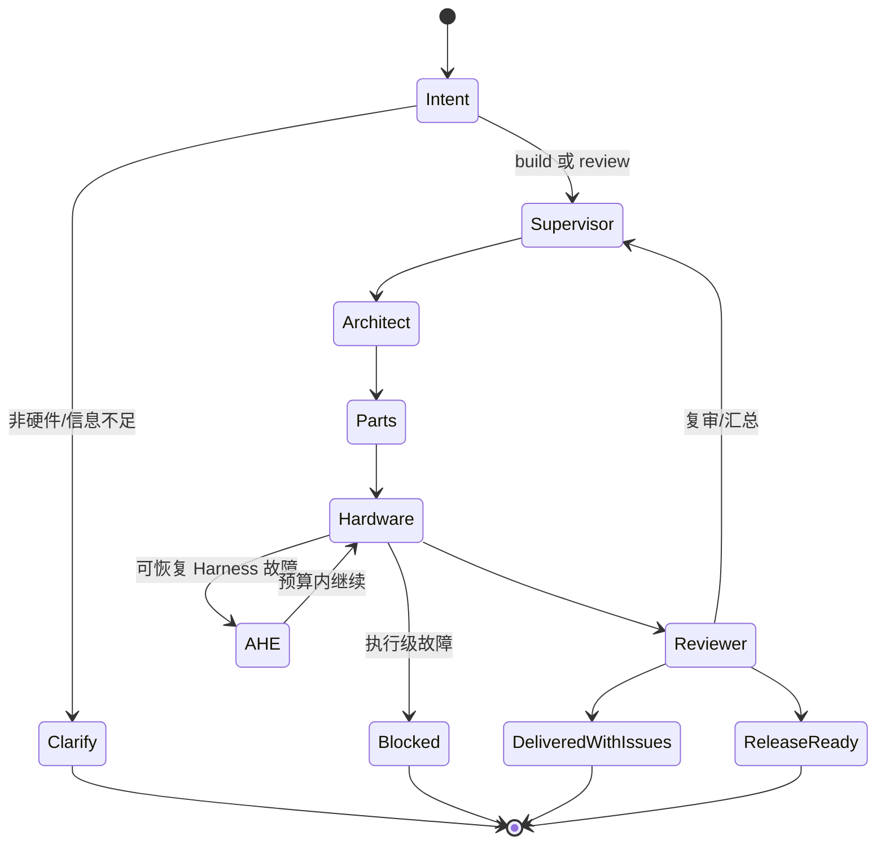
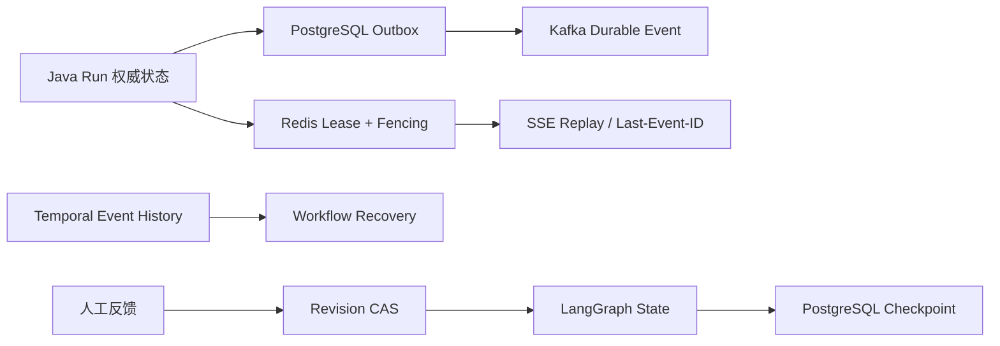

# CircuitFoundry

CircuitFoundry 是由 **CircuitFoundry Engineering** 团队维护、面向版本化 KiCad 硬件设计场景的企业级多智能体系统。它把自然语言需求转换成可审查的 KiCad 工程、制造文件和风险报告，并通过 Java 控制面提供多租户、身份、任务、产物和审计能力。为保持数据库迁移、内部 API 和既有工程兼容，源码中的 `ratsnestpro`、`ratsnest-*` 仍作为稳定的内部标识存在。

当前生产产品只注册一个 Agent：`ratsnestpro-multi-agent`。旧的通用聊天、RAG、AG-UI、语音和多 Agent 示例代码已经从运行时移除，避免启动时加载无关图和错误地把普通聊天 Agent 当成硬件设计 Agent。

## 当前能力边界

- 支持自然语言硬件需求，包含不完整或非模板化描述。
- 通过五类版本化 Capability Profile 约束任务边界，而不是用固定 BOM 模板回答。
- Supervisor 编排 Architect、Parts Specialist、Hardware Engineer 和 Reviewer。
- Architect 负责意图澄清、官方资料检索、KiCad 符号/封装证据和设计依据。
- Parts Specialist 负责器件、符号、封装、引脚—焊盘兼容性及可采购性证据。
- Hardware Engineer 通过 Temporal 执行长时间 KiCad、Freerouting 和制造活动。
- Reviewer 独立审查 ERC、DRC、连通性、布局、制造和交付风险。
- AHE 只修复 Harness/流程缺陷；EHE 聚合跨任务的匿名失败签名并生成隔离候选，不直接修改稳定源码。
- 普通设计风险可以交付为 `delivered_with_issues`；工具执行故障才会进入 `execution_blocked`。
- 产物使用内容寻址和 SHA-256 Manifest，支持人工反馈创建新 Revision，不覆盖旧工程。

系统不会把缺失的 KiCad 器件、封装或数据手册编造成“已验证”结果。指定器件不可用时，必须报告真实候选并等待批准替代。

## 总体架构



### 服务边界

| 层 | 技术 | 负责内容 |
|---|---|---|
| 浏览器入口 | OAuth2 Proxy + Keycloak | OIDC Authorization Code + PKCE、登录会话、退出登录 |
| Web | Next.js / React / TypeScript | 白色团队工作区、聊天、模型/Profile选择、Markdown渲染、SSE消费、资料页 |
| 控制面 | Java 21 + Spring Boot | OIDC/JWKS验签、租户/RBAC、Project/Run/Revision、配额、Artifact授权、SSE、审计 |
| Agent Runtime | Python + FastAPI | LangGraph运行、内部身份校验、Redis运行协调、事件转换 |
| Agent Kernel | LangGraph | State、节点、handoff、checkpoint、Supervisor和角色协作 |
| 耐久工程执行 | Temporal | Workflow、Activity、重试、超时、Event History、取消和恢复 |
| 持久化 | PostgreSQL | Java业务表、RLS、Outbox、LangGraph checkpoint/store |
| 协调与回放 | Redis | lease、fencing token、幂等、SSE事件回放、LLM输出流 |
| 事件总线 | Kafka | Durable生命周期、审计、用量和EHE observation |
| 文件存储 | S3兼容对象存储 | KiCad、Gerber、BOM、CPL、DSN、SES和审查报告 |

## 登录与请求泳道



## AG-UI 前端交互标准

AG-UI（Agent User Interaction）是一个面向 Agent 与前端之间交互事件的通用协议/适配层，通常用于把 Agent 的消息、工具调用、状态更新和流式事件转换为前端可消费的事件流。它适合通用 Copilot 或 Agent UI 集成，但它不是 LangGraph 本身，也不是身份认证协议，更不是 KiCad 执行引擎。

CircuitFoundry 将 AG-UI 作为 Agent 事件的前端交互标准，但不把 AG-UI 当作公网认证入口。正式产品链路固定为：

```text
浏览器 → OAuth2 Proxy → Next.js BFF → Java Control Plane → Python internal_api/gRPC → RatsNestPro LangGraph
```

浏览器仍只连接 Java 的 REST + SSE；Java 把 Python Runtime 的消息、工具证据、状态、产物和人工确认事件规范化为 AG-UI 事件。Next.js 通过 `fetch()` 和 `ReadableStream` 消费有序 `RunEvent`，并用 `Last-Event-ID` 恢复。AG-UI 的 `CUSTOM/ratsnest.human-input-required.v1` 驱动同一 Run 的暂停与恢复；普通 Markdown、reasoning 摘要和工具 JSON 则使用各自的可视组件。这样既获得 AG-UI 的前端生态兼容性，又保持 OIDC、租户、审计和 Run 状态只有一条权威链路。

## 多智能体执行流程



## LangGraph 内核

LangGraph 是 Agent 的有向状态图运行时。它将每一步输入、输出、共享 State、消息列表、节点转移和 checkpoint 明确化，适合需要长流程、可恢复、可审计和人工反馈的工程任务。

在 CircuitFoundry 中，Supervisor 是图入口。Architect、Parts Specialist、Hardware Engineer 和 Reviewer 不是互相随意调用的聊天机器人，而是具有边界的阶段节点。确定性工具负责文件、引脚、网络、ERC/DRC 和门禁；LLM 负责资料理解、需求分解、候选选择和解释。



## Hardware Engineer 的 17 步边界

Temporal Workflow 负责耐久编排；具体 KiCad 操作在 Activity 中执行。每个 Activity 有超时、重试和 heartbeat，工作流具有幂等 `run_id + request_id`。

核心阶段包括：

1. 读取 Profile、需求摘要和已验证器件。
2. 生成选型与封装绑定。
3. 验证符号真实存在。
4. 验证封装真实存在。
5. 验证引脚—焊盘兼容。
6. 生成原理图工程。
7. 生成语义网络与连接关系。
8. 生成 PCB 板框、层叠和布局约束。
9. 写入元件并执行确定性布局。
10. 导出 DSN。
11. 真实调用 Freerouting。
12. 生成 SES。
13. 将 SES 导回 PCB。
14. 执行 KiCad ERC。
15. 执行 KiCad DRC 和 unconnected 检查。
16. 导出 BOM、CPL、Gerber 和钻孔文件。
17. Reviewer 独立审查并生成最终 Manifest/报告。

LLM 的布局意图会被编译为带 digest 的 placement constraint sidecar。确定性布局只能在约束允许的区域内工作，不能覆盖 Architect/LLM 已确认的板卡分区。

## AHE 与 EHE

### AHE

AHE（Agentic Harness Engineer）处理框架自身的可恢复缺陷，例如事件格式漂移、状态增量错误、输入映射错误、局部网络生成失败或旧上下文污染。它不把真实器件缺失、硬件规格冲突或 KiCad 工具不可用伪装成成功。

每次任务受总修复次数、同一失败签名次数、墙钟时间和 LLM token 预算限制。预算耗尽后系统保留产物并报告问题，而不是无限循环。

### EHE

EHE（Evolutionary Harness Engineer）把匿名化的跨项目失败签名聚合为受治理候选。每个 Run 固化 Harness 版本；候选只能修改低风险白名单文件，不能读取或修改 sealed holdout/固定 grader，也不能改身份、迁移、部署或发布真值。候选需要经过固定评测、内容摘要绑定和独立人工批准，之后才有资格进入 Kubernetes Canary；系统不会自动合并或自动提升到生产。

## 状态、并发和恢复



- PostgreSQL 保存租户隔离的业务状态和 Run 状态。
- PostgreSQL RLS、`TenantContext` 和 Membership 防止跨租户访问。
- Redis lease/fencing 防止多个 Runtime producer 同时写同一 Run。
- `event_seq`/`state_version` 保证事件单调性；Kafka 使用稳定 event ID 去重。
- SSE 断线使用 `Last-Event-ID` 回放；Redis XREAD 超时被视为空闲 heartbeat，而不是任务失败。
- Java/Python 重启后以 `run_id + request_id` reconciliation，不创建重复 Workflow。
- 人工反馈以 `base_revision` CAS 创建新 Revision，旧产物不可覆盖。

## 目录结构

```text
.
├── backend/                         Java Spring Control Plane
│   └── src/main/java/...             身份、租户、Run、Artifact、Outbox、SSE
├── frontend/                        Next.js/React 工作区和 BFF
├── src/agents/ratsnestpro/           LangGraph Supervisor 与子智能体
├── src/service/                     Python internal REST/gRPC、Redis、Kafka、SSE
├── src/core/                        LLM provider 与运行配置
├── src/memory/postgres.py            LangGraph PostgreSQL checkpoint/store
├── src/RatsNestPro-main/...          KiCad/EDA/17步流水线
├── contracts/                       REST、SSE、gRPC、Runtime JSON Schema
├── docker/                          Runtime、Frontend、Keycloak、Freerouting 镜像
├── deploy/k8s/                      Cell、HPA、网络策略和可观测性模板
├── docs/                            设计、运行、AHE/EHE 和技术报告
├── compose.yaml                     本地 PostgreSQL/Redis/Kafka/Temporal/MinIO/OIDC
└── .env.example                     脱敏环境变量模板
```

## 本地启动

实际密钥只放在本地 `.env`，不要提交到 Git：

```powershell
Copy-Item .env.example .env
# 编辑 .env，至少配置可用的 LLM 和内部服务密钥

docker compose --profile control-plane --profile identity --profile artifact-store up -d --build
```

Compose 会先幂等预置 `ratsnest_app` 与 `ratsnest_migrator`，再用独立的 Flyway 进程执行 V1–V11，成功后才启动 Java 控制面。生产环境仍应由平台预置数据库角色，并通过独立 Kubernetes Flyway Job 执行迁移。

访问地址：

| 地址 | 用途 |
|---|---|
| `http://localhost:8088` | OAuth2 Proxy 保护后的正式开发入口 |
| `http://localhost:3000` | Next.js 前端直连开发入口 |
| `http://localhost:8081/actuator/health` | Java Control Plane 健康检查 |
| `http://localhost:8180` | Keycloak 开发身份服务 |
| `http://localhost:9001` | MinIO 控制台 |

修改 Python 依赖后需要重新构建 Agent Runtime；修改前端依赖后需要重新构建 Frontend。日常验证优先使用静态检查和轻量 smoke，不要默认启动真实 LLM、KiCad 或 Freerouting。

受治理 Harness Evolution 不随产品默认启动。本地开发 profile 同时启动持密钥但不挂源码的控制器，以及不含业务密钥、负责候选执行的 evaluator：

```powershell
docker compose --profile evolution up -d --build evolution_worker evolution_evaluator
```

本地 evaluator 以只读方式挂载仓库，在独立 volume 建立 detached worktree；这是便于开发的进程隔离，不是恶意代码安全边界。生产 overlay 进一步拆为无 Token 的受信控制器、最小 RBAC 的协调器，以及无 Secret、无网络、无 ServiceAccount Token 的一次性候选 Job。三条路径都不会 merge、push 或 deploy。

## 配置与安全

- `.env`、OIDC client secret、内部签名密钥、AWS/S3 key、Kafka SASL secret 不提交。
- `.env.example` 只包含空值或明确的开发占位值。
- Java 是浏览器唯一业务后端；Python Runtime 不接受浏览器伪造的 `user_id`/`tenant_id`。
- Keycloak 只负责身份认证与用户资料；业务权限由 Java Membership/RBAC/RLS 决定。
- 本地 Compose 是开发环境，不代表已经完成跨区域 HA、真实 Metrics API、TLS 演练或 RPO/RTO 验收。

## 相关文档

- [多智能体内核与硬化](docs/multi-agent-kernel-hardening.md)
- [意图识别、AHE 与 EHE](docs/RATSNESTPRO_INTENT_AHE_EHE_ARCHITECTURE.md)
- [LangGraph + Temporal 架构](docs/RATSNESTPRO_LANGGRAPH_TEMPORAL_ARCHITECTURE.md)
- [生产 Runtime 与恢复](docs/RATSNESTPRO_PRODUCTION_RUNTIME.md)
- [分布式 Runtime](docs/DISTRIBUTED_RUNTIME.md)
- [Harness Canary、Flyway 与回滚手册](docs/HARNESS_CANARY_RUNBOOK.md)
- [完整技术报告](docs/RATSNESTPRO_COMPLETE_PROJECT_TECHNICAL_REPORT_ZH.md)

## 当前已知边界

2. 本地 Compose 已具备组件连通配置，但真实 Kubernetes Metrics API、跨区域 failover/failback、TLS 重启恢复和 RPO/RTO 仍需要在目标集群演练。
3. 交付工程是否满足全部硬件设计规则仍需 Reviewer 和人工硬件工程师确认；系统不会把 `delivered_with_issues` 冒充 `release_ready`。

## License

项目使用 MIT License，详见 [LICENSE](LICENSE)。
