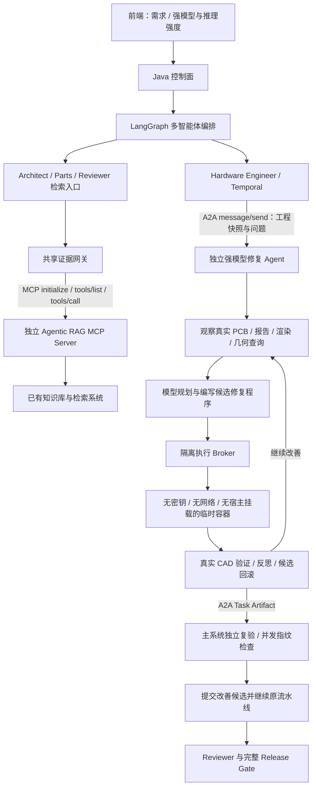

# Agentic RAG MCP 与独立 A2A 工程修复服务

## 1. 服务边界



外部修复 Agent 不是 LangGraph 节点，也不是“每轮推理转发接口”。它在独立进程、独立存储中运行完整的观察—规划—执行—验证循环。内部系统委派一个工程任务、查询状态并接收候选；不会在外部执行时运行第二套模型循环。

代码复用 CAD 适配器和隔离执行器，以免形成两套判断规则。独立部署与代码复用并不冲突。外部服务没有主系统 Run 目录、数据库或 Docker Socket；只有执行 Broker 持有 Docker 管理权限。

## 2. MCP：挂载已有 Agentic RAG

### 已经有 MCP Server

在本地受保护的 `.env` 中设置（不要提交真实密钥）：

```dotenv
RATSNEST_KNOWLEDGE_TRANSPORT=mcp
RATSNEST_KNOWLEDGE_GATEWAY_URL=http://your-rag-service:8000/mcp
RATSNEST_KNOWLEDGE_GATEWAY_TOKEN=<服务认证令牌>
RATSNEST_KNOWLEDGE_MCP_TOOL=search_knowledge
```

该 URL 是 MCP Streamable HTTP 端点，不是普通搜索 REST 地址。客户端实际调用 MCP SDK 完成初始化、工具发现与调用。配置的工具必须接受 `docs/AGENTIC_RAG_GATEWAY.md` 中的查询字段，并返回其中的证据 JSON 对象；支持 structuredContent 或单个 JSON 文本内容块。

查询包含 query、role、limit、evidence_types 和 principal/tenant/project scope。检索服务器必须按受信调用方和 scope 执行 ACL；不能仅相信浏览器提交的租户名。返回的 `evidence_sufficient=true` 不会直接变成器件放行：来源、型号、封装和 pin/pad 证据仍由现有网关验证。

### 现有知识库只有 HTTP 接口

启用仓库提供的轻量 MCP facade，无需复制知识库：

```dotenv
RATSNEST_KNOWLEDGE_TRANSPORT=mcp
RATSNEST_KNOWLEDGE_GATEWAY_URL=http://knowledge_mcp:8099/mcp
RATSNEST_KNOWLEDGE_GATEWAY_TOKEN=<至少32字符随机令牌>
RATSNEST_RAG_UPSTREAM_URL=http://your-rag-service:8000/search
RATSNEST_RAG_UPSTREAM_TOKEN=<原知识库认证令牌>
```

原 HTTP 服务仍需实现上述查询/结果契约；如果其字段不同，在 facade 的 `search_knowledge` 内做字段映射。传输改变不会自动把不兼容的检索结果变成合格工程证据。

主要文件：

| 文件 | 职责 |
| --- | --- |
| `src/agents/ratsnestpro/knowledge_gateway.py` | 角色共享入口、HTTP/MCP 切换、证据归一化与校验 |
| `src/agents/ratsnestpro/knowledge_mcp.py` | 真正 MCP ClientSession；初始化、发现、调用、超时 |
| `src/agents/ratsnestpro/knowledge_mcp_server.py` | 可选 MCP Server，代理已有 HTTP RAG |

## 3. A2A：启用独立强模型修复 Agent

### 从 blocked 现场接手

委派现在携带当前工作目录内支持的工程文件与报告（包括原理图、PCB、库资产、DSN/SES、BOM、Markdown/JSON 检查报告），以及当前 State 中的各步骤检查、故障、修复/重规划历史和检查点标识。`handoff-index.json` 给出文件摘要与排除项；`handoff-trace.json` 保留过程证据。模型通过 `read_file` 的 `handoff/` 路径前缀分页读取，不把全量日志反复塞进每次推理。

这里的“完整”限于已经持久化的工程 State 和工程目录，不能重建未保存的浏览器聊天。密钥、原始模型调用日志、旧候选缓存和 Git 历史不外传；超过传输上限会明确失败，不偷偷提交残缺快照。PDF 随工程证据传递，文本观察仍以已提取的结构化证据为主。

外部服务从副本联合修改原理图、PCB 与允许的布局状态，并可创建和执行 `programs/repair_generator.py`，把针对生成器的修改保存在工程级程序中。生产 `/app` 源码只读，程序永远在无网络、无密钥沙箱执行。锁定器件身份、嵌入符号定义与已确认的 pin/net 契约不能通过脚本偷改；需要修改设计意图时仍须走上游确认通道。

`ProjectHost` 对实际原理图执行 ERC 与导出网络一致性检查，对 PCB 执行真实 DRC、几何和需求不变量检查，并检查保留的步骤契约。物理检查干净后重建候选制造输出。联合评分未归零时继续观察与修复，预算或轮次耗尽则只保留已验证的改善。不能承诺任意输入自动成功。

主系统重新验收联合文件后，通过 `project_transaction.py` 的日志提交原理图、PCB、程序及状态更新。中断后仅允许对“原文件或同一候选”前滚；任何更新版本冲突都拒绝覆盖。已完成事务 ID 随检查点保存，避免后续恢复重复应用旧事务。制造文件由主系统再生成，Reviewer 与最终发布检查仍是最后的权威。

联合文件协议为 `ratsnest.external-repair.v2`，Agent Card 应用版本为 `2.0.0`（A2A 协议仍为 0.3）。客户端拒绝旧版本服务，防止只提交 PCB 而丢失原理图修改。更新时需一起构建并更新 Worker、外部 Agent 和执行 Broker/沙箱镜像；不要新旧混用。

使用 A2A 0.3 JSON-RPC，提供：

- `/.well-known/agent-card.json`：能力发现，要求服务认证。
- `/a2a` 的 `message/send`：提交 DataPart 工程快照，返回 Task。
- `tasks/get`：查询工作状态、进度与终态产物。
- `tasks/cancel`：协作取消；已经开始的模型调用/沙箱执行仍受自身超时限制，取消后结果不提交。

配置：

```dotenv
RATSNEST_A2A_REPAIR_URL=http://external_repair_agent:8098/a2a
RATSNEST_A2A_REPAIR_TOKEN=<至少32字符独立随机令牌>
RATSNEST_A2A_ALLOWED_MODELS=<前端所选强模型的内部标识，逗号分隔>
RATSNEST_A2A_OPENAI_API_KEY=<外部服务专用模型Key>
RATSNEST_A2A_OPENAI_BASE_URL=https://api.openai.com/v1
```

模型与 reasoning effort 沿用前端已有强模型配置，原样发送给外部任务；外部服务再次检查 allowlist 和模型配置。allowlist 不是模型权限的替代品：供应商账号必须实际支持该模型与推理强度。不要把本聊天产品里显示的模型名称直接当作供应商 API 已支持的型号。

此部署模板注入 OpenAI/兼容端点专用凭据。其他供应商需要显式增加相应环境配置，不能把主 Runtime 的整份 `.env` 挂到外部服务。URL 留空时沿用已有内部修复路径；URL 已配置但远端失败时，不会偷偷调用第二个模型导致重复支出。

### 候选权限与真实验证

当前外部循环能够查询真实几何、观察原理图及 PCB 渲染、编写 Python 工程修改程序，在沙箱中执行，并联合修改允许的布局归属、刷新锁定器件证据。它返回原理图、PCB、可选工程程序与布局归属增量；主系统重新获取/核验证据、执行真实评分与并发指纹校验后提交。

不接受外部声明的 `release_ready` 作为发布真值。Task `completed` 仅表示修复委派完成，可能 `improved=false`；候选改善也不等于完整发布通过。原理图需求变更、器件身份替换和任意生产生成器源码补丁不属于这个候选接口，仍由已有上游重规划/HITL/受治理演进处理。

### 幂等、预算与恢复

- 输入快照哈希形成 messageId，同一快照重连附着原 Task，不重复付费执行。
- 外部 SQLite WAL 持久化 Task、输入摘要、状态与预算，服务必须单副本部署。
- 每次模型调用前持久化预留预算；调用异常时不自动退款，避免不确定计费后重复调用。默认外部修复预算 120,000 tokens、循环墙钟 600 秒，子进程上限 900 秒。
- 同一 scope/allowance 共享预算。新快照不会自动重置额度；需要沿用主系统已有的明确预算授权流程。
- 服务重启把未完成任务标记失败，不自动重放可能已经付费的调用。同一个 messageId 查询仍得到这个失败任务；检查后使用新的、显式授权的委派输入再执行。
- 本地提交同时检查原 State 和 PCB 指纹；主工程已经改变时，过期候选不得覆盖。

主要文件：

| 文件 | 职责 |
| --- | --- |
| `src/ratsnestpro/repair/a2a_contracts.py` | 快照字段、路径限制、摘要和可移植路径 |
| `src/ratsnestpro/repair/a2a_client.py` | A2A 委派、查询、事件回传、本地候选复验 |
| `src/repair_executor/a2a_agent.py` | 独立服务、持久任务、预算、完整外部模型循环 |
| `src/ratsnestpro/repair/pipeline_adapter.py` | 原 Hardware 修复入口选择内部或外部执行 |
| `src/ratsnestpro/repair/session.py` | 两种部署共用的修复循环实现 |
| `src/repair_executor/docker_runner.py` | 固定隔离策略的代码执行容器 |
| `src/service/ahe_event.py` | 外部任务 ID、状态、轮次进入原事件链路 |

## 4. 本地启动

先填写本地 `.env` 和已有 `.env.strong-repair`，保留现有基础设施与数据。以下 PowerShell 命令不会删除容器或卷：

```powershell
Set-Location 'E:\agent-service-toolkit-main\agent-service-toolkit_frame\agent-service-toolkit-main'
$composeArgs = @('--env-file', '.env', '--env-file', '.env.strong-repair', '-f', 'compose.yaml', '-f', 'deploy/compose/strong-repair.yaml', '-f', 'deploy/compose/agent-protocols.yaml')
docker compose @composeArgs --profile a2a-repair --profile rag-mcp config --quiet
docker compose @composeArgs build agent_service
```

构建完成后，通过 `docker image inspect ratsnestpro-agent-runtime:local --format '{{.Id}}'` 获取新 image ID，将本地 `.env.strong-repair` 的 `RATSNEST_REPAIR_SANDBOX_IMAGE` 更新为该 ID，使沙箱与新适配器版本匹配。然后：

```powershell
docker compose @composeArgs --profile a2a-repair --profile rag-mcp up -d --no-deps repair_executor external_repair_agent knowledge_mcp agent_service temporal_worker
```

若直接使用现成 MCP Server，省略 `--profile rag-mcp` 与 `knowledge_mcp`。`--no-deps` 假定原 PostgreSQL、Redis、Temporal 等基础设施已经在线；这不是从零部署全部基础设施的命令。运行中的任务请先结束或安全暂停后再更新 Worker。

两个新服务均不映射公网端口。当前是受信内网、单副本试点部署；公网生产需额外设置服务身份/mTLS、每租户认证与配额、对象存储快照、数据库任务队列和高可用恢复。不要直接把 8098/8099 暴露公网。

## 5. 验证口径

### 联合工程修复 v2 验证记录

- 2026-09-09：`test_project_repair.py`、`test_agent_protocols.py`、`test_strong_repair_session.py`、`test_strong_repair_event_bridge.py` 共 50 项通过。
- 真实隔离执行：从只读样例加载原理图/PCB，在临时无网络容器中生成并运行工程脚本，成功返回原理图、PCB 与程序文件。没有修改样例原文件。
- 真实 CAD 评分：使用当前任务保留的、旧格式的未布线布局副本及对应 State/原理图，实际执行联合评分，输出 `(5, 0, 74)` 和 3 项保留契约问题。该记录仅验证检查器接通，**不是发布正例，也不是强模型修复成功率**。
- 另发现当前任务主 PCB 声明 KiCad 10，而构建镜像为 KiCad 9。新增版本预检，避免把工具链不兼容当作模型设计错误消耗预算。不得通过修改文件头伪装兼容，应对齐镜像工具链。
- 尚未进行付费强模型端到端试验，也未切换运行中的服务。部署前需配置 A2A 地址、模型白名单与专用凭据，并一起更新外部服务、Worker、Broker 和沙箱镜像。

联合修复代码入口：`src/ratsnestpro/repair/project_host.py`、`project_transaction.py`。前者负责项目副本、原理图/PCB/程序联动与独立评分；后者负责多文件日志提交与恢复。

`tests/test_agent_protocols.py` 覆盖真实 MCP initialize/list/call、本地 A2A 标准信封、认证、幂等、持久化、取消及过期候选拒绝；测试中的修复函数为替身，不调用付费模型，也不能证明一块 PCB 达到 release-ready。

接入实际知识库后，先检查 Parts 工具证据中存在真实来源/命中块；启用 A2A 后，检查 `strong_repair.a2a_submitted`、进度和候选提交记录。最后仍按实际 ERC、DRC、连通性及发布 Manifest 验收，不以“协议调用成功”替代端到端工程验收。
