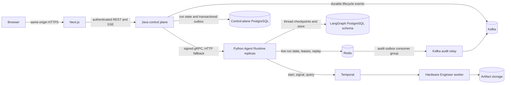

# Distributed runtime architecture

This document defines ownership and delivery guarantees for a distributed RatsNest
deployment. The single-node Compose stack is a development environment. It is useful
for local integration and demonstrations, but it is not a high-availability production
topology.

## Request and execution path

Java is the only external backend and owns OIDC verification, tenant authorization,
projects, quotas, public run state, and artifact authorization. Next.js never calls
Python directly. Python accepts only a short-lived, request-bound identity signed by
Java on the internal network; browser-provided `user_id` and `tenant_id` are not part
of that boundary.

The browser consumes Java SSE with `fetch` plus a `ReadableStream` parser. Java
subscribes to Python events, preserves the monotonic sequence, and supports
`Last-Event-ID`. Closing either browser connection cancels only that subscription;
it never implicitly cancels the Python or Temporal execution.

## Java run state and transactional outbox

The control-plane `runs` table is the SaaS-visible state authority. State transitions
are monotonic. Each accepted run and durable lifecycle transition is written in the
same PostgreSQL transaction as a versioned outbox event. A bounded publisher claims
rows with `SKIP LOCKED`, publishes them to Kafka with a stable event ID, and only then
acknowledges them. A later event for one run cannot be claimed while an earlier
version remains unpublished, preserving per-run order across publisher replicas.
Delivery is at least once; consumers deduplicate by event ID.

If Java stops after committing a run but before observing Python's response, a bounded
reconciler retries by `request_id`. Python uses that same value as the run key and the
Temporal workflow key, so recovery attaches to existing work. `event_seq` reconciles
Python execution events with Java's durable view; high-frequency token and reasoning
deltas remain on the streaming path and are not written to Kafka.

## Redis: live HTTP run coordination

Redis owns short-lived distributed coordination needed by stateless FastAPI replicas:

- current run status and ownership;
- bounded SSE replay events and monotonically increasing event IDs;
- the request fingerprint used for idempotency;
- cancellation intent;
- an expiring execution lease and its renewal metadata;
- the audit outbox awaiting Kafka publication.

Redis is not the authoritative LangGraph conversation checkpoint and it does not own
the durable Hardware Engineer workflow.

Java creates one `request_id` after accepting an idempotent public request and reuses it
for every runtime retry. A repeated private request with the same ID and fingerprint
attaches to the existing run; the same ID with different input is a conflict. On an SSE
disconnect the browser reconnects with `Last-Event-ID`. Redis replays retained events
after that ID. If the requested ID
has fallen outside the bounded replay window, the client must fetch run status and
reconstruct the UI from durable state rather than silently starting another run.

Closing a browser connection only closes that subscription. It is not a business-level
cancel. An explicit Java control request asks Python to signal the Temporal Hardware
Engineer workflow first, then records local cancellation intent. Missing workflows are
allowed before the graph reaches Hardware Engineer; transport and permission failures
remain visible and are not presented as successful cancellation.

Each active execution has a short renewable lease. A FastAPI process may work only
while it owns the lease. If it dies, another replica may reclaim the expired run. Lease
recovery is at-least-once: side effects still require idempotency keys, checkpoint-aware
resume, or fencing. Lease TTL must exceed normal renewal jitter but remain short enough
for useful failover.

The current registry deliberately places global admission, run hashes, and the audit
outbox in one Redis Cluster hash slot so each Lua transition is atomic. This supports
many stateless API replicas and Redis HA, but its coordination throughput is bounded by
one Redis primary. If measured registry latency reaches the SLO, the next scale tier is
multiple deterministic registry shards with per-shard admission and one outbox relay
consumer per shard; do not claim unbounded Redis Cluster scaling before that change.

## PostgreSQL: LangGraph checkpoints

PostgreSQL is the durable source for LangGraph thread checkpoints and long-term graph
store data. It preserves multi-turn state across FastAPI restarts and lets another
replica resume from a committed graph boundary. Redis loss may interrupt live SSE or
lease state, but must not rewrite committed conversation history.

Production PostgreSQL needs HA replication, backups, TLS, restricted roles, bounded
connection pools, schema migration control, and monitoring for pool exhaustion and
checkpoint latency. Concurrent writers for one graph thread must be serialized with
the existing distributed thread lock/checkpoint concurrency rules.

## Temporal: durable Hardware Engineer execution

LangGraph owns agent-level orchestration; Temporal owns the Hardware Engineer's long
17-step EDA execution. Workflow Event History, Activities, heartbeats, retry policy,
timeouts, signals, and Saga recovery make the work resumable after API or worker
failure. KiCad/Freerouting artifacts belong in shared durable storage or object storage,
not a replica-local temporary filesystem.

Temporal retries transient infrastructure failures. Deterministic design findings such
as ERC/DRC errors are workflow results, not endlessly retried exceptions. Worker
concurrency must remain bounded according to CPU, memory, KiCad, and Freerouting
capacity. Production requires a supported Temporal cluster or Temporal Cloud, TLS,
namespace authorization, compatible worker versioning, and tested cancellation paths.

## Redis audit outbox and Kafka

Security and lifecycle metadata is first appended to the Redis audit outbox with a
stable `audit_event_id` and JSON `schema_version`. `KafkaAuditRelay` reads that Stream
through a consumer group, reclaims stale pending entries, and sends the versioned JSON
to Kafka. The request ID is the partition key when present, preserving per-run order;
the stable audit event ID remains in the payload and headers for deduplication. The
relay performs an atomic `XACK` plus `XDEL` only after Kafka acknowledges the send.

This is at-least-once delivery. A crash after Kafka acknowledgement and before `XACK`
publishes the event again. Kafka idempotent production protects producer-session
retries but does not make the Redis-to-Kafka handoff exactly-once. Every audit consumer
must deduplicate by `audit_event_id`, normally with a unique constraint or durable
processed-event table. Topic compaction alone is not a substitute for consumer-side
deduplication.

Kafka carries compact, versioned audit metadata. It does **not** carry:

- token-by-token LLM output or SSE replay data;
- executable closures or LangGraph in-memory state;
- KiCad/Freerouting files;
- Hardware Engineer workflow commands or long-running tasks;
- secrets, raw prompts, or unrestricted tool output.

Outbox trimming must never discard unacknowledged audit entries. Monitor pending count,
oldest pending age, reclaim rate, publish latency, invalid entries, and consumer lag.
`REDIS_AUDIT_OUTBOX_MAXLEN` is an alert threshold, not a lossy trim instruction.
Schema evolution is additive within a version; incompatible changes use a new schema
and topic/consumer migration plan.

## Production deployment requirements

The development Compose topology commonly has one instance of each dependency and
shared local volumes. It has single points of failure and does not establish production
durability or isolation.

A production deployment should provide:

- multiple stateless Next.js and FastAPI replicas behind health-aware load balancers;
- Redis HA with persistence appropriate for the audit outbox, TLS, ACLs, memory limits,
  eviction protection for coordination/outbox keys, and failover testing;
- PostgreSQL HA, encrypted backups, TLS, least-privilege roles, and managed migrations;
- a production Temporal cluster/Cloud namespace and independently scalable, bounded
  Hardware Engineer workers;
- a replicated Kafka cluster with TLS, SASL/ACLs, topic retention policy, consumer lag
  alerts, and durable downstream deduplication;
- TLS on every network hop, secrets from a secrets manager, credential rotation, and no
  passwords or bearer tokens in logs;
- correlation IDs spanning BFF, FastAPI, Redis run state, LangGraph, Temporal, and audit
  events, without using Kafka as the live request path;
- capacity tests, failure-injection tests, backup/restore drills, and explicit SLOs.

These ownership boundaries keep interactive token streaming low latency, graph state
durable, hardware work recoverable, and audit publication independently scalable.
