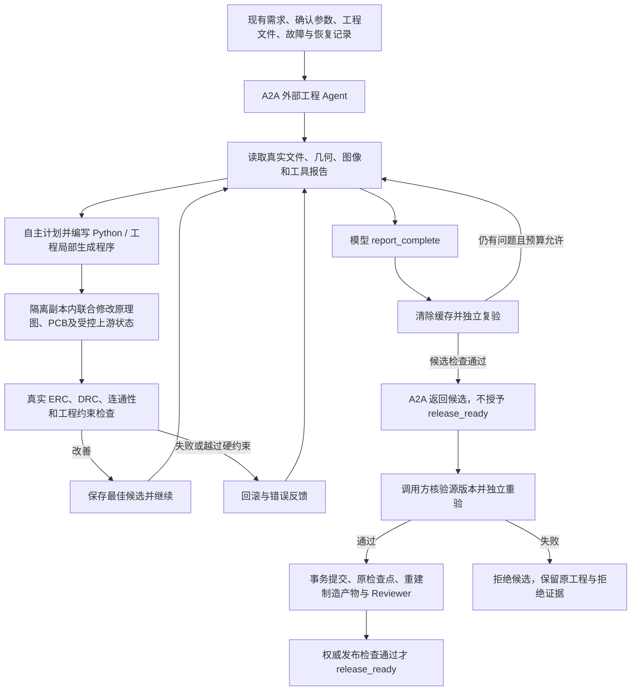

# 外部工程 Agent：实体修复与完成验收

外部 Terra 接收已有项目，而不是重新从需求生成另一块板。它与内部 LangGraph
通过 A2A 协作，脚本通过独立沙箱执行；模型自主选择修复计划、查询和 Python 实现。
这提供与交互式编程助手类似的工作方式，不承诺相同模型能力或任意板型必然成功。

## 修复路径

## 输入与编程权限

- `handoff.py` 打包真实工程、工具报告、持久化流水线/恢复记录和文件摘要。
  敏感文件与私有模型日志不进入交接包；不是未经持久化的全部聊天记录。
- 外部 Agent 可分页读取 `handoff/` 下的输入证据；当前候选的几何查询和工具检查优先于旧报告。
- 每次执行带入 `repair-context.json`：原始需求、当前工程 Artifact、原理图/PCB 名称及发布问题。
  当前 ERC/DRC JSON 同时进入沙箱，模型可直接编程处理这些文件。
- 可编写任意受资源限制的 Python 修复算法，修改候选 PCB、配套原理图和
  `programs/repair_generator.py`；不是只能从若干预注册 CAD 动作中选择。
- 归属和技术证据更新仍通过联合候选的受控接口。沙箱没有生产文件写权限、密钥或网络。
  文件输入中的资料不是可信指令，不能通过修改检查报告、规则或身份获得放行。

## 三种不同的完成含义

| 状态 | 含义 |
| --- | --- |
| `agent_reported_complete` | 模型提出完成申请，可能被工具复验否决 |
| `candidate_checks_passed` | 外部候选检查通过，仍需调用方复验及重建发布产物 |
| `release_ready` | 内部主工程的权威发布结果；不能由 A2A 文本或布尔标志授予 |

模型使用 `{"action":"report_complete","rationale":"..."}` 提交完成申请。
Host 清除检查缓存再验；未通过的分数/约束进入下一轮反馈。执行异常的脚本不会被提交，
即使异常前已经改动副本。暂时的联合修改可以在候选内部进行，只有经检查的改善才能保留。

A2A Task 的 `completed` 只表示服务完成一次修复尝试。结果另含 `repair_status`、
`validation_status`、`session_outcome` 和 `next_action`，不可把协议终态视为发布成功。
调用方不信任远端的 `release_ready`，源版本不匹配或本地复验失败就拒绝候选。

## 预算、恢复与验证范围

沿用现有服务端轮次、脚本时间、总时间、Token 和会话限制。没有自动清零历史消耗，
也没有为此改动发起模型调用。预算用尽可提交已经验收的部分改善，但任务仍可能不满足发布条件。
再次付费修复须走显式续跑额度；不要用新会话或新项目名称规避原检查点与消耗记录。

本次定向测试覆盖：提前完成被拒后继续修复、无修改不能凭声明提交、失败脚本回滚、
执行上下文及报告传递、报告不能作为返回产物覆盖验收，以及远端完成标志不能越过本地复验。
这些是代码路径验证，不是当前 STM32 板的 Terra 实修或 release-ready 证明。
