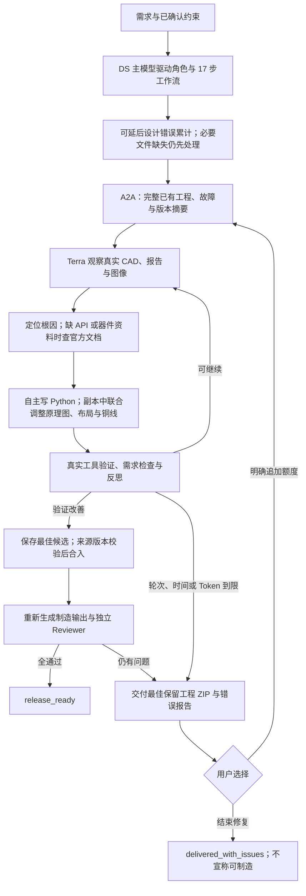

# 外部工程 Agent：从证据推导修复，不复读固定操作

这是一套诊断方法，不是特定板型的修复脚本。器件编号、移动位置、走线坐标、网络顺序与修改范围必须来自当前工程；示例的结果不能代替当前工程的检查。

## 人工实践如何转移给 Terra

这里总结的是本项目中 Codex/GPT-6 辅助修复实际采用的工程过程，不是模型未公开的内部推理，也不意味着换一个模型就会产生相同效果。运行时将方法直接写入 `repair/session.py` 的系统指引，并通过 `ProjectHost`、A2A 和独立 Python 执行器提供执行能力。



“先走完”是调度策略，不是无效文件也能继续：缺少可解析的原理图/PCB、执行工具不可用或硬约束冲突时，下游仍可能无法执行。预算、超时与版本边界保留，但不会把它们当成模型只能选固定动作的理由。

## 建立可信起点

读取需求、真实 PCB/原理图、规则、当前 ERC/DRC、器件证据和已有尝试。分别列出电气连接、几何间距、丝印、资产与资料等问题。保留原件与可回滚的最佳副本。记录文件摘要及验证报告，勿把上次缓存报告视为当前结论。

## 从故障推导候选

- **逃线受阻：**检查相邻焊盘、元件边界和两层铜线。计算线宽、过孔半径、净距与空间的关系。交错过孔也可能碰到邻居的走线；必要时联合移动有明确电气归属的被动件、改变逃线组或重布局部网络。
- **路径受阻：**区分端点出不去与中间走廊被占用。利用几何搜索生成候选；单层无解时考虑跨层，或把阻挡网络一起纳入事务。不要为一个剩余网络重复全板重布线。
- **地铜断开：**检查填充多边形、实际焊盘和已有跨层连接，构建连通分量。DRC 的铜区坐标可能只是轮廓原点。两个孤岛通过过孔相连仍可能是孤岛；应证明路径抵达已连接的地网络。必要时联合调整包围该区域的信号线。重新填铜会改变分量，必须重新观察。
- **丝印与悬空铜：**在不隐藏位号的前提下按真实几何寻找可读位置。只删除真实工具确认无用的铜，并证明连通性不退化。
- **资料缺失：**取得官方来源、保留原文件与内容摘要、核对对应封装的引脚图。区分下载失败、解析失败与真实冲突。常规缩写等价应受引脚方向和语义约束，不能模糊接受不同电源域、GPIO 或 NC。

## 工具使用与可执行程序

先检查可用工具和函数签名，再写程序。现有环境有 KiCad 的 `pcbnew`、真实 DRC/ERC、CAD 文件解析器及几何搜索代码；可以阅读源码并组合使用，不必在每一轮重新实现整个布线器。`pcbnew` 的实际形状碰撞查询可用于预筛选，但最终仍需真实 DRC。

程序应读取当前实体和规则，计算参数，输出简明的修改及验证摘要。不要复制别的案例的坐标。一个脚本可以包含关联的器件移动、拆线、走线与过孔；也可以修正前一轮脚本。程序应保存以支持复现，但脚本的成功退出不代表工程成功。

### 受控联网资料工具

外部 A2A 的 `engineering_queries` 新增：

```json
{"engineering_queries":[{"tool":"web_search","query":"KiCad pcbnew ToMM FOOTPRINT GetFPID API"}]}
```

随后 `{"tool":"read_document","url":"https://docs.kicad.org/...","offset":0,"limit":2}` 读取搜索得到的实际 URL。PDF 按页分页，HTML 按 8000 字符块分页；返回有界文本、来源 URL 和内容 SHA-256，下载文件保存在任务的 `repair-documents/`。最多 12 个不同研究请求，同请求复用缓存；单文档 16 MB，重定向逐跳校验 HTTPS、官方域名及公共 IP。管理员可用 `RATSNEST_REPAIR_DOC_DOMAINS` 调整官方域名列表。文本提取不保证保留复杂引脚图对应关系，不能直接将搜索片段认作已验证 pin/pad 证据。

网络只开放在资料工具中；执行 Python 的容器无网络、无密钥，不接受下载内容作为系统指令。Python 可读取当前 CAD、真实报告、上下文及项目生成器，使用安装的 `pcbnew` 写文件。先核实 API，避免猜测 `IU_PER_MM` 或 `GetFootprintName`；当前使用 `ToMM/FromMM` 和 `GetFPID`。失败程序与异常独立保留，不会被后续六条观察窗口挤掉。

### 失败也交付

A2A 完成一轮，即使 `improved=false` 或 Token 到限，也返回最佳保留工程的交付包。调用端校验来源 digest、压缩包摘要、大小和路径，将其保存为 `terra-repair-delivery.zip` 与 `terra-repair-delivery.json`，加入真实 Artifact 列表。交付包与候选提交权限分离：ZIP 不在主工程解压执行，外部诊断不替代内部验收。包内含原理图、PCB、项目规则、随工程保存的库资产、现有 BOM/路由文件及错误报告；`current-checks/` 是对保留候选重新验证的报告。历史制造输出可能未重建，不能用于直接制造。

无改善时，最佳文件可能与输入完全相同；不能伪称 Terra 做出了修改。异常 Python 容器中未保存、未返回的临时变化不能事后恢复为有效候选。服务崩溃或网络中断时，外部结果可能无法返回；用户选择结束时至少打包本地保留工程，并明确没有新增验证，不伪造外部结果。

HITL 提供“批准新增一轮 Terra 修复”和“结束修复，交付当前工程和剩余错误报告”。后者保存决定并直接进入最终交付，不再次调用模型、不清空错误、不标记 release_ready。前者保持已有累计成本和原工程，仅增加明确的一轮授权。

## 验证、反思与提交

每次修改后重新填铜，再执行 DRC/连通性检查。观察新增错误的具体实体，而不是只看总分。短期非单调变化可以保留在隔离候选中继续修复，不能直接合入生产工程。安全恢复、预算或时间耗尽时，回到最佳验证副本并说明未解决问题。

候选合入必须包括布局状态、相关证据及闭包文件，并校验源版本，防止旧结果覆盖新状态。旧制造报告应重新生成，而不是触发一次没有必要的付费修复。最终逐项验证需求、ERC、DRC、连通性、BOM 和制造产物；模型的完成声明不是发布凭证。

## 复现评测

用原始缺陷文件作为输入，只提供本方法、原需求和可核查资料；不把人工修好的文件或坐标脚本当作 Agent 输入。记录 Agent 自己的查询、程序、候选、回滚与最终检查结果。人工辅助成功和 Agent 独立成功分别统计。单例复现不能证明对所有板型都有效。
