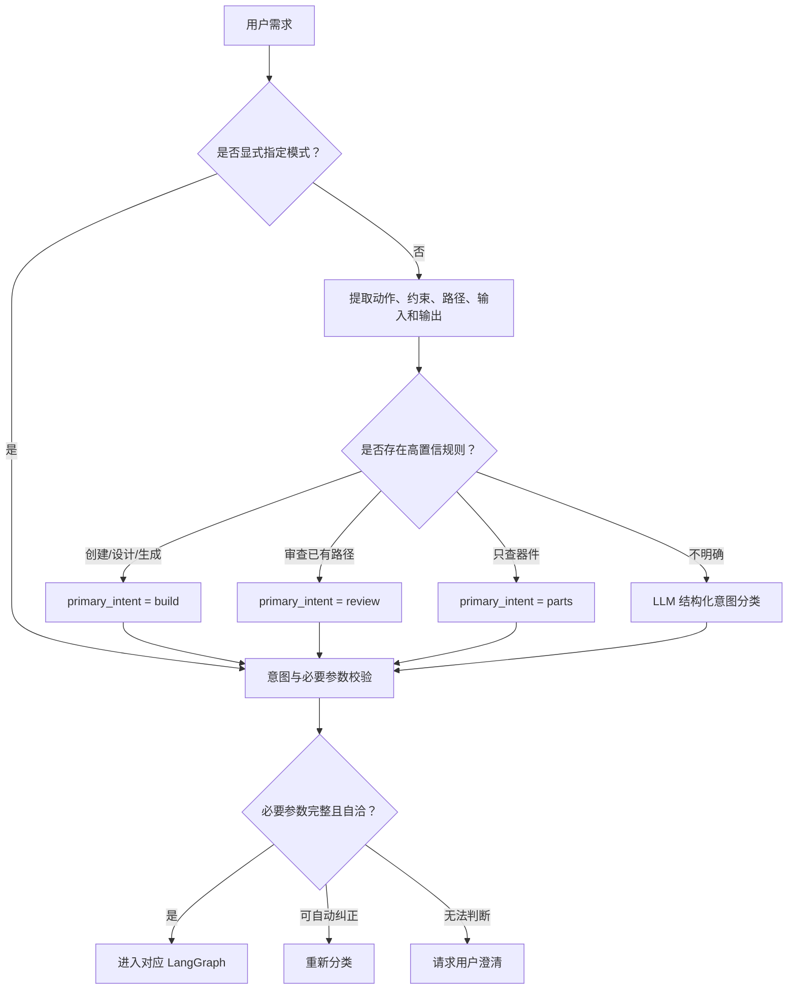
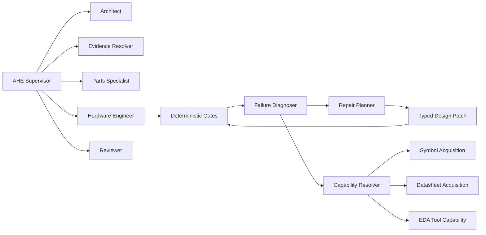
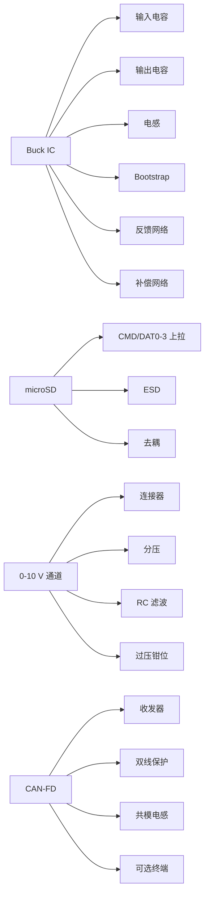
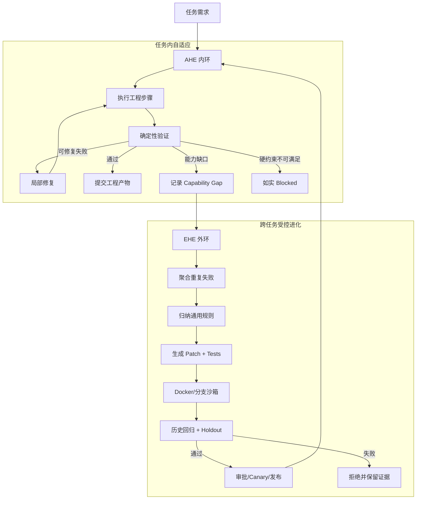

# 结构化意图识别与 AHE + EHE 双环自进化架构

## 1. 文档目标

本文给出 RatsNestPro 多智能体硬件工程系统的两项核心升级方案：

1. **结构化意图识别（Structured Intent Routing）**：可靠地区分新建设计、审查已有工程、器件检索和资料研究，避免长需求中的 Reviewer、ERC、DRC 或文件名污染主任务分类。
2. **AHE + EHE 双环架构**：
   - **AHE（Agentic Hardware Engineering）**负责在单次硬件任务中观察、诊断、修复并继续执行。
   - **EHE（Evolutionary Harness Engineering）**负责跨任务归纳通用缺陷，在隔离环境中生成、验证和发布 Harness 改进。

目标不是消除所有 `blocked`，而是区分：

- 系统已有能力解决的问题：自动诊断、局部修复并继续；
- 缺少工具或 Harness 能力的问题：记录能力缺口并进入受控进化；
- 用户硬约束确实无法满足的问题：如实 `blocked`，不降低验收标准。

---

## 2. 当前问题

### 2.1 关键词分类无法表达复合任务

硬件需求通常同时包含：

```text
设计
→ 器件选型
→ 生成原理图和 PCB
→ ERC/DRC
→ Reviewer 审查
→ 修复
→ 复审
```

这里的主要意图是 `build`，Reviewer 是构建后的后续动作。简单规则：

```python
if "review" in text and ".kicad_pcb" in text:
    return "review"
```

无法区分下面两种语义：

```text
请生成一个 KiCad PCB 文件，完成后由 Reviewer 审查。
```

```text
请审查 E:\projects\existing-board\main.kicad_pcb。
```

前者是新建设计，后者才是审查已有工程。

### 2.2 选择失败后只会停止

复杂器件不是一个孤立元件。选择 Buck、microSD、CAN-FD 或模拟输入功能后，还必须展开其支持器件：

- Buck：输入/输出电容、电感、Bootstrap、反馈、补偿和定时网络；
- microSD：CMD、DAT0–DAT3 上拉、去耦和 ESD；
- CAN-FD：收发器、双通道保护、共模抑制和可选终端；
- 0–10 V 模拟输入：连接器、分压、限流、滤波和钳位。

如果 LLM 只返回顶层 IC，确定性门禁会正确阻断，但当前系统缺少把失败结果转换成结构化增量修复的通用机制。

### 2.3 有限器件白名单不能覆盖开放世界

使用 MCU 名称正则白名单会不断遗漏新系列，例如：

- ATSAME/SAME；
- LPC；
- EFM32；
- GD32；
- MSP430；
- Renesas RA；
- PSoC；
- PIC32。

器件识别应以用户约束、制造商订货号和真实 EDA 库为依据，而不是靠固定品牌前缀枚举。

---

## 3. 结构化意图识别

### 3.1 不再只返回一个字符串

推荐使用以下结构化契约：

```python
from typing import Literal

from pydantic import BaseModel, Field


class IntentDecision(BaseModel):
    primary_intent: Literal["build", "review", "research", "parts"]
    post_actions: list[Literal["review", "manufacture", "export"]] = Field(
        default_factory=list
    )
    source_project_path: str | None = None
    requested_outputs: list[str] = Field(default_factory=list)
    confidence: float = Field(ge=0.0, le=1.0)
    evidence: list[str] = Field(default_factory=list)
    needs_clarification: bool = False
```

一个“新建设计并在完成后审查”的需求应产生：

```json
{
  "primary_intent": "build",
  "post_actions": ["review", "manufacture", "export"],
  "source_project_path": null,
  "requested_outputs": [
    "KiCad schematic",
    "KiCad PCB",
    "DSN",
    "SES",
    "BOM",
    "CPL",
    "Gerber"
  ],
  "confidence": 0.99,
  "evidence": [
    "用户要求从需求开始设计新板",
    "用户要求生成新的工程产物",
    "Reviewer 是构建完成后的后续阶段",
    "没有提供已有工程路径"
  ],
  "needs_clarification": false
}
```

### 3.2 判定优先级

```text
API 显式 workflow_mode
    >
前端模式选择
    >
高置信确定性规则
    >
LLM 结构化分类
    >
澄清或安全默认
```

显式模式必须作为真正的 API 字段传递，不能只写在自然语言提示词中。

### 3.3 输入产物与期望输出分离

解析器必须分别维护：

- `source_artifact`：用户已经提供、要求系统读取的工程；
- `requested_output`：用户要求系统生成的文件。

只有同时满足以下条件，才能进入独立 `review` 模式：

```text
存在明确的审查动作
AND
存在可解析、可访问的已有工程路径或附件
AND
没有优先级更高的新建设计动作
```

文件扩展名出现在验收条件中，只能视为期望输出证据。

### 3.4 路由流程



### 3.5 必要参数门禁

| 主意图 | 必要参数 |
|---|---|
| `build` | 设计需求 |
| `review` | 已有工程路径或附件 |
| `parts` | 器件查询条件 |
| `research` | 研究主题 |

以下状态不能调用 Reviewer：

```json
{
  "primary_intent": "review",
  "source_project_path": null
}
```

系统应先检查是否存在新建设计动作；若存在则纠正为 `build`，否则请求用户提供工程路径。

### 3.6 确定性规则与 LLM 的职责

确定性规则负责高精度场景：

```python
def classify_intent(parsed: ParsedRequest) -> IntentDecision:
    if parsed.explicit_mode:
        return validate_explicit_mode(parsed)

    if parsed.has_create_action or parsed.requests_generated_pcb:
        return build_decision(parsed)

    if parsed.has_review_action and parsed.source_project_path:
        return review_decision(parsed)

    if parsed.is_parts_only:
        return parts_decision(parsed)

    return classify_with_llm(parsed)
```

LLM 只处理真正的歧义，例如：

```text
看看这个板子，然后根据问题重新做一版。
```

它可能表示：

- 先审查再重建；
- 在已有工程上修复；
- 只提出建议，不修改文件。

LLM 的输出仍必须经过 Pydantic 和必要参数门禁，不能直接决定工作流。

### 3.7 意图识别回归矩阵

必须覆盖：

| 输入 | 期望结果 |
|---|---|
| 请设计一块 PCB，完成后 Reviewer 复审 | `build` |
| 请生成 KiCad 原理图和 PCB，并执行 ERC/DRC | `build` |
| 请审查一个明确路径下的现有 PCB 工程 | `review` |
| 请审查这个板子，但没有路径或附件 | `needs_clarification` |
| 只查询某 MCU 的可采购型号 | `parts` |
| 研究 USB-C CC 电阻要求，不生成 PCB | `research` |
| 长篇新建设计需求，包含 Reviewer、ERC、DRC 和产物名称 | `build` |

真实失败提示词应原样加入测试，避免只测试精简句子。

---

## 4. AHE：任务内的 Agentic Hardware Engineering

### 4.1 AHE 的目标

AHE 负责在一次工程任务中完成：

```text
观察
→ 诊断
→ 生成局部修复计划
→ 修改结构化设计状态
→ 重新验证
→ 提交或回滚
```

AHE 不应在运行中修改生产 Harness 源代码。

### 4.2 推荐组件



### 4.3 失败分类

`FailureDiagnoser` 至少应区分：

```text
constraint_violation
missing_component
missing_support_network
symbol_unavailable
symbol_mismatch
footprint_mismatch
pin_conflict
tool_unavailable
transient_external_failure
routing_congestion
manufacturing_violation
harness_defect
```

不同失败应触发不同策略：

| 失败 | AHE 行为 |
|---|---|
| 数据抓取为空 | 重试、切换官方源、读取缓存 |
| 缺少支持器件 | 生成 SelectionPlan 增量 |
| 符号不存在 | 启动 Symbol Acquisition |
| 引脚冲突 | 局部重新分配外设引脚 |
| 布线拥塞 | 调整布局或允许范围内的布线策略 |
| ERC/DRC 错误 | 针对错误对象修复 |
| Harness 规则缺失 | 记录 EvolutionCandidate |
| 用户硬约束无法满足 | 如实 `blocked` |

### 4.4 器件约束必须结构化

固定 MCU 不应在每一步从长提示词重新解析：

```json
{
  "component_constraints": [
    {
      "role": "mcu",
      "manufacturer_part_number": "ATSAME54P20A-AU",
      "substitution": "forbidden",
      "package": "TQFP-128"
    }
  ]
}
```

该约束由 Requirements 阶段创建，并由 Selection、Pinmap、Materialize、Review 全程引用。

### 4.5 Symbol Acquisition 能力阶梯

```text
1. 已安装 KiCad 库精确匹配
2. 已安装库的受控通配型号匹配
3. 官方厂商提供的 EDA 资源
4. 可信第三方库，并保留来源
5. 根据官方引脚表生成项目级自定义符号
6. 校验引脚号、名称、电气类型、封装和焊盘
7. 无法验证才 blocked
```

模糊候选必须满足：

- 器件类型一致；
- 型号族一致；
- 封装和引脚数一致；
- 不违反禁止替换约束。

否则不能返回候选，更不能返回与 MCU 无关的普通二极管符号。

### 4.6 器件依赖义务图

选择主器件后，系统应递归展开 `required obligations`：



义务来源包括：

- 数据手册必要应用电路；
- 符号引脚类型；
- 接口协议模板；
- 工程知识库；
- 用户验收条件。

### 4.7 类型化拓扑覆盖

不能因为 RJ45 和 PHY 的角色字符串都包含 `ethernet`，就认为 RJ45 实现了 PHY。

正确模型：

```json
{
  "block": "Ethernet PHY",
  "required_capability": "rmii_phy",
  "implemented_by": "U7",
  "evidence": {
    "symbol": "Interface_Ethernet:LAN8742A",
    "interfaces": ["RMII", "MDI"],
    "datasheet": "official-source"
  }
}
```

RJ45 只能提供：

```json
{
  "capability": "ethernet_connector_with_magnetics"
}
```

它不能满足 `rmii_phy`。

### 4.8 结构化增量修复

Selection 失败后不应重写整个 BOM，而应生成受控补丁：

```json
{
  "repair_scope": "selection",
  "preconditions": {
    "selection_version": 3
  },
  "actions": [
    {
      "type": "add_support_network",
      "target": "U2",
      "roles": [
        "buck_input_capacitor",
        "buck_output_capacitor",
        "buck_inductor",
        "buck_bootstrap_capacitor",
        "buck_rt_resistor",
        "buck_compensation_network"
      ]
    },
    {
      "type": "implement_topology_block",
      "block": "Digital Humidity/Temperature Sensor"
    }
  ]
}
```

补丁合并后只重新执行受影响步骤及其下游，而不是从第 1 步重跑。

---

## 5. EHE：跨任务的 Evolutionary Harness Engineering

### 5.1 EHE 的目标

EHE 负责把重复出现的 Harness 缺陷转化为通用能力：

```text
收集失败
→ 归纳失败签名
→ 生成通用规则或代码补丁
→ 生成回归测试
→ 隔离评估
→ 历史回归与陌生任务 Holdout
→ 审批/Canary
→ 发布新 Harness
```

### 5.2 经验记忆的正确粒度

错误记忆：

```text
某 SAME54 板缺少 R28，所以以后自动添加 R28。
```

正确记忆：

```json
{
  "failure_signature": {
    "interface": "sdio_4bit",
    "missing_roles": [
      "cmd_pullup",
      "dat0_pullup",
      "dat1_pullup",
      "dat2_pullup",
      "dat3_pullup"
    ]
  },
  "repair_recipe": {
    "action": "instantiate_required_signal_pullups",
    "scope": "all_active_sdio_data_signals",
    "validate": [
      "pin_exists",
      "net_unique",
      "resistor_to_io_supply"
    ]
  }
}
```

EHE 记忆的单位应是：

- 接口义务；
- 电源拓扑；
- 数据手册模式；
- 失败签名；
- 修复策略；
- 验证规则；
- 适用条件和反例。

不得保存具体项目的 Ref、运行名或固定网络名作为通用规则。

### 5.3 Evolution Candidate

每个 Harness 改进候选至少包含：

```python
class EvolutionCandidate(BaseModel):
    failure_signature: dict
    generalized_problem: str
    proposed_change: str
    affected_modules: list[str]
    new_tests: list[str]
    expected_benefits: list[str]
    regression_risks: list[str]
    safety_invariants: list[str]
```

### 5.4 隔离评估

任何自动生成的 Harness 代码都必须：

1. 在独立 Git 分支或临时 Worktree 中修改；
2. 在独立 Docker 环境运行；
3. 执行新增回归测试；
4. 执行全部历史测试；
5. 执行至少一个未参与修复的 Holdout 任务；
6. 比较硬门禁、完成率、修复次数和警告变化；
7. 生成可审查报告；
8. 经批准后发布。

### 5.5 进化等级

| 等级 | 能力 | 建议 |
|---|---|---|
| L0 | 固定流程，失败即停止 | 不足 |
| L1 | 同一步有限重试 | 已有部分能力 |
| L2 | 按失败类型生成结构化局部补丁 | 优先实现 |
| L2.5 | 成功修复形成可复用 Recipe | 推荐近期目标 |
| L3 | 自动生成 Harness Patch 和测试，并在沙箱评估 | 推荐中期目标 |
| L4 | 自动修改并部署生产 Harness | 不建议直接开放 |

---

## 6. AHE + EHE 双环运行模型



内环解决当前任务，外环增强未来能力。两者通过结构化失败记录连接，而不是让运行中的 Agent 直接修改生产代码。

---

## 7. 状态、版本和并发安全

### 7.1 设计状态版本化

每个结构化补丁应包含：

- 输入状态版本；
- 修改范围；
- 前置条件；
- 修改后的状态版本；
- 受影响步骤；
- 验证结果；
- 回滚信息。

如果两个修复基于相同旧版本，后提交者必须重新读取状态，不能静默覆盖。

### 7.2 运行隔离

- 同一 `(agent_id, thread_id)` 串行执行；
- 同一 `run_name` 使用工程目录锁；
- 不同工程可以并发；
- EHE 只能在隔离分支和容器工作；
- EHE 不能修改正在运行任务所加载的 Harness。

### 7.3 可追溯性

最终报告应记录：

```text
Harness 版本
意图决策及证据
每次状态补丁
每次确定性检查
使用的数据手册来源
使用的符号和封装来源
修复前后差异
最终产物哈希
```

---

## 8. 安全边界

不允许 EHE 为了提高“成功率”执行：

- 降低 ERC/DRC 等级；
- 忽略未连接网络；
- 删除用户要求的功能；
- 替换禁止替换的器件；
- 将 `warning`、`blocked`、`deferred` 或 `not_reached` 改写为成功；
- 使用未经验证的符号、封装或引脚表；
- 自动部署未经回归验证的 Harness 修改；
- 从网页直接执行不可信代码。

硬门禁属于安全不变量，只能增加能力去满足，不能通过修改定义绕过。

---

## 9. 推荐实施路线

### 第一阶段：结构化输入和任务内修复

1. 增加显式 `workflow_mode` API 字段；
2. 实现 `IntentDecision`；
3. 分离输入产物和期望输出；
4. 增加 review 必要路径门禁；
5. 将固定器件写入结构化约束；
6. 增加 Failure Diagnoser；
7. 增加 SelectionPlan 增量补丁；
8. 支持从失败步骤继续执行。

### 第二阶段：硬件能力解析

1. 用通用 MPN/库索引解析替换 MCU 白名单；
2. 增加 Symbol Acquisition；
3. 实现器件依赖义务图；
4. 使用类型化 Capability 检查拓扑覆盖；
5. 将数据手册必要应用电路转化为可验证义务。

### 第三阶段：经验系统

引入：

```text
FailureObservation
RepairAttempt
RepairOutcome
RepairRecipe
CapabilityGap
EvolutionCandidate
```

成功修复后，只保存经过验证、去项目化的通用 Recipe。

### 第四阶段：受控 EHE

1. 聚合重复 Harness 缺陷；
2. 自动生成最小代码补丁；
3. 自动生成针对性测试；
4. Docker 沙箱执行；
5. 全量历史回归；
6. 陌生板卡 Holdout；
7. 审批和 Canary；
8. 版本化发布和回滚。

---

## 10. 评价指标

不能只使用“最终是否成功”作为优化目标。建议同时追踪：

- 硬门禁违规数；
- 陌生任务完成率；
- 任务内自动修复成功率；
- 平均修复轮次；
- 无效重试比例；
- 错误符号/封装候选率；
- 用户硬约束保持率；
- ERC/DRC error；
- Unconnected 数量；
- 历史回归通过率；
- EHE 候选接受率；
- 从 Capability Gap 到可用能力的平均周期。

---

## 11. 结论

RatsNestPro 应采用：

```text
Structured Intent Router
+ AHE Runtime Repair Loop
+ EHE Controlled Evolution Loop
```

结构化意图路由负责进入正确工作流；AHE 在当前任务中通过诊断和局部状态补丁继续解决问题；EHE 把重复能力缺口转化成经过测试、可回滚的新 Harness 能力。

最终原则是：

> 能通过补齐资料、器件、连接、布局或工具能力解决的问题，应由系统自动闭环；真正违反用户硬约束或缺少可验证证据的问题，仍然必须如实阻断。
