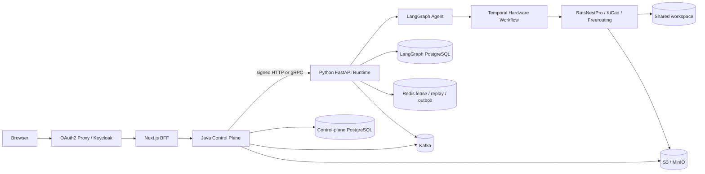

# CircuitFoundry / RatsNestPro 项目代码讲解手册

> 面向接手开发、调试和二次设计的源码导读。重点覆盖 Agent 内核、Python Runtime、Temporal/EDA 执行链和 Java 控制面。

## 0. 文档说明

### 0.1 这份文档解决什么问题

本手册不是产品宣传或部署速查，而是回答下面这些源码问题：

1. 一个用户请求从浏览器进入后，依次经过哪些类、函数和中间件？
2. Java 控制面和 Python Agent Runtime 各自拥有什么状态，为什么不能混为一层？
3. LangGraph 中有哪些节点、状态字段和条件路由？
4. Temporal 为什么存在，它如何把一次长时间 PCB 设计拆成可恢复步骤？
5. 内嵌 RatsNestPro EDA 内核如何生成、检查和发布 KiCad 工程？
6. PostgreSQL、Redis、Kafka、S3、Keycloak、gRPC 等分别在哪些文件中接入？
7. 每个主要源码文件负责什么、如何实现、应从哪里开始阅读？

### 0.2 覆盖范围

重点逐文件覆盖：

- `src/agents/ratsnestpro/`：Agent 内核、工具、意图、HITL、能力档案、Temporal 适配。
- `src/service/`：FastAPI、SSE、内部认证、Redis 运行注册表、gRPC、Kafka relay。
- `src/ratsnestpro/`：确定性 EDA 内核。
- `src/evolution/`：受治理 Harness Evolution。
- `backend/src/main/java/team/ratsnest/controlplane/`：Java/Spring 控制面。
- `backend/src/main/resources/db/migration/`：Flyway V1–V12。
- `contracts/`、`frontend/`、`compose.yaml`、`deploy/k8s/`：连接上述核心的契约和基础设施。

以下内容只做归类，不逐行讲解：

- 自动生成的 `agent_runtime_pb2.py`、`agent_runtime_pb2.pyi`、`agent_runtime_pb2_grpc.py`。
- 包管理锁文件、图片、字体、构建缓存和第三方许可证。
- CSS 视觉细节；前端只讲 BFF、聊天、SSE、状态恢复和后端连接。

### 0.3 阅读时必须知道的当前工作区状态

本文以当前工作区为快照。当前存在一组尚未提交的“运行租约可见性与恢复”改动，涉及 Python、Java、contracts 和前端。文中使用以下标识：

- **基线**：当前提交已经包含的能力。
- **WIP**：工作区存在、但尚不能等同于干净克隆能力的改动。
- **生成文件**：由 proto 等源契约生成，不应作为手工修改入口。

项目总原则写在 `CLAUDE.md`：Java 拥有 SaaS 身份和 Run 权威状态，Python 拥有 Agent 执行；不得硬编码“电路板成功”或伪造 EDA 证据；Evolution 不得自动合并、推送或部署。

### 0.4 阅读导航

- 第 1–3 章：系统边界、完整请求链和框架/中间件总表。
- 第 4–7 章：Python Runtime、Agent 内核、内嵌 EDA、Harness Evolution。
- 第 8–9 章：Java 控制面逐包/逐类说明和 Flyway V1–V12。
- 第 10–12 章：跨语言 contracts、前端 BFF、Compose/Kubernetes/OTel。
- 第 13–14 章：当前 recovery WIP、测试和 CI 边界。
- 第 15–18 章：按故障定位代码、推荐阅读路线、维护不变量。
- 第 19–20 章：小型入口/生成文件补充索引和术语表。

---

## 1. 项目定位与核心边界

CircuitFoundry 是一个企业多租户 AI 硬件设计平台。用户以自然语言描述硬件需求，系统经过意图识别、架构规划、器件选型、KiCad 工程生成、布局布线、ERC/DRC、独立审核，最终交付可审计的工程和制造产物。

它不是“一个 Python Agent 服务”，而是五个相互约束的系统：

| 系统 | 主要目录 | 权威职责 |
|---|---|---|
| Web/BFF | `frontend/` | 浏览器交互、同源 API、SSE 消费，不拥有业务真相 |
| Java Control Plane | `backend/` | 身份、租户、项目、Run/Revision、Artifact、Harness/Evolution 状态 |
| Python Agent Runtime | `src/service/`、`src/agents/` | Agent 图执行、HITL、运行租约、事件生产、检查点恢复 |
| Temporal + EDA | `src/agents/ratsnestpro/temporal/`、内嵌 `ratsnestpro/` | 耗时硬件流水线及实际 KiCad/Freerouting 操作 |
| 数据与治理设施 | PostgreSQL、Redis、Kafka、S3、Keycloak | 持久化、协调、审计、产物和认证 |

### 1.1 总体调用图



### 1.2 状态归属

| 状态 | 真相源 | 主要实现文件 | 说明 |
|---|---|---|---|
| 用户、组织、成员、项目 | Java PostgreSQL | `identity/`、`tenancy/`、`organization/`、`project/` | 由 OIDC 主体和 RLS 保护 |
| Run/Revision/Delivery | Java PostgreSQL | `run/RunService.java`、`RunRepository.java` | 对外 API 的权威状态 |
| LangGraph 对话状态 | PostgreSQL checkpoint/store | `src/memory/postgres.py` | 进程重启后可继续图执行 |
| 执行租约、fencing、SSE 回放 | Redis | `src/service/redis_run_registry.py` | 防止多个 Runtime 同时写同一 Run |
| 长硬件任务进度 | Temporal | `src/agents/ratsnestpro/temporal/workflow.py` | activity 重试、心跳、暂停和补偿 |
| EDA 中间工程 | 共享 workspace | `tools.py`、内嵌 pipeline | 同一 Run 的磁盘检查点和 KiCad 文件 |
| 最终产物 | S3/MinIO 或 local backend | `artifact_publisher.py`、Java `artifact/` | manifest、hash、授权下载 |
| 生命周期审计 | Redis outbox → Kafka；Java DB outbox → Kafka | `kafka_relay.py`、`RunOutboxPublisher.java` | 至少一次，消费者按事件 ID 去重 |

---

## 2. 一次请求的完整执行过程

### 2.1 登录和工作区发现

1. OAuth2 Proxy 把用户送到 Keycloak 登录。
2. 浏览器请求 Next.js BFF，而不是直接请求 Java 或 Python。
3. `frontend/lib/backend.ts` 解析认证信息。优先使用浏览器 `Authorization`；只有显式信任代理头时，才接受 OAuth2 Proxy 注入的 access-token header。
4. `frontend/app/api/session/route.ts` 组合 Java 的组织和项目接口。没有组织/项目时返回可识别的 setup-required 状态。
5. Java `AuthenticatedActor` 从 JWT 的 `(issuer, subject)` 建立不可伪造的主体身份。

### 2.2 创建 Run 或 Revision

1. `frontend/components/chat-console.tsx` 收集 message、thread、team、model、capability profile。
2. `frontend/lib/request-intent.ts` 判断是新 root Run 还是基于最近 Run 的 Revision。
3. `frontend/components/chat-console.tsx` 生成稳定 `request_id`；`frontend/app/api/chat/route.ts` 校验后把它映射为 `Idempotency-Key`，BFF 不另造第二个幂等身份：
   - root：`POST /api/v1/projects/{projectId}/runs`；
   - revision：`POST /api/v1/runs/{baseRunId}/revisions`。
4. `RunController` 只负责 HTTP 解析、Bean Validation 和 DTO 映射，业务进入 `RunService`。
5. `RunService.start`：
   - 查询同一幂等键是否已经存在；
   - 调用 Runtime metadata 获取可用 Agent/model/profile；
   - 解析并固定 capability profile digest；
   - 通过 `HarnessReleaseRouter` 确定性选择 stable/canary；
   - 计算请求 fingerprint；
   - 在事务中插入 Run 和初始生命周期事件；
   - 由 reconciliation worker 或直接调用方式启动 Python Runtime。

幂等语义不是“相同 key 总是成功”：相同 key 且 fingerprint 相同才重放；相同 key 对应不同 payload 会冲突。

### 2.3 Java 调用 Python Runtime

Java 的 `AgentRuntimeGateway` 是领域接口，有两个实现：

- `HttpAgentRuntimeGateway`：默认实现，调用 `/internal/v1/...`。
- `GrpcAgentRuntimeGateway`：对 Start/Get/Control/Resume/Subscribe 使用 proto；metadata/history 仍走签名 HTTP。

`InternalTaskSigner` 生成短期 HS256 JWT，绑定：

- issuer、audience、subject；
- tenantId、projectId、runId；
- HTTP method、精确 path；
- body SHA-256、iat、exp、jti。

Python `internal_auth.py` 用相同规则验证，随后 `runtime_identity.py` 把外部身份映射成不暴露原始 SaaS ID 的 opaque runtime scope。

### 2.4 Python 建立运行并准备图输入

建立 Run 和准备 LangGraph 输入是两个相邻但不同的阶段：

1. `service.stream()` 查找 Agent、校验 request ID/fingerprint，并先调用 `run_registry.start(...)` 建立或附着 Run。
2. Redis `RunRegistry` 在 producer 启动前处理：
   - lease 表示当前 producer 是否活跃；
   - fencing token 阻止过期 producer 继续写；
   - replay stream 保存可重放 SSE；
   - cursor 是严格单调事件位置。
3. 新 producer 进入 `_produce_stream_events`，再通过 message generator 调用 `_handle_input` 准备 checkpointed graph invocation。
4. `_handle_input` 校验/生成 `thread_id` 和 `request_id`，验证 Java 固定的 harness identity，构造 Agent/owner/thread 隔离的 checkpoint ID，并判断新消息、幂等恢复还是 HITL `Command(resume=...)`。
5. 真正推进 Agent 图时，在进程锁之外再获取 PostgreSQL advisory lock，避免同一 checkpoint 被多个请求并发写入。

memory registry 仅适合开发；Compose 会覆盖为 Redis。LangGraph saver/store 则始终依赖 PostgreSQL。

### 2.5 LangGraph 执行

Runtime 调用：

```python
agent.astream(
    graph_input,
    config,
    stream_mode=["updates", "messages", "custom"],
    subgraphs=True,
)
```

三类输出分别承担：

- `updates`：节点状态更新；
- `messages`：LLM token/message；
- `custom`：workflow、AHE、artifact manifest、显式 reasoning 等自定义事件。

事件先由独立 producer 生成并写入 RunRegistry，HTTP subscriber 只是消费。浏览器断线不会取消 producer，因此重新连接时可以按 `Last-Event-ID` 回放。

### 2.6 HITL 人工决策

1. `decision_engine.py` 从需求和意图构造开放决策。
2. Agent 调用 LangGraph `interrupt()`。
3. Runtime 把 interruption 转成 `ratsnest.human-input-required.v1` 自定义事件，并将 Run 标记为等待输入。
4. Java 把 interaction 与 `stateVersion` 持久化。
5. 前端提交 `answer + stateVersion`。
6. Java 使用 CAS 将 interaction 从 pending 推进到 responding/responded。
7. Python 使用 `Command(resume=...)` 继续原 checkpoint，而不是创建新会话。

### 2.7 Hardware 与 Temporal

`hardware_dispatch_phase` 根据配置选择：

- Temporal 开启：启动或附着 durable workflow；
- Temporal 关闭：在本地线程运行同一个 pipeline adapter。

Temporal workflow 固定推进 17 个步骤。每个 Activity 启动独立子进程执行 `ratsnest_run_pcb_pipeline_until`，从 workspace checkpoint 恢复并只推进到目标步骤。Workflow 自身不保存大段 LLM token，也不直接执行 KiCad。

### 2.8 审核、交付和 Artifact

1. `reviewer_phase` 先调用确定性 `ratsnest_review_kicad_project`。
2. 确定性报告先原子落盘，随后 LLM 只能增加 advisory 内容，不能覆盖真实 verdict。
3. `final_report` 根据 17/17、ERC/DRC、未连接网络、布线、实际文件和独立审核决定 delivery status。
4. `artifact_publisher.py` 检查路径 containment、排除临时/审计文件、计算 hash、上传并生成 manifest。
5. Java `ArtifactManifestParser` 再次校验 Run namespace、digest、文件名和 delivery truth。
6. 下载必须先经过 Java tenant/run 授权，再获得短期 S3 presigned URL。

---

## 3. 框架和中间件总索引

依赖版本的三个权威入口是：Python 的 `pyproject.toml`/`uv.lock`、Java 的 `backend/pom.xml`、前端的 `frontend/package.json`。当前主版本包括 Python 3.12–3.14、FastAPI 0.139、LangGraph 1.2、Temporal SDK 1.30、Redis client 8、Spring Boot 4.1/Java 21、Next.js 16.2、React 19.2 和 TypeScript 5.9。阅读代码时应以这些声明为准，不要用旧技术报告推测 API 版本。

| 框架/中间件 | 用途 | 主要文件 |
|---|---|---|
| FastAPI | Python 公网/内部 API、生命周期、健康检查 | `src/service/service.py`、`internal_api.py` |
| Pydantic | 请求、响应、内部契约、严格 JSON 解析 | `src/schema/schema.py`、`models.py`、`src/evolution/contracts.py` |
| LangGraph | Agent 状态图、checkpoint、interrupt/HITL、stream | `ratsnestpro_agent.py`、`src/memory/postgres.py` |
| LangChain provider adapters | 多厂商模型和消息抽象 | `src/core/llm.py` |
| Langfuse | 可选 LLM 调用 tracing callback | `src/service/service.py` |
| Temporal Python SDK | 17 步硬件 workflow/activity、Evolution trial | `src/agents/ratsnestpro/temporal/`、`src/evolution/temporal/` |
| Redis | lease、fencing、run record、SSE replay、LLM stream、audit outbox | `redis_run_registry.py`、`llm_output_stream.py`、`kafka_relay.py` |
| PostgreSQL | LangGraph saver/store、advisory lock | `src/memory/postgres.py`、`run_coordination.py` |
| Kafka | Python/Java 生命周期审计，至少一次投递 | `kafka_audit.py`、`kafka_relay.py`、Java `RunOutboxPublisher.java` |
| gRPC/protobuf | Java→Python versioned Run 控制和事件订阅 | `contracts/agent-runtime/v1/agent_runtime.proto`、`grpc_runtime.py`、`GrpcAgentRuntimeGateway.java` |
| Spring Boot WebMVC | Java REST API、依赖注入、调度、Actuator | `backend/pom.xml`、各 `*Controller.java`、启动类 |
| Spring Security OAuth2 Resource Server | JWT/OIDC 认证授权 | `identity/SecurityConfiguration.java`、`OidcConfigurationGuard.java` |
| Spring JdbcClient / JDBC | 显式 SQL、事务、行锁、RLS 上下文 | 各 `*Repository.java`、`TenantContext.java` |
| Flyway | 控制面 schema 版本化迁移 | `FlywayMigrationMain.java`、`db/migration/V*.sql` |
| Spring Kafka | Java事务 outbox 发布 | `RunOutboxKafkaConfiguration.java`、`RunOutboxPublisher.java` |
| AWS SDK S3 | Artifact/avatar 上传和 presigned download | `artifact/ArtifactService.java`、`profile/ProfileAvatarStorage.java` |
| Next.js App Router | 页面、BFF route handlers、standalone build | `frontend/app/`、`frontend/next.config.ts` |
| React | 工作台、聊天、团队、profile UI | `frontend/components/` |
| SSE | token/event 流、cursor、断线回放 | Python `sse.py`、Java Run events、前端 `lib/sse.ts` |
| Keycloak | OIDC Identity Provider | `compose.yaml`、`docker/identity/ratsnest-dev-realm.json` |
| OAuth2 Proxy | 浏览器登录入口和认证代理 | `compose.yaml`、Kubernetes web/ingress 配置 |
| KiCad CLI | 原理图/PCB/ ERC/DRC/制造工具 | 内嵌 `eda/vendor/kicad_cli.py`、`tools.py` |
| Freerouting | PCB 自动布线 | 内嵌 `eda/routing.py`、`_route_worker.py`、Dockerfile |
| S3/MinIO | 内容寻址产物和头像 | `artifact_publisher.py`、Java artifact/profile、`compose.yaml` |
| Docker Compose | 本地单机集成环境 | `compose.yaml`、`docker/` |
| Kubernetes/Kustomize | 生产拓扑、cell、canary、evolution sandbox | `deploy/k8s/` |
| OpenTelemetry | Java/Python/Node 自动插桩和 collector | `deploy/k8s/observability/` |

---

## 4. Python Runtime 逐文件讲解

### 4.1 启动、配置、模型和 Schema

| 文件 | 内容与功能 | 关键实现方式 |
|---|---|---|
| `src/run_service.py` | Runtime 进程入口 | 加载 `.env`；Windows 下切换 selector event loop；用 Uvicorn 启动 `service:app` |
| `src/service/__init__.py` | FastAPI app 延迟导出 | 仅在访问 `service.app` 时通过 `__getattr__` 导入 `service.py`，避免导入辅助模块就初始化整套 Runtime |
| `src/core/settings.py` | 全部环境配置 | 使用 `pydantic-settings`；定义服务端口、模型、PostgreSQL、Redis、Kafka、Temporal、S3、内部签名、并发和超时；对危险组合做启动校验 |
| `src/core/llm.py` | 模型工厂 | 把配置转换成 LangChain ChatModel；支持 OpenAI、Azure、DeepSeek、Anthropic、Google/Vertex、Groq、Bedrock、Ollama、OpenRouter、兼容接口和 fake model |
| `src/schema/models.py` | provider/model 枚举 | 用 `StrEnum` 固定 API 可见 provider 和模型标识；部分值同时是部署映射 key，不能随意改名 |
| `src/schema/schema.py` | FastAPI 公共请求/响应模型 | 定义 `UserInput`、`StreamInput`、消息、历史、反馈、服务 metadata、RunStatus；内部身份通过 Pydantic `PrivateAttr` 保存，不被客户端序列化 |
| `src/memory/postgres.py` | LangGraph 持久化 | 建立 psycopg async pool，初始化 `AsyncPostgresSaver`；应用 lifespan 中执行 setup |
| `langgraph.json` | LangGraph CLI 图注册 | 把 `ratsnestpro-multi-agent` 直接映射到 `./src/agents/ratsnestpro/ratsnestpro_agent.py:ratsnestpro_multi_agent`；这条 CLI 路径不同于生产 Runtime 的 `agents.py` 注册表 |

配置上的一个重要区别：`settings.py` 的代码默认允许 memory registry、关闭 Temporal；`compose.yaml` 才把真实集成拓扑覆盖为 Redis registry + Temporal。直接运行 Python 默认值不等同于部署形态。

### 4.2 `src/service/` 文件地图

| 文件 | 内容与功能 | 如何实现 |
|---|---|---|
| `service.py` | FastAPI 主应用和 Agent 执行总入口 | lifespan 初始化 checkpointer、registry 与 gRPC；提供 invoke、stream、status、cancel、feedback、history、health；把 LangGraph 输出转换成持久化 SSE |
| `internal_api.py` | Java→Python 内部 HTTP API | 使用严格 Pydantic 模型和依赖注入验证签名 claims；校验 URL 中 Run 与 token 中 Run 相同；暴露 runtime info、stream、status、resume、cancel、history、evolution trial |
| `internal_auth.py` | 内部请求认证 | 验证 HS256、issuer/audience、TTL、method/path/body hash、tenant/project/run；使用常量时间摘要比较 |
| `runtime_identity.py` | 身份域隔离 | 对 SaaS issuer/subject/tenant/project 进行域分离 hash，生成 Runtime owner/checkpoint/audit scope，避免直接把原始用户标识写入执行存储 |
| `run_registry.py` | 进程内 RunRegistry | 开发/测试实现；管理 run record、producer/subscriber、cancel、interaction；没有跨进程 lease，因此不会声明 durable recoverable |
| `redis_run_registry.py` | 分布式 RunRegistry | Redis hash/stream + Lua 原子脚本；管理幂等 fingerprint、lease、owner、fencing token、状态、cursor、SSE replay、HITL、审计 outbox和指标 |
| `run_coordination.py` | checkpoint 并发协调 | 进程内 keyed lock 加 PostgreSQL advisory lock；对同一 agent/owner/thread 的图推进串行化 |
| `sse.py` | SSE 格式化 | 给缓冲事件补 `id:` 和 payload 内 `event_id`，支持浏览器 `Last-Event-ID` 回放 |
| `utils.py` | LangChain 消息适配 | 将 Human/AI/Tool/Custom message 转成公共 `ChatMessage`；只暴露 provider 明示 reasoning，不构造隐藏思维链；区分展示适配错误和执行错误 |
| `llm_output.py` | LLM 输出审计 | 提取回答文本、显式 reasoning 和有限 metadata；限制字段大小；写 JSONL transcript；不推断模型隐藏思考 |
| `llm_output_stream.py` | Hardware 实时 LLM 流 | 使用有界 Redis Stream 传递实时输出，避免把大 token 流写入 Temporal Event History |
| `kafka_audit.py` | Kafka 审计契约 | 严格、版本化 Pydantic envelope；事件进入 outbox 前分配稳定 `audit_event_id`；Kafka key 优先使用 request ID |
| `kafka_relay.py` | Redis outbox→Kafka | consumer group claim、发布、ACK、重试；at-least-once，Kafka 不承载 token/prompt 正文 |
| `grpc_runtime.py` | Python gRPC server | 实现 proto 中 Start/Get/Control/Resume/Subscribe；复用 HTTP 层同一 service/registry；把 SSE envelope 映射为 proto event |
| `proto/agent_runtime_pb2*.py` | protobuf 生成文件 | 由 `contracts/agent-runtime/v1/agent_runtime.proto` 生成；应修改 proto 后重新生成，不应直接编辑 |

### 4.3 `service.py` 的内部结构

`service.py` 是 Runtime 最重要的入口文件，可以按下面顺序阅读：

| 函数/区域 | 职责 |
|---|---|
| `_create_run_registry` | 根据配置选择 memory 或 Redis 实现 |
| `lifespan` | 启动 PostgreSQL saver/store、registry、可选 gRPC；停止时反向释放资源 |
| `request_guard` | 请求 ID、Content-Length 和异常防护；注意它只检查声明长度，不是完整 ASGI 字节限额 |
| `info` | 返回 Agent、model、profile、harness metadata |
| `_handle_input` | 建立 request/thread、运行身份、harness pin、checkpoint 配置，识别 resume/幂等恢复 |
| `_invoke_unlocked` / `invoke` | 非流式执行；仍使用相同 checkpoint 和协调锁 |
| `_message_generator_unlocked` | 消费 LangGraph `updates/messages/custom`，生成规范化事件 |
| `message_generator` | 给图执行增加进程锁和 PostgreSQL advisory lock |
| `stream` | 建立/附着 producer，然后返回 subscriber 的 `StreamingResponse` |
| `_produce_stream_events` | 独立 producer；写 RunRegistry、terminal/error/HITL/artifact 信息；与浏览器连接生命周期解耦 |
| `resume_interaction` | 验证 interaction/CAS 后用 `Command(resume=...)` 恢复图 |
| `run_status` / `cancel_run` | 查询 registry、发出协作式取消 |
| `history` | 从 LangGraph state/checkpoint 转换公共聊天历史 |
| liveness/readiness/health/metrics | 区分进程存活、依赖可用和运行指标 |

### 4.4 Redis RunRegistry 为什么复杂

`redis_run_registry.py` 不是普通缓存，它承担执行一致性：

- Run hash 保存状态、fingerprint、owner、harness identity、interaction 和 terminal 信息。
- Redis Stream 保存 SSE replay；每条事件拥有稳定递增 cursor。
- lease 有到期时间；producer 周期续租。
- fencing token 每次接管递增。旧 producer 即使恢复网络，也无法继续写。
- subscriber 与 producer 解耦；subscriber 断开不意味着取消 Run。
- cancel 是请求状态，由执行协作式检查，而不是直接杀死任意进程。
- HITL 使用 interaction ID 和 state version，防止重复或过期回答。
- **WIP** 使用 Redis server `TIME` 计算 `execution_lease_active/recoverable/lease_expires_at/checked_at`，避免应用节点时钟差异。

这套机制解决的是“同一个 Run 最多一个有效写者”和“连接断开后可回放”，不是后台自动调度恢复。lease 过期后仍需外部重新调用 start/recover 才会接管。

---

## 5. Agent 内核逐文件讲解

### 5.1 Agent 注册

`src/agents/agents.py` 是生产图注册表。目前只注册 `ratsnestpro-multi-agent`。`get_agent()` 返回编译后的 LangGraph，`get_all_agent_info()` 为 `/info` 提供 metadata。新增 Agent 时既要注册图，也要考虑公共 metadata、checkpoint scope、内部 API 和 Java runtime-info 兼容。

### 5.2 `RatsNestWorkflowState`

`ratsnestpro_agent.py` 中的 `RatsNestWorkflowState` 是整个图的数据总线。字段可分成：

| 字段组 | 示例 | 含义 |
|---|---|---|
| 输入与身份 | `request_id`、`latest_request`、`requirement`、`run_name`、`execution_scope`、`workspace_run_name`、`project_name` | 当前请求、合并后的需求和隔离工作区身份；thread ID 属于外层 checkpoint config，不是此 state 的字段 |
| 意图 | `workflow_mode`、`intent` | build/research/parts/review/diagnose/clarify/unsupported；post actions 位于结构化 `intent` 内 |
| 决策 | `open_decisions`、`resolved_decisions` | HITL 前后的结构化工程决策 |
| 规划 | `architecture`、`specialist_consultations`、`parts` | 架构师、可选专家和器件工程师输出 |
| 硬件 | `hardware`、`hardware_attempts`、`hardware_dispatch` | Temporal/local 执行、尝试历史和结果 |
| 审核 | `review`、`review_target` | 确定性检查、advisory 和 review 模式目标；delivery 值在结果结构内产生 |
| 能力与团队 | `capability_profile`、`capability_profile_error`、`team_members` | 固定 profile 快照、gate 错误和本次角色配置；digest/budget 位于 profile 结构内 |
| 恢复 | `incremental_resume`、`human_interaction_version`、`resume_after_clarification` | checkpoint 增量继续和 HITL 恢复控制 |
| 可观测性 | `trace`、`artifact_manifest`、继承的 `messages` | 精简节点轨迹、事件和产物 |

角色子图使用 `_RatsNestRoleState` 和 overwrite-only message delta，避免每次 handoff 都把完整父历史重复附加到 checkpoint。

### 5.3 主图节点

| 节点/函数 | 功能 | 核心实现 |
|---|---|---|
| `initialize` | 初始化一次工作流 | 提取最新需求、解析 team/profile、验证恢复身份、识别模式、建立 trace；必要时准备 HITL |
| `intake_phase` | 对话式需求澄清 | 根据模式和开放决策生成回答或 `interrupt`；非 build 请求可在此直接形成结果 |
| `architect_phase` | 架构设计 | 本地知识、外部 Agentic RAG、网页/数据手册、KiCad 库证据组合；使用严格结构化输出和 JSON fallback；记录 capability gap |
| `specialist_consultation_phase` | 可选专家会诊 | 按前端 team 中的可选成员并行/顺序产生专业建议，再压缩进入主状态 |
| `parts_phase` | 器件和采购 | 构造元件查询，搜索本地/JLC/外部资料，保存 provenance、可采购性和替代信息 |
| `hardware_phase` | 本地硬件执行兼容节点 | 调用 `_run_hardware`，用于不启用 Temporal 的路径 |
| `hardware_dispatch_phase` | 派发长任务 | 计算 workflow identity；启动/附着 Temporal；记录 task/workflow ID 和初始进度 |
| `hardware_wait_phase` | 等待/轮询 Temporal | 查询 progress/result，转发 workflow/LLM output；处理 running、paused、cancelled、failed、completed |
| `reviewer_phase` | 独立审核 | 先确定性 review 并落盘，再让 LLM 解释；不能用 LLM 覆盖 ERC/DRC/文件事实 |
| `final_report` | 形成最终回答和 manifest | 依据实际产物、步骤、verification 和 reviewer 结论确定三态 delivery，并发布 artifact manifest event |

### 5.4 条件路由

图末尾的 `_after_*` 函数决定下一节点：

- `_after_initialize`：unsupported、clarify、research、parts、review、diagnose、build 分流。
- `_after_intake`：开放决策未解决时结束本轮并等待输入；解决后进入架构或直接答复。
- `_after_architect`：需要专家时进入 specialist，否则进入 parts/hardware/reviewer。
- `_after_specialists`：回到 parts。
- `_after_parts`：只有 build 类需求进入 hardware；纯 parts 查询可直接 final。
- `_after_hardware`：执行结果进入 reviewer，而不是因为生成了文件就直接成功。
- `_after_review`：统一进入 final report。

主图使用多个 `_single_phase_subgraph` 包装角色节点，以便 LangGraph 显示子图边界，同时控制父子 messages 合并方式。

### 5.5 Agent 支撑文件

| 文件 | 功能 | 如何实现 |
|---|---|---|
| `intent_router.py` | 意图识别 | 先用确定性规则提取 review path、输出类型、新上下文等；不确定时允许有界 LLM JSON；`parse_llm_decision` 对枚举和结构 fail closed |
| `decision_engine.py` | HITL 决策 | 用 Pydantic 定义 option/decision/answer；从设计缺口和 intent 生成问题；解析回答并合并到 requirement；保持稳定 decision ID |
| `call_limits.py` | 非 Temporal 调用超时 | 用 `asyncio.wait_for` 给一次模型/工具调用设置 provider-agnostic deadline |
| `retry_policy.py` | 纯重试分类 | 只把明确 transport/provider transient 状态或必需空结果视为可重试，不把逻辑错误无限重试 |
| `remediation_search.py` | 审核问题检索计划 | 把 ERC/DRC rule ID 归类为 library/connectivity/clearance/routing/geometry，生成有长度上限、保留证据的查询 |
| `hardware_state.py` | 压缩硬件历史 | checkpoint 只保留最近两次尝试摘要；完整最新结果单独保存；实际 artifact 仍从完整状态读取 |
| `knowledge_gateway.py` | 外部 Agentic RAG | 固定 URL、禁止 redirect、响应/结果/文本长度上限、超时；所有内容标记 untrusted；失败软降级 |
| `web_tools.py` | 网页与数据手册检索 | DDGS/httpx/PDF 解析；限制下载体积；做私网/URL 安全检查；优先官方 manufacturer 文档；异常转结构化结果 |
| `ehe_memory.py` | Runtime 经验记忆 | 记录修复策略 outcome，只有 release-ready 且独立 review 通过才晋升 verified；跨项目经验用平滑分数排序；它不是源码自修改系统 |
| `artifact_publisher.py` | 产物发布 | workspace containment、symlink/临时文件过滤、SHA-256、内容寻址、local/S3 上传、manifest digest和 delivery 规范化 |
| `tools.py` | Agent 到 EDA 的工具层 | 本地知识、pipeline 执行/恢复、ERC/DRC、review、parts、KiCad symbol/footprint 查找和本地库生成；同时管理 pipeline state/checkpoint/transcript |

### 5.6 `tools.py` 的职责拆分

`tools.py` 较大，阅读时按功能区而不是从头到尾逐行读：

1. **需求身份和失效范围**：把需求拆成稳定 clauses/digest；需求变化时判断 pipeline 应回滚到哪一步。
2. **Pipeline 状态**：原子写 `pipeline_state.json`，记录每一步、AHE event、已完成步骤和产物。
3. **LLM adapter**：`_ToolkitLlmClient` 把主项目的 LangChain 模型适配成内嵌 EDA 所需客户端，并把显式输出写 transcript/stream。
4. **Workspace 管理**：安全 run name/path、同一 run 互斥、文件清单和工程对选择。
5. **验证**：执行 KiCad ERC/DRC，解析错误，形成 release blocker 和 Markdown 报告。
6. **主执行工具**：
   - `ratsnest_run_pcb_pipeline`：运行到结束；
   - `ratsnest_run_pcb_pipeline_until`：只推进到 Temporal 指定步骤；
   - `ratsnest_review_kicad_project`：独立确定性审核。
7. **知识和器件工具**：内部知识、EHE 经验、parts、symbol、footprint、binding 和本地库生成。

### 5.7 Capability Profile

`profiles/registry.py` 读取并严格校验五个 JSON profile，计算 canonical SHA-256。注册表断言集合恰好包含五个已知 ID，防止目录中意外增加文件就改变生产能力。

| Profile | 侧重点 |
|---|---|
| `sipi-channel-pdn-eval@1.0.json` | 高速通道、阻抗、回流和 PDN 评估 |
| `telecom-48v-power-monitor@1.0.json` | 48V 输入、电源监控和保护 |
| `site-control-telemetry@1.0.json` | 站点控制、传感和遥测 |
| `sfp-sync-interface@1.0.json` | SFP、时钟/同步和接口 |
| `radio-control-monitor@1.0.json` | 无线控制、监控和混合信号接口 |

Profile 会约束允许的 workflow modes、required decisions、知识策略、验证门槛、最大运行时间、LLM token 和 AHE 尝试次数。Java 在创建 Run 时固化 ID/version/digest，Python 恢复时拒绝换 profile。

### 5.8 Temporal Hardware 目录

| 文件 | 内容与功能 | 关键实现 |
|---|---|---|
| `temporal/contracts.py` | workflow/activity 契约 | 定义权威 17 步、输入、progress、result、pause/cancel 等 dataclass/Pydantic 结构和 identity digest |
| `temporal/client.py` | Agent 侧 Temporal client | 建立连接；以 request ID + input digest 构造稳定 workflow ID；start-or-attach；query/signal/result |
| `temporal/workflow.py` | durable workflow | 一步一个 Activity；timeout/heartbeat/retry；pause/resume/cancel signal；routing 步骤使用更长预算；失败时运行 Saga compensation |
| `temporal/activities.py` | Activity 实现 | 为 step runner 建立输入/输出、heartbeat、取消；隔离阻塞/子进程工作；读取结果和执行补偿 |
| `temporal/step_runner.py` | 单步子进程入口 | 加载 pipeline checkpoint，调用 `ratsnest_run_pcb_pipeline_until`；将结果写到约定路径，避免在 Temporal worker 进程内直接运行重型 EDA |
| `temporal/worker.py` | Worker 进程入口 | 注册 workflow 和 activities；连接配置的 task queue；处理优雅关闭 |

---

## 6. 内嵌 RatsNestPro EDA 内核逐文件讲解

内核路径为：

`src/ratsnestpro/`

它是确定性 EDA 内核，不拥有多租户、SSE 或 Java Run 状态。外层 Agent 通过 `tools.py` 和 Temporal step runner 调用它。

### 6.1 顶层、领域和 Agent adapter

| 文件 | 功能 | 实现说明 |
|---|---|---|
| `__init__.py` | 包标识和公共导出 | 保持内嵌包命名空间 |
| `config.py` | 内核配置 | workspace、KiCad/Freerouting、模型和 pipeline 配置结构 |
| `domain/contracts.py` | 核心领域对象 | 需求、候选、连接、验证、pipeline 结果等跨步骤结构，减少各阶段任意 dict 漂移 |
| `agents/llm.py` | 内核 LLM 协议 | 定义 EDA pipeline 需要的模型接口/响应适配，不直接决定 SaaS provider |
| `agents/reviewer.py` | EDA 侧 reviewer | 对工程结果形成结构化审核信息，外层仍会做独立确定性 review |
| `data/process_capability.json` | 制程能力数据 | 为线宽、间距、孔径等制造约束提供本地基线 |

### 6.2 `orchestration/` 文件地图

| 文件 | 功能 | 如何实现 |
|---|---|---|
| `pipeline.py` | 17 步主流水线 | 固定步骤顺序；proposal→确定性 check→有界 repair/replan；checkpoint；artifact-first；最终三态交付；约 1.5 万行，是 EDA 核心 |
| `pipeline_contracts.py` | pipeline 强类型契约 | 定义步骤输入/输出、状态和验证 envelope，供 pipeline 和外层适配器共享 |
| `ahe.py` | Adaptive Harness Engineering | 将失败分类为 transient、structured、evidence、selection、connectivity、placement、routing、verification、hard constraint；决定 retry/repair/capability gap |
| `requirement_identity.py` | 需求稳定身份 | 对规范化需求/约束计算 digest，用于恢复和需求变化失效范围 |
| `component_resolution.py` | 元件解析 | 将文本候选、MPN、KiCad symbol/footprint、本地/供应商证据解析成可用元件 |
| `selection_grounding.py` | 选型证据约束 | 校验选型是否有数据手册、库存/供应商、参数和封装证据，阻止 LLM 凭空选型 |
| `footprint_search.py` | footprint 搜索 | 在本地 KiCad/供应商候选中查找、评分和验证封装 |
| `connection_synthesis.py` | 连接综合 | 从架构和 pin evidence 生成规范化 nets/pins，检查重复、悬空和冲突 |
| `placement_constraints.py` | 布局约束 | 将电源、高速、晶振、连接器等规则转换成 partition/keepout/邻近约束 |
| `review_project.py` | 工程独立审核 | 汇总工程文件、ERC/DRC、连接和制造结果，形成确定性 review |

### 6.3 17 个步骤及其产物

| 序号 | Step | 主要工作 |
|---:|---|---|
| 1 | `requirements` | 规范化需求、约束、输出和缺失决策 |
| 2 | `topology` | 电源树、功能块、接口和主要网络拓扑 |
| 3 | `selection` | 元件、MPN、symbol、footprint 和证据 |
| 4 | `schematic_connections` | 连接综合、net/pin 关系和电气语义 |
| 5 | `schematic_pinmap` | 数据手册/本地库 pin 定义对齐 |
| 6 | `schematic_layout` | 原理图页面、分区和可读性布局 |
| 7 | `schematic_materialize` | 实际写出 KiCad schematic/project |
| 8 | `erc` | 运行并解析 ERC；问题进入 AHE/交付真相 |
| 9 | `layout_partition` | PCB 功能分区、器件组和板框约束 |
| 10 | `layout_critical` | 晶振、电源、高速和敏感器件优先放置 |
| 11 | `layout_general` | 其余器件布局和机械检查 |
| 12 | `layout_write` | 写出实际 PCB 文件 |
| 13 | `route_plan` | 层叠、net class、顺序和布线策略 |
| 14 | `route_planes` | 电源/地平面、zone、回流路径和 stitching |
| 15 | `route_signals` | 信号布线或 Freerouting DSN/SES 交互 |
| 16 | `route_fab` | DRC、丝印、孔、板边和可制造性修复 |
| 17 | `manufacture` | Gerber/钻孔/BOM/报告等最终制造输出 |

### 6.4 `eda/` 文件地图

| 文件 | 功能 | 实现说明 |
|---|---|---|
| `adapter.py` | pipeline→EDA 调用适配 | 把领域对象转换成具体 KiCad/materialize/routing 操作 |
| `grounding.py` | 本地 EDA 证据 | 将 symbol/footprint/library 事实转换成可验证 grounding |
| `library_roots.py` | KiCad 库根目录发现 | 根据环境和平台查找 symbol/footprint 路径，避免硬编码单机路径 |
| `local_library.py` | 本地项目库 | 生成/维护项目专属 symbol/footprint，并写入 KiCad table |
| `symbols.py` | symbol 查找和解析 | symbol ID、pin、alias 和库定义匹配 |
| `footprints.py` | footprint 查找和修复 | footprint 候选、pad/尺寸校验和有界修复 |
| `materialize.py` | 原理图/PCB 物化 | 把连接和布局模型写成实际 KiCad S-expression 工程 |
| `routing.py` | 布线编排 | DSN/SES、Freerouting、plane/signal/fab 阶段、超时和结果检查 |
| `_route_worker.py` | 路由隔离子进程 | 让可能耗时/崩溃的路由不污染主 worker |
| `_plane_stitch_worker.py` | plane/via stitching 子进程 | 执行平面和 stitching 密集操作 |
| `_footprint_repair_worker.py` | footprint 修复子进程 | 隔离封装修复及失败边界 |
| `_manufacture_repair_worker.py` | 制造修复子进程 | 隔离最终 DFM/制造文件修复 |

### 6.5 `eda/vendor/` 文件地图

这些文件是项目内的底层 KiCad/供应商适配代码，不是外部 pip vendor 包：

| 文件 | 功能 |
|---|---|
| `sexpr.py` | KiCad S-expression 解析/序列化基础 |
| `schematic.py` | schematic 对象、页面、wire、label、junction 操作 |
| `pcb.py` | PCB、footprint、track、via、zone、board geometry 操作 |
| `footprint.py` | footprint/pad 几何和属性处理 |
| `symbol_lib.py` | `.kicad_sym` symbol library 读写 |
| `connectivity.py` | net、pin、label 和实际连接关系检查 |
| `review.py` | ERC/DRC/结构化审核解析辅助 |
| `library.py` | KiCad library table 和 ID 管理 |
| `kicad_cli.py` | 安全调用 `kicad-cli`，管理参数、超时、stdout/stderr 和退出码 |
| `kicad_paths.py` | KiCad 安装和资源路径发现 |
| `jlcpcb.py` | JLCPCB 本地数据/cache 和供应信息适配 |
| `fsutil.py` | 原子/安全文件系统辅助 |

### 6.6 其他内核目录

| 目录/文件 | 功能 |
|---|---|
| `parts/selector.py` | 对供应候选进行约束过滤、评分和替代选择 |
| `knowledge/store.py` | 加载本地 Markdown 电子设计知识，按主题检索片段 |
| `knowledge/corpus/*.md` | 去耦、晶振、LDO、电源树、阻抗、回流、EMC、布局、制造等确定性知识基线 |
| `verification/expectations.py` | 从需求和设计推导应满足的检查期望 |
| `verification/rules.py` | 硬件检查规则和判定逻辑 |
| `verification/verify.py` | 执行规则、汇总 finding/blocker 和最终验证结果 |

### 6.7 AHE 如何工作

AHE 是任务内有限自修复，不是无限让 LLM 重试：

1. 每个 step 先形成 proposal。
2. 确定性检查器产生结构化 failure envelope。
3. `ahe.py` 分类失败：可重试、局部可修、能力缺口或硬冲突。
4. retry 必须受 profile 和全局 budget 限制。
5. repair 后必须在 error/check count 或诊断规模上产生实质改善，否则判定 stagnation。
6. 必要时回滚到上游步骤重新规划，但次数有限。
7. 预算耗尽或硬约束冲突时 fail closed，并输出 capability gap/blocked delivery，而不是伪称成功。

---

## 7. Harness Evolution 逐文件讲解

### 7.1 `src/evolution/`

| 文件 | 功能 | 如何实现 |
|---|---|---|
| `contracts.py` | 受治理演进契约 | 定义 harness manifest、observation、candidate、eval case/evidence/report 等严格模型和 digest；固定 commit/source/contracts/policy/toolchain |
| `collector.py` | AHE 观测清洗和聚合 | 不保留原始 tenant/project/run/message；使用域分离 HMAC fingerprint；至少两个不同项目证据才进入候选 |
| `optimizer.py` | 候选补丁策略 | whole-file create/replace；旧 SHA 校验；allow/deny path；最多 8 文件、单文件和 bundle 大小限制；构造 optimizer prompt |
| `evaluator.py` | 确定性评分器 | intent、trajectory、artifact、release truth、recovery、security、cost grader；比较 baseline/candidate report |
| `sandbox.py` | 本地 worktree sandbox | detached worktree、清理敏感环境、固定命令、超时和补丁 materialization；它不是恶意代码安全边界 |
| `kubernetes_sandbox.py` | 生产 Job 定义 | digest-pinned image、non-root、readonly rootfs、drop capabilities、资源/时限、emptyDir workspace、无 SA token |
| `kubernetes_sandbox_runner.py` | 候选容器入口 | 验证 commit/policy/old hash/symlink，原子应用 whole-file patch，执行固定命令并生成 result |

### 7.2 `src/evolution/temporal/`

| 文件 | 功能 |
|---|---|
| `contracts.py` | trial workflow/activity 输入输出和固定评测命令 |
| `trial_contracts.py` | Java/Python trial 边界、candidate/plan/bundle identity |
| `client.py` | 以稳定 workflow ID 启动/附着 Evolution trial |
| `workflow.py` | materialize→sandbox evaluate→proof→external review 状态流；不会自动生产 promotion |
| `activities.py` | 调用 local/Kubernetes executor、构造签名回调并提交 Java |
| `proof.py` | 把 candidate、patch、suite digests、workflow、report、executor mode 绑定到 HMAC proof |
| `worker.py` | 注册 Evolution workflow/activity 的 Temporal Worker |

### 7.3 当前演进能力的真实边界

- Python 已有 collector、optimizer、evaluator 库，但生产 trial API 接收的是已经准备好的 candidate/plan/bundle。
- 生产路径没有自动完成“观测→生成补丁→真实 Agent replay→自动批准”。
- 固定 sandbox 命令目前主要是 Python compile 和 Evolution 自测，并非完整 Agent/KiCad 行为测试。
- sealed case 在仓库路径中只是禁止修改/不给 optimizer 上下文，不代表候选进程从文件系统上绝对不可读。
- Java 控制面负责最终的 candidate/trial/approval 状态；Python workflow 的终点只是供外部审核。

---

## 8. Java 控制面逐文件讲解

Java 包根目录：

`backend/src/main/java/team/ratsnest/controlplane/`

控制面采用模块化单体：Controller 处理 HTTP，Service 处理权限/事务/业务，Repository 使用 `JdbcClient` 和显式 SQL。它没有使用 ORM 自动推导跨租户查询，因此 RLS、锁和状态迁移都能在 SQL 中直接看到。

### 8.1 构建、启动与全局配置

| 文件 | 功能 | 如何实现 |
|---|---|---|
| `backend/pom.xml` | Maven 构建 | Java 21、Spring Boot 4.1；WebMVC、Validation、Security、JDBC、Flyway、Kafka、S3、gRPC/protobuf；构建时从共享 contracts 生成 Java proto 类 |
| `bootstrap/RatsNestControlPlaneApplication.java` | 主服务入口 | `@SpringBootApplication`；启用 scheduling，用于 outbox/reconciliation 等后台任务 |
| `bootstrap/FlywayMigrationMain.java` | 独立迁移入口 | 使用 migrator 数据库身份执行 Flyway 后退出；长期 Control Plane 默认不自动迁移 |
| `bootstrap/KafkaSecurityConfigurationGuard.java` | Kafka 配置守卫 | 在需要 Kafka 时检查安全协议/凭据等生产配置，阻止静默使用危险默认值 |
| `resources/application.yaml` | 主配置 | JDBC、Kafka、OIDC、S3、runtime HTTP/gRPC、内部签名、outbox、reconciliation、Actuator；HTTP runtime 默认，outbox/reconciliation 默认关闭 |
| `resources/application-dev.yaml` | 开发覆盖 | 为本地环境放宽或提供开发地址；不能作为生产安全基线 |

### 8.2 `identity/`：认证与平台权限

| 文件 | 功能 | 关键实现 |
|---|---|---|
| `AuthenticatedActor.java` | 当前用户领域对象 | 从 JWT 读取 issuer/subject，形成稳定 principal；email 只作资料，不作权限主键 |
| `SecurityConfiguration.java` | Spring Security 过滤链 | stateless Resource Server；health 和受内部签名保护的 evolution callback 在 Spring 层 permit；`/api/**` 要认证；其余 deny-all |
| `OidcConfigurationGuard.java` | OIDC 启动校验 | 要求 issuer/JWK/audience；issuer 与 JWK 同源；生产环境要求 HTTPS，避免启动后才发现身份链错误 |
| `PlatformAccess.java` | 平台管理员判断 | 从受信 JWT authority/claim 判断是否有 harness/evolution 全局管理权限；与 tenant role 分离 |
| `SecurityProblemWriter.java` | 401/403 输出 | 在进入 Controller 前也统一生成 problem-details JSON，而不是返回默认 HTML |

认证边界需要区分：Spring JWT 只证明“是谁”；`TenantAccess` 和各 Service 还要证明“这个主体是否是目标组织成员、具有什么租户角色”。

### 8.3 `tenancy/`：多租户与 RLS

| 文件 | 功能 | 关键实现 |
|---|---|---|
| `TenantContext.java` | PostgreSQL 租户上下文 | 在事务内调用 `set_config(..., true)` 设置 tenant/principal；无事务时拒绝，确保连接归还池后不泄漏上下文 |
| `TenantAccess.java` | API 租户访问入口 | 把请求组织 ID 与当前 actor membership 对齐，激活 TenantContext 后再执行业务回调 |
| `DatabaseIsolationVerifier.java` | 数据库身份启动守卫 | 要求 runtime 用户恰为 `ratsnest_app`，且不是 superuser、BYPASSRLS、migrator、schema/table owner |
| `MembershipRole.java` | 租户角色和能力 | OWNER/ADMIN/ENGINEER/REVIEWER/VIEWER；集中定义写项目、管理成员和演进权限 |
| `MembershipRepository.java` | membership SQL | 按 organization/principal 查询和 upsert；所有业务查询在 tenant context 下运行 |
| `MembershipService.java` | membership 规则 | 管理者权限、角色变更、owner 保护；目前没有完整的原子 ownership transfer/delete 流程 |
| `MembershipController.java` | membership API | list/put DTO、路径参数和权限入口 |

RLS 的核心不是 Controller 中加一个 `WHERE organization_id=?`，而是数据库连接事务内同时设置 tenant/principal，数据库 policy 再做第二层隔离。

### 8.4 `organization/` 与 `project/`

| 文件 | 功能 | 如何实现 |
|---|---|---|
| `organization/Organization.java` | 组织领域记录 | organization ID、tenant ID、名称、时间等不可变视图 |
| `OrganizationRepository.java` | 组织 SQL | principal discovery、组织读取/创建；与 membership 表组合 |
| `OrganizationService.java` | 组织业务 | 创建组织时同一事务生成 tenant UUID，并把创建者写成初始 OWNER |
| `OrganizationController.java` | 组织 REST API | list/create/get/current 等 HTTP DTO |
| `project/Project.java` | 项目领域记录 | tenant 下项目 ID、名称、描述、时间戳 |
| `ProjectRepository.java` | 项目 SQL | tenant-scoped CRUD 和列表 |
| `ProjectService.java` | 项目业务 | 成员可读；OWNER/ADMIN/ENGINEER 可写；用 TenantAccess 激活 RLS |
| `ProjectController.java` | 项目 REST API | 参数校验、DTO 映射和 problem exception |

### 8.5 `profile/`：用户资料和头像

| 文件 | 功能 | 如何实现 |
|---|---|---|
| `ProfileIdentity.java` | profile 主键 | 用 issuer/subject 隔离资料，不以可变 email 为主键 |
| `UserProfile.java` | 数据库领域记录 | display name、bio、avatar metadata、version 等 |
| `ProfileView.java` | API 展示模型 | 合并身份信息和用户可编辑资料 |
| `ProfileAvatar.java` | 头像对象模型 | content type、长度、SHA、object key 等 |
| `UserProfileRepository.java` | profile SQL | 按 principal 查询/upsert；使用 version 做乐观锁 |
| `UserProfileService.java` | profile 业务 | 校验长度、版本；协调 repository 与 avatar storage |
| `ProfileAvatarStorage.java` | S3 头像存储 | 限制 JPEG/PNG/WebP、2 MiB；校验 magic bytes；读取时核对对象长度和 SHA-256 |
| `UserProfileController.java` | profile/avatar API | GET/PUT profile、上传/读取/删除头像、HTTP content headers |

### 8.6 `agentgateway/`：Java→Python 边界

| 文件 | 功能 | 如何实现 |
|---|---|---|
| `AgentRuntimeGateway.java` | Runtime 领域接口 | 定义 metadata、start、get status、control、resume、stream、history 等 record；隔离 RunService 与具体传输 |
| `HttpAgentRuntimeGateway.java` | 签名 HTTP 实现 | JSON 序列化、内部 JWT、timeout、SSE 转发、problem 映射；stable/canary 可使用不同 base URL |
| `GrpcAgentRuntimeGateway.java` | gRPC 实现 | proto stub、channel、deadline、metadata；验证事件 sequence 严格递增，并要求 pause/terminal 后才允许正常结束 |
| `InternalTaskSigner.java` | 请求绑定签名 | canonical body SHA、method/path、tenant/project/run、90 秒左右 TTL、jti；也为 Evolution callback 等使用域分离签名 |
| `AgentRuntimeException.java` | 边界异常 | 把 timeout、不可用、非法响应等 Runtime 错误转换成控制面可理解的异常 |

`runtimeChannel` 属于 Java 内部 stable/canary 路由信息，不能泄漏进 wire `runReference`。HTTP adapter 会手工剥离，proto 使用自己的字段模型。

### 8.7 `run/`：Run 核心

| 文件 | 功能 | 如何实现 |
|---|---|---|
| `Run.java` | Run 聚合快照 | tenant/project、root/parent/revision、幂等、prompt/model、profile/harness/runtime principal 快照、状态、delivery、事件计数、错误和时间线 |
| `DeliveryStatus.java` | 交付真相枚举 | 规范化 `release_ready/delivered_with_issues/execution_blocked` 等，和执行生命周期状态分离 |
| `RunInteraction.java` | HITL 领域记录 | interaction ID、state version、状态、问题、回答、response request ID |
| `ConversationSummary.java` | 会话列表模型 | thread 最新 Run、摘要、pending interaction 等前端恢复所需信息 |
| `RunController.java` | Run REST API | start/get/cancel/revise/events/history/conversations/delete/runtime-info/interaction；**WIP** 增加 runtime-status 和 recover |
| `RunService.java` | Run 业务总编排 | 幂等创建、profile/harness 固化、Runtime 启动、SSE 事件处理、状态迁移、revision、HITL、history、manifest、reconciliation |
| `RunRepository.java` | Run SQL 和状态机 | insert/find/lock/update；SQL 条件禁止 terminal 回退；状态和 event count 单调；幂等查询和 revision lineage |
| `RunInteractionRepository.java` | HITL SQL/CAS | pending→responding→responded；`stateVersion` 和 `response_request_id` 防重复/过期回答 |
| `RunOutboxRepository.java` | outbox SQL adapter | 调用 Flyway 安装的 append/claim/ack/retry 函数；每 Run 按 state version 有序 |
| `RunOutboxKafkaConfiguration.java` | Kafka producer 配置 | topic、serializer、producer 安全/可靠性配置 |
| `RunOutboxPublisher.java` | DB outbox→Kafka | scheduled claim；Run ID 作为 key；等待 broker ACK 后 ack DB；失败则退避重试 |
| `RunReconciliationWorker.java` | 跨租户启动补偿 | 批量 claim pending Run，重新激活 tenant context，有总时间预算和单次 timeout，调用幂等 Runtime start |

#### `RunService` 的关键路径

`RunService` 是 Java 最重要的文件，可按下面几条路径阅读：

1. **create Run**：幂等 replay → runtime metadata/profile → harness route → fingerprint → DB insert → outbox/reconciliation 或直接 start。
2. **direct start**：调用 gateway；成功推进 queued/running；异常写失败。默认关闭 reconciliation 时，响应丢失可能造成“Java FAILED、Python 实际仍执行”的分裂风险。
3. **SSE subscribe**：订阅 Runtime event；token/reasoning 透传但不全部入库；message、AG-UI、manifest、error、terminal 会转成权威状态/outbox。
4. **revision**：要求父 Run terminal 且是最新 revision；复制不可变 execution snapshot，创建新子 Run，不覆盖旧产物。
5. **interaction**：先 DB CAS 成 responding，再调用 Runtime resume，成功后 responded；失败保留可诊断状态。
6. **conversation delete**：写 principal-scoped tombstone，隐藏该用户视图，不删除共享 Run。
7. **WIP recover**：只允许非 terminal、非 waiting、无 active lease且 Runtime 明确 recoverable 的 Run；复用稳定 Run UUID 再次 start。

#### Run 状态与 delivery 状态不是同一概念

- 生命周期状态回答“还在运行吗”：`QUEUED/RUNNING/WAITING_FOR_INPUT/SUCCEEDED/FAILED/CANCELLED`。
- Delivery 回答“产物质量到什么程度”：`release_ready/delivered_with_issues/execution_blocked`。

一个 Run 可以执行成功地生成了工程，但 delivery 仍是 `delivered_with_issues`。Java、Python 和前端都不应把 terminal success 自动翻译成 release-ready。

### 8.8 `artifact/`：产物

| 文件 | 功能 | 如何实现 |
|---|---|---|
| `Artifact.java` | 单个产物记录 | artifact UUID、kind、文件名、media type、size、SHA、object key |
| `ArtifactManifest.java` | Run 级 manifest | delivery、manifest digest、artifact 列表和时间 |
| `ArtifactManifestParser.java` | Runtime manifest 校验 | canonical sort/digest；UUID、SHA、文件名、`runs/{runId}/` namespace；release-ready 至少一个 artifact |
| `ArtifactRepository.java` | manifest/artifact SQL | 每 Run 一个不可变 manifest；重复写必须与原 manifest 完全一致 |
| `ArtifactService.java` | 授权和下载 | 先校验 tenant/Run 访问，再生成最长约 15 分钟的 S3 presigned URL |
| `ArtifactController.java` | Artifact API | list manifest、获取下载地址，映射 problem details |

Java信任已签名 Runtime 提交的 manifest metadata；普通 artifact 下载不会每次重新读取对象并计算 SHA，因此对象存储完整性还依赖 Runtime 上传和存储平台。

### 8.9 `harness/`：版本与 canary

| 文件 | 功能 | 如何实现 |
|---|---|---|
| `HarnessVersion.java` | Harness 版本模型 | CANDIDATE/APPROVED/CANARY/STABLE/RETIRED/ROLLED_BACK，包含 commit、manifest、image digest、attestation metadata |
| `HarnessRollout.java` | rollout 记录 | stable/canary 比例、previous stable、状态和审计信息 |
| `HarnessVersionRepository.java` | Harness SQL | 全局表 CRUD、状态 CAS、稳定版本查询 |
| `HarnessRolloutRepository.java` | Rollout SQL | canary 配置、previous stable 和当前 rollout |
| `HarnessReleaseRouter.java` | 确定性流量选择 | 对 tenant/project/idempotency key 做 HMAC bucket；同一请求稳定落到 stable 或 canary |
| `HarnessVersionService.java` | 状态机 | 注册、approve、start canary、promote、rollback；rollback 只能回到记录的 previous stable |
| `HarnessVersionController.java` | 查询 API | 租户/项目可见的 harness metadata |
| `HarnessReleaseAdminController.java` | 平台管理 API | 只有 platform admin 能执行全局发布状态变更 |

Harness 表是平台全局控制数据，不使用普通 tenant RLS；因此 HTTP 层 platform-admin 检查和数据库角色保护都很重要。

### 8.10 `evolution/`：受治理演进控制面

| 文件 | 功能 | 如何实现 |
|---|---|---|
| `EvolutionObservation.java` | 清洗后的观测记录 | 只保存受治理派生信息和 HMAC fingerprint |
| `EvolutionCandidate.java` | 候选聚合 | gap、不同 fingerprint/project 证据、candidate 状态 |
| `EvolutionTrial.java` | 试验记录 | candidate/harness/suite digests/workflow/proof/report/状态 |
| `EvolutionRepository.java` | 演进 SQL | observation/candidate/trial CRUD、claim/CAS、幂等查询 |
| `EvolutionCollector.java` | Java侧观测收集 | 只从允许的 message/custom/AHE event 提取；不把原始 prompt 直接落库；至少不同 fingerprint 后聚合 |
| `EvolutionRuntimeGateway.java` | Python Evolution 边界 | 通过签名内部请求启动/查询 trial |
| `EvolutionService.java` | 演进业务 | 候选、trial、proof、approval；校验 patch path/hash/大小；强制 auto-merge/push/deploy 为 false |
| `EvolutionController.java` | 租户演进 API | 受租户角色保护的 observation/candidate 视图或操作入口 |
| `EvolutionAdminController.java` | 管理 API | OWNER/ADMIN 或平台权限下启动 trial、批准/拒绝等 |
| `EvolutionResultController.java` | Python→Java 回调 | Spring 层 permit，但 Controller 内验证反向 runtime JWT、payload digest 和 HMAC attestation |

Trial 会先在数据库进入 pending/evaluating，再派发 Python。派发失败目前没有类似 Run 的专用 reconciliation worker，主要依赖相同幂等键人工重试。

### 8.11 `shared/web/`：统一错误与请求标识

| 文件 | 功能 |
|---|---|
| `ApiException.java` | 带 HTTP status、code、detail 的业务异常 |
| `ApiProblemDetails.java` | RFC 7807 风格公共错误结构 |
| `ApiExceptionHandler.java` | `@ControllerAdvice`，统一 validation、业务和意外异常输出 |
| `RequestIdFilter.java` | 接收或生成 request ID，放入响应/MDC，支撑跨层追踪 |

---

## 9. Flyway V1–V12 讲解

| 版本 | 文件 | 引入内容与关键约束 |
|---:|---|---|
| V1 | `V1__create_identity_and_projects.sql` | organization、membership、project；tenant/principal session function；基础 RLS/FORCE RLS |
| V2 | `V2__create_runs_and_principal_discovery.sql` | principal discovery policy、基础 runs、幂等约束、Run 状态、索引和 FORCE RLS |
| V3 | `V3__add_run_capability_profile_snapshot.sql` | profile ID/version/digest 全有或全无，形成不可变执行快照 |
| V4 | `V4__create_run_outbox.sql` | runtime principal、state version、reconciliation lease、run_outbox、跨租户 claim 函数；对 runs 使用 NO FORCE 但仍启用 RLS |
| V5 | `V5__create_run_revisions_and_artifacts.sql` | root/parent/revision、delivery、manifest/artifacts；immutability trigger；release-ready deferred constraint |
| V6 | `V6__harden_run_outbox.sql` | 撤销应用直接 INSERT；原子 append；source event 去重；Run 行分配单调 state version；每 Run head-of-line claim |
| V7 | `V7__create_user_profiles.sql` | principal-scoped profile/avatar metadata、乐观版本和 RLS |
| V8 | `V8__create_run_interactions.sql` | `WAITING_FOR_INPUT`、durable interaction、stateVersion/response request id |
| V9 | `V9__create_harness_evolution.sql` | 全局 harness release/rollout、Run harness 快照、evolution observation/candidate/trial |
| V10 | `V10__add_harness_rollout_rollback_target.sql` | 保存 previous stable，限制 rollback 目标 |
| V11 | `V11__complete_evolution_trial_proof.sql` | 拒绝不安全 legacy trial；补 proof digest、pending/workflow 唯一约束 |
| V12 | `V12__create_conversation_deletions.sql` | principal-scoped conversation tombstone，不删除共享 Run |

### 9.1 V4 `NO FORCE RLS` 的准确含义

`ALTER TABLE runs NO FORCE ROW LEVEL SECURITY` 不是关闭 RLS。表仍然 `ENABLE ROW LEVEL SECURITY`：

- 普通、非 owner、无 BYPASSRLS 的 `ratsnest_app` 仍受 policy。
- 表 owner 身份执行的 `SECURITY DEFINER` reconciliation 函数可以跨租户 claim。
- V6 又撤销应用直接 outbox insert，要求通过受校验函数写入。

安全上更理想的进一步隔离是为跨租户 worker 单独设置数据库 role，而不是 Web API 与 worker 共用同一长期应用 role。

---

## 10. Contracts：Java、Python、前端如何对齐

### 10.1 契约文件地图

| 文件 | 消费者 | 内容 |
|---|---|---|
| `contracts/README.md` | 开发者 | public/private API 边界和 route 说明；部分 route 已出现文档漂移，不能替代源码 |
| `contracts/agent-runtime/v1/agent-runtime.schema.json` | Java HTTP gateway、Python内部模型、人工验证 | Java↔Python 私有 JSON wire：metadata、run reference、run/status/event/history 等 |
| `contracts/agent-runtime/v1/agent_runtime.proto` | Java gRPC、Python gRPC | versioned Start/Get/Control/Resume/Subscribe RPC；JSON payload 仍由 JSON schema 约束 |
| `contracts/public/v1/problem-detail.schema.json` | Java/Next/客户端 | 统一 problem details |
| `organization-project-api.schema.json` | Java/Next | 组织、membership、project 请求响应 |
| `user-profile-api.schema.json` | Java/Next | profile/avatar metadata |
| `run-api.schema.json` | Java/Next | Run、revision、interaction、events、history、conversation、artifact、runtime info；**WIP** 包含 runtime status/recover |
| `harness-release-api.schema.json` | Java 管理 API | Harness version/rollout/admin DTO |
| `evolution-api.schema.json` | Java 管理 API | observation/candidate/trial/approval DTO |
| `contracts/evolution/v1/evolution.schema.json` | Python/Java Evolution | observation、candidate、trial 和 proof 边界 |
| `candidate-patch.schema.json` | optimizer/sandbox/control plane | whole-file patch plan/bundle 和路径/hash/大小约束 |

### 10.2 proto 生成关系

`agent_runtime.proto` 是 gRPC 的手写源：

- Python生成：`src/service/proto/agent_runtime_pb2.py`、`.pyi`、`agent_runtime_pb2_grpc.py`。
- Java生成：Maven protobuf plugin 在 `backend/target/generated-sources/protobuf/` 生成 message 和 stub。

修改顺序应为：

1. 先修改 proto/schema；
2. 再生成 Python/Java代码；
3. 更新 Python Pydantic、Java gateway records/adapter；
4. 更新 public schema、Java Controller DTO、TypeScript types/parser；
5. 添加旧/新 peer 的兼容测试。

### 10.3 当前契约风险

public JSON schemas、Java DTO 和 TypeScript 类型主要是手工镜像，当前 CI 没有发现统一 codegen 或自动一致性验证。一次字段变化可能同时触及：

```text
Pydantic model
  ↔ private JSON schema
  ↔ proto + generated files
  ↔ Java gateway record/adapter
  ↔ public JSON schema
  ↔ Java controller DTO
  ↔ TypeScript parser/type/UI
```

当前 recovery WIP 正好修改了整条链，因此应把“schema compatibility matrix”作为合并门槛，而不只验证新版本互相能编译。

---

## 11. 前端与 BFF：连接 Agent 和后端的代码

前端不是业务权威，重点职责是认证上下文、同源代理、SSE 消费和可恢复 UI。

### 11.1 关键文件

| 文件 | 功能 | 如何实现 |
|---|---|---|
| `frontend/app/page.tsx` | 页面入口 | 渲染 `ProductApp` |
| `components/product-app.tsx` | 顶层工作台 | 通过 hash 在 team/workspace/profile 视图间切换 |
| `components/team-builder.tsx`、`types/team.ts` | Agent team 配置 | 固定五个核心角色，允许有限可选专家；从 localStorage 恢复时重新套用内置定义 |
| `lib/backend.ts` | BFF 公共后端客户端 | 验证 URL/UUID/ID/token/body；认证头优先级；统一 problem/no-store；普通 JSON 请求当前没有统一硬 timeout |
| `lib/request-intent.ts` | root/revision 决策 | 根据新项目表达、profile 变化和现有 Run 判断创建 root 还是 revision |
| `lib/sse.ts` | 浏览器 SSE parser | 处理 chunk 边界、CRLF、event/data/id/retry 和残余 buffer |
| `app/api/chat/route.ts` | 聊天主 BFF | 创建 Run/Revision 后立即订阅 Java events；转发 `Last-Event-ID`；关闭代理 buffering |
| `components/chat-console.tsx` | 聊天状态机主体 | session/history/conversation、提交、SSE 消费、去重、重连、HITL、delivery/artifact、revision；**WIP** runtime polling/recover |
| `types/chat.ts` | 前端 wire 类型和 parser | 对 Run、event、interaction、artifact、conversation 做运行时解析；**WIP** 增加 runtime status/recovery state |
| `components/markdown-content.tsx` | AI Markdown 展示 | 不启用 raw HTML；用户消息按纯文本展示 |

### 11.2 BFF Route 对应关系

| Next BFF | Java API | 用途 |
|---|---|---|
| `/api/session` | organizations + projects | 组合当前 workspace |
| `/api/info` | `/projects/{id}/runtime-info` | Agent/model/profile metadata |
| `/api/chat` | start/revision + events | 聊天主链 |
| `/api/runs/{id}` | Run GET | Java 权威摘要 |
| `/api/runs/{id}/events` | Run events | 单独续订 SSE |
| `/api/runs/{id}`（POST） | `:cancel` | 同一路由 GET 查询、POST 执行协作式取消 |
| `/api/runs/{id}/revisions` | revision | 基于 terminal Run 创建新版本 |
| `/api/runs/{id}/interactions/{iid}/respond` | interaction response | HITL CAS answer |
| `/api/history` | thread history | 从 Runtime/LangGraph state 读取消息 |
| `/api/conversations` | conversation list/delete | thread 摘要和用户级 tombstone |
| `/api/runs/{id}/artifacts` | Run artifact list | Java 授权后读取 manifest |
| `/api/artifacts/{artifactId}/download` | artifact `:download` | Java授权后返回短期下载地址 |
| `/api/runs/{id}/runtime-status` | **WIP** runtime status | 查询 lease advisory |
| `/api/runs/{id}/recover` | **WIP** recover | 用户确认后重新 start 同一 Run |

### 11.3 SSE 重连

`chat-console.tsx` 使用事件 ID 去重并保存 cursor。断线后：

1. 保持相同 idempotency key；
2. 发送最近 `Last-Event-ID`；
3. 最多重连四次并退避；
4. `replay_gap` 不盲目继续，提示重建状态；
5. 浏览器 AbortController 取消的是订阅，不自动取消后台 Run。

当前 WIP 的页面刷新恢复还不完整：普通 active Run 会被轮询，但不总是自动调用续订；terminal 后也不保证自动重新加载错过的最终消息。

---

## 12. 中间件与部署文件

### 12.1 Docker Compose

`compose.yaml` 是本地单机集成拓扑，不是生产 HA。主要服务：

| Service | 作用 | 被谁使用 |
|---|---|---|
| PostgreSQL/bootstrap | Java business DB + LangGraph checkpoint/store；初始化 app/migrator role | Java、Python |
| Redis AOF | RunRegistry、replay、lease、LLM stream、Python audit outbox | Python Runtime/worker/relay |
| Kafka | 生命周期/审计事件 | Java outbox、Python relay |
| Temporal dev server | Hardware/Evolution durable workflows | Python clients/workers |
| Keycloak | 开发 OIDC realm | OAuth2 Proxy、Java Resource Server |
| MinIO/init | 本地 S3 | Python artifact publisher、Java artifact/profile |
| agent_service | FastAPI Runtime | Java gateway |
| temporal_worker | Hardware Activity worker | Temporal |
| evolution controller/evaluator | 受治理演进，可选 profile | Java/Python Temporal |
| kafka relay | Redis outbox→Kafka | Python审计链 |
| flyway migrate | 短生命周期 schema 迁移 | Control-plane PostgreSQL |
| control_plane | Java API | Next BFF |
| frontend | Next standalone server | Browser/OAuth2 Proxy |
| oauth2_proxy | 登录入口 | Browser、Keycloak、Next |

### 12.2 Dockerfiles

| 文件 | 内容 |
|---|---|
| `docker/Dockerfile.service` | Python 3.13 Runtime、KiCad、Java/Freerouting、内嵌包安装、non-root 用户；Runtime 与硬件 Worker复用 |
| `docker/Dockerfile.evolution` | Evolution controller/evaluator/sandbox 所需 Python 环境 |
| `backend/Dockerfile` | Maven/Java 21 多阶段构建，运行 Spring Boot jar |
| `docker/Dockerfile.frontend` | Node standalone 多阶段构建，non-root 运行 |

### 12.3 Kubernetes

| 目录 | 功能 |
|---|---|
| `deploy/k8s/base/` | namespace、ConfigMap、Java/Python/worker/web/service/ingress、PDB/HPA 基线 |
| `cells/primary-region/` | 多副本、zone spread、default-deny/允许策略、autoscaling metric contract |
| `operations/` | 独立 Flyway Job 等运维资源 |
| `overlays/harness-canary/` | stable/canary Runtime 和 worker |
| `overlays/evolution*` | controller、coordinator、候选 sandbox Job/RBAC/NetworkPolicy |
| `observability/` | OTel collector、Java/Python/Node instrumentation、ServiceMonitor |

部署模板明确依赖外部托管 PostgreSQL、Redis、Kafka、Temporal、S3、DNS/TLS、metrics adapter 和长期 telemetry backend。静态 YAML 可渲染不代表真实集群已经满足这些条件。

### 12.4 当前部署注意点

- primary cell 有 namespace default-deny egress，但 stable runtime/worker 的 allow selector 不自动覆盖 canary；canary 可能访问不到 PostgreSQL、Redis、Temporal、S3 或模型服务。
- observability injection 和 app→collector egress 也主要匹配 stable deployment，canary 遥测证据可能缺失。
- evolution 候选隔离依赖正确 label/NetworkPolicy；本地 sandbox 不应被当成恶意代码安全边界。
- gRPC 有应用层签名，但 Python server 使用 insecure port；生产必须依赖受信网络、TLS 终止或 service mesh mTLS。

---

## 13. 当前 Recovery WIP 专章

### 13.1 修改范围

当前未提交实现同时修改：

- Python：`schema.py`、`run_registry.py`、`redis_run_registry.py`、`grpc_runtime.py`、生成 proto。
- private contracts：agent runtime JSON Schema 和 proto。
- Java：`AgentRuntimeGateway`、HTTP/gRPC adapter、`RunService`、`RunController`。
- public contract：Run API Schema。
- 前端：chat types、ChatConsole、recovery card 样式、BFF runtime-status/recover route，以及 Node test script。
- 测试：Python、Java `agentgateway/run`、Node 三组当前未跟踪测试。

### 13.2 状态判定

| recoveryState | 含义 |
|---|---|
| `TERMINAL` | Java或 Runtime 已 terminal，不可恢复 |
| `WAITING_FOR_INPUT` | 应走 interaction resume，不走 generic recover |
| `ACTIVE` | Runtime 确认 lease 仍活跃 |
| `RECOVERABLE` | lease 已失效且 Runtime 明确允许接管 |
| `RECOVERING` | 已重新派发同一 Run UUID |
| `UNKNOWN` | 没有足够 Runtime 证据或检查失败 |

恢复不会创建 Revision。Java复用稳定 Run UUID，Python Redis registry 原子 attach 到有效 lease 或以新 fencing token 接管过期 lease。

Redis 侧的实现还有两点关键细节：

- 使用 Redis `TIME` 而不是应用节点本地时间计算 lease 是否过期，降低多实例时钟偏差造成的误判；memory registry 可以报告本地 task 活跃，但永远不宣称具备进程重启后的 durable recoverable。
- **WIP** 给 `[DONE]` 事件写入 fencing token 和 terminal 标记。订阅时跳过旧世代 producer 留下的 DONE；只有当前 fence 且已提交 terminal 状态的最终 DONE 才交付。旧事件仍保留在 Stream 供审计，不靠删除历史实现正确性。

### 13.3 合并前需要处理的点

1. v1 JSON 把新字段直接设成 required，旧 Runtime 响应会让新 Java HTTP adapter 失败。
2. proto additive field number 安全，但旧 peer 的 `checked_at` 是空默认值，新 Java仍强制解析。
3. recover Controller 校验 `Idempotency-Key`，但 Service 没有使用这个值；当前真正幂等键是稳定 Run UUID。
4. runtime status 捕获异常后返回 `UNKNOWN + Instant.now()`，会混淆“Runtime回答未知”和“检查调用失败”。
5. 前端刷新后的 active stream 自动续订和 terminal history 重建仍不完整。
6. 新测试应进入 Git 和 CI，而不仅在本地存在。

---

## 14. 测试、CI 与验证范围

### 14.1 当前测试覆盖

Python测试主要覆盖：

- Evolution observation 隐私、聚合、policy、optimizer、sandbox。
- intent/decision 少量分支。
- knowledge gateway。
- Reviewer 先持久化确定性报告。
- **WIP** Redis recovery status。

Java测试主要覆盖：

- Evolution collector/service proof。
- Harness rollback。
- Spring proxy compatibility。
- **WIP** runtime status 分类器。

前端当前只有少量 **WIP** runtime-status parser/label Node tests，没有完整 React、BFF、SSE 或浏览器 E2E。

### 14.2 明显缺口

- FastAPI 内部 JWT、HTTP/SSE/gRPC 端到端。
- Redis Lua lease/fencing/takeover 和 HITL resume 并发测试。
- LangGraph完整 build/research/review 路径和 checkpoint 恢复。
- Hardware Temporal activity/cancel/compensation。
- 约 1.5 万行内嵌 pipeline 的真实 KiCad/Freerouting 测试。
- PostgreSQL/Flyway/RLS 集成测试。
- Run idempotency/revision/interaction/outbox/reconciliation 集成测试。
- 新旧 HTTP/gRPC peer 滚动兼容测试。
- Artifact manifest/S3 字节完整性测试。
- 浏览器刷新、replay gap、HITL、recover E2E。
- primary + canary + observability 的最终 Kustomize 组合验证。

### 14.3 CI 现状

`.github/workflows/ci.yml`：

- Python只 lint/test `src/evolution` 和 `tests/evolution`，不运行其余 Runtime/Agent/EDA tests。
- 前端只 typecheck/build，当前不执行 Node tests。
- Java在 JDK 21 上 Maven verify，但没有 PostgreSQL/Kafka/Temporal service integration。
- infra 执行静态脚本和 Compose/Kustomize 部分渲染，没有 live cluster/EDA/LLM 证明。

---

## 15. 按问题定位代码

### 15.1 用户提交后没有创建 Run

依次检查：

1. `frontend/app/api/chat/route.ts` 请求校验和 upstream problem；
2. `RunController.start`；
3. `RunService.start` 的幂等/profile/harness 分支；
4. `TenantAccess`、`ProjectService` 权限；
5. `RunRepository.insert` 和 Flyway/RLS。

### 15.2 Java 有 Run，但 Python 没开始

依次检查：

1. `RunService` 是 direct start 还是 reconciliation；
2. `HttpAgentRuntimeGateway`/`GrpcAgentRuntimeGateway` 的 URL、deadline、签名；
3. Python `internal_api.verified_internal_claims`；
4. `service._handle_input` 的 harness identity/fingerprint；
5. `RedisRunRegistry` lease/fencing；
6. reconciliation 是否默认关闭、outbox/worker 是否启用。

### 15.3 Run 在运行但前端没有 token

依次检查：

1. `service._produce_stream_events` 是否仍在生产；
2. Redis replay stream/cursor；
3. Java gateway SSE subscriber 和 `RunController.SseSubscriber`；
4. `frontend/app/api/chat/route.ts` 是否保留 `Last-Event-ID`、`no-transform`；
5. `frontend/lib/sse.ts` parser 和 ChatConsole 去重；
6. ingress 是否关闭 buffering。

### 15.4 Run 卡在等待输入

依次检查：

1. `decision_engine.py` 生成的 decision/interaction ID；
2. LangGraph checkpoint 的 `interrupt`；
3. Redis/Java interaction 是否都是 pending；
4. 前端提交的 `stateVersion`；
5. `RunInteractionRepository.beginResponse` CAS；
6. Python `resume_interaction` 是否用 `Command(resume=...)`。

### 15.5 Hardware 长时间不动

依次检查：

1. `hardware_dispatch_phase` 中的 workflow ID/digest；
2. Temporal task queue 与 `temporal/worker.py`；
3. Workflow query/heartbeat；
4. 当前 17 步名称和 activity timeout；
5. `step_runner.py` 子进程结果；
6. workspace pipeline checkpoint；
7. KiCad/Freerouting 工具、许可证/路径和 stderr。

### 15.6 有文件但没有 release-ready

依次检查：

1. pipeline completed steps 是否 17/17；
2. 实际 schematic/PCB/DSN/SES/制造文件；
3. ERC/DRC 和 unconnected 数；
4. `ratsnest_review_kicad_project` 确定性报告；
5. `final_report` delivery 判定；
6. `artifact_publisher` 是否排除了文件或上传失败；
7. Java `ArtifactManifestParser` 是否拒绝 namespace/digest/空 manifest。

### 15.7 租户数据 403 或查不到

依次检查：

1. JWT issuer/subject/audience；
2. organization header；
3. `TenantAccess.requireMembership`；
4. Service 是否在真实事务内；
5. `TenantContext.set_config` 是否使用同一连接；
6. membership/RLS policy；
7. runtime DB role 是否被 `DatabaseIsolationVerifier` 接受。

---

## 16. 推荐源码阅读路线

### 16.1 先理解 Agent

1. `src/agents/agents.py`
2. `src/agents/ratsnestpro/ratsnestpro_agent.py` 的 state 和图装配区
3. `intent_router.py`、`decision_engine.py`
4. `tools.py` 的三个公开主工具
5. `temporal/contracts.py`、`workflow.py`、`activities.py`
6. 内嵌 `orchestration/pipeline.py` 的 step 常量、主循环、AHE 和最终 result
7. `artifact_publisher.py`

### 16.2 再理解 Runtime

1. `src/run_service.py`
2. `src/core/settings.py`、`llm.py`
3. `src/service/service.py`：lifespan→`_handle_input`→stream→producer
4. `internal_auth.py`、`runtime_identity.py`
5. `redis_run_registry.py`
6. `run_coordination.py`、`memory/postgres.py`
7. `grpc_runtime.py`、`kafka_relay.py`

### 16.3 再理解 Java 控制面

1. `SecurityConfiguration`、`AuthenticatedActor`
2. `TenantContext`、`TenantAccess`、V1/V2 RLS
3. `RunController`、`RunService`、`RunRepository`
4. `AgentRuntimeGateway` 及 HTTP/gRPC 实现
5. V4/V6 outbox 和 `RunOutboxPublisher`
6. V5 Artifact/Revision、V8 Interaction、V12 tombstone
7. `HarnessReleaseRouter`、`HarnessVersionService`
8. Java/Python两侧 Evolution

### 16.4 最后理解 UI 和部署

1. `frontend/lib/backend.ts`
2. `frontend/app/api/chat/route.ts`
3. `frontend/components/chat-console.tsx`
4. `compose.yaml`
5. `deploy/k8s/base/`、primary cell、canary、observability

---

## 17. 维护时应坚持的边界

1. 不要让浏览器直接调用 Python Runtime。
2. 不要把 Redis执行状态当成 Java SaaS 权威状态。
3. 不要用 terminal success 代替 release-ready。
4. 不要让 LLM 文本覆盖 ERC/DRC、实际文件或独立 review。
5. 不要修改生成 proto 文件而不修改源 proto。
6. 不要在没有新旧 peer 测试时给 v1 contract 增加 required 字段。
7. 不要绕过 tenant transaction/RLS，只在 Java 内存中检查 organization ID。
8. 不要让 Evolution 自动 merge、push、deploy 或读取不应暴露的 sealed evaluator trust domain。
9. 不要把 Compose、静态 K8s render 或 fake model 结果描述成生产运行证据。
10. 内部 ratsnest ID 是持久化/契约标识；品牌重命名不应随意更改这些 ID。

---

## 18. 文档维护规则

当代码发生以下变化时，应同步更新本手册：

- LangGraph state、节点或条件边变化；
- 17 步 pipeline 名称/顺序变化；
- Runtime public/private API 或 RunRegistry 状态变化；
- Java Run/Interaction/Harness/Evolution 状态机变化；
- Flyway 新增版本；
- proto/schema/TypeScript wire 类型变化；
- 中间件拓扑、Kubernetes network policy 或运行角色变化。

建议在 CI 中增加文档可验证项：检查本文引用的反引号路径是否存在、Flyway 表是否包含最新版本、proto 生成文件是否与源契约一致，以及 public schema 与 Java/TypeScript 的兼容测试。

---

## 19. 包初始化文件与生成文件补充索引

为了让逐文件覆盖完整，下面列出前文没有单独展开的小型入口文件：

| 文件 | 作用 |
|---|---|
| `src/agents/__init__.py` | Agent 包标识；生产注册表位于同级 `agents.py` |
| `src/agents/ratsnestpro/__init__.py` | 外层 Agent 集成入口；源码 checkout 下发现并加入内嵌 RatsNestPro 路径；Temporal deterministic sandbox 中避免执行文件系统发现 |
| `src/agents/ratsnestpro/profiles/__init__.py` | 对外稳定导出 profile model、registry 和 gate |
| `src/agents/ratsnestpro/temporal/__init__.py` | 对外导出 canonical hardware step 等轻量契约，避免导入 worker 就连接 Temporal |
| `src/core/__init__.py` | core 包边界；实际配置和模型工厂分别在 `settings.py`、`llm.py` |
| `src/schema/__init__.py` | 汇总导出 FastAPI/Pydantic 公共模型，使 `from schema import ...` 保持稳定 |
| `src/memory/__init__.py` | 导出 PostgreSQL saver/store 生命周期函数 |
| `src/service/proto/__init__.py` | protobuf Python namespace；无业务状态机 |
| `src/evolution/__init__.py` | Evolution 包边界 |
| `src/evolution/temporal/__init__.py` | Evolution Temporal 包边界；实际 workflow/activity/client 分文件实现 |
| 内嵌各级 `__init__.py` | `agents/domain/eda/vendor/knowledge/orchestration/parts/verification` 的包标识或稳定 re-export；业务实现位于同目录具体文件 |
| `src/service/proto/agent_runtime_pb2.py` | **生成文件**：protobuf message descriptor/classes |
| `src/service/proto/agent_runtime_pb2.pyi` | **生成文件**：Python类型提示 |
| `src/service/proto/agent_runtime_pb2_grpc.py` | **生成文件**：gRPC service/stub |
| `backend/target/generated-sources/protobuf/**` | **构建生成目录**：Java proto message 和 gRPC stub，不进入手工源码清单 |

以下是数据而不是可执行代码，但会直接改变 Agent 行为：

| 数据 | 作用 |
|---|---|
| `src/agents/ratsnestpro/profiles/*.json` | 版本化 capability、工具、预算、acceptance 和引用约束；内容变化会改变 digest |
| 内嵌 `knowledge/corpus/*.md` | 确定性电子设计知识库 |
| 内嵌 `data/process_capability.json` | 本地制程线宽、间距、孔等能力基线 |
| `config/harness/invariants.v1.json` | Evolution 不变量、allowlist/denylist、发布治理规则 |
| `evals/manifests/`、`evals/suites/`、`evals/fixtures/` | 评测身份、case 组合和输入证据；当前 suite identity/fixture 绑定仍需加强 |

---

## 20. 名词对照

| 名词 | 在本项目中的准确含义 |
|---|---|
| Agent | 注册在 Python Runtime 的完整 LangGraph；当前生产只有 `ratsnestpro-multi-agent` |
| Role/Member | Architect、Parts、Hardware、Reviewer 或可选 specialist；是图节点/子图，不是独立网络服务 |
| Run | Java持久化、浏览器可见的一次执行资源；UUID 也是跨服务幂等执行身份 |
| Thread | 对话分组；可以拥有 root Run 和多个 Revision |
| Revision | 基于 terminal Run 创建的新子 Run，保留父 Run 和旧 artifacts |
| 前端 `request_id` | ChatConsole 生成的提交幂等身份；BFF 校验后映射为 Java `Idempotency-Key`，它不是 Java Run UUID |
| Runtime `request_id` | Java创建 Run 后传给 Python 的稳定 Run UUID；用于 Runtime registry、事件、Temporal identity 和恢复 |
| Checkpoint | LangGraph PostgreSQL 中的图状态；回答“图执行到哪里、等待什么” |
| Lease | Redis 中 producer 的活跃所有权；回答“当前哪个 Runtime 实例有权继续写” |
| Fencing token | 每次接管递增的写者世代号；阻止旧 producer 恢复后污染新执行 |
| SSE cursor/event ID | 事件回放位置，不是数据库 `stateVersion` |
| State version | Java Run/interaction 的并发控制版本，用于 CAS |
| Capability Profile | 某类硬件任务的范围、工具、预算和验收门槛，按 Run 固化 digest |
| Harness Version | Agent代码/策略/contract/toolchain 的发布身份，可 stable/canary |
| AHE | 一次任务内部的有界 repair/replan |
| Runtime EHE | 基于已验证 outcome 的共享经验排序，不修改源码 |
| Governed Evolution | 离线候选补丁、沙箱、trial、人工批准和 canary 治理 |
| Execution state | queued/running/waiting/terminal 等生命周期 |
| Delivery status | release-ready、delivered-with-issues、execution-blocked 等交付质量真相 |
