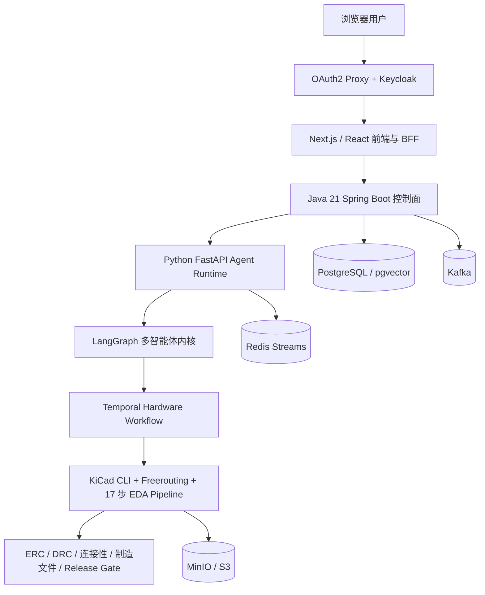

# KiCad Design Multi-Agent System / RatsNestPro 项目说明

## 一句话定位

这是一个面向真实 KiCad/Freerouting 工具链的企业级硬件设计多智能体系统：用户通过自然语言描述 PCB 需求，系统由多个专业 Agent 协作完成需求澄清、资料检索、器件闭包、原理图生成、PCB 布局布线、ERC/DRC、制造文件导出和独立审查，并通过确定性证据门禁决定设计能否达到 `release_ready`。

它不是一个“让大模型生成 KiCad 文本”的演示项目，而是一套将 LLM 推理、工程工具执行、长任务恢复、人工决策、质量审查和企业控制面组合起来的 Agentic Engineering 平台。

## 1. 项目要解决的问题

传统单 Agent 硬件设计方案通常存在以下问题：

1. 一个模型同时负责需求理解、器件选型、原理图、PCB 和审查，职责和上下文容易互相污染。
2. 模型可能声称“已经连接、已经通过 ERC”，但实际 KiCad 文件不满足条件。
3. Symbol、Footprint、Pin-Pad 映射不完整时，系统容易带着占位符继续执行。
4. KiCad、Freerouting 等任务耗时较长，服务重启或浏览器断开后难以恢复。
5. ERC、DRC、未连接网络等问题只能发现，不能定位到实体并进行修复。
6. 缺乏公平、可复现的单 Agent/多 Agent 对照评测，无法证明多智能体的实际业务收益。

项目的核心目标不是让模型“看起来完成了设计”，而是建立一条可验证、可恢复、可审查、可追责的硬件设计交付链路。

## 2. 总体架构



系统基础设施职责如下：

- PostgreSQL：业务状态、LangGraph Checkpoint、长期记忆和审计数据。
- pgvector：跨会话语义记忆。
- Redis：Run 租约、fencing token、事件回放和实时 LLM 输出。
- Kafka：运行生命周期、审计、用量和演进观察事件。
- Temporal：硬件长任务的耐久执行与断点恢复。
- MinIO/S3：KiCad、Gerber、BOM、CPL、DSN、SES 和审查报告。
- OpenTelemetry：跨前端、Java、Python 和 Temporal 的链路观测。

## 3. 多智能体内核

系统采用的不是自由循环 ReAct，而是：

> 角色化 LangGraph 状态机 + 确定性工具门禁 + Temporal 耐久工作流。

各角色不是相互自由聊天，而是在 Supervisor 控制下按照明确的状态图和交付契约协作。

| 角色 | 主要职责 |
|---|---|
| Supervisor | 识别意图、选择 Capability Profile、组织阶段执行、汇总结果 |
| Architect | 需求分析、资料检索、器件证据、系统架构和约束定义 |
| Specialist Panel | 按任务加入电源、SI、EMC、DFM、固件接口等专业审查视角 |
| Parts Specialist | 器件、Symbol、Footprint、Pin-Pad 映射和采购证据验证 |
| Hardware Engineer | 通过 Temporal 执行真实 KiCad/Freerouting 流水线 |
| Reviewer | 独立检查实体文件、ERC、DRC、连接性、制造与交付条件 |

角色共享同一个结构化 State，但每个角色只能读取必要的状态投影、调用允许的工具并输出规定的数据结构。LLM 负责需求理解、候选生成和解释；KiCad CLI、文件检查、ERC/DRC、网表比对和 Release Gate 负责工程真值。

## 4. Hardware Engineer 的 17 步流水线

硬件执行被拆成固定、可恢复的 17 个阶段：

1. `requirements`：冻结原始需求与硬约束。
2. `topology`：建立系统拓扑和功能模块。
3. `selection`：完成器件、Symbol、Footprint 和 Pin-Pad 闭包。
4. `schematic_connections`：生成语义连接关系。
5. `schematic_pinmap`：验证引脚和网络映射。
6. `schematic_layout`：规划原理图页面布局。
7. `schematic_materialize`：生成真实 `.kicad_sch` 文件。
8. `erc`：执行原理图电气规则检查。
9. `layout_partition`：进行 PCB 功能分区。
10. `layout_critical`：放置关键电源、时钟、去耦等器件。
11. `layout_general`：完成一般器件布局。
12. `layout_write`：写入真实 `.kicad_pcb`。
13. `route_plan`：生成路由策略和 DSN。
14. `route_planes`：处理电源、地平面和关键区域。
15. `route_signals`：执行信号路由和 SES 导回。
16. `route_fab`：执行连通性、DRC 和制造前检查。
17. `manufacture`：导出 Gerber、钻孔、BOM、CPL、报告和 Manifest。

每一步成功后都会保存 Pipeline Checkpoint。服务重启后，Temporal 根据 Workflow ID、输入摘要和 Manifest Digest 附着到原任务，只执行尚未完成的步骤。Temporal 保证的是执行耐久性，并不保证设计本身一定正确。

## 5. HITL：用户参与工程决策

系统从需求中提取板框、层数、电源、接口、时钟、调试口和元件替代等工程决策。只有原始需求确实缺失、存在歧义或需要批准替换时，Decision Engine 才会触发 LangGraph `interrupt()`。

HITL 事件包含稳定的 `interactionId`、`stateVersion`、结构化问题、候选选项和影响范围。用户回答后，系统通过 `Command(resume=...)` 恢复原 LangGraph Checkpoint，而不是重新创建任务。Interaction ID、状态版本和 CAS 校验用于防止重复回答、过期回答和跨任务串线。

已经在原始需求中明确的约束不能被 HITL 无意覆盖。例如用户明确要求“双层、≤40×30 mm”，系统不得通过后续提问将其改成四层或 50×40 mm。

## 6. 器件闭包和防止虚假设计

所有器件必须在进入原理图阶段前完成以下闭包：

- 原始器件身份。
- 真实 KiCad Symbol。
- 真实 KiCad Footprint。
- 完整 Pin-Pad 对应关系。
- 库文件来源和 SHA-256。
- 必要的 Datasheet 或官方证据。
- 是否允许进入 Release。

缺失 Symbol、Footprint、引脚功能未验证或仅使用占位符时，系统在 `selection` 阶段阻断，而不是生成表面完整、实际不可制造的 PCB。

原理图生成后，系统还会将 Design IR 中的 `(ref, pin, net)` 与 KiCad 实际导出的网表进行集合级比较，检查图形未连接、多余连接、同一 Pin 跨多个 Net、IR 与实体不一致，以及 MCU Boot、Reset、电源和调试引脚终止错误。

## 7. Release-ready 质量门禁

最终状态分成三类：

- `release_ready`：真实工程文件、器件闭包、ERC、DRC、连接性、路由、制造输出和独立 Reviewer 全部满足当前 Profile。
- `delivered_with_issues`：生成了可编辑草稿，但仍存在工程问题，禁止作为可制造设计发布。
- `execution_blocked`：工具、环境、证据或流水线执行无法继续。

`17/17` 只说明流程执行到最后一步，不等于 `release_ready`。最终审查会重新读取实体 PCB，核对板层和板框、ERC、DRC、未连接网络、跨网络短路、Footprint 和 Pin-Pad、Freerouting 结果、用户原始约束、制造输出和 Reviewer 报告。LLM 的文字结论不能覆盖这些门禁。

## 8. AHE、EHE 与受治理自进化

### 8.1 AHE

AHE 是单次任务内的有界 Agentic Harness Engineering。它将失败区分为工程设计错误、基础设施瞬时故障、Harness 编排或状态错误、外部证据缺失和不可违反的用户约束冲突。

针对可修复问题，系统执行：

```text
确定性 Gate 产生失败 Observation
→ 按当前阶段加载领域 Skill 与 failure-reflection Skill
→ LLM 形成根因假设并选择当前步修复、工具重试、重新检查或动态上游回滚
→ Harness 将选择绑定到已注册的实体工具并创建候选/检查点
→ 修改实体工程或重跑权威工具
→ 独立 Gate 给出新的 Observation 和收敛分数
→ LLM 基于真实变化继续、换假设、换回滚点，或请求必要的人类决策
```

每一轮都会持久化 `RecoveryDecision` 与 `RecoveryTurnRecord`，记录 Skill 摘要、工具、目标步骤、前后分数和观察结果。同一动作、同一 Artifact 指纹和同一分数不允许原样重放。`blocked` 是恢复预算耗尽、缺少真实证据/权限、必须由用户决定或硬约束冲突后的终态，不再是普通 ERC、DRC、布局或布线失败的第一反应。

LLM 拥有诊断权、计划权、工具选择权、候选修改权和回滚改路权；Harness 仍拥有事实权、工作区权限、不可变需求、确定性 Release Gate、预算和审计权。AHE 不会热修改生产源码，Harness 缺陷只能形成受治理的 Evolution Candidate。

### 8.2 EHE

EHE 聚合跨项目的匿名失败签名和经过验证的修复经验。只有同时满足 `17/17 + Reviewer PASS + release_ready` 的经验才能晋升。同一种 Harness 缺陷必须至少跨两个 Project、两个独立 Run 复现，才允许成为 Evolution Candidate。单次器件缺失、设计错误或环境故障不会触发“自进化”。

### 8.3 Governed Evolution

Evolution 可以在独立 Worktree 或受限 Kubernetes Job 中生成白名单范围内的最小补丁，绑定固定 Git Commit 和 Harness Manifest，运行 Optimization、Holdout 和 Adversarial Eval，生成内容寻址报告并等待人工审批。

它不会自动 merge、push 或 deploy。候选即使通过，也只会进入 `approved_for_external_review`，随后仍需要代码审查、构建新镜像、Canary 和人工 Promote。

## 9. 记忆与 Agentic RAG

### 9.1 短期记忆

LangGraph 使用 PostgreSQL Checkpoint 保存对话、已确认决策、架构证据、器件结果、Hardware Pipeline 状态、Reviewer 结果和 HITL Interrupt 状态，因此同一 Thread 可以跨进程重启继续执行。

### 9.2 长期记忆

长期记忆使用 PostgreSQL + pgvector，包括 384 维向量、HNSW 语义索引、全文检索、时间衰减、来源置信度、同项目加权和 `active/superseded/contested` 冲突状态。

只有用户原话、显式用户事实和确定性 Artifact Manifest 结果可以写入长期记忆。Assistant 自由文本、网页内容和未经验证的工程结论不会直接固化。召回记忆被标记为“不可信历史上下文”，器件、引脚和制造事实仍须重新通过资料与 KiCad 门禁。

当前 episodic memory 主要是用户事件的确定性规范化记录，不应宣传为独立摘要模型生成的完整自然语言语义摘要；冲突治理主要覆盖带稳定 key 的显式事实，不是任意自然语言命题的通用矛盾推理。

### 9.3 Agentic RAG

Architect、Parts Specialist 和 Reviewer 可以依次查询外部 Agentic RAG、项目内置知识库、经过验证的 EHE 经验，以及官方网页和 Datasheet fallback。RAG 内容只能作为候选证据，不能替代真实 Symbol、Footprint、ERC、DRC 和制造检查。

## 10. 企业级控制面与前端

前端采用 Next.js、React 和 TypeScript，支持历史会话选择与删除、新建/继续/修订工程、多角色实时状态、17 步执行进度、HITL 表单、SSE 断线重连、Runtime 状态、Artifact、自定义 Specialist 和配对评测。

Java 控制面采用模块化单体和 Port/Adapter 架构，负责 OIDC/JWT、Tenant/RBAC、PostgreSQL RLS、Project/Run/Thread/Revision、幂等启动、HITL CAS、SSE、Artifact、Transactional Outbox、Harness 版本和 Evolution 审批。Python Runtime 同时保留 HTTP 与 gRPC Adapter。浏览器不会直接访问 Python Agent，也不会持有内部服务凭据。

## 11. 单 Agent / 多 Agent 配对评测

评测专用的 `ratsnestpro-single-agent-eval` 是真实单节点、连续上下文 Agent，但与多 Agent 复用相同模型与预算、证据工具、Temporal 17 步流水线、Reviewer 和 Release Gate，因此不会通过故意削弱单 Agent 来制造差异。该 Agent 默认生产关闭，只在受控评测配置中启用。

黄金评测集收集端到端完成率、`release_ready` 比例、ERC/DRC 通过率、无未连接网络比例、人工盲审接受率、任务耗时、HITL 介入率、工具调用正确率、跨角色交接错误率、Token 和基础设施成本。缺失证据保留为 `null/N/A`，不能补成成功。

截至 2026-08-29，严格 E2E 已得到两个多 Agent `release_ready` 正向样本：NE555 为 ERC 0、DRC 0、unconnected 0、15/15 connections；STM32F030 为 ERC 0、DRC 0、unconnected 0、50/50 connections。当前只有 NE555 具备完整单/多 Agent pair：单 Agent 为 `delivered_with_issues`，多 Agent 为 `release_ready`，所以这一个 pair 的严格成功率为 0% 对 100%。样本量只有 1，不能外推为总体增益；人工盲审、完整 handoff 分母和跨臂工具参数证据仍为 N/A。详见 [release-ready 收敛报告](../evals/reports/release-ready-convergence-20260829.md)。

## 12. 当前成熟度和边界

代码层已经形成：

```text
需求冻结
→ 证据闭包
→ 实体原理图
→ ERC
→ 实体 PCB
→ 布局布线
→ DRC
→ 有界实体修复
→ 原始约束复审
→ 独立 Reviewer
→ 制造输出
→ Release Gate
```

目前能够证明系统具备真实工具执行、长任务恢复、风险阻断、可审计交付，以及在两个受支持黄金板型上产出严格 `release_ready` 的能力。它仍不能证明任意 PCB 需求的稳定成功率；多智能体业务增益也只能陈述为一个完整 pair 的观察结果，仍需继续补齐固定黄金任务的真实配对与盲审。

本地 Docker Compose 使用 Temporal dev server、单节点 Kafka 和 Keycloak 开发模式，适合完整开发与评测，不应原样作为生产集群。vLLM、AWQ/GPTQ、投机采样和独立 Evolution/Observability Profile 均为可选部署能力，不代表默认链路已经启用。

## 13. 延伸文档

- [项目 README](../README.md)
- [项目源码导读](PROJECT_CODE_GUIDE_ZH.md)
- [完整技术报告](RATSNESTPRO_COMPLETE_PROJECT_TECHNICAL_REPORT_ZH.md)
- [可观测性与评测](observability-and-evaluation.md)
- [分布式运行时](DISTRIBUTED_RUNTIME.md)
- [模块化单体与服务边界 ADR](adr/0002-modular-monolith-and-service-boundaries.md)
