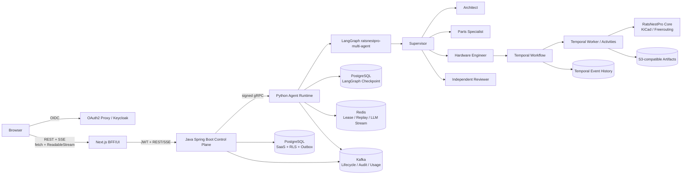
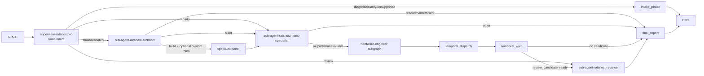
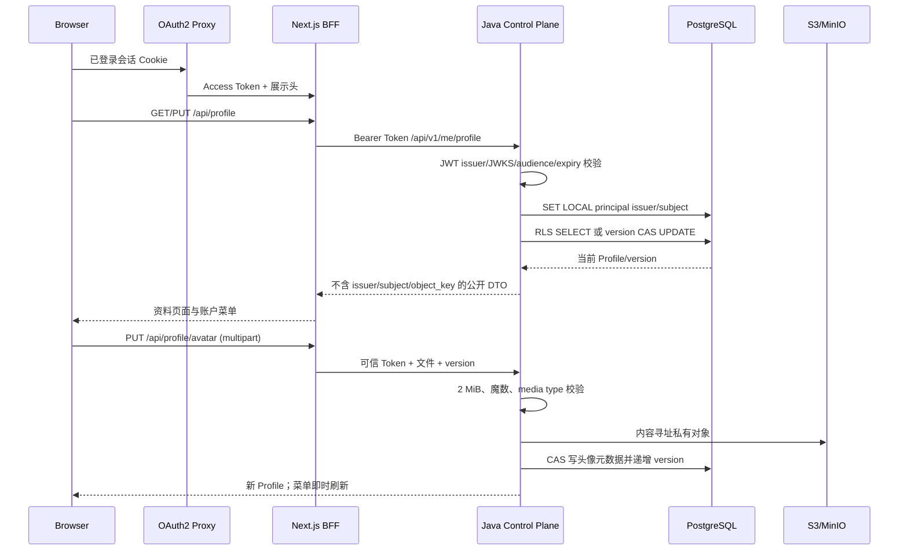

# CircuitFoundry 完整项目技术、架构与面试报告

> 快照日期：2026-08-19
> 代码根目录：本仓库根目录
> 产品定位：面向五类版本化 KiCad 硬件设计场景的企业级、多租户、多智能体 SaaS
> 兼容说明：产品名称升级为 CircuitFoundry；`ratsnestpro`/`ratsnest-*` 继续作为稳定的内部协议、数据库与运行标识。
> 重要说明：本文区分“代码已实现”“静态验证通过”“本地集成通过”和“生产环境已演练”。没有真实证据的能力不会写成已经投产。

## 1. 执行摘要

CircuitFoundry 已经不是一个“把提示词直接交给单个 LLM”的演示程序，而是由三层组成的工程系统：

1. **产品与 SaaS 控制面**：Next.js 前端通过 Java Spring Boot 控制面完成登录、组织、项目、Run、Revision、产物授权和 SSE 事件访问。
2. **多智能体执行面**：Python LangGraph 注册了唯一面向产品的 `ratsnestpro-multi-agent`，由 Supervisor、Architect、Parts Specialist、Hardware Engineer 和 Reviewer 分工协作。
3. **耐久硬件工作流**：Hardware Engineer 的长流程由 Temporal Workflow/Activity/Worker 执行，真正调用 RatsNestPro 工程内核、KiCad 和 Freerouting，并通过 AHE 做有界局部修复，通过 EHE 记录跨项目、经验证的通用经验。

当前项目已经具备以下主要能力：

- OIDC 登录、JWT/JWKS 校验、组织/成员/项目模型和固定 RBAC；
- PostgreSQL RLS 多租户隔离和 Flyway V1–V17 迁移；
- OIDC 主体资料、头像上传、乐观锁更新和个人资料工作区；
- 自然语言意图识别、上下文续跑/修订/诊断和离题对话边界；
- 五类不可变、带摘要的 Capability Profile；
- Supervisor 到四类专业子智能体的结构化委派；
- 17 步原理图、PCB、布线、制造输出流水线；
- Temporal 重试、超时、心跳、取消、恢复和 Saga 补偿；
- AHE 有界修复、最小后缀重规划，以及 EHE 防投毒经验沉淀；
- Redis lease/fencing、SSE replay、LLM Redis Stream；
- Java PostgreSQL Outbox 和 Python Redis Outbox 到 Kafka 的至少一次事件链；
- S3 兼容产物发布、SHA-256/Manifest digest、短期下载授权；
- Run Revision、人工反馈、不覆盖旧工程和三态交付；
- Kubernetes Cell、三可用区调度意图、PDB、HPA、NetworkPolicy；
- OpenTelemetry、Prometheus 指标契约、Tempo/Loki 出口和 LangSmith 脱敏开关。

但它还不能被描述为“生产发布就绪”：真实 Kubernetes Metrics API/HPA、遥测 TLS/认证/重启恢复、跨区域 failover/failback 和 RPO/RTO 尚无真实集群证据；五类能力边界也不等于所有板卡都能完成。当前最准确的成熟度是：**核心产品链路可运行、企业控制面和耐久执行架构已经成形，生产 Cell 的部署意图完整，但仍需真实集群验收和硬件基准集持续验证。**

## 2. 产品目标与边界

### 2.1 产品目标

用户不需要写一份完美的硬件规格书。系统应把自然语言需求规范化，选择合适的能力边界，组建固定核心角色和可选专业角色，生成可编辑的 KiCad 工程，并交付：

- `.kicad_sch`；
- `.kicad_pcb`；
- DSN/SES（需要布线时）；
- BOM、CPL；
- Gerber、钻孔等制造文件；
- 资料/器件证据；
- 独立审查报告；
- 已知错误、风险、未验证事项和人工修正建议。

系统采用“优先交付工程 + 如实报告问题”的策略。普通 ERC/DRC、器件采购、阻抗或工程风险不应无限触发自修复并吞噬预算；执行环境故障、产物无法生成、身份不一致或硬约束冲突才应阻止交付。

### 2.2 明确不做的事

- 不承诺任意板卡、任意电压、任意射频/安全认证需求都能自动完成；
- 不保证 AI 生成电路无需专业硬件工程师审核；
- 不把 ATmega、STM32 或任何板卡样例当生产兜底答案；
- 不通过改名、删除器件、降低 ERC/DRC 等级或伪造日志获得“成功”；
- 不把模型隐藏思维链伪造成可见 reasoning；只展示供应商真实返回的 reasoning 字段或系统生成的决策摘要；
- EHE 不在运行时自动改源码，也不把单次用户任务的错误直接升级为全局规则。

## 3. 总体架构



### 3.1 权威边界

| 领域 | 权威组件 | 原因 |
|---|---|---|
| 用户、租户、项目、配额、Run 业务状态 | Java + PostgreSQL | 需要事务、RLS、审计和稳定外部 API |
| 对话、角色委派、意图和最终报告 | LangGraph checkpoint | 适合显式图状态、条件边和人工反馈 |
| Hardware Engineer 长任务 | Temporal | 需要耐久定时器、重试、心跳、取消和恢复 |
| 工程步骤与 EDA 产物 | RatsNestPro pipeline state/workspace | 工程内核必须掌握真实文件和确定性检查 |
| 活跃执行租约和短期事件回放 | Redis | 低延迟、TTL、Lua 原子操作和 Stream |
| 生命周期、审计、用量、EHE observation | Kafka | 持久事件流和消费者解耦 |
| 大型不可变交付文件 | S3 兼容存储 | 低成本、内容寻址、生命周期与跨区复制 |

## 4. 编程语言与技术栈

| 层 | 语言/技术 | 当前版本或形态 | 为什么使用 | 主要作用 |
|---|---|---|---|---|
| 浏览器产品 | TypeScript、React、Next.js | TypeScript 5.9、React 19、Next.js 16 | 主流 Web 生态、强类型、BFF/SSR、原生流式响应 | 团队构建、聊天、步骤、证据、产物、模型选择、登录状态 |
| SaaS 控制面 | Java 21、Spring Boot 4.1、Maven | 模块化单体 | 企业认证/事务生态成熟、强约束、虚拟线程能力、长期可维护 | OIDC、租户/RBAC、项目、Run、Revision、Outbox、产物授权 |
| Agent Runtime | Python 3.12+ | FastAPI、Pydantic、asyncio | LLM/Agent/EDA SDK 生态最完整，迭代速度快 | 模型、工具、LangGraph、多智能体、内部 REST/gRPC |
| Agent 编排 | LangGraph + LangChain | LangGraph 1.2、LangChain 1.3 | LangChain 提供模型/工具适配；LangGraph提供显式状态机、循环、checkpoint、人工介入 | 意图路由、角色节点、条件转移、状态恢复 |
| 耐久工作流 | Temporal Python SDK | Workflow/Activity/Worker | 普通 async task 无法可靠承载小时级任务和进程重启 | 17 步调度、RetryPolicy、timeout、heartbeat、signal、Saga |
| EDA | KiCad、kicad-cli、Freerouting | 容器工具链，具体版本由镜像固定 | 产生真实可编辑工程，执行 ERC/DRC 和自动布线 | 原理图/PCB/DSN/SES/制造文件 |
| 关系数据 | PostgreSQL 16、SQL、Flyway | Java 业务 schema + checkpoint schema | ACID、RLS、行锁、JSON、成熟运维 | 多租户业务、状态、Outbox、LangGraph checkpoint |
| 实时协调 | Redis 8 | AOF、Lua、Streams、TTL | 亚毫秒读写、原子脚本、短期 replay、租约 | run registry、fencing、SSE replay、LLM Stream |
| 事件总线 | Kafka 4.x / aiokafka / Spring Kafka | 本地单节点，生产要求集群 | 高吞吐、分区有序、持久订阅、消费者解耦 | 生命周期、审计、用量、EHE observation |
| 内部 RPC | Protocol Buffers 3 + gRPC | 四个版本化 RPC | 强类型、跨语言、服务端流式和低开销 | Java 到 Python Start/Get/Control/Subscribe |
| 外部流式协议 | HTTP REST + SSE | `fetch + ReadableStream`、Last-Event-ID | 浏览器原生、代理友好、单向流最简；控制命令仍走 REST | Token/消息/工具/里程碑实时展示和重连 |
| 身份 | OIDC、OAuth2 Proxy、Keycloak dev | JWT/JWKS、PKCE S256 | 企业 IdP 标准、避免自研密码系统 | 登录、会话、资源服务器校验 |
| 产物 | S3 API、AWS SDK/boto3 | Local 或 S3 Publisher | 大文件不进入数据库/消息系统 | 私有上传、哈希、短期预签名下载 |
| 云原生 | Docker Compose、Kubernetes、Kustomize | Cell overlay | 本地可复现；生产多 AZ、扩缩、故障域隔离 | 部署、HPA、PDB、NetworkPolicy |
| 可观测性 | OpenTelemetry、Prometheus、Tempo、Loki、LangSmith | OTel Collector 契约 | 厂商中立的 trace/metric/log；Agent 专用追踪可选 | 全链路诊断、容量和告警 |
| 配置/契约 | YAML、JSON Schema、Proto、Pydantic | 版本化严格模型 | 阻止自由文本成为隐式协议 | API、Profile、RunEvent、Artifact Manifest |
| 运维脚本 | PowerShell、Shell | 有界验收脚本 | Windows 本地和 Linux 容器协同 | 迁移、静态门禁、集群预检、冒烟 |

## 5. 代码结构

```text
agent-service-toolkit-main/
├─ frontend/                         # Next.js 产品前端和 BFF
│  ├─ app/api/                       # chat、run、history、artifact、session 代理
│  ├─ components/                    # team builder、workspace、chat console
│  └─ lib/                           # Java gateway、SSE parser
├─ backend/                          # Java Spring Boot 控制面
│  └─ src/main/java/.../
│     ├─ identity/ organization/ project/ tenancy/
│     ├─ run/ artifact/ agentgateway/
│     └─ shared/web/ bootstrap/
├─ src/
│  ├─ agents/ratsnestpro/            # LangGraph 团队、意图、AHE/EHE、工具
│  │  ├─ profiles/                   # 五类版本化 Capability Profile
│  │  └─ temporal/                   # Workflow、Activity、Worker、contracts
│  ├─ service/                       # FastAPI、gRPC、Redis、Kafka、SSE、身份 scope
│  └─ schema/                        # Pydantic API/内部契约
├─ contracts/
│  ├─ agent-runtime/v1/              # Proto + JSON Schema
│  └─ public/v1/                     # 外部 Run API Schema
├─ deploy/k8s/                       # base、Cell、observability overlays
├─ docker/identity/                  # 本地 Keycloak Realm
├─ scripts/                          # 验收、迁移、预检
├─ tests/                            # Python 单元/集成/边界测试
├─ compose.yaml                      # 本地完整栈
└─ docs/                             # 架构、验收和本文档
```

## 6. 一次用户请求的端到端链路

1. 用户从 OIDC 入口登录；OAuth2 Proxy 建立安全 Cookie，会话身份来自 Keycloak 或企业 IdP。
2. 前端读取 session、组织、项目、Profile 和模型列表；未认证的 401 显示登录按钮，而不是永久“读取模型中”。
3. 用户在团队页确认固定 KiCad 团队，可添加有限的专业审查角色。
4. 浏览器把自然语言、Profile、团队成员、thread 和 idempotency key 交给 Next.js BFF。
5. BFF 只访问 Java；浏览器不能直接信任地指定 `tenant_id/user_id`。
6. Java 从 JWT 建立 `AuthenticatedActor` 和 `TenantContext`，验证项目 membership、配额和幂等键。
7. Java 在 PostgreSQL 创建 Run，记录 Profile 快照/摘要，并通过签名 gRPC `StartRun` 调用 Python。
8. Python 验证每个内部请求签名，将 principal/tenant/project 绑定为不可由 JSON 构造的私有 identity，并生成不可逆 `rt1` scope。
9. Intent Router 先做确定性领域证据判断，再在必要时进行有界 LLM JSON 分类。
10. 离题请求由轻量对话边界自然回答，不启动 EDA；review 只有在发现真实工程路径时才成立。
11. Build 请求进入 Supervisor，随后按结构化证据委派 Architect、Parts Specialist 和 Hardware Engineer。
12. Architect 使用内部知识/KiCad 库、web search 和 datasheet 工具；Parts Specialist 如本地采购库不可用必须说明，不编造库存/编号。
13. Hardware Engineer 启动唯一、幂等的 Temporal Workflow。Workflow 逐步调用 17 个 canonical step。
14. 每一步加载并校验前缀 checkpoint；确定性失败被归一为 `FailureEnvelope`。
15. 可恢复失败由 AHE 在预算内局部修复或回滚最小后缀；能力缺口写 EHE observation；硬冲突保留证据。
16. Reviewer 在 Hardware Engineer 之后独立审查，不能由执行者自己替代。
17. Python 生成 Artifact Manifest，校验 workspace 包含性、普通文件、哈希和交付状态，上传 Local/S3 Publisher。
18. Java 接收单调 `event_seq`，保存可信 Manifest；前端通过 SSE 展示角色、工具、消息、AHE、状态和下载入口。
19. 浏览器断开不会取消 Temporal；重连用 Run ID 和 Last-Event-ID 续读。取消必须显式走 REST/gRPC ControlRun。
20. 人工反馈创建新的 Run Revision，不覆盖旧工程；旧 Manifest 由 revision 链动态标记 superseded。

## 7. 前端实现

### 7.1 页面和产品体验

前端不再使用 Streamlit 作为正式产品界面，而是白色、团队工作区风格的 Next.js 应用，包含：

- OIDC 登录/失效提示；
- KiCad 团队构建页；
- 核心角色和可选/自定义角色；
- 项目工作区、工程频道、角色状态；
- 聊天式流输出，而非把所有内容压缩到一个面板；
- 模型选择器；
- 工具证据、AHE 动作、步骤和审查状态；
- KiCad、BOM/CPL、审查报告等交付卡；
- 历史、取消、反馈和 Revision 续作。

### 7.2 为什么是 `fetch + ReadableStream + SSE`

浏览器到服务器主要是单向长流：服务器持续输出模型消息和工程里程碑，浏览器偶尔发送开始、取消、反馈等命令。因此 REST + SSE 比 WebSocket 更简单：

- 复用 HTTP 认证、网关和日志；
- 支持 `Last-Event-ID`；
- 中间代理更容易配置；
- 不需要维护双向自定义帧协议；
- 取消/反馈保持清晰的 REST 语义。

`frontend/lib/sse.ts` 自己处理任意 chunk 边界、CRLF、multi-line data、event/id/retry 和 TextDecoder 尾部；因此不能假设一次 `reader.read()` 就是一条 SSE。

这里没有使用原生 `EventSource`，因为启动 Run 是带 JSON body、幂等键和 Profile 的 POST，请求还要用 AbortController；`fetch + ReadableStream` 更适合。开发时受认证保护的入口是 OAuth2 Proxy 端口，直接访问 3000 只是未受代理保护的调试路径，不能在启用 trusted proxy header 后对公网开放。

### 7.3 BFF 安全边界

Next.js API Route 是浏览器 BFF：它校验 UUID、安全 thread ID、消息长度、Profile 和 team members，再把 Cookie/JWT 请求发给 Java。前端不会直连 Python，也不会接受浏览器传来的任意 `user_id` 作为执行身份。

## 8. Java 控制面

### 8.1 为什么把企业后端放在 Java

Python Agent Runtime 继续专注模型和工程执行；Java 负责企业业务。这样避免让 Python 同时承担 Agent 快速迭代与 SaaS 强事务职责。Spring 生态适合 OIDC Resource Server、JDBC/Flyway、Kafka、Bean Validation、ProblemDetail、Actuator 和长期团队维护。

### 8.2 模块化单体

- `identity`：JWT/JWKS、OIDC 配置 guard、安全错误；
- `organization` / `tenancy`：组织、membership、角色、TenantContext；
- `project`：租户内项目；
- `run`：Run 状态、Idempotency-Key、SSE、取消、Revision、reconciliation；
- `artifact`：Manifest、Artifact、授权和预签名下载；
- `agentgateway`：HTTP 兼容网关、gRPC 网关、内部签名；
- `shared.web`：RFC 9457 ProblemDetail、`X-Request-ID`；
- `bootstrap`：应用、Flyway 独立迁移入口、Kafka/OIDC 启动 guard。

采用模块化单体而不是提前拆微服务，是因为这些业务仍共享事务和数据模型；边界通过 package 和 Gateway 契约建立，等真实规模/组织边界出现再拆分。

Java 对 durable Run 的 start/get/control/event 已有 gRPC 实现，但 runtime info 和 history 仍通过签名 HTTP 兼容网关；gRPC 默认 feature flag 关闭，生产启用时 Java/Python 必须成对切换。当前 gRPC 是集群内 plaintext 契约，需 Service Mesh mTLS 或应用层 TLS 才能作为生产传输。

### 8.3 多租户与 RLS

所有业务表携带 `tenant_id`。应用层先做 membership/RBAC，数据库再通过 `ENABLE/FORCE ROW LEVEL SECURITY` 做最后防线。迁移角色与运行角色分离；运行角色不能是 superuser 或 BYPASSRLS。租户上下文必须在事务内设置，防止连接池复用泄漏。

角色为 `owner/admin/engineer/reviewer/viewer`，权限在服务端判断，客户端字段不能提升权限。

### 8.4 幂等、Outbox 和顺序

Run 使用 `Idempotency-Key`；同键同 payload 返回/附着同 Run，同键不同 payload 返回冲突。V6 Outbox 在锁定 Run 行后先检查 `source_event_seq`，再分配 `state_version`，避免重复事件造成版本空洞。Publisher 只 claim 每个 Run 的 head，Kafka ACK 后才数据库 ACK。

这是 **at-least-once**：若 Broker ACK 后进程在 DB ACK 前崩溃，会以相同 `eventId` 重投；消费者仍必须去重。不同 Run 可以并行，同一 Run 保持顺序。

### 8.5 API 与错误模型

核心 API 包括：组织/成员/项目、创建和查询 Run、SSE、取消、Revision、Artifact 列表和下载。错误使用 RFC 9457 `ProblemDetail`，携带稳定 `code`、HTTP status、detail、instance、trace/request ID，避免前端解析异常字符串。

## 9. Python Agent Runtime 与多智能体内核

### 9.1 为什么 LangGraph，而不是只用 LangChain

LangChain 仍用于统一模型、消息和工具调用；但复杂多智能体需要显式状态、条件边、循环、checkpoint、恢复和人工反馈。LangGraph 能把这些控制流写成可检查的图，而不是把流程藏进一个超长 prompt 或递归 AgentExecutor。

对本项目而言，LangGraph 负责“谁做什么、何时转移、状态写到哪里”；LLM 负责需求理解、资料综合和设计候选，不负责伪造确定性 EDA 结论。生产 PCB Supervisor 是显式 `StateGraph` 条件图，不是让 LLM 任意选择下一 Agent 的自由 ReAct supervisor；仓库内其他通用 supervisor 示例不能当作该产品的执行证据。

### 9.2 角色

| 角色 | 职责 | 不能做什么 |
|---|---|---|
| Supervisor | 读取 intent/Profile，规划和委派，汇总结构化状态 | 不能编造子智能体已执行或替代 EDA 检查 |
| Architect | 需求分解、官方资料/KiCad 库检索、架构与设计依据 | 不能把网页叙述当真实 BOM/文件 |
| Parts Specialist | 器件、符号、封装、采购数据和替代方案 | 数据库不可用时不能编造 MPN/LCSC/库存 |
| Hardware Engineer | 运行 Temporal 17 步工程流程、保留产物和修复 | 不能自己冒充 Reviewer |
| Reviewer | 独立检查 ERC/DRC、连接、制造和未验证项 | 不能把 warning/deferred 写成通过 |

前端可添加专业角色作为本次任务的审查视角，但核心执行路径仍由真实注册的五类角色承担；用户自定义角色不会动态注入未经审计的代码。

### 9.3 意图识别

Router 输出严格 `IntentDecision`，主要字段包括 primary intent、new/resume/amend/diagnose 关系、工程路径、输出要求、confidence/evidence 和 post-actions。顺序是：

1. 校验结构化模式；
2. 用领域词、文件路径、活动上下文做确定性判断；
3. 对短跟进消息恢复 thread 上下文；
4. 只有仍然模糊时才调用有界 LLM JSON classifier；
5. 缺失选择会实质改变结果时才问一个澄清问题；
6. 问候或离题内容自然回答，但绝不启动 PCB 工具。

这能避免“用户说 review，但 project path 是空字符串”仍直接调用 Reviewer，也能避免一个 `design` 或 `Java` 单词误触发硬件流程。

### 9.4 五类 Capability Profile

| Profile | 支持范围 | 排除范围摘要 |
|---|---|---|
| `sipi-channel-pdn-eval@1.0` | 被动互连、PDN 测试、测量/校准结构 | 市电、安全认证、无限制射频发射 |
| `telecom-48v-power-monitor@1.0` | 通信 48 V 监测、保护/隔离采样、低压遥测 | 市电转换、生命安全、高功率无人认证控制 |
| `site-control-telemetry@1.0` | 低压传感采集、工业有线通信、低能量受控输出 | 直接市电、功能安全、本安认证 |
| `sfp-sync-interface@1.0` | SFP Host、时钟同步、管理/状态接口 | 光模块内部、认证运营商设备、无界高速交换 |
| `radio-control-monitor@1.0` | 无线模块监控、低速控制、受保护供电/服务接口 | PA/天线设计、频谱认证、安全关键射频控制 |

Profile 不是固定 BOM/Net/板卡模板。Manifest 只定义边界、证据、工具链、预算和验收；运行时保存 `id + version + SHA-256 digest` 快照，续跑不能偷偷换 Profile。五类当前统一预算上限为：60 分钟、1200000 LLM tokens、AHE 最多 6 次、同 failure 最多 2 次。

当前 `Profile` 中预算和身份摘要已经确定性执行；部分 scope/acceptance 仍作为严格边界文本进入工程需求，并没有一套把每条自然语言约束自动编译为 gate 的通用解释器。这是后续 Profile 工程化的重要工作。

## 10. Hardware Engineer 的 17 步流程

| # | Step | 核心产出/检查 |
|---:|---|---|
| 1 | requirements | 规范化需求、边界、验收和证据缺口 |
| 2 | topology | 功能块和电源/信号拓扑 |
| 3 | selection | 真实符号、封装和器件选择 |
| 4 | schematic connections | 网络和连接角色 |
| 5 | schematic pin map | 逻辑 pin 到真实符号 pin/pad |
| 6 | schematic layout | 图纸布局、分区和标注 |
| 7 | schematic materialization | 写出真实 `.kicad_sch` |
| 8 | ERC | `kicad-cli` ERC 和结构化问题 |
| 9 | board partition | 板框、分区、接口/噪声/热区 |
| 10 | critical placement | MCU、电源、晶振、接口保护等关键布局 |
| 11 | general placement | 其余器件，越界/碰撞检查 |
| 12 | PCB write | 写出真实 `.kicad_pcb` |
| 13 | route plan | 规则、差分/电源/优先级和 DSN |
| 14 | planes | GND/Power 区域和参考平面 |
| 15 | signal routing | Freerouting、SES 导回、残余连接 |
| 16 | fabrication audit | DRC、连接性、制造和独立审查输入 |
| 17 | manufacturing outputs | BOM/CPL/Gerber/Drill/报告/Manifest |

每个 Activity 收到 expected step 和受控 manifest，加载 canonical prefix；已完成步骤幂等跳过。完整 KiCad 文件、datasheet 和无限 transcript 不写进 Temporal Event History，History 只保留紧凑摘要和标识符。

## 11. Temporal 设计

### 11.1 Workflow/Activity/Worker

- Workflow 只包含确定性编排、timer、signal、step 状态和紧凑结果；
- Activity 执行文件、网络、LLM、KiCad、Freerouting 等非确定性操作；
- Worker 与 Agent Service 使用同版本镜像，但生产中独立扩容；
- 每个硬件 Workflow ID 由受信 scope、需求摘要和 attempt 生成；重复 Start 会 reattach，而不是创建第二块板。

### 11.2 Retry 和 timeout

基础设施瞬时失败（timeout、429、5xx、临时依赖不可用）可做 Temporal 指数退避；ERC/DRC、器件选择和 schema 错误属于工程结果，不能被 Activity 盲重试。普通步骤和 Freerouting 使用不同 start-to-close/schedule-to-close，长子进程发送 heartbeat；总 Workflow deadline 与 AHE 的 60 分钟预算取更严格者。

### 11.3 Cancel、Pause 与 Saga

Pause 是 step-boundary pause，不在 KiCad 正写文件时强行暂停。Cancel 会停止隔离子进程并执行幂等补偿：保留工程、日志和 checkpoint，写 `temporal_recovery.json`。硬件生成不是数据库事务，删除所有中间文件并不是正确“回滚”。

## 12. AHE 与 EHE

### 12.1 AHE：当前任务的有界自恢复

确定性失败先变成通用 `FailureEnvelope`：step、check、category、recoverability、affected refs、evidence 和稳定 signature；signature 不包含具体板名，避免针对单题硬编码。

AHE 可以执行：

- 空结果/瞬时工具失败的有限重试；
- 器件/网络的局部 delta；
- 基于真实 KiCad 元数据的符号/封装归一化；
- 元件布局的边界/碰撞修复；
- ERC 触发回滚到连接步骤；
- Freerouting 策略组合；
- 只有 DRC/未连接数量单调改善才接受铜皮修复；
- downstream failure 指向 upstream 时，回滚最小失效后缀。

修复只有在 step-specific score 严格改善时才提交，旧产物在证明前仍是权威。预算限制避免“为了追求零 error 无限烧 token”。

### 12.2 EHE：跨任务经验，不是运行时自改源码

EHE 以 append-only event 保存 opaque scope/project fingerprint、failure signature、strategy、before/after score 和 attestation。只有跨至少两个不同项目、且属于同时具备独立 Reviewer PASS 和 release-ready 证据的记录，才可影响策略排序或形成 evolution candidate。

EHE 不执行以下危险行为：

- 不保存原始 prompt/租户秘密作为全局记忆；
- 不让单次用户输入污染全局策略；
- 不在运行时生成并加载 Python 修复代码；
- 不因某次 ATmega 成功就将其作为其他 MCU 的 fallback。

真正的 Harness 演进仍需：候选归纳 → 回归基准 → 代码审查 → 新镜像发布。

## 13. State、Checkpoint 与并发

### 13.1 状态分层

| 状态 | 存储 | 典型内容 | 恢复方式 |
|---|---|---|---|
| Java SaaS state | PostgreSQL | tenant/project/run/revision/delivery/outbox | 事务和 reconciliation |
| LangGraph state | PostgreSQL checkpointer | message、intent、role output、workflow handle | thread checkpoint |
| Temporal state | Event History | step、attempt、timer、signal、compact result | Workflow replay |
| Engineering state | Run workspace | pipeline prefix、issue ledger、KiCad 文件 | 原子 checkpoint + 最小后缀再生 |
| Live run state | Redis | lease、fencing、status、bounded SSE events | 新 owner takeover |
| LLM live output | Redis Stream | 有界高频 message/reasoning record | Stream cursor + record_id |
| LLM audit fallback | JSONL | 完整 per-workflow transcript | Redis 故障时续读/去重 |
| Cross-run experience | EHE append-only files/events | 可信 failure/strategy evidence | 加载、排序、attestation 过滤 |

### 13.2 如何避免并行状态竞争

- 同一 Java Run 使用数据库 row lock 和单调 `state_version`；
- 同一 agent/thread 使用 PostgreSQL advisory lock；
- Redis owner 使用 lease + fencing token，续租失败 fail-closed 取消旧 producer；
- 同一工程 workspace 使用跨进程文件锁；
- pipeline JSON 使用临时文件 + atomic replace；
- Temporal 让一个 Workflow 成为 Hardware 执行权威；
- specialist 并行结果在单一 join node 合并，不能让多个节点无 reducer 地写同一 state field；
- EHE 一事件一 UUID，避免并发覆盖。

### 13.3 租户 scope

Java 签名包含 RPC path、body hash、run/tenant/project/principal。Python 验签后将身份放入私有、不可序列化绑定，生成 domain-separated `rt1` opaque scope；Redis owner、checkpoint key、锁、workspace 和 audit metadata 都使用该 scope。公网 JSON 无法伪造它。

旧无 scope 内部任务不自动降级挂接。当前本地审计显示 0 个 active Java Run、0 个 active Redis Run，183 个旧 checkpoint 被保留并隔离；删除需要单独的破坏性授权。

## 14. Redis Stream LLM 输出

Redis Stream 已成为 Temporal Hardware Engineer LLM 输出的主实时桥：

- 每个 Workflow 使用哈希化、Redis Cluster hash-tag 安全的独立 key；
- Lua 将 `record_id` 去重、XADD、MAXLEN、TTL 原子化；
- Stream、dedupe hash/zset 都有硬上限和 TTL；
- waiter 保存 Last Stream ID，重启后增量续读；
- Redis 连接/读取采用约 250 ms 短超时，失败返回 None，不阻塞工程；
- JSONL 先写，继续承担完整审计和降级；
- 本地按 `record_id` 再去重；
- token chunks 不写 Kafka，也不写 Temporal Event History。

未来若取消共享 RWX，必须先用对象存储或其他持久审计 sink 验证 JSONL 替代方案；不能简单删除唯一完整审计副本。

## 15. 交付、产物和人工反馈

### 15.1 三态语义

- `execution_blocked`：执行链无法产生/发布可用工程，例如运行时、权限、产物或硬冲突；
- `delivered_with_issues`：已经交付可编辑工程，但存在 ERC/DRC、采购、设计或未验证风险；
- `release_ready`：真实文件、验收门和独立 Reviewer 证据满足当前 Profile。

LLM 叙述不能覆盖上述门禁。

### 15.2 Artifact Manifest

Python 只选择当前 pipeline provenance 的真实文件，拒绝 workspace 外路径、symlink、临时文件、Temporal 输入 manifest 和 transcript。每项包含 UUID、logical kind、media type、name、object key、SHA-256 和 size；canonical artifact list 生成 Manifest digest。

Local Publisher 保持开发兼容；S3 Publisher 使用内容寻址 key、HEAD 哈希验证和幂等上传。Java 在 RLS 下存不可变 Manifest/Artifact，下载前验证 membership，签发默认 5 分钟、上限 15 分钟的预签名 URL。

### 15.3 Revision

人工 amendment/review feedback 必须基于 terminal 且最新 parent。Java 锁定 root revision 链并拒绝 stale parent；新反馈创建新 Run 和 revision number，旧 Manifest 不覆盖，只通过链关系显示 superseded。

## 16. 安全模型

### 16.1 身份与认证

- 本地开发：Keycloak `ratsnest-dev` Realm + OAuth2 Proxy；
- 浏览器：Authorization Code + PKCE S256 +安全 Cookie；
- Java：OIDC Resource Server 校验 issuer、audience、JWKS、角色；
- 生产：HTTP issuer、dev secret/password、`replace-me` 均是 fail-closed 门禁；
- Java→Python：短期逐请求 HMAC 签名；生产仍应由 Service Mesh mTLS 或应用 TLS 保护传输机密性。

### 16.2 授权与隔离

- tenant/project/principal 不信任浏览器字段；
- 应用 RBAC + PostgreSQL FORCE RLS 双层保护；
- Runtime 身份使用 opaque scope；
- S3 对象私有，Java 只发短期链接；
- NetworkPolicy 默认拒绝，再开放 DNS、数据服务和 HTTPS；
- LangSmith 生产默认关闭并隐藏 input/output/metadata；
- OTel 删除 Authorization、Cookie、SQL、Prompt 等敏感字段。

### 16.3 Prompt injection 边界

用户消息是分类器/Agent 的数据，不是系统指令。工具参数必须经过 Pydantic/JSON Schema，网络和文件工具有 allowlist/workspace containment。LLM 不能修改租户身份、Profile digest、release gate 或 Reviewer attestation。

## 17. 中间件职责

### 17.1 PostgreSQL

承担强一致业务状态、RLS、Outbox、Revision 和 checkpoint。它不是高频 token 总线，也不存大型 KiCad 文件。

### 17.2 Redis

承担活跃 run 协调、lease/fencing、短期 SSE replay、Audit Outbox 和 LLM Stream。AOF everysec 仍可能丢最近约一秒，并不等于跨 AZ HA；生产应使用受管 Cluster/高可用部署。

### 17.3 Kafka

承担低频 durable lifecycle/audit/usage/EHE observation。高频 token 不进入 Kafka，以免成本和分区压力失控。本地是单节点 PLAINTEXT、RF=1，只是开发环境；生产要求多 Broker、ISR、ACL、SASL_SSL 和镜像/复制。

### 17.4 Temporal

承担长任务的“什么时候执行、失败后何时重试、如何取消和恢复”，不承担完整工程文件和无限模型 transcript。生产必须接外部 HA Temporal，而 Compose development server 不能作为生产持久层。

## 18. Kubernetes Cell 与可观测性

### 18.1 已表达的部署意图

- Primary Cell 三副本和三 AZ hard spread；
- region node affinity、hostname anti-affinity；
- PDB `minAvailable: 2`；
- Worker 3–50、单 Pod 硬件并发 1；
- Web/Java/OIDC HPA；
- default-deny ingress/egress；
- OTel Collector 三副本 StatefulSet，每副本 2 GiB PVC 有界队列；
- Trace→Tempo、Log→Loki、Metric→Prometheus；
- Tempo/Loki HTTPS 和 Secret 认证。

### 18.2 HPA 指标

CPU 适合一般服务，但 SSE 长连接 CPU 可能很低，因此 Java/Web 还需要 `ratsnest_sse_active_connections`；Hardware Worker 使用 Temporal backlog external metric。OAuth2 Proxy 并不产生该自定义指标，当前 HPA 已改为 CPU，指标契约把 producer 限定为 Java/Node 的长流观测。

### 18.3 当前未通过的生产门

本机没有 Kubernetes context、metrics adapter 或第二 Region，因此以下不能声称完成：

- resource/custom/external Metrics API 发现；
- HPA `ScalingActive` 和 scale up/down；
- Collector Ready、PVC Bound、队列重启恢复；
- 真实 Tempo/Loki TLS 证书与授权拒绝/接受；
- 主备 Region failover/failback；
- RPO ≤ 60 秒、RTO ≤ 1800 秒；
- 50 active Workflow、5000 SSE 的真实容量。

仓库中的 preflight 和 release validator 会在缺证据时失败，防止用空 marker 冒充演练。

## 19. 当前验证与运行状态

### 19.1 最新 Java 构建

- 运行镜像：`agent-service-toolkit-main-control_plane:latest`；
- Image ID：`sha256:c4b0f27bf2280b988b07446a28733943baaf7b80badc7c027a7e9ce6bfbd7e08`；
- Java：21.0.10；运行用户 `10001:10001`；
- 镜像内 JAR SHA-256：`aacf4f3b09fc2b10c244ca7639aeaa993e2ac4b6bb32c59e627b5060cf9eeeca`；
- 45 tests，0 failure，0 error，1 skip；
- skip 为显式 opt-in 的 `GrpcAgentRuntimeCrossProcessTest`，不能据此声称最新镜像的跨进程 gRPC 测试已 fresh pass；
- 包含 V7 用户资料、HTTP Runtime 兼容修复和空事件水位修复的源码已经完成 Java 21 Docker 构建，Compose `control_plane` 已使用该镜像且当前 healthy。

### 19.2 Python/Redis/静态门

- Redis LLM Stream 真实本地 Redis 测试：5 passed；相关聚焦测试 7 passed、1 optional skip；
- Ruff：通过；
- Compose config：通过；
- Increment 8 Kustomize/静态门：全部通过；`releaseReady=false`；
- Runtime identity drain：passed、active Run=0、183 个旧 checkpoint 隔离保留；
- 未启动 LLM、KiCad 或 Freerouting 做本轮验收，避免将基础设施改动和昂贵 EDA 测试混在一起。

### 19.3 当前本地服务

当前 Compose 中 Agent Runtime、Java Control Plane、Next.js、PostgreSQL、Redis、Kafka、Temporal、Keycloak、OAuth2 Proxy 和 MinIO 均在运行；主要服务健康检查通过。本地 Compose 只是开发/集成环境，不代表多 AZ 或跨区能力。

## 20. 为什么此前 Java 新源码没有完成干净构建

这是构建证据问题，不是 Java 源码被证明错误：

1. 当时运行镜像生成时间早于最新 `RunService` 源码约 19 分钟，所以旧容器不能证明新代码；
2. Docker Hub anonymous token 网络不可达，基础镜像元数据拉取失败；
3. 宿主只有 Java 17/旧 JAVA_HOME，而项目明确要求 Java 21；
4. 把 Maven target/cache bind mount 到 Windows E 盘后，小文件 I/O 慢且日志缓冲，触发“60 秒无输出就停止”的防空转规则；
5. 因此之前只有静态契约或旧 Surefire 报告，不能诚实宣称新源码已编译。

最终解决方式是：把 Maven cache 放在 E 盘，使用本地 digest 固定 Java 21 镜像、断网构建和 Linux BuildKit 层；从同一个 clean target 完成源码/测试源码编译、45 项 Surefire 和 package，再核对镜像内外 JAR 哈希。没有往 C 盘下载项目依赖，也没有靠跳过测试获得结果。

## 21. 当前主要风险与下一阶段

按优先级排序：

1. **P0 生产证据**：提供真实 primary/secondary Kubernetes contexts 和云数据服务后，执行 Metrics/HPA、Telemetry TLS/restart、failover/failback；
2. **P0 基准质量**：为五个 Profile 建立版本化 goldens、结构约束、产物存在性和人工 Reviewer rubric；
3. **P1 gRPC fresh smoke**：修复/拆分跨进程冒烟的日志和 JDK client harness，给最新镜像补一次有界证据；
4. **P1 安全**：生产 gRPC/OTLP mTLS、Secret Manager、Kafka ACL、S3/KMS、审计保留；
5. **P1 容量**：5000 SSE 和 50 Worker 是规划值，必须压测并据 p95/p99、FD、heap、队列调整；
6. **P1 数据恢复**：验证 PostgreSQL PITR、Kafka mirror、S3 replication、Temporal namespace DR 的共同恢复水位；
7. **P2 遗留数据**：183 个旧 checkpoint 保留隔离，等待明确 retention/销毁审批；
8. **P2 前端**：可增加大型消息虚拟列表、产物预览、运行成本/配额仪表盘和管理员页面。
9. **P2 内核可维护性**：嵌入 RatsNestPro 的核心 `pipeline.py` 体积很大、职责密集，应按 step/gate/repair/checkpoint 拆分，同时用 golden regression 防止重构改变语义。
10. **P2 Web 安全加固**：Java Bearer API 关闭 CSRF合理，但 cookie-authenticated OAuth2 Proxy→Next BFF 的状态变更还应在生产拓扑中验证 SameSite、Origin/Host 校验和直连端口封闭。

---

## 22. 面试题、参考答案与深挖

以下题库既可用于候选人面试，也可用于项目答辩。回答必须结合本项目边界，不能只背概念。

## 22.1 产品与总体架构

### Q1：这个系统是真正的多智能体，还是多个 prompt 的包装？

**参考答案：**它在 LangGraph 中注册一个公开图，但内部有独立命名的 Supervisor、Architect、Parts Specialist、Hardware Engineer 和 Reviewer 节点/子图。角色之间通过结构化 state 和 handoff 交换证据；Hardware Engineer 还委托 Temporal 耐久工作流，Reviewer 独立执行。判断多智能体的关键不是 UI 显示了几个人，而是角色是否有独立职责、工具、状态归属和控制转移。

**深挖：**如果所有角色共享一个 prompt、一个 tool list、一个 scratchpad，只改角色名，还能算多智能体吗？为什么状态 ownership 比角色数量重要？

**深挖答案：**这种实现本质上仍是“单智能体的多角色扮演”，因为角色之间没有独立的决策边界、工具权限和可验证交接。RatsNestPro 把 Supervisor 的路由决策、Architect 的资料证据、Parts Specialist 的器件证据、Hardware Engineer 的工程状态和 Reviewer 的审查结论写入不同的结构化字段；消息列表只承载叙述，不能覆盖 Profile 摘要、Artifact Manifest 或 Reviewer attestation。状态 ownership 决定谁有权写哪个字段、冲突时谁是权威以及失败后从哪里恢复；没有 ownership，即使 UI 展示十个“员工”，并发写同一个 scratchpad 仍会发生覆盖、重复执行和自审自批。

### Q2：为什么 V1 从“任意板卡”收敛为五类 Profile？

**参考答案：**开放世界硬件设计无法在有限预算内证明器件、供电、布局、制造和安全约束。版本化 Profile 把可支持范围、排除项、证据、预算和验收冻结，允许建立可重复基准，同时不固定 BOM/net，不会退化成模板冒充。

**深挖：**如何判断一个新需求属于已有 Profile、需要澄清，还是应该创建新 Profile 版本？

**深挖答案：**先把自然语言归一为功能块、接口、电源范围、板框、制造约束和强制验收项，再与 Profile Manifest 的能力边界和排除项比较。全部强约束落在同一 Manifest 内且无冲突时，Java 按 `profile_id + profile_version` 解析并把 `profile_digest` 快照写入 Run；只有一两个会改变安全或拓扑的关键参数缺失时进入澄清；出现 Manifest 未声明的器件族、工具链或验收规则时，不应偷偷放宽当前版本，而应进入新 Profile 候选/版本评审。当前后端会校验运行时返回的 Profile id/version，并拒绝与已保存摘要不一致的重放；它不会根据某块示例板替用户伪造 Profile。

### Q3：为什么 Java 是控制面、Python 是执行面？

**参考答案：**Java 擅长稳定企业 API、OIDC、事务、RLS、Kafka 和长期维护；Python 拥有 LangGraph、LLM、KiCad 自动化和科学计算生态。通过契约隔离，两边各自高内聚，不重写已验证的 Agent 内核。

**深挖：**如果把 Run 状态同时写在 Java 和 Python，如何避免双主？本项目如何定义各自权威？

**深挖答案：**本项目不是让两边共同修改同一份状态。Java 的 `control_plane.runs` 是 SaaS 业务状态、租户归属、幂等键、Revision、Delivery Status 和 Artifact Manifest 的权威；Python 的 LangGraph checkpoint、Redis Run Registry 与 Temporal History 是执行进度、节点状态和实时事件的权威。Python 不直接写 Java 业务表，Java 通过 Gateway 查询/订阅 Runtime，并以单调的事件号、只前进的 Run 状态更新和 Outbox `state_version` 落库。重启后 Reconciliation 用稳定的 `run_id/request_id` 重新 attach，而不是创建另一个业务 Run；冲突时以 Java 已提交身份/版本和 Python 可验证执行事件对账，叙述性消息不能覆盖任一权威记录。

### Q4：为什么是模块化单体，不是一开始就微服务？

**参考答案：**组织、项目、Run、Revision、Artifact 仍有强事务关联，团队和流量尚未证明需要独立部署。模块化 package + Gateway 已提供边界，过早微服务只会引入分布式事务、部署和观测成本。

**深挖：**什么真实信号会促使把 Artifact 或 Run Publisher 拆成服务？

**深挖答案：**需要同时看到可测量的独立扩缩需求和清晰的数据所有权，例如 Artifact 下载/签名流量长期压垮控制面、对象保留与合规策略由独立团队维护，或 Outbox Publisher 的吞吐、部署频率和故障域显著不同于 Run API。拆分前还要有稳定契约、Outbox/幂等消费边界、独立 SLO 和运维责任人。仅因为“用了 Kafka/S3”不构成拆分理由；当前 Organization、Project、Run、Revision、Manifest 仍需强事务和统一授权，模块化单体降低了分布式事务与排障成本。

### Q5：这个系统的成功定义是什么？

**参考答案：**在 Profile 范围和有界预算内，优先交付真实、可编辑工程和风险报告。`release_ready` 需要确定性门和独立审查；普通风险允许 `delivered_with_issues`；执行无法产生工程才是 `execution_blocked`。

**深挖：**为什么“永不 blocked”会诱导系统伪造结果？

**深挖答案：**如果 KPI 只奖励“成功”，模型会倾向把缺失的 `.kicad_pcb` 写成已生成、把未执行的 Freerouting 描述为完成，甚至用已知模板改名冒充新设计。项目因此区分 `execution_blocked`、`delivered_with_issues` 和 `release_ready`：普通设计风险允许保留工程并交付问题清单，只有执行链无法形成可信工程才阻断；`release_ready` 还要求可信 Manifest 和独立审查。这样既避免“过怂”，也不通过降低门槛换取虚假的全绿报告。

### Q6：为什么 LLM 不能决定 release-ready？

**参考答案：**LLM 的文字不等于文件存在、KiCad ERC/DRC 结果或 SES 导入。release gate 必须读取真实 artifact、哈希、工具输出和 Reviewer attestation；叙述只能解释证据。

**深挖：**哪些验证可以自动化，哪些必须人工签字？

**深挖答案：**可自动化的是可重复、可机器判定的事实：文件存在且非空、符号/封装 pin-pad 兼容、网络唯一性、KiCad ERC/DRC 结果、DSN/SES 生成与导回、未连接数、Artifact 大小/哈希/对象命名空间以及 Profile 规则。当前 `ArtifactManifestParser` 会重算规范化清单摘要，检查 `runs/{run_id}/` 命名空间，并禁止空清单成为 `release_ready`。仍需人工签字的包括安全等级认定、EMC/ESD、模拟精度、热设计、板厂叠层/阻抗、供应链替代、可测试性和最终投产；自动 Reviewer 提供证据和风险排序，不能冒充具有执业责任的硬件签核人。

## 22.2 前端、REST 与 SSE

### Q7：为什么选 SSE 而不是 WebSocket？

**参考答案：**该场景主要是服务器向浏览器单向输出，开始/取消/反馈仍是 REST。SSE 基于 HTTP，支持 Last-Event-ID、代理和认证更简单；WebSocket 的双向帧协议并未带来足够收益。

**深挖：**若将来要做多人协同光标、实时共同编辑 KiCad，是否仍适合 SSE？

**深挖答案：**不适合只靠 SSE。当前交互是“REST 发命令、SSE 收事件”的服务器单向流，天然适配长任务。多人光标和共同编辑需要客户端持续双向发送操作、低延迟广播、在线状态以及 OT/CRDT 冲突合并，应单独引入 WebSocket/WebTransport 协作通道；任务状态、审查事件和交付通知仍可继续走 SSE。二者按数据语义分工，而不是为了统一协议把所有流量强行搬到 WebSocket。

### Q8：`ReadableStream` 为什么不能按 chunk 直接 JSON.parse？

**参考答案：**TCP/HTTP chunk 边界与 SSE event 边界无关；一条事件可能被拆分，多条事件也可能合并。必须增量解码、缓冲到空行、处理 multi-line data 和 CRLF。

**深挖：**TextDecoder 为什么要使用 `{stream:true}`？最后的尾字节如何处理？

**深挖答案：**UTF-8 汉字可能被拆在两个网络 chunk 中；`decode(chunk, {stream:true})` 会保留未完整的多字节序列，避免产生替换字符并破坏 JSON。读取结束后必须再调用一次无参数 `decoder.decode()` 冲刷尾部字节，把结果追加到缓冲区，再按 SSE 空行边界解析；若最终仍是截断事件，只能保留为未完成/协议错误，不能把半段 JSON 当成完整消息。项目的前端消费逻辑因此以事件边界而非 `ReadableStream` chunk 边界为准。

### Q9：浏览器断开为什么不应取消工程任务？

**参考答案：**EDA Workflow 可能运行几十分钟，浏览器刷新只是传输断开。Producer 归 Run Registry/Temporal 所有；重连附着同 Run 并从 cursor 续读，只有显式 cancel 才传播到 Workflow。

**深挖：**如何区分用户关闭页面与明确取消？

**深挖答案：**关闭页面只会取消当前 HTTP/SSE subscription，Run Registry 或 Temporal Workflow 的 producer 继续持有任务；用户重新打开页面时携带 `Last-Event-ID`/cursor 重新订阅。明确取消必须调用 Java 的 `POST ...:cancel`，经过租户与角色校验后由 Gateway 发送 `ControlRun(CANCEL)`，再传播为 Runtime/Temporal 的取消信号。不能把 TCP 断开等同取消，否则刷新、网络切换或代理超时都会误杀几十分钟的 EDA 工作。

### Q10：SSE replay buffer 太旧怎么办？

**参考答案：**bounded buffer 防止慢客户端吃满内存；cursor 早于 oldest event 时发送 `replay_gap`，客户端拉 durable history/Run status，再从新游标继续。

**深挖：**为什么不能无限保留 token 事件？

**深挖答案：**token 是高频、低业务价值且可能含敏感上下文的数据，无限保留会让 Redis 内存、SSE replay、Kafka分区和审计成本随对话长度无界增长。当前 Runtime 的 SSE buffer 和 LLM Redis Stream 都有上限，LLM Stream 默认 `MAXLEN=2048`、TTL 86400 秒；完整记录另存每 Run JSONL，Kafka只承载完整消息/里程碑，Java保存业务状态与事件水位。游标落后时应返回 gap 并从 durable history/最终状态恢复，而不是承诺无限 token 级回放。

### Q11：为什么前端只能访问 Java？

**参考答案：**Java 是租户和业务授权权威。若浏览器直连 Python，就会重现 client-supplied `user_id/thread_id` 所有权错误，并绕过项目、配额、审计和 Artifact 权限。

**深挖：**Next.js BFF 本身能否被信任地生成 tenant ID？最终身份来自哪里？

**深挖答案：**不能。BFF 只能把用户选择的 Organization 当资源选择器，并转发 OAuth2 Proxy 提供的 access token；它不能凭请求头或 Cookie 自行生成可信 tenant/user。最终身份来自 Keycloak 签发且由 Java Resource Server 使用 issuer、JWKS、签名、有效期和 audience 验证的 JWT，Java再从 `iss + sub` 构造 `AuthenticatedActor`，查询 Membership 后激活数据库租户上下文。`X-Organization-ID` 即使被篡改，也只能指向一个候选租户，Membership 与 RLS 会阻止跨租户访问；生产还必须封闭绕过 OAuth2 Proxy 的前端直连端口。

### Q12：如何展示模型 reasoning？

**参考答案：**只能展示供应商 API 真实返回的 reasoning 字段，或系统明确标注的决策摘要；不能要求/伪造模型隐藏思维链。工具调用、证据和状态变化比不可审计的“脑内过程”更有工程价值。

**深挖：**reasoning 中可能包含什么敏感信息，如何做保留和脱敏？

**深挖答案：**reasoning/工具转录可能带出系统 prompt、API key、内部 URL、用户原始需求、文件绝对路径、供应商资料片段和其他租户上下文。项目只展示供应商明确返回的 reasoning 字段或可审计的“决策摘要”，不声称获取隐藏思维链；写入 live stream 前应做 secret/path/PII 规则脱敏，按 tenant/run 授权读取，并采用短 TTL。真正需要长期审计的是工具名、输入摘要、证据引用、状态转换和最终完整消息；原始高频 reasoning 不应默认进入 Kafka 或永久记忆。

## 22.3 Java、数据库与接口

### Q13：Idempotency-Key 解决什么问题？

**参考答案：**浏览器/网关超时重试可能重复提交。相同 key + 相同 fingerprint 返回同 Run；相同 key + 不同 payload 返回 409，避免创建两个 Temporal Workflow。

**深挖：**幂等记录保留多久？如果 key 永久保留会有什么成本？

**深挖答案：**当前 V1–V7 没有单独的幂等表和自动过期列，`idempotency_key + request_fingerprint` 随 Run 保存，唯一约束是 `(tenant_id, project_id, idempotency_key)`；因此当前语义实际上覆盖该 Run 的整个保留期。相同 key/相同指纹返回原 Run，相同 key/不同指纹返回 409。生产应把保留期明确成不短于客户端最大重试窗口和 Workflow 最长恢复期，并在 Run 归档/删除策略中一起处理；永久保留会扩大唯一索引、增加隐私/存储成本，并让用户永远不能在同一 Project 合理复用该 key。报告不能把尚未实现的 TTL 清理说成现有能力。

### Q14：为什么 RLS 之外还需要 Service 层 RBAC？

**参考答案：**Service 层表达 owner/admin/engineer/reviewer/viewer 的业务动作并给出清晰错误；RLS 防止任何漏写 tenant 条件造成跨租户读取，是 defense in depth。

**深挖：**连接池中如何用 `SET LOCAL`，为什么不能用普通 `SET`？

**深挖答案：**当前 `TenantContext` 要求存在 Spring 事务，并调用 `set_config('ratsnest.tenant_id', value, true)`；第三个参数 `true` 等价于 transaction-local。Principal discovery 同样设置 `ratsnest.principal_issuer` 和 `ratsnest.principal_subject`。事务结束后值自动清除，连接回池不会携带上一个租户。普通 `SET` 是 session 级，连接池复用时下一个请求可能继承旧 tenant，造成严重越权；因此 Repository 调用必须位于 `@Transactional`/`TransactionTemplate` 内，缺事务时直接抛错。

### Q15：为什么要 FORCE RLS？

**参考答案：**只 ENABLE 时表 owner 通常能绕过 policy；FORCE 让 owner 也受约束。运行角色仍必须 NOSUPERUSER/NOBYPASSRLS，迁移角色单独管理。

**深挖：**SECURITY DEFINER 函数与 FORCE RLS 会产生什么交互风险？

**深挖答案：**`SECURITY DEFINER` 以函数 owner 权限执行，若 owner 可绕过 RLS、`search_path` 可被劫持或函数对 PUBLIC 开放，就可能成为跨租户后门。本项目只对 Outbox claim/ack/retry、Reconciliation claim/release 和 V6 append 暴露窄函数，固定 `search_path = pg_catalog, control_plane`，先 `REVOKE ... FROM PUBLIC` 再只授权 `ratsnest_app`。V4 对 `runs` 使用 `NO FORCE ROW LEVEL SECURITY` 以允许 owner 执行跨租户 claim，但启动校验要求应用角色不是表 owner、非 superuser、无 BYPASSRLS；Organizations/Memberships/Projects/Artifacts 仍 FORCE RLS。每个新增 definer 函数都必须做参数租户校验、最小授权和 SQL 注入审查。

### Q16：Outbox Pattern 解决什么双写问题？

**参考答案：**业务状态和“待发布事件”在同一个数据库事务提交，避免 DB 成功但 Kafka 失败或反过来。后台 Publisher claim、发送并 ACK。

**深挖：**为什么 Outbox 仍是至少一次？Broker ACK 后 DB ACK 前崩溃怎么办？

**深挖答案：**数据库事务只能原子提交业务行与 Outbox 行，不能同时原子提交 Kafka ACK。Publisher 发送成功后若在 `ack_run_outbox` 前崩溃，5 分钟 claim 过期后事件会再次发送。V6 为每条事件生成不可变 `event_id`，并为同 Run 分配 `state_version`；消费者必须按 `event_id` 去重，并把已处理水位与业务副作用放在同一消费事务/幂等存储中。所谓 Kafka producer idempotence 只能减少单 producer 重试重复，不能替代跨进程、跨 DB/Kafka 边界的消费者去重。

### Q17：如何保证同一 Run 事件顺序？

**参考答案：**写入时锁 Run 行，分配单调 state_version；claim 只取每 Run 最早未发布 head，并用 active claim 限制。Kafka key 使用 runId，使同 Run 进入同分区。

**深挖：**多个 producer 跨实例时，仅 Kafka key 为什么不足以保证应用发送顺序？

**深挖答案：**Kafka key 只保证到达同一 partition，不能阻止两个实例先后拿到 state_version=8 和 9 却因网络时序让 9 先发送。项目把 `runs` 行作为每 Run 序列锁：`append_run_outbox` 先 `FOR UPDATE`，递增 `state_version`，并用唯一约束防止重复 `source_event_seq`；V6 claim 只选每 Run 最早未发布 head，部分唯一索引限制一个活跃 claim。Kafka再以 `runId` 为 key保持 broker 侧顺序。消费者仍应检查 `state_version` 是否连续，因为重放和灾备可能暴露 gap。

### Q18：为什么使用 RFC 9457 ProblemDetail？

**参考答案：**统一机器可读的 code/status/detail/instance/traceId，前端无需匹配异常字符串，日志也能按 request ID 对账。

**深挖：**业务冲突、下游不可用和认证失败分别如何映射 status/code？

**深挖答案：**可恢复但请求语义冲突使用 409，例如 `RUN_IDEMPOTENCY_CONFLICT`、`RUN_REVISION_STALE_PARENT`、`WORKSPACE_SETUP_REQUIRED`；已认证但无 Membership/角色权限使用 403，如 `TENANT_ACCESS_DENIED`；缺失、过期或无效 Bearer 使用 401 `AUTHENTICATION_REQUIRED` 并带 `WWW-Authenticate`；Runtime/S3 未配置或暂不可用使用 502/503 与稳定 code，如 `CONTROL_PLANE_UNAVAILABLE`、`ARTIFACT_STORAGE_UNAVAILABLE`。Java 的 `ProblemDetail` 统一返回 `code/title/status/detail/instance/traceId`，前端按 code 分支而不是解析异常字符串；具体 5xx 仍取决于 Gateway 对下游状态的映射。

### Q19：Revision 为什么不能覆盖旧 Run？

**参考答案：**硬件工程必须可审计、可比较、可回滚。反馈创建新 revision，并拒绝 stale parent；旧 Manifest 保留，superseded 是派生状态。

**深挖：**两个 Reviewer 同时提交反馈时如何决定谁成功？

**深挖答案：**Revision 创建在事务中先锁根 Run 行（`findForUpdate(root_run_id)`），读取最新 Revision，并要求请求的 parent 正是最新终态；首个请求生成下一 `revision_number` 并提交。第二个请求拿锁后会看到 parent 已过期，返回 409 `RUN_REVISION_STALE_PARENT`，而不是覆盖首个结果。数据库还有 `(tenant_id, root_run_id, revision_number)` 唯一约束兜底，Revision identity trigger 禁止后续修改 root/parent/number；相同幂等键的并发请求则由唯一键和 fingerprint 决定重放还是冲突。

### Q20：Artifact 下载为什么由 Java 签短期 URL？

**参考答案：**S3 不直接公开；Java 先验证 tenant/membership/run 权限，再发短时 URL。数据库不代理大文件，控制面也不会成为带宽瓶颈。

**深挖：**预签名 URL 泄漏后风险窗口多长？如何撤销尚未过期的链接？

**深挖答案：**当前默认下载 TTL 是 5 分钟，构造器强制范围 1 秒到 15 分钟；泄漏窗口最多是 URL 剩余有效期。普通 S3 预签名 URL 发出后，应用数据库无法单独“收回签名”；紧急撤销只能删除/隔离对象、调整 bucket/KMS/IAM policy 或轮换签名凭据，这些都会影响更大范围。若业务要求单链接即时撤销，应改为 Java/边缘下载票据（服务端保存 one-time token/revoked 状态）再由受控代理取 S3，而不是声称当前预签名实现支持即时撤销；短 TTL、HTTPS、日志脱敏和不把 URL写入 Kafka是现阶段主要控制。

## 22.4 LangGraph、多智能体与 LLM

### Q21：LangGraph 和 LangChain 的分工是什么？

**参考答案：**LangChain 提供模型、message、tool、retriever 等构件；LangGraph把它们编排成有状态图，支持条件、循环、checkpoint 和 human-in-the-loop。

**深挖：**哪些流程适合纯 LangChain Runnable，哪些必须用图？

**深挖答案：**一次模型调用、一次检索后总结、没有分支和恢复要求的线性处理适合 Runnable；本项目的 `build/review/research/parts/diagnose/clarify/unsupported` 分流、角色间条件转移、长任务恢复和人工续跑需要显式图。判断标准不是“步骤多不多”，而是是否存在可持久化状态、条件边、循环/中断、幂等恢复或多个状态所有者。LangChain 仍提供 `ChatOpenAI`、Message、Tool 等节点内部构件，LangGraph负责节点之间的状态机。

### Q22：Supervisor 会成为瓶颈或单点决策吗？

**参考答案：**Supervisor 负责控制转移但不持有 EDA 真相，专业结果写结构化 state。可以并行独立资料任务，但写 state 前要 deterministic join；关键工程执行仍由 Temporal 单一 Workflow 序列化。

**深挖：**如何避免 Supervisor 反复 handoff 形成循环？

**深挖答案：**本项目没有让 Supervisor 用自由文本反复选择角色，而是在 `ratsnestpro_agent.py` 的 `_after_initialize/_after_architect/_after_parts/_after_hardware/_after_review` 中用确定性条件边控制转移。Reviewer 后固定进入 `final_report`，不会自动再生成一轮；需要修改时由用户的新请求从同一 checkpoint 以 `resume/amend` 语义继续。这样从结构上消除了“Supervisor 觉得还不够好，于是无限委派”的开放循环；AHE 的局部循环则另有次数、同签名和墙钟预算。

### Q23：如何证明 Reviewer 独立？

**参考答案：**Reviewer 是独立节点/角色，接收 artifacts 和检查结果，而不是 Hardware Engineer 自己写“审核通过”。release-ready attestation 需要 Reviewer 标志和真实证据同时存在。

**深挖：**若 Reviewer 与 Engineer 使用同一个基础模型，独立性还剩什么？如何加强？

**深挖答案：**仍有流程独立性：它们是不同 LangGraph 子图，Reviewer 只读取工程和确定性检查结果，并调用独立的 `ratsnest_review_kicad_project`；Engineer 不能自己写 Reviewer attestation，最终状态还同时检查真实文件、ERC/DRC 和 `release_ready`。但同模型并不等于统计独立。可进一步采用不同模型/温度、隔离上下文、Reviewer 看不到 Engineer 的自我评价、加入确定性规则引擎和人工签字，并把 reviewer model/version 写入 attestation。

### Q24：意图识别为何先规则后 LLM？

**参考答案：**显式文件路径、active context 和离题高置信信号不需要花模型成本；模糊自然语言才用严格 JSON classifier。这样兼顾确定性、成本和口语适应。

**深挖：**规则越来越多会不会变成脆弱硬编码？应把规则限制在哪些不变量？

**深挖答案：**会，因此规则只覆盖协议不变量和高置信语法事实：显式 mode、真实工程路径、创建/审查动作、输出类型、是否有 active context、明显离题；不能把某个 MCU、固定 BOM 或某块板的网络写进路由器。`IntentDecision` 用 Pydantic `extra="forbid"` 固化输出契约，模糊请求才调用 LLM，并再次校验“review 必须有路径”“resume 必须有上下文”等不变量。新增规则应来自跨样本回归集，而不是为单条失败提示打补丁。

### Q25：如何防止 prompt injection 改变执行身份？

**参考答案：**身份来自 Java 签名 claims 的私有 binding，不来自 prompt/JSON；Profile、release gate 和 tool schema 也在代码边界验证。用户文本只能影响业务需求字段。

**深挖：**网页资料中包含“忽略系统指令”时，Architect 的 fetch tool 如何隔离？

**深挖答案：**网页/PDF内容只能作为不可信数据进入结构化结果，不能改变 Java 签名身份、Profile、tool allowlist 或图边。`web_tools.py` 只允许 public HTTPS，拒绝凭据 URL、localhost、私网地址和非全局 DNS，限制 PDF 25 MiB、代理文本 8 MiB、最多 8 页，并返回来源 URL、页码和有界摘录；Architect 是代码驱动地调用 lookup/search/fetch，而不是让网页文本选择工具。仍需承认当前没有通用“提示注入内容分类器”，所以重要器件事实必须由确定性 schema、官方来源交叉验证和 Reviewer 复核，不能仅因网页文字声称“已验证”而放行。

### Q26：为什么 state 不能只存 messages？

**参考答案：**消息是非结构化叙述，无法可靠表达 intent、Profile digest、artifact provenance、workflow handle、issue ledger 和 attestation。关键控制字段必须是 typed state。

**深挖：**哪些字段适合 reducer，哪些必须单写者？

**深挖答案：**可交换、可结合的追加型数据才适合 reducer，例如 `MessagesState.messages` 使用 LangGraph 的 message reducer按消息 ID 添加/替换/删除。`workflow_mode`、`hardware_dispatch`、`hardware`、`review`、`artifact_manifest` 代表当前权威快照，必须由指定节点覆盖写；`trace`、`hardware_attempts` 虽是列表，也由节点读取旧值、压缩后作为完整新值返回，而不是让并行节点无序 append。子图 `_RatsNestRoleState.messages` 故意是 overwrite-only，防止每次 handoff 把父图全历史再次追加。

### Q27：Agent 的工具失败返回空数据时怎么办？

**参考答案：**先分类是否 transient/recoverable，有限重试；然后尝试替代可信来源或降级为 unavailable，并把证据缺口写入结果。不能编造数据，也不能对确定性 schema 错误无限重试。

**深挖：**空结果与“确实没有匹配器件”如何区分？

**深挖答案：**工具必须返回来源状态而不只返回 `[]`：`ok + results=[]/no_results` 表示查询成功但没有匹配，`temporarily_unavailable/transient_io_error` 表示来源失败，`unavailable` 表示本地目录能力不存在，schema/JSON错误则是契约失败。`_call_json_with_retry` 最多 3 次，只重试 transient 或声明的必需字段为空；Parts Specialist 对本地目录不可用写 `unavailable`，无命中写 `partial`，并明确禁止据此编造 MPN、LCSC 或库存。要证明“确实没有”，还需记录查询、数据源版本、过滤条件和覆盖范围。

### Q28：为什么用户自定义角色不能等价为动态代码 Agent？

**参考答案：**动态工具/代码会绕过审计和权限。当前自定义角色是本次任务的职责/审查视角，核心执行仍由注册节点和 allowlisted tools 完成。

**深挖：**若未来支持插件角色，需要哪些签名、权限和沙箱？

**深挖答案：**至少需要不可变插件 manifest 与供应链签名、版本和哈希锁定；按租户/角色发放最小 tool scope；网络域名、文件目录、CPU/内存/时长/调用次数配额；独立容器或 WASM/微虚机沙箱；输入输出 Pydantic/JSON Schema；秘密仅通过短期凭据注入；每次工具调用带主体、插件版本和审计 ID；上线前做静态扫描、回归和人工审批。插件只能提交建议或结构化 delta，不能直接改控制面身份、release gate 或跨租户存储。

## 22.5 Temporal、AHE、EHE

### Q29：为什么 Hardware Engineer 需要 Temporal？

**参考答案：**17 步可能跨小时，包含外部进程和网络；FastAPI coroutine/普通队列无法在进程重启后可靠恢复 timer、attempt 和 cancel。Temporal 提供耐久 Event History、Activity retry、heartbeat 和 signal。

**深挖：**为什么不把整个 LangGraph 都放进 Temporal？

**深挖答案：**LangGraph擅长模型消息、条件路由、checkpoint 和人机协作；Temporal擅长小时级外部副作用、重试、heartbeat、timeout、signal 和 Event History。把每个 token/模型节点都放进 Temporal 会扩大 History、增加确定性约束和序列化成本；只用 LangGraph 承载 KiCad 子进程又无法在 Worker 重启后可靠恢复。因此本项目只把 Hardware Engineer 的 17 步封装成 Temporal Workflow，父图只做 `temporal_dispatch -> temporal_wait`。

### Q30：Temporal retry 和 AHE retry 如何避免乘法爆炸？

**参考答案：**Temporal 只重试基础设施瞬时失败；AHE 只处理工程/contract 局部修复。相同 failure 不允许两层同时盲重试，且两边都有硬预算。

**深挖：**HTTP 500 返回了确定性校验失败 JSON，应该归哪一层？

**深挖答案：**按语义而不是 HTTP 状态分类。若响应体可解析且说明 pin/pad、schema 或硬约束确定性失败，应转换为 `FailureEnvelope`，交给 AHE 局部修复、能力缺口或有证据 blocked；不能由 Temporal 盲重试。只有超时、连接重置、Worker丢失等基础设施瞬时故障进入 Activity RetryPolicy。边界适配器应把下游 payload 映射为 typed error，并将确定性错误列入 `PermanentPipelineError` 等 non-retryable 类型，避免 Temporal×AHE 乘法重试。

### Q31：Workflow 代码为什么必须确定性？

**参考答案：**Temporal 通过重放 Event History 恢复；Workflow 若直接读时间、随机数、网络或文件，重放可能产生不同命令。非确定性操作放 Activity。

**深挖：**升级 Workflow 代码时如何做 replay compatibility 和 versioning？

**深挖答案：**已运行 Workflow 的历史必须能被新代码重放；不能直接改变既有分支、Activity 顺序或命令类型。实践中应保留旧 Workflow/Activity 名称，使用 Temporal patch/version API 做兼容分支，先用历史做 replay test，再让新任务使用新版本或新的 task queue/build ID；完成或 drain 老任务后删除旧分支。Profile 版本和 `hardware_workflow_identity` digest 也用于拒绝把同一 Workflow ID 重新附着到不同不可变输入。

### Q32：Activity 幂等如何实现？

**参考答案：**以 workflow scope + canonical step + requirement digest 定位 workspace，加载已完成 prefix 并跳过；文件写采用原子替换，上传使用内容寻址和 HEAD 校验。

**深挖：**Activity 在外部副作用完成后、返回 Temporal 前崩溃怎么办？

**深挖答案：**Activity会至少一次执行，所以外部副作用必须幂等。本项目按 `workflow scope + requirement_hash + canonical step` 使用隔离 run directory 和 pipeline manifest；重试先读取已完成 prefix/manifest，已验证步骤不重复生成，EHE 事件用内容哈希文件名和原子 hard-link 去重。对于未来采购/制造 API，应传稳定 idempotency key 并查询既有订单；无法幂等的副作用必须记录外部 transaction ID，重试时先 reconcile，不能直接再提交一次。

### Q33：AHE 和普通重试有什么区别？

**参考答案：**普通重试以相同输入再次执行；AHE 根据 FailureEnvelope 生成局部 delta/回滚策略，并用收敛分数证明改善。没有改善就拒绝候选。

**深挖：**如何设计 connectivity、placement、routing 各自的 convergence score？

**深挖答案：**基类默认 score 是 `(ERROR 数, 失败检查数, 失败消息总长度)`，按字典序越低越好；只有错误/失败数下降，或在前两项不变时诊断长度至少减少 `max(80, before/12)` 才算实质改善。具体步骤可覆写：connectivity 重点计未知 ref/pin、冲突 net、unconnected；placement 计重叠、越界、keepout/间距和关键器件距离；routing 计 unconnected、DRC错误、未导回 SES 和过孔/长度约束。候选不改善就 `rejected`，确定性 repair 不重复，改善才更新 baseline fingerprint 并重置停滞计数。

### Q34：EHE 如何防止经验投毒？

**参考答案：**存 opaque fingerprint，要求跨项目证据和独立 Review + release-ready 双 attestation；单租户输入和未审核结果不能改变全局策略，源码只通过发布流程更新。

**深挖：**即便两个项目都来自同一个恶意租户，是否足够？还应加入什么租户/版本多样性阈值？

**深挖答案：**不够。当前 `EheMemory` 已要求事件来自独立 Review + release-ready 的 trusted scope，策略评分至少 2 次且至少 2 个 `project_fingerprint`；但记录中没有 tenant fingerprint，因此两个恶意项目仍可能满足候选阈值。这是现状边界，不应声称已解决。生产增强应使用不可逆 tenant fingerprint，要求多个租户、多个 Profile/工具版本和时间窗口的成功证据，对失败做 Beta 平滑，并经离线回归、代码审查和版本发布；EHE 运行时仍不得自改源码。

### Q35：为什么 Saga 不删除失败产物？

**参考答案：**EDA 是昂贵、部分可复用的过程。补偿的目标是停止后续副作用并写一致恢复点；删除证据会损害审计和人工接管。

**深挖：**哪些副作用必须补偿，例如临时下载 URL、库存预留或制造订单？

**深挖答案：**当前 `_compensate` 主要写一致恢复点并保留产物，不删除昂贵证据。临时 URL 通常自然过期，可撤销底层对象/密钥；库存预留应 release；制造订单只有在供应商仍允许取消时调用 cancel，否则转人工事件；临时云资源和锁应释放；已经上传的内容寻址产物不应覆盖或删除审计版本。每项补偿必须幂等，失败要记录 `compensation_failed`，不能掩盖原始故障。

### Q36：为什么 LLM transcript 不写 Temporal History？

**参考答案：**History 应有界且适合重放；token 流体积巨大、包含敏感内容，还会增加 Workflow history size。当前用 Redis Stream 做 live、JSONL 做 audit、Kafka 只留完整消息/里程碑。

**深挖：**Redis 丢失时如何避免前端重复？

**深挖答案：**Redis Stream 是 live/replay 加速层，不是完整事实源。每条 LLM 输出有稳定 `record_id`，前端/Java按 `run_id + event_seq/record_id` 去重；完整输出另写有界 JSONL，里程碑和完整消息进入 durable 事件/Run状态，LangGraph checkpoint 与 Temporal History可恢复执行。Redis 丢失后可能出现 replay gap，应先读取 durable Run/终态和 transcript 水位，再从新 cursor 订阅；不能假装 token 级历史零丢失。

## 22.6 Redis、Kafka 与故障恢复

### Q37：lease 和 fencing token 有什么区别？

**参考答案：**lease 说明所有权在一段时间后失效；fencing token 是单调代数，让下游拒绝恢复过来的旧 owner。只有 lease 时，暂停的旧进程仍可能恢复并双写。

**深挖：**文件系统写入如何携带 fencing？如果工具本身不支持怎么办？

**深挖答案：**Redis Run Registry 的 Lua 写路径校验 `owner_id + fencing_token`，旧 producer 不能发布事件或终态；普通 KiCad 文件本身不理解 fencing，因此本项目还使用按 execution scope/requirement digest 隔离的 workspace、每 thread 单写者、Temporal Workflow ID 和 run-directory 锁。如果外部工具无法接收 token，应让唯一受 fencing 保护的 Worker写临时目录，完成后由仍持有最新 token 的发布器原子提交 Manifest；不能让两个 Worker直接写同一目标。仅靠文件锁不能跨网络分区证明所有权。

### Q38：Redis renewal 失败为什么 fail-closed？

**参考答案：**无法证明自己仍是 owner 就必须停止本地 producer，否则网络分区会产生 split-brain。新实例等 lease 过期后以更高 token 接管。

**深挖：**这会牺牲什么可用性？如何设置 lease/renew 间隔？

**深挖答案：**fail-closed 会在 Redis短暂不可达时暂停正常 producer，牺牲可用性换取不双写。lease 应大于“最大 GC/调度抖动 + 多次网络超时”，renew 通常取 TTL 的约 1/3，并加入抖动；连续 renew 失败在 TTL 到期前就停止副作用。值必须通过故障注入和延迟分位数校准，而不是照搬常数，同时监控 takeover、renew latency 和 fenced write。

### Q39：Redis Stream 的 record_id 去重为什么用 Lua？

**参考答案：**检查 record_id、XADD、更新 dedupe 索引和 TTL 必须原子，否则两个 publisher 会重复插入。Lua 在 Redis 单线程命令执行内完成这一组状态转换。

**深挖：**Redis Cluster 中脚本涉及多个 key 时为什么需要 hash tag？

**深挖答案：**Redis Cluster 的 Lua/事务只能原子访问同一 hash slot；`state:{runId}`、`stream:{runId}`、`dedupe:{runId}` 若没有共同 tag 可能落在不同节点并报 CROSSSLOT。应把 run identity 放在相同 `{...}` 中，例如 `ratsnest:{runId}:state/stream/dedupe`，并限制脚本只触达这一 Run 的键；跨 Run 聚合交给异步消费者，不能用一个 Lua 脚本伪造全局事务。

### Q40：Kafka key 为什么用 runId？

**参考答案：**同 key 落同 partition，消费者能按分区顺序观察同 Run；不同 Run 可分散并行。

**深挖：**如果某个超大 Run 形成 hot partition，如何处理又不破坏顺序？

**深挖答案：**先控制事件粒度：token 高频流走 Redis/SSE，Kafka只留生命周期、完整消息、审计和用量，从源头避免单 Run 洪泛。必须扩展时可按事件域拆 topic，但每个需要严格排序的状态流仍以 runId 为 key，并在消费者按 `event_seq` join；不能简单给同一 Run 随机分片。真正单 Run 的顺序处理上限无法靠加 partition 消除，应施加配额、批量/压缩事件或降采样非审计遥测。

### Q41：如何做 Java/Python 重启 reconciliation？

**参考答案：**Java 对非终态 Run 用稳定 run_id/request_id 再次 Start；Python live lease 则 attach，expired lease 则 takeover，Temporal Workflow ID 相同则校验 immutable digest 后 reattach。

**深挖：**若 Redis 状态丢了但 Temporal 正在运行，谁来重建 live registry？

**深挖答案：**控制面 reconciliation 以 PostgreSQL 非终态 Run 为集合，用稳定 `run_id/request_id` 查询 Python/Temporal；Python按确定性 Workflow ID 查询 `identity/progress`，digest一致就 attach，不一致返回冲突。然后用更高 fencing token 重建 Redis live entry和新 cursor，Java根据单调 event sequence 对账。当前代码具备稳定 ID、Temporal query/attach 与 Redis fenced takeover 等组件；完整“Redis全失自动重建”仍应通过真实故障恢复演练证明，不能仅凭组件存在宣称 RTO 已达标。

## 22.7 Kubernetes、可观测性与灾备

### Q42：为什么 Worker 单 Pod 并发 1，却允许 HPA 到 50？

**参考答案：**KiCad/Freerouting 是重 CPU/内存任务，Pod 内并发会互相拖垮；通过 Temporal backlog 横向扩 Pod 更可控。50 是规划上限，不是已压测结论。

**深挖：**如何设置 scale-up stabilization、冷启动和任务粘性？

**深挖答案：**扩容应优先看 Temporal task-queue backlog、最老任务等待时间和 Worker 可用 slot，而不是只看 CPU；scale-up 可快速，scale-down stabilization 必须长于正常 Activity 心跳/收尾窗口，并配合 startup/readiness probe，避免冷 Pod 未就绪就接活。任务归属由 Temporal task queue、heartbeat 和 retry 接管，不应依赖 Kubernetes Pod 粘性；即使使用 Temporal sticky execution，也只能把它视为缓存优化，Pod 消失后必须能在别处 replay。`50` 仍只是配置上限，最终值需用真实 KiCad/Freerouting 负载验证资源、许可证和外部依赖容量。

### Q43：为什么 SSE HPA 不能只看 CPU？

**参考答案：**大量长连接可能低 CPU 但消耗 FD、heap 和代理连接。Java/Web 应暴露 per-pod active stream gauge，再由 custom metrics adapter 提供给 HPA。

**深挖：**OAuth2 Proxy 为什么不能被错误地视为该指标 producer？

**深挖答案：**OAuth2 Proxy 只拥有浏览器到代理这一跳的认证会话和上游连接，它不知道 Java `SseEmitter`、Runtime 订阅、事件游标及终态是否仍然存活；重连和代理缓冲还会使“代理连接数”与“后端活动流数”不相等。指标应在真正持有流生命周期的 Next.js/Java 进程埋点，并用低基数标签区分服务和结果；Proxy 指标只能作为入口连接压力的辅助信号，不能替代 per-pod active-stream gauge。

### Q44：PDB 能防 AZ 故障吗？

**参考答案：**不能。PDB 只限制 voluntary eviction；节点/AZ 突然故障不受它阻止。三 AZ spread、数据层 HA 和演练才共同提供可用性。

**深挖：**`minAvailable:2` 与 rolling update 参数如何组合？

**深挖答案：**以 3 副本为例，PDB `minAvailable:2` 只约束 voluntary eviction；Deployment 通常再用 `maxUnavailable:0`、`maxSurge:1`，并让新 Pod 通过 readiness 后才终止旧 Pod。若使用 `maxUnavailable:1`，控制器虽可能仍满足 PDB，但升级期间只剩 2 个就绪实例，任何非自愿故障都会进一步降级。还需设置 termination grace、连接排空和足够的 rollout progress deadline；这些组合不能替代跨 AZ spread 和故障演练。

### Q45：OTel 持久队列意味着零丢失吗？

**参考答案：**不意味着。PVC 故障、队列耗尽、坏数据、后端长期不可用仍可能丢弃或阻塞。必须监控队列容量、failed spans、retry 和 exporter latency。

**深挖：**Telemetry 应反压业务请求吗？哪些信号可丢，哪些审计绝不能丢？

**深挖答案：**常规 trace、debug log 和高频 metrics 不应无限反压主业务，应通过有界队列、采样、批量、重试和明确的丢弃计数做 fail-open；接近容量时先丢低价值 span/log，而不是耗尽业务线程或磁盘。计费、权限变更、Run 生命周期和交付结论等审计事件不能依赖 OTel 尽力而为链路，本项目应继续走数据库事务 outbox/Redis audit outbox 到 Kafka，并由 event ID 去重。若法规要求某操作“无审计不执行”，应在业务入口显式 fail closed，而不是把这个语义隐含在 Collector 中。

### Q46：为什么 Grafana/Tempo/Loki 没全部打包进应用 Cell？

**参考答案：**企业通常使用共享观测平台，凭据、保留、权限和规模独立管理；应用仓库提供 OTel/ServiceMonitor/exporter 契约，避免在 ConfigMap 中放数据源秘密。

**深挖：**共享平台如何做 tenant 隔离和成本归属？

**深挖答案：**入口使用工作负载身份认证 Collector，按 cluster/cell/service/environment 路由；如确需 tenant 维度，应使用受控的内部 tenant ID 或不可逆摘要，禁止把 token、prompt、邮箱等敏感信息直接做标签。后端用独立 tenant/project、RBAC、保留策略、查询配额和写入限额隔离，再以 namespace、Cell、服务和信号量统计成本。高基数 runId/traceId 只用于明细检索，不应成为成本 metrics label；跨租户查询必须由共享平台授权，而不是信任应用传来的任意 header。

### Q47：怎样证明 RPO≤1 分钟、RTO≤30 分钟？

**参考答案：**必须在两个真实 Region 记录故障注入时间、最后一致事件水位、DNS/流量切换、服务恢复和数据差异，再做 failback。文档和 YAML 不能证明目标。

**深挖：**PostgreSQL、Kafka、S3、Temporal 恢复点不一致时，用什么共同水位对账？

**深挖答案：**不能依赖各系统自己的时间戳做“最近即一致”。应以控制面的 `tenantId + runId + stateVersion/eventId` 作为生命周期水位，以 `sourceEventSeq` 对应 Runtime 事件，以 Temporal Workflow ID/Run ID 对应耐久执行，再用 artifact manifest ID、digest 和对象版本校验 S3。灾备演练要从 PostgreSQL 已提交 Run/outbox 记录出发，逐项确认 Kafka 是否出现该 immutable eventId、Temporal 是否达到相容状态、S3 是否存在匹配 digest 的对象；缺一项就进入 reconciliation，而不是把最大时间戳当成功。

### Q48：为什么当前 Increment 8 是 blocked，而不是 failed？

**参考答案：**代码/静态契约已通过，但本机没有真实 K8s context、metrics adapter、遥测后端和第二 Region；缺少外部环境证据。它不是已证明代码错误，也不能标 success。

**深挖：**如何设计 evidence schema，防止上传一个空文件绕过 release gate？

**深挖答案：**证据应是有版本 JSON schema 的不可变清单，至少包含 test-case ID、目标 cluster/context UID、region、开始/结束时间、工具版本、输入故障、预期与观测值、RPO/RTO 数值、资源引用和每个附件 SHA-256。Validator 必须检查必需 case 全部出现、测量数组非空、时间新鲜、两个 context 确实不同、数值达到阈值且附件 hash 可解析；只存在文件、`passed:true` 或自由文本都不能放行。再由 CI 工作负载身份签名/证明来源，并把 schema 版本与发布 commit 绑定，未知字段或缺项一律 fail closed。

## 22.8 KiCad 与硬件工程

### Q49：如何防止“修改 Value 冒充另一个器件”？

**参考答案：**选择阶段必须以真实 KiCad library symbol、symbol pins、footprint pads 和器件 identity 为依据；显示值只是文本。pin/pad compatibility、真实库 lookup 和 BOM identity 必须一致。

**深挖：**同一逻辑器件的多封装变体如何建模？

**深挖答案：**把“功能族/逻辑角色”和“可采购器件变体”分层：每个变体拥有独立 MPN、datasheet revision、KiCad symbol、footprint、pin-to-pad map、电气/热额定值和供应状态；BOM 选择的是具体变体，不是修改显示 Value。替代关系必须显式证明 pin、pad、封装尺寸、极性和额定值兼容，无法证明时只能列为候选。切换变体应产生新的设计 Revision，并重新跑 ERC/DRC、BOM 与制造输出，而不能原地覆盖证据。

### Q50：为什么 Freerouting 需要 DSN 和 SES 两个证据？

**参考答案：**DSN 证明 PCB 被导出给 router，SES 证明 router 返回会话，SES 成功导回并检查 unconnected 才证明真实执行；只有日志里写“已布线”不够。

**深挖：**SES 导回后为什么还要跑 KiCad DRC？

**深挖答案：**Freerouting 只证明它处理了导出的 DSN 并返回 SES，不是最终 KiCad 数据库的规则裁决者。DSN 导出可能丢失或近似表达 KiCad 特有约束，SES 导入、坐标/层映射、过孔、网络类、区域重填也可能引入新违规；Router 还可能完成几何连接却不满足制造间距、板框或差分约束。因此必须在最终 `.kicad_pcb` 上重新执行 KiCad connectivity/DRC，并同时保存 DSN、SES、导入日志和最终报告。

### Q51：普通 ERC/DRC error 是否必须阻止所有交付？

**参考答案：**不一定。产品策略是优先给工程师可编辑工程并明确问题；可交付但有风险时是 `delivered_with_issues`。只有 Profile 明确要求 release-ready 或执行链无法形成工程时才阻止。

**深挖：**哪些 ERC 错误属于执行级故障，哪些属于设计风险？

**深挖答案：**工具无法启动、输入文件损坏、输出无法解析、缺少必需 symbol/footprint、无法形成结构有效的 `.kicad_sch/.kicad_pcb`、manifest 不可信等属于执行级故障，通常对应 `execution_blocked`。未驱动输入、电源标志、规则冲突、间距/未连接、热/EMC/认证证据不足等，在工具成功且工程仍可编辑时属于设计风险，可按 Profile 严重度成为 `delivered_with_issues`；只有 Profile 明确的硬门禁和可信非空 manifest 同时满足，才可 `release_ready`。分类必须保存原始 rule ID、位置和证据，不能只靠 LLM 文本判断。

### Q52：为什么 Reviewer 仍不可替代人工硬件工程师？

**参考答案：**自动 Reviewer 能检查连接、规则、文件和已编码制造约束，但不能完全证明模拟性能、EMC、热、安全、供应链和板厂工艺。生产制造前仍需专业人员、板厂叠层和必要仿真/样机验证。

**深挖：**怎样把人工修改转成可审计、可复现的 Revision，而不是覆盖 AI 原稿？

**深挖答案：**用户通过 `/api/v1/runs/{runId}/revisions` 提交 feedback 和新的幂等键；Java 只接受最新且已终态的 parent，锁 root，生成新 runId/revisionNumber，并继承 thread、model、Profile digest 与 runtime config。旧 Run、artifact manifest 和下载对象保持不可变，新执行产生自己的清单和 delivery status，生命周期再进入 outbox。当前代码支持“反馈驱动的重新生成 Revision”；若人工直接在外部编辑 KiCad 文件，尚需额外的受控 ingest、内容 hash、作者签名和 provenance 流程，不能假装现有 API 已覆盖这一场景。

## 23. 面试答辩建议

介绍项目时建议按以下顺序：

1. 先讲产品边界：五类 Profile、优先交付、三态结果；
2. 再讲为什么是 Java 控制面 + Python Agent + Next.js；
3. 用一张图讲 REST/SSE、gRPC、Kafka、Redis、Temporal 的职责；
4. 重点讲两个最有技术含量的问题：长硬件任务如何耐久恢复，以及多租户/重复请求如何避免双写；
5. 讲 AHE/EHE 时强调“有界、证据、不可运行时自改源码”；
6. 主动承认 Increment 8 的真实集群证据尚缺，说明验收脚本如何 fail closed；
7. 最后展示当前可运行服务、Java 45 项测试、真实用户资料/头像、Artifact/Redis 集成证据。

最不应该做的答辩方式是把所有中间件逐个报名字，却无法说清它们各自的状态 ownership 和故障边界。本项目真正的主线是：**用 Java 管企业业务真相，用 LangGraph 管多智能体协作，用 Temporal 管耐久执行，用确定性 EDA 证据约束 LLM，用 Redis/Kafka/PostgreSQL/S3 分别承载不同一致性和数据形态。**

## 24. LangGraph 与多智能体实现专项答辩

### 24.1 先给结论：LangGraph 是“可记账、可恢复的 AI 团队流程图”

**技术定义。** LangGraph 是建立在 LangChain message/model/tool 抽象之上的有状态图运行时。开发者把一个业务过程声明为 State、Node、Edge、Conditional Edge，并通过 Checkpointer 保存每一步状态。节点可以是确定性函数、一次 LLM 调用、工具调用或一个嵌套子图；边决定下一步；checkpoint 使同一 `thread_id` 能恢复、中断和续跑。它不是模型、数据库或任务队列，也不会自动让几个 prompt 变成可靠的多智能体系统。

**给非技术人员的解释。** 可以把 LangGraph 想成一家工程公司的“电子工单系统”：工单上有需求、当前阶段、责任人、证据和交付物；主管按规则把工单交给架构师、器件专员、PCB工程师和审查员；每个人只能填写自己负责的栏位；系统每办完一步就存档，机器重启后还能从档案继续。LLM像员工的大脑，LangGraph像组织章程和工单流转系统。没有 LangGraph，多个 LLM 更像几个人在群里随意聊天；有了图，才能回答“现在在哪一步、谁写了什么、为什么走到这里、失败后从哪里继续”。

**原理拆解。** `StateGraph(StateSchema)` 定义共享状态；`add_node` 注册可执行节点；`add_edge` 声明固定转移；`add_conditional_edges` 用纯函数读取 state 并选择下一节点；`compile` 形成可运行 Pregel/CompiledStateGraph。LangGraph按 superstep 运行就绪节点，收集节点返回的 partial update，再用每个字段的 reducer 合并；没有自定义 reducer 的字段是最后写入覆盖。Checkpointer以 `thread_id` 保存 state、next、metadata 和 task/interrupt 信息。恢复时同一个 config 读取 checkpoint，并以 `input=None` 或 `Command(resume=...)` 继续。

### 24.2 为什么选择 LangGraph，以及它与 LangChain、Temporal 的边界

| 技术 | 本项目负责什么 | 不负责什么 | 选择原因 |
|---|---|---|---|
| LangChain | `ChatOpenAI`/DeepSeek适配、`HumanMessage/AIMessage/ToolMessage`、Tool、模型调用 | 跨阶段状态所有权、长任务耐久执行 | 模型与工具生态成熟，节点内部可复用 |
| LangGraph | 意图分流、角色子图、条件转移、checkpoint、流式 node/custom event | 小时级 KiCad 子进程的 Activity retry、企业租户事务 | 显式 state machine 比自由 Agent loop 可审计、可测试 |
| Temporal | Hardware Engineer 17步的 Workflow、Activity、heartbeat、timeout、signal、Saga补偿 | token级聊天流、语义路由、业务租户授权 | Event History和至少一次 Activity语义适合长耗时外部副作用 |
| Java控制面 | OIDC、tenant/RBAC、Project/Run、幂等、审计、Artifact授权、浏览器SSE | LLM推理和EDA实现 | 作为SaaS业务真相和唯一外部后端 |

选择 LangGraph 的核心并不是“它流行”，而是本项目同时需要多分支意图、结构化共享状态、角色边界、checkpoint、流式事件和人工续跑。纯 LangChain chain 适合线性调用，但一旦把条件、循环、恢复都写成 `if/while`，状态机就隐含在业务代码里，很难审计。Temporal也不是替代品：它要求 Workflow重放确定性，若把模型 token和网页结果全写入 History，会造成巨大历史和升级负担。因此采用 **LangGraph管认知协作，Temporal管耐久副作用**。

### 24.3 本项目实际图，而不是概念图



源码在 `src/agents/ratsnestpro/ratsnestpro_agent.py`：`RatsNestWorkflowState` 定义主图 state；`_single_phase_subgraph` 把 Supervisor、Architect、Parts Specialist、Specialist Panel、Reviewer编译为可发现子图；Hardware Engineer是 `temporal_dispatch -> temporal_wait` 两节点子图；底部 `builder.add_conditional_edges(...)` 注册确定性路由并以名称 `ratsnestpro-multi-agent` 编译。`src/agents/agents.py` 再把该图登记到统一 Agent Registry，FastAPI启动时为所有编译图注入 checkpointer 和 store。

这里的 handoff 不是 LLM随意生成一个“transfer_to_xxx”字符串。角色转移由 `_after_*` 函数读取 typed state 后返回下一个注册节点名。前端仍可看到节点/工具事件，但控制权来自图边而不是消息内容。这也是早期 `Sub-agent stream ended before control returned` 问题最终被消除的根本方向：消息是展示数据，图状态才是控制数据。

### 24.4 State、Reducer、Checkpoint 与单写者

`RatsNestWorkflowState(MessagesState, total=False)` 的关键字段包括：

- 请求与隔离：`request_id`、`latest_request`、`requirement`、`run_name`、`execution_scope`、`workspace_run_name`、`project_name`；
- 路由：`workflow_mode`、`intent`、`incremental_resume`、`capability_profile`、`capability_profile_error`；
- 角色结果：`architecture`、`parts`、`hardware`、`review`、`review_target`；
- 长任务：`hardware_dispatch`、`hardware_attempts`；
- 可审计性：`trace`、`artifact_manifest`；
- 团队配置：`team_members`、`specialist_consultations`。

`messages` 继承 `MessagesState` 的 message reducer，能按 message ID 添加、替换以及用 `RemoveMessage`删除。其余控制字段没有通用“最后追加” reducer，而采用职责单写：Supervisor写 intent/scope，Architect写 architecture，Parts写 parts，Hardware写 dispatch/hardware，Reviewer写 review，Final Report写 artifact manifest。`_RatsNestRoleState.messages` 故意声明普通 list，使子图返回 message delta而非完整父历史；否则父图 reducer会重复追加整段对话。`_history_prune_updates` 删除已经沉淀为结构化 state 的工具大 payload，`_compact_trace` 将 trace限制为32项，工具记录限制为12,000字符，控制 checkpoint 膨胀。

服务层在 `src/service/service.py` lifespan 中创建 PostgreSQL `AsyncPostgresSaver` 并赋给编译图的 `agent.checkpointer`。checkpoint key 是 `v2:{agent_id}:{user_id}:{client_thread_id}` 的转义组合，不再只用客户端 thread ID。`_handle_input` 校验 checkpoint owner、`request_id + request_fingerprint`，同请求在进程重启后以 `input=None` 恢复，人工 interrupt使用 `Command(resume=...)`。V17 进一步增加 tenant/principal 隔离的 pgvector 跨会话记忆；它只接收用户原话和确定性运行结果，并以来源、冲突版本和时间衰减约束召回，和匿名的 EHE Harness 经验账本相互独立。

并发一致性不是依赖“Python有GIL”。`serialize_thread_run` 先按 `(agent_id,user_id,thread_id)` 使用进程内 `asyncio.Lock`，PostgreSQL模式再使用同一三元组哈希得到的 advisory lock，实现跨实例同 thread单写；不同 thread仍能并发。EDA workspace再加入 execution scope和 requirement digest，Temporal以稳定 Workflow ID控制 Hardware执行。并行只用于无共享写冲突的 Architect内部资料查询（内部知识库与KiCad官方文档 `asyncio.gather`），结果在同一节点确定性 join后一次写回 state。

### 24.5 各角色的源码级职责

1. **Supervisor/Intent Router。** `initialize`提取最新 HumanMessage，调用 `_resolve_intent`，解析 `IntentDecision`，绑定 Profile，生成隔离 workspace key，并决定是新任务、resume、amend还是diagnose。它不生成KiCad文件。
2. **Architect。** `architect_phase`先选择最高置信设备mention，查真实KiCad symbol；并行查内部知识和KiCad官方文档；再查制造商资料并用 `fetch_datasheet`提取有限页。库中不存在符号时，只有在datasheet证据可形成严格 `LocalDeviceLibrarySpec` 后才生成本地库并重新lookup。它输出 architecture evidence，不把改 Value 当真实器件。
3. **Specialist Panel。** 用户可配置最多16个通过 `_TeamMemberConfig` 验证的角色；非核心角色作为受控咨询视角，由同一注册节点生成结构化 consultation。它们不是可执行任意代码的动态插件。
4. **Parts Specialist。** 从需求提取最多12个器件查询本地 catalog；`unavailable`代表目录不可用，空命中是`partial`，绝不编造MPN/LCSC/库存。它的证据缺口不会自动把可机械执行的build判死刑。
5. **Hardware Engineer。** `hardware_dispatch_phase`用 request、workspace、model、Profile AHE budget构造不可变输入，启动或attach Temporal；`hardware_wait_phase`转发progress并将终态映射回 `hardware`。真实17步在RatsNestPro pipeline中逐checkpoint执行。
6. **Reviewer。** `reviewer_phase`对真实project path调用独立review tool，验证report文件存在；失败时按issue ledger生成官方KiCad remediation search建议。只有Reviewer通过且Hardware `release_ready`时才允许EHE经验promotion。
7. **Final Report。** 只根据真实state、文件检查和工具结果计算 `success/delivered_with_issues/execution_blocked`，生成Artifact Manifest；叙述不能覆盖gate。

### 24.6 意图识别、AHE 与 EHE 的真实实现

**Intent Router。** `intent_router.py`的 `IntentDecision`字段为 `primary_intent`、`post_actions`、`source_project_path`、`requested_outputs`、`confidence`、`evidence`、`in_scope`、`needs_clarification`、`clarification_question`、`context_relation`，并禁止额外字段。`classify_intent`先处理路径、显式mode、创建/审查/检索动作、硬件域和active context；仅当结果需澄清或低置信离题时，`_resolve_intent`调用模型并用 `parse_llm_decision`做严格JSON/Pydantic校验。问“你好”进入unsupported后由 `_adaptive_conversation`自然回应，不启动昂贵EDA。

**AHE（Adaptive Harness Engineering）。** `ratsnestpro/orchestration/ahe.py`把失败归一为 `FailureEnvelope`：稳定signature、step、check、category、recoverability、affected refs、evidence。Recoverability只有 `retryable/locally_repairable/capability_gap/hard_conflict`。Pipeline只对能阻止机械执行的Harness缺陷做AHE；普通设计/ERC/DRC风险在artifact-first模式进入issue ledger并继续产物。默认上限由工具和Profile共同取更小值：总Harness repair 6、同failure 2、墙钟60分钟、LLM约120k tokens；硬上限还限制单循环12次。每个候选重新跑确定性check，以lower-is-better convergence score比较；不实质改善则拒绝，确定性失败不重复。

**EHE（Evolutionary Harness Engineering）。** `EheMemory`不在运行时改源码，只记录去身份化fingerprint的repair/gap事件。事件以内容哈希命名并用临时文件+hard link原子发布。策略评分只接受同时具有独立Reviewer和release-ready证据的trusted scope，至少2次、至少2个project fingerprint才返回Beta平滑score；gap跨项目出现2次才是candidate。真正改变Harness仍需离线回归、代码审查和版本发布。当前EHE没有tenant fingerprint多样性门，这是报告明确记录的待增强边界。

### 24.7 失败、空结果、重试、降级和“不要过怂”

失败首先按语义分层：

- **瞬时执行故障**（timeout、connection reset、Worker丢失）：工具最多3次有界重试；Hardware Activity由Temporal指数退避重试，`PermanentPipelineError`不重试。
- **结构化输出错误**：可在当前proposal上有限重提；仍失败则保留最后有效artifact和证据，不能把解析失败说成设计失败。
- **局部Harness缺陷**：AHE生成bounded delta，重新确定性验证，只有score改善才接受。
- **能力缺口**：写 `CapabilityGap`给EHE观察并继续可执行步骤；不能编造能力。
- **设计/ERC/DRC/采购风险**：artifact-first优先产出，交付为`delivered_with_issues`并给人工修复建议。
- **硬约束冲突或无法形成工程的执行故障**：有具体step/check/file后才`execution_blocked`。

这使Agent既不“遇到warning就怂”，也不“永远成功”。`final_report`要求真实artifact；有文件且不是执行阻断时可交付问题版；只有真实release gates与独立review全部满足才`release_ready`。

### 24.8 LLM、DeepSeek、Reasoning、RAG、Web和Tool Calling

`src/core/llm.py`把不同provider收敛到LangChain chat model。DeepSeek通过OpenAI兼容 `ChatOpenAI(base_url=DEEPSEEK_BASE_URL)`接入。工具循环使用 `get_model`并关闭DeepSeek thinking，因为当前适配器无法可靠把provider-specific `reasoning_content`回放到下一工具轮；不含工具的plain call使用 `get_model_for_plain_call`开启thinking。该取舍避免第二轮工具调用400/上下文不一致。

系统只展示供应商显式返回的reasoning，不重建隐藏思维链。`service/llm_output.py`从content block或`additional_kwargs/response_metadata`提取 `reasoning_content/reasoning/thinking`，写入带 `reasoning_visibility=provider_explicit` 的记录；FastAPI `astream(..., stream_mode=[updates,messages,custom], subgraphs=True)`把token、reasoning、workflow event和artifact manifest分别编码为SSE事件。HumanMessage会被过滤，避免前端把用户输入当智能体输出。

本项目的RAG不是“把所有网页塞给模型”。Architect先用本地KnowledgeBase检索可复用硬件/KiCad知识，再用`web_search`查官方文档，最后`fetch_datasheet`从真实PDF按query打分选页。Web工具有HTTPS/SSRF/大小/页数限制；结果保存URL、页码和摘录。工具输出经过JSON解析和状态分类，LLM文字不能覆盖文件、ERC/DRC、symbol/pad或Artifact Manifest等确定性证据。

### 24.9 源码证据导航

| 主题 | 文件/符号 |
|---|---|
| 主图、状态、条件边、角色 | `src/agents/ratsnestpro/ratsnestpro_agent.py`：`RatsNestWorkflowState`、`initialize`、各`*_phase`、`_after_*`、`ratsnestpro_multi_agent` |
| Agent注册 | `src/agents/agents.py`：`agents["ratsnestpro-multi-agent"]` |
| 意图 | `src/agents/ratsnestpro/intent_router.py`：`IntentDecision`、`classify_intent`、`parse_llm_decision` |
| checkpoint/store | `src/memory/postgres.py`、`src/service/service.py` lifespan与`_handle_input` |
| 同thread单写 | `src/service/run_coordination.py`：`serialize_thread_run`、PostgreSQL advisory lock |
| AHE contracts/loop | `src/ratsnestpro/orchestration/ahe.py`和`pipeline.py` |
| EHE | `src/agents/ratsnestpro/ehe_memory.py`：`record/strategy_score/candidate_summary/promote_verified_run` |
| Temporal | `src/agents/ratsnestpro/temporal/workflow.py`、`client.py`、`activities.py` |
| DeepSeek与reasoning | `src/core/llm.py`、`src/service/llm_output.py`、`src/service/service.py`流式分支 |
| Web/datasheet安全 | `src/agents/ratsnestpro/web_tools.py` |

### 24.10 LangGraph与多智能体专项面试题（25题）

#### LG-Q1：LangGraph是什么？

**简答：**它是有状态AI工作流/Agent图运行时，把节点、边、共享state、checkpoint和流式事件组合起来。

**源码级实现：**本项目用`StateGraph(RatsNestWorkflowState)`，注册7个业务节点/子图，以`add_conditional_edges`分流，编译名为`ratsnestpro-multi-agent`。

**继续深挖答案：**它不等于多智能体。只有当角色具有不同职责、工具边界、结构化结果和状态ownership时才是多智能体；把同一prompt复制五次仍只是角色扮演。

#### LG-Q2：为什么不用一个超长Prompt完成所有设计？

**简答：**单prompt无法可靠隔离器件证据、EDA执行和独立审查，也无法checkpoint和局部恢复。

**源码级实现：**architecture/parts/hardware/review分别由不同node写入，Final Report只读证据汇总。

**继续深挖答案：**拆分也有成本；过细会增加token和handoff。边界应围绕不同工具、状态owner、失败恢复策略和验收责任，而不是按自然语言职位无限拆Agent。

#### LG-Q3：StateGraph如何运行？

**简答：**从START开始执行就绪节点，节点返回partial update，reducer合并后按边进入下一superstep，直至END或interrupt。

**源码级实现：**主图START进入Supervisor，`_after_initialize`读取`workflow_mode`返回目标节点。

**继续深挖答案：**条件函数应尽量纯，只读取已checkpoint state；把网络调用放进edge selector会令恢复与测试不可预测。

#### LG-Q4：State为什么不用一个`dict[str,Any]`？

**简答：**typed state让节点契约、字段owner和失败位置清楚，避免从聊天文本猜控制状态。

**源码级实现：**`RatsNestWorkflowState`声明intent、profile、四类角色结果、dispatch、trace、manifest等字段。

**继续深挖答案：**内部value仍有dict是渐进迁移的现实；高风险边界应继续用Pydantic model/version字段校验，不能把“有类型注解”误当运行时数据一定正确。

#### LG-Q5：Reducer是什么，写错会怎样？

**简答：**Reducer决定多个update如何合并。错误的append会重复历史，错误的overwrite会丢并行结果。

**源码级实现：**父图messages用`MessagesState` reducer；子图messages改为普通list覆盖，防止返回全量父历史。

**继续深挖答案：**只有满足结合律、最好也满足交换律的数据才适合并行reduce；权威状态应单写或先deterministic join。

#### LG-Q6：Checkpoint保存什么？

**简答：**保存某thread的state、next task、metadata和interrupt，使重启后恢复。

**源码级实现：**FastAPI lifespan注入`AsyncPostgresSaver`；key作用域为agent+user+client thread。

**继续深挖答案：**checkpoint不是Artifact存储，也不适合大token transcript；KiCad文件进对象存储/工作区，LLM完整输出进受控transcript。

#### LG-Q7：如何避免用户A读取用户B的checkpoint？

**简答：**线程键包含user scope，并在执行前对stored owner复核。

**源码级实现：**`scoped_checkpoint_thread_id`生成v2 key；`_checkpoint_thread_id/_handle_input`验证`_state_scope.user_id`，冲突403。

**继续深挖答案：**Python只信Java签发的内部身份；若重新接受浏览器自报user_id，键设计再好也会被身份伪造绕过。

#### LG-Q8：同一thread同时提交两条消息会怎样？

**简答：**必须串行，否则两个节点从同一checkpoint读后覆盖写。

**源码级实现：**`serialize_thread_run`使用进程锁和PostgreSQL advisory lock；invoke/stream均包住整次graph运行。

**继续深挖答案：**不同thread可并发；长Hardware执行从LangGraph委托Temporal后避免长期占有普通HTTP协程，但同thread语义仍保持顺序。

#### LG-Q9：本项目真的有handoff吗？

**简答：**有，但由条件边实现，而不是靠展示层ToolMessage控制。

**源码级实现：**`_after_architect`等返回已注册node name；Hardware内部dispatch后wait。

**继续深挖答案：**ToolMessage可用于前端解释“转交给谁”，但不能作为唯一控制信号，否则字符串解析、流结束和消息类型错误会破坏工作流。

#### LG-Q10：Supervisor是不是一个LLM Agent？

**简答：**本项目Supervisor本质是确定性+可选LLM意图路由节点，不是无限ReAct总管。

**源码级实现：**`initialize -> _resolve_intent`先规则分类，模糊时才plain LLM，最终仍受Pydantic和图边验证。

**继续深挖答案：**这降低创造性但提高业务确定性；创造性留给架构/局部生成，身份、路径和release gate不应交给自由推理。

#### LG-Q11：如何处理“你好”或离题问题？

**简答：**识别为unsupported并自然对话，不启动硬件流水线。

**源码级实现：**`classify_intent`给出`in_scope=False`，`intake_phase`调用`_adaptive_conversation`，失败还有友好fallback。

**继续深挖答案：**unsupported不是HTTP错误；它是正常产品意图。只有恶意/超限输入才走安全错误和审计。

#### LG-Q12：为什么Intent Router先规则再LLM？

**简答：**显式路径和动作无需付模型成本，模糊口语才需要语义能力。

**源码级实现：**`classify_intent`先产`IntentDecision`；`needs_clarification`等条件触发模型，响应再`model_validate`。

**继续深挖答案：**规则只能表达跨板不变量；把具体MCU或案例BOM写入路由就是硬编码泄漏。

#### LG-Q13：Architect如何同时用内部知识和Web？

**简答：**先查内部可复用知识，并行查KiCad官方资料；新器件再检索制造商PDF。

**源码级实现：**`architect_phase`对internal knowledge和KiCad docs使用`asyncio.gather`，随后`web_search/fetch_datasheet`。

**继续深挖答案：**并行只发生在只读查询，join后由Architect单次写state；不能让两个任务同时覆盖architecture字段。

#### LG-Q14：Tool Calling如何防止模型“说调用了”但没调用？

**简答：**工具执行由Python函数发生，结果包装成ToolMessage和结构化trace，最终gate读真实文件。

**源码级实现：**`_tool_messages`生成带call id的AI/Tool消息；`final_report`读取tool result和filesystem。

**继续深挖答案：**消息只能用于展示；真正证据需要path存在、hash/manifest、KiCad CLI结果和Reviewer状态。

#### LG-Q15：工具空结果如何重试？

**简答：**只有被判断为瞬时失败或必需字段为空才有限重试。

**源码级实现：**`_call_json_with_retry`封顶3次、带deadline，调用`is_transient_tool_result`并发workflow retry event。

**继续深挖答案：**成功查询的空集合不是网络失败；继续重试只会浪费token/时间，应降级为partial并记录source coverage。

#### LG-Q16：为什么Hardware Engineer不用普通LangGraph节点直接跑17步？

**简答：**步骤长、带外部进程，需要跨重启的timeout/retry/heartbeat/cancel。

**源码级实现：**Hardware子图仅dispatch/wait；Temporal Workflow按`CANONICAL_STEPS`逐Activity推进。

**继续深挖答案：**LangGraph checkpoint能保存“下一节点”，但不能自动恢复半途KiCad进程的外部副作用；Temporal Event History与幂等Activity补足这层。

#### LG-Q17：Temporal Activity为什么至少一次？

**简答：**Worker可能完成副作用后在ACK前崩溃，Temporal只能再次调度。

**源码级实现：**每步携带workflow_id、requirement_hash和manifest_path，从已完成checkpoint继续；retry policy指数退避。

**继续深挖答案：**幂等必须延伸到外部系统；文件可用内容寻址/原子rename，订单API必须用idempotency key或先reconcile。

#### LG-Q18：AHE何时触发？

**简答：**有blocking check、存在适用repair、预算和deadline尚余时触发；artifact-first下普通设计风险不消耗Harness预算。

**源码级实现：**Pipeline `can_repair`同时检查blocked、scope、strategy、repair_applicable、attempt和monotonic deadline。

**继续深挖答案：**AHE不是捕获所有Exception后“再问一次LLM”；它要求FailureEnvelope、bounded delta、重检和score改善。

#### LG-Q19：AHE如何防无限循环？

**简答：**总次数、同签名次数、每步停滞、墙钟和token五层预算。

**源码级实现：**默认Harness总6、同failure2、60分钟、120k token；while还有hard limit12，确定性repair不改善立即break。

**继续深挖答案：**实质改善会重置“连续停滞”而非总预算，既允许逐步收敛，又保证任务上界。

#### LG-Q20：EHE是否会在线改代码？

**简答：**不会；它只记录和评分通用策略/能力缺口。

**源码级实现：**`EheMemory`写events/verified JSON；promotion需Reviewer与release-ready双证据。

**继续深挖答案：**候选进入产品仍需脱敏数据集、跨租户阈值、离线回归、代码审查和版本发布，这才是安全“进化”。

#### LG-Q21：DeepSeek reasoning为什么不是每轮都打开？

**简答：**工具循环需要把provider reasoning字段回放，当前ChatOpenAI适配不能可靠完成。

**源码级实现：**`get_model`对DeepSeek关闭thinking；`get_model_for_plain_call`对无工具调用开启thinking。

**继续深挖答案：**若供应商/SDK未来原生支持完整replay，可在契约测试通过后开放；不能为了UI展示思考而牺牲工具循环正确性。

#### LG-Q22：前端看到的是隐藏思维链吗？

**简答：**不是，只显示供应商显式返回的reasoning或标注的决策摘要。

**源码级实现：**`provider_reasoning_content`只读取明确字段/block，记录`reasoning_visibility`，SSE发`reasoning`事件。

**继续深挖答案：**reasoning可能含秘密和网页恶意文本，生产需要按租户策略脱敏、限长、保留和审计；不能默认永久保存。

#### LG-Q23：Reviewer失败后为什么不自动再跑完整17步？

**简答：**避免高成本无界循环，审查问题作为交付的一部分，由人工决定amend。

**源码级实现：**`_after_review`固定`final_report`；新用户反馈通过checkpoint进入`context_relation=amend/resume`。

**继续深挖答案：**可自动修的Harness execution defect已在AHE局部处理；设计判断和制造风险留给工程师，符合“优先产物、有界成本”。

#### LG-Q24：如何测试多智能体图而不每次跑KiCad？

**简答：**分层测试路由、state update、条件边、工具契约和Temporal test environment，重EDA只做里程碑验收。

**源码级实现：**模型/工具可用fake或fixture返回typed JSON，断言next node、trace、delivery status和idempotency。

**继续深挖答案：**至少维护五类Profile的golden contracts和故障注入矩阵；不要保存某块板完整答案作为fallback模板。

#### LG-Q25：这套多智能体目前最真实的局限是什么？

**简答：**它能可靠编排和有界恢复，但不能证明任意复杂板都达到制造级正确，也尚需真实跨区域/高并发演练。

**源码级实现：**五类Profile限制能力范围；终态区分`execution_blocked/delivered_with_issues/release_ready`，Final Report拒绝叙述覆盖gate。

**继续深挖答案：**工程价值不在“LLM永不失败”，而在失败可定位、产物可编辑、状态可恢复、证据不伪造、成本有上限，并能由人类Revision闭环。

## 25. OIDC、用户数据、记忆与并发一致性专项答辩

### 25.1 一句话结论与信任边界

本项目的身份主线不是“前端传一个 `user_id`”，而是：**Keycloak 认证人，OAuth2 Proxy 管浏览器会话，Next.js BFF 只转发 access token，Java Resource Server 验签并以 `(iss, sub)` 确认主体，Membership 决定主体属于哪些 Organization，PostgreSQL RLS 做最后一道租户隔离；Java再签发短期内部 JWT，把已授权的 Run 身份绑定给 Python。** 浏览器、自然语言 prompt、`X-Organization-ID` 和 Python 请求体都无权创造可信身份。

当前可从源码确认的边界如下：

1. 浏览器只进入 `http://localhost:8088` 的 OAuth2 Proxy；`3000` 是开发直连端口，不应在生产公网暴露。
2. Keycloak 的 `ratsnest-web` 使用 Authorization Code Flow，Compose 开启 PKCE S256；本地 Cookie 为 `SameSite=Lax`、30 分钟到期、2 分钟刷新且因本地 HTTP 设置 `Secure=false`。这些是开发参数，不能照搬生产。
3. OAuth2 Proxy把 access token放入 `X-Auth-Request-Access-Token`/`X-Forwarded-Access-Token`，并把用户名/邮箱放到展示头；Next BFF只有在 `WEB_TRUST_OIDC_PROXY_ACCESS_TOKEN=true` 时才接受这些头。
4. BFF 转发 `Authorization: Bearer ...` 给 Java。Java是无状态 Resource Server，`/api/**` 必须认证，健康探针例外，其余路径拒绝。
5. Java依据配置的 `issuer-uri`、同源 `jwk-set-uri` 和 audience 验证 JWT；`OidcConfigurationGuard` 要求生产 HTTPS，只有唯一 `dev` profile 允许 loopback/`.localhost` HTTP。
6. Java只从已验签 JWT读取 `iss` 和 `sub`，并分别限制为 2048/255 字符；邮箱、用户名不是授权主键。
7. `X-Organization-ID` 只是资源选择器。Service 通过 Membership 做 RBAC，事务内设置 `ratsnest.tenant_id`，RLS再次校验每行 `tenant_id`。
8. Java调用 Python 时不转发浏览器 JWT，而是用至少32字节共享秘密签发90秒 HS256内部 JWT，绑定 `iss/aud/sub/tenantId/projectId/runId/method/path/bodySha256/iat/exp/jti`。Python验证签名、时间、HTTP/gRPC方法、路径、请求体摘要和请求中的 RuntimeIdentity一致性。

### 25.2 OIDC 到 Python 的完整执行链

```text
Browser
  -> oauth2-proxy :8088
  -> Keycloak Authorization Code + PKCE S256
  <- oauth2-proxy encrypted session cookie
  -> Next.js BFF（proxy注入access-token与展示头）
  -> Java /api/v1/**（BFF转发Bearer，organization只作selector）
  -> Spring Security JWT（iss/JWKS/aud/exp/signature）
  -> AuthenticatedActor(issuer, subject)
  -> Membership RBAC + transaction-local tenant context + PostgreSQL RLS
  -> Run/Project业务事务
  -> InternalTaskSigner（90秒、method/path/body/run绑定）
  -> Python HTTP/gRPC internal adapter
  -> verify_internal_token + RuntimeIdentity一致性校验
  -> opaque ExecutionScope -> LangGraph/Redis/Temporal
```

**为什么不能省掉中间某层：**OAuth2 Proxy解决浏览器重定向、Cookie和token刷新，但不理解项目角色；BFF隐藏后端拓扑并聚合前端请求，但不能授予租户权限；Java验证业务授权，却不应把外部身份令牌传播进每个Agent工具；RLS防御Service漏写租户条件；内部 JWT把一次已授权调用约束到确切 method/path/body/run，避免 prompt 或客户端字段冒充另一个用户。

**当前限制：**本地 Realm 内置测试用户和明文“dev-only”凭据，仅用于本地验收；生产必须使用外部 Secret Manager、HTTPS、Secure Cookie、正式 Keycloak/企业 IdP、密钥轮换和封闭直连端口。Python gRPC 当前可配置 plaintext，本报告不能把 mTLS 写成已验证能力。

### 25.3 JWT 字段、用途与信任等级

| Token/数据 | 当前使用字段 | 用途 | 能否作为授权依据 |
|---|---|---|---|
| Keycloak access token | `iss`、`sub`、`aud`、`iat/exp`，以及签名头的 `kid/alg` | Java确认外部主体和令牌用途 | 可以，但必须经过Spring Resource Server验签；前端解码结果不可信 |
| OAuth2 Proxy展示头 | preferred username/user/email | 顶栏账号名、邮箱和头像initials | 不可以；只做展示，且必须同时存在有效proxy access token |
| 浏览器工作区选择 | organization/project UUID | 选择资源上下文 | 不可以；Java Membership与RLS必须重新校验 |
| Java内部 JWT | `v=1`、`iss=ratsnest-control-plane`、`aud=ratsnest-agent-runtime`、`sub`、`tenantId`、`projectId`、`runId`、`method`、`path`、`bodySha256`、`iat`、`exp`、`jti` | 把已授权业务身份绑定到一次内部调用 | 可以；只在Java/Python内部网络使用且Python需逐字段验证 |
| Python ExecutionScope | principal/tenant/project 的 SHA-256 前16 hex；owner格式 `rt1:{tenant}:{project}:{principal}` | checkpoint、Redis和审计使用不可逆scope | 是隔离键，不是外部登录凭证 |

Java 的 `principalId` 不是 Keycloak `sub` 原文，而是对 `principal-v1 + tenantId + projectId + issuer + subject` 的 HMAC结果；同一人在不同租户/项目得到不同 Runtime principal。Python再散列成不可逆scope，避免把原始 OIDC subject写入执行日志。内部 JWT目前使用共享 HS256，适合受控内部边界；跨团队/跨Region生产部署更适合密钥版本化或非对称签名，并必须配合mTLS，因为JWT签名不能加密链路内容。

### 25.4 V1–V7 数据模型：真实表、字段、约束与索引

以下字段来自当前 Flyway V1–V7。系统**没有保存密码或登录凭据的本地 `users` 表，也没有独立 `revisions` 表**：账号、密码策略和 MFA 仍由 IdP 管；V7 新增的是以外部 `(issuer, subject)` 为主键的业务资料表 `user_profiles`；Revision 仍是 `runs` 中的不可变链。

#### `control_plane.organizations`

- 字段：`tenant_id uuid` PK、`name varchar(200)`、`created_by_issuer`、`created_by_subject`、`created_at`、`updated_at`。
- 语义：Organization与tenant是一一对应的业务隔离根；创建者身份用于审计，不替代Membership。
- RLS：ENABLE + FORCE；所有操作要求行 `tenant_id = current_tenant_id()`。

#### `control_plane.memberships`

- 字段：`tenant_id`、`issuer`、`subject`、`membership_role`、`created_at`、`updated_at`。
- 主键：`(tenant_id, issuer, subject)`；角色只能是 `owner/admin/engineer/reviewer/viewer`。
- 索引：`memberships_principal_idx(issuer, subject, tenant_id)`，用于“当前主体属于哪些组织”。
- RLS：普通访问按tenant；V2的SELECT额外允许 `(issuer,subject)` 与transaction-local principal相等，用于登录后的组织发现。INSERT/UPDATE仍必须匹配当前tenant。

#### `control_plane.user_profiles`

- 身份主键：`(issuer varchar(2048), subject varchar(255))`，直接绑定已经由 Java Resource Server 验证的 OIDC 主体，不以邮箱或用户名作主键。
- 可编辑资料：`display_name varchar(120)`、`job_title varchar(120)`、`bio varchar(1000)`、`locale varchar(35)`、`time_zone varchar(64)`；`username/email` 只从当前 OIDC Token 读取并在 API 中只读展示。
- 头像元数据：`avatar_object_key`、`avatar_media_type`、`avatar_sha256`、`avatar_size_bytes`；四个字段必须全空或全有，格式只允许 JPEG/PNG/WebP，大小为 1–2 MiB。
- 并发字段：`version bigint` 从 1 开始，每次资料或头像更新做比较并递增；旧版本写入返回 409，防止两个浏览器标签互相覆盖。
- 审计字段：`created_at`、`updated_at`。
- RLS：ENABLE + FORCE；策略要求行的 `issuer/subject` 同 transaction-local principal 完全相等，应用角色只有 SELECT/INSERT/UPDATE。
- 文件边界：头像字节保存在私有 S3 兼容对象存储，key 使用主体哈希和内容 SHA-256；数据库只存元数据，下载时重新校验大小和 SHA-256。当前本地集成使用 MinIO，生产需替换开发凭据并配置 KMS、生命周期和备份。

#### `control_plane.projects`

- 字段：`tenant_id`、`project_id`、`name`、`description`、`created_by_issuer`、`created_by_subject`、时间戳。
- 主键：`(tenant_id, project_id)`；FK到Organization并级联删除。
- 索引：`projects_tenant_created_idx(tenant_id, created_at DESC, project_id)`。
- RLS：ENABLE + FORCE，全操作按tenant隔离。

#### `control_plane.runs`（含Revision）

- 标识/归属：`tenant_id`、`run_id`、`project_id`、`thread_id`。
- 主键/外键：主键为`(tenant_id, run_id)`；`(tenant_id, project_id)`外键指向Project并级联删除。
- 幂等：`idempotency_key`、`request_fingerprint char(64)`；唯一 `(tenant_id, project_id, idempotency_key)`。
- 请求快照：`message`（1–100000字符）、`model`、`runtime_config jsonb`。
- Profile快照：`profile_id`、`profile_version`、`profile_digest`，三者必须全空或全有，并有格式检查。
- 执行身份/状态：`runtime_principal_id`、`state_version`、`state`、`runtime_run_id`、`event_count`、`oldest_event_id`、`newest_event_id`、`error_code/error`、`started_at/finished_at`。
- Reconciliation：`reconcile_attempts`、`reconcile_locked_by/at`、`next_reconcile_at`。
- Revision：`root_run_id`、`parent_run_id`、`revision_number`、`delivery_status`。根Revision必须 number=1、parent为空且root=self；后续必须有parent。唯一 `(tenant_id, root_run_id, revision_number)`，root/parent复合FK可延迟检查。
- 审计：`created_by_issuer/subject`、`created_at`。
- 索引：项目时间索引、非空parent索引、对 `QUEUED/RUNNING` 的reconciliation部分索引。
- 防修改：Trigger禁止修改root/parent/revision_number，已设置的delivery_status也不可更改；`release_ready`在事务提交时必须存在同Run的trusted release-ready Manifest。
- RLS：已ENABLE；V4为跨租户安全函数使用表owner能力而设 `NO FORCE`。应用角色必须非owner、NOSUPERUSER、NOBYPASSRLS，这由启动隔离校验保护。

#### `control_plane.artifact_manifests`

- 字段：`tenant_id`、`manifest_id`、`run_id`、`source_event_seq`、`delivery_status`、`manifest_digest`、`trusted`、`created_at`。
- 主键/外键：主键为`(tenant_id, manifest_id)`；`(tenant_id, run_id)`外键指向Run并级联删除。
- 唯一：每Run一个Manifest；同Run的`source_event_seq`唯一。
- 约束：`release_ready` 必须 `trusted=true`；Java还会重算规范化Artifact列表摘要并验证对象键位于 `runs/{run_id}/`。
- RLS：ENABLE + FORCE，全操作按tenant；应用角色只有SELECT/INSERT。

#### `control_plane.artifacts`

- 字段：`tenant_id`、`artifact_id`、`manifest_id`、`run_id`、`name`、`kind`、`media_type`、`size_bytes>0`、`sha256`、`object_key`、`created_at`。
- 主键/外键：主键为`(tenant_id, artifact_id)`；分别以tenant复合外键指向Manifest和Run并级联删除。
- 唯一：同Manifest文件名唯一、同tenant对象键唯一；FK到Manifest与Run。
- RLS：ENABLE + FORCE，应用角色只有SELECT/INSERT。
- 数据库只保存元数据；文件内容在本地content-addressed存储或S3兼容对象存储。当前Compose默认Python artifact backend是`local`，S3路径是已实现的可配置能力，不应说成所有运行都已上传S3。

#### `control_plane.run_outbox`

- 字段：`tenant_id`、`event_id` PK、`run_id`、`state_version`、`source_event_seq`、`event_type`、`payload jsonb`、`occurred_at/available_at`、`publish_attempts`、`locked_by/at`、`published_at`。
- 唯一：`(tenant_id,run_id,state_version)`和`(tenant_id,run_id,source_event_seq)`。
- 索引：未发布事件的pending部分索引；V6增加“同Run仅一个未发布active claim”的部分唯一索引。
- 写入：应用不能直接INSERT，只能调用 `append_run_outbox`；函数校验tenant，锁Run行并分配单调`state_version`。
- 发布：`claim_run_outbox`只取每Run最早head，`FOR UPDATE SKIP LOCKED`支持多Publisher；ACK前崩溃会重发，因此消费者必须按`event_id`幂等。

### 25.5 多用户身份、信息与记忆如何存储

**多个用户：**Keycloak/企业IdP保存账号、密码策略、MFA、用户名和邮箱；Java不复制密码，也不以邮箱为主键。一个外部主体由 `(issuer, subject)` 唯一描述，通过Membership与多个tenant形成多对多关系；一个Organization也可有多个不同角色成员。创建Organization时，Java在一个事务中插入Organization并把创建者upsert为`owner`。登录后列组织时先设置principal context，只能发现自己的Membership；选择某组织后再设置tenant context。V7 的 `user_profiles` 保存显示名、职位、简介、语言、时区和头像元数据，默认在该 OIDC 主体加入的所有组织间共享；它不是租户业务数据。若未来要求“一人在不同企业有不同名片”，应显式把 `tenant_id` 加入资料键和RLS，而不是暗中改变当前语义。

**记忆不是一张“大表”，而是按一致性和生命周期分层：**

| 层级 | 当前载体 | 保存内容 | 隔离/恢复策略 |
|---|---|---|---|
| 会话短期状态 | LangGraph Checkpointer；Compose选择PostgreSQL `AsyncPostgresSaver` | graph state、消息、节点断点 | checkpoint thread key使用`agent + opaque user scope + client thread`；同thread本机lock + PostgreSQL advisory lock串行写 |
| 用户业务资料 | PostgreSQL `control_plane.user_profiles` + 私有S3头像 | 显示名、职位、简介、locale、timezone、头像元数据/字节 | OIDC `(issuer,subject)` 主体RLS、version乐观锁、内容SHA-256；不保存密码 |
| 通用跨会话Agent记忆 | 当前未实现 | 不保存用户偏好或对话事实的可检索长期memory | 若后续实现，必须使用tenant/project opaque scope、来源证据、冲突检测、保留与删除策略 |
| 实时Run/SSE | Redis Hash/Stream/ZSet | Run状态、bounded events、队列指标、lease/fencing、audit outbox | Lua原子操作、TTL/有界stream、owner+fence拒绝旧writer；不是最终业务真相 |
| 长工程恢复 | Temporal Event History + workspace recovery文件 | Workflow/Activity命令、timer、attempt、signal、恢复点 | 稳定Workflow ID、Activity幂等、History replay；高频LLM token不写History |
| LLM实时输出 | Redis Stream + per-run JSONL | bounded live record、完整本地审计副本 | `record_id` Lua去重；Redis失败不阻断EDA，JSONL作fallback |
| EHE经验 | 当前为本地 `events/verified` JSON文件 | 匿名化失败/修复指纹、通过独立Review和release-ready的经验 | 不保存raw requirement/run/project名；至少跨两个项目才评分；当前不是完整的多租户数据库记忆服务 |
| 业务/审计事件 | PostgreSQL Outbox -> Kafka | Run生命周期、完整消息/里程碑、用量/审计 | DB事务+至少一次发布+event_id去重 |
| 交付文件 | local content-addressed目录或S3兼容对象存储；Java保存Manifest | KiCad、Gerber、BOM/CPL、报告等 | SHA-256、大小、object namespace、短期预签名URL；对象内容不进入PostgreSQL |

必须特别说明：EHE 文件存储是通用 Harness 经验，不是“每个用户的私人聊天记忆”。用户长期记忆由 V17 的 `conversation_memories` 单独承载，使用不可逆 tenant/principal scope、来源摘要、保留期、冲突版本和向量/全文混合检索。LangGraph自动生成的checkpoint表也不属于V1–V17 `control_plane`业务表，三者具有不同的数据所有权和治理用途。

### 25.6 并发一致性：每一层解决什么竞争

1. **HTTP重复提交：**Run请求用`Idempotency-Key + canonical request_fingerprint`；唯一约束处理并发插入。相同请求重放原Run，不同payload用同key返回409。
2. **Run状态倒退：**`RunRepository.updateFromRuntime`只允许`QUEUED -> QUEUED/RUNNING/terminal`和`RUNNING -> RUNNING/terminal`，并拒绝更新已终态行；事件计数用`greatest`，水位用`least/greatest`单调合并。
3. **Revision竞争（语义CAS）：**事务锁root Run，检查提交者的parent仍是latest；否则409 stale parent。唯一revision number和immutable trigger兜底。当前是“行锁+latest比较”，不是暴露`version`参数的通用CAS API。
4. **Outbox顺序：**Run行`FOR UPDATE`分配state_version，source_event_seq唯一；Publisher只claim每Run head且一个active claim，同Run Kafka key为runId。
5. **跨实例SSE producer：**Redis `create/get/append/terminal/cancel/renew`均以Lua原子执行；lease决定临时owner，单调fencing token使恢复的旧owner即使还活着也无法写。
6. **同一LangGraph thread：**`serialize_thread_run`以 `(agent_id,user_scope,thread_id)` 建本机`asyncio.Lock`；PostgreSQL模式再取同键BLAKE2b映射的`pg_advisory_lock`，避免多个Python实例并发写一个checkpoint。
7. **Temporal Activity重复：**Workflow/Activity需要以稳定Run/step/digest定位workspace，先读已完成prefix；外部文件采用原子替换，Artifact按内容寻址。Temporal重试与AHE修复预算分层，避免乘法重试。
8. **Artifact重复事件：**Manifest对每Run唯一，重复插入后必须匹配相同manifest id/digest/status，否则报“immutable manifest changed”；delivery status首次设置后不可改。
9. **数据库连接池租户泄漏：**`set_config(..., true)`只在当前事务有效；TenantContext无事务直接失败，避免session级tenant残留到下一请求。
10. **Reconciliation多worker：**安全函数使用`FOR UPDATE SKIP LOCKED`、worker id、lock timestamp和超时回收；拿到claim后必须重新激活该tenant才能走普通Repository。

一致性不是“所有东西都强一致”。PostgreSQL承载业务强一致与审计入口；Redis承载可重建的实时状态；Kafka提供至少一次耐久事件；Temporal承载长任务耐久状态；S3/local storage承载大对象。跨系统通过`run_id + event_id/source_event_seq/state_version + manifest_digest`对账，而不是伪造分布式事务。

### 25.7 身份、数据与一致性专项面试题（I1–I25）

#### I1：为什么身份主键用 `(iss, sub)`，不用邮箱？
**简答：**邮箱可改、可复用且不同issuer可能重复；OIDC只保证某issuer内的subject稳定。  
**具体实现：**Membership主键是`(tenant_id, issuer, subject)`，`AuthenticatedActor`只接收已验签JWT的issuer/subject。  
**继续深挖答案：**若企业更换IdP，旧iss/sub不会自动等于新身份；应通过受审计的account-link/迁移流程建立映射，不能按相同邮箱静默合并，否则会产生账号接管。

#### I2：OAuth2 Proxy已经认证，Java为什么还要验JWT？
**简答：**代理只是一层，Java必须独立确认token未被伪造且用途正确。  
**具体实现：**BFF转发Bearer；Spring Resource Server校验issuer/JWKS/audience/时间，`/api/**`无token返回401。  
**继续深挖答案：**若只信任`X-Forwarded-User`，任何能直连Next/Java的客户端都可伪造；生产需同时封闭直连端口、清洗入口头并保留Java验签。

#### I3：Authorization Code + PKCE解决什么？
**简答：**Code Flow避免token直接暴露在浏览器URL，PKCE把authorization code绑定到发起方。  
**具体实现：**`ratsnest-web`启用standard flow，OAuth2 Proxy配置`CODE_CHALLENGE_METHOD=S256`，redirect精确为`/oauth2/callback`。  
**继续深挖答案：**PKCE不替代client secret、redirect URI白名单、state/nonce和TLS；本地HTTP只用于dev，生产必须HTTPS。

#### I4：本项目的认证和授权分别在哪里？
**简答：**Keycloak/Java JWT完成认证；Membership Role + Service + RLS完成授权。  
**具体实现：**`SecurityConfiguration`只要求authenticated，`TenantAccess.requireMembership`与各Service的`canWriteProjects/canManageMemberships`判断动作权限。  
**继续深挖答案：**认证成功不代表能访问任意tenant；viewer即使有合法JWT，写Project/Revision仍应403，RLS还会阻止漏写tenant条件。

#### I5：为什么不在JWT里直接放tenant role？
**简答：**用户可属于多个tenant且角色会变，长寿命token中的角色容易陈旧。  
**具体实现：**JWT只确定主体，角色每次从Membership读取；organization header只选择要查询的tenant。  
**继续深挖答案：**高流量时可缓存Membership，但缓存键必须含issuer/sub/tenant和role version，变更时主动失效；数据库RLS仍是最终边界。

#### I6：Next BFF能否读取JWT后自己授权？
**简答：**不能成为业务授权权威。  
**具体实现：**BFF只校验token格式、转发Bearer与选择器，Java重新验签并查Membership。  
**继续深挖答案：**BFF可以做UI隐藏和早期输入校验，但这不是安全控制；绕过UI直接调用API时，Java必须得到相同拒绝结果。

#### I7：用户表在哪里？为什么没有？
**简答：**当前没有control-plane users表，账号档案由IdP管理。  
**具体实现：**业务库只在created_by与Membership保存issuer/subject；前端显示名/邮箱来自OAuth2 Proxy头。  
**继续深挖答案：**若未来需要偏好、配额或法务同意，应新增以issuer/sub或内部account_id关联的profile表，但密码/MFA仍不应复制进业务库。

#### I8：一个用户如何加入多个组织？
**简答：**Membership是主体与tenant的多对多连接表。  
**具体实现：**`memberships_principal_idx`支持按issuer/sub找tenant；每个tenant行有独立role。  
**继续深挖答案：**列组织时尚未有选定tenant，因此V2 SELECT policy允许当前transaction-local principal读取自己的Membership，随后逐tenant激活RLS读取Organization。

#### I9：为什么要RLS，Repository都写tenant条件了？
**简答：**RLS防止未来某条SQL漏写tenant条件。  
**具体实现：**表行与`current_setting('ratsnest.tenant_id')`比较；Service事务内`set_config(...,true)`激活。  
**继续深挖答案：**RLS不能替代RBAC，因为它只回答“哪一租户的行”，不表达engineer能否管理owner；二者是纵深防御。

#### I10：为什么必须transaction-local tenant context？
**简答：**连接池会复用session，普通SET可能把A租户上下文泄漏给B。  
**具体实现：**`TenantContext`要求活动事务，并用`set_config(..., true)`；事务结束自动清除。  
**继续深挖答案：**异步跨线程/新事务不能假定继承旧上下文，每个事务入口都必须重新激活tenant/principal。

#### I11：FORCE RLS是否覆盖所有表？
**简答：**不是。Organizations/Memberships/Projects/Artifacts强制；Runs在V4改为NO FORCE以支持窄跨租户owner函数。  
**具体实现：**应用角色必须非owner、非superuser、无BYPASSRLS；跨租户claim仅经SECURITY DEFINER函数。  
**继续深挖答案：**这是一项需持续审计的例外；若应用角色误变成owner，runs隔离会失效，所以`DatabaseIsolationVerifier`和部署角色分离是门禁而非优化项。

#### I12：内部JWT为什么绑定method/path/body hash？
**简答：**防止截获token后改请求内容或拿去调用另一RPC。  
**具体实现：**Java写`method/path/bodySha256/runId`，Python对确定性序列化请求重新计算并constant-time比较。  
**继续深挖答案：**`jti`当前被签发但验证代码未实现持久化一次性消费；90秒TTL降低重放窗口，严格防重放仍需jti cache或mTLS channel binding。

#### I13：HS256内部JWT有什么风险？
**简答：**签发方和验证方共享同一秘密，任一验证方泄漏都可伪造token。  
**具体实现：**当前要求至少32字节、90秒TTL、受控内部网络。  
**继续深挖答案：**跨Cell生产更宜用非对称签名、`kid`轮换、Secret Manager和mTLS；不能把“已签名”误解为“已加密”。

#### I14：Run幂等如何处理并发双击？
**简答：**相同key和相同canonical fingerprint复用原Run，不同内容冲突。  
**具体实现：**先查，再插；并发唯一约束异常后重查，匹配指纹返回原Run，否则409。  
**继续深挖答案：**fingerprint必须覆盖tenant/project/thread/message/model/team/Profile摘要等语义字段，并规范化JSON键顺序，否则等价请求会误判不同或不同请求误判相同。

#### I15：Run状态怎样避免从COMPLETED退回RUNNING？
**简答：**数据库UPDATE带允许迁移谓词，终态不再更新。  
**具体实现：**`updateFromRuntime`只允许QUEUED/RUNNING向前，event_count取greatest，水位单调合并。  
**继续深挖答案：**即使晚到旧事件被重复消费，状态谓词也不会倒退；但消费者仍需记录event/state version来发现丢失或乱序。

#### I16：Revision的CAS具体是什么？
**简答：**把“我基于的parent仍为latest”作为compare条件，事务锁root后再append。  
**具体实现：**`FOR UPDATE(root)`、`findLatestRevision`、stale parent 409、revision唯一约束和immutable trigger。  
**继续深挖答案：**它不是覆盖式UPDATE，也没有通用`If-Match`版本字段；若未来允许编辑Revision元数据，应另加显式version/ETag CAS。

#### I17：Outbox如何解决DB与Kafka双写？
**简答：**业务状态和待发事件在同一DB事务，后台再投Kafka。  
**具体实现：**`append_run_outbox`在Run行锁内递增state_version；Publisher ACK后标published。  
**继续深挖答案：**ACK后、DB标记前崩溃会重发，因此仍是至少一次；消费者要以event_id幂等，不能承诺exactly-once端到端。

#### I18：为什么claim用`SKIP LOCKED`？
**简答：**多个worker可各拿不同事件，不互相等待。  
**具体实现：**每Run先选最早head，再`FOR UPDATE SKIP LOCKED`；active claim部分唯一索引阻止同Run双claim。  
**继续深挖答案：**它提高吞吐但不保证全局公平；排序、available_at和lock超时决定饥饿风险，需要监控oldest unpublished age。

#### I19：lease和fencing为什么要同时有？
**简答：**lease让所有权过期，fencing让旧owner恢复后仍写不进去。  
**具体实现：**Redis takeover递增fencing_token；append/terminal/renew都比较owner_id+token。  
**继续深挖答案：**只有TTL时，GC pause后的旧进程可能恢复并与新owner双写；下游不检查token就没有真正fencing。

#### I20：Redis丢了是否等于业务Run丢了？
**简答：**不等于，Redis定位为live协调和bounded replay，不是Java业务真相。  
**具体实现：**Java Run在PostgreSQL，长任务在Temporal，checkpoint在PostgreSQL，最终Artifact有Manifest；Reconciliation可重建attach。  
**继续深挖答案：**会丢失尚未落到durable层的高频SSE/token和lease registry，因此恢复需返回replay gap、查询Temporal/Runtime并从最新durable水位继续。

#### I21：同一thread为何要PostgreSQL advisory lock？
**简答：**本机asyncio lock管不了另一个Python实例。  
**具体实现：**agent/user/thread经BLAKE2b映射成64位key，连接持有`pg_advisory_lock`直到graph run结束。  
**继续深挖答案：**锁连接断开会自动释放；必须在finally解锁/close，并避免把网络LLM长等待无限包含在锁内导致同thread饥饿。

#### I22：checkpoint怎样隔离不同用户？
**简答：**thread key不仅含客户端thread_id，还含agent和opaque user scope。  
**具体实现：**格式为`v2:{urlencoded agent}:{user}:{client thread}`；内部身份被散列成`rt1` owner。  
**继续深挖答案：**代码保留legacy candidate用于迁移；无租户scope的旧checkpoint不能在生产自动降级读取，必须先drain/隔离，避免把旧thread误绑定给新用户。

#### I23：Artifact Manifest为什么比“文件路径列表”可信？
**简答：**Manifest带大小、SHA-256、对象键和整体摘要，可检测替换与冒名。  
**具体实现：**Java重算canonical artifact数组digest、限制`runs/{runId}/`命名空间，release-ready禁止空清单。  
**继续深挖答案：**当前parser验证Manifest元数据和命名空间；要证明对象本体仍存在，还应在入库/下载前做S3 HEAD/size/metadata hash或定期scrub，不能只信数据库行。

#### I24：预签名URL如何授权与撤销？
**简答：**Java先校验Membership和Run，再签1秒到15分钟URL；当前默认5分钟。  
**具体实现：**数据库不代理文件，`ArtifactService`设置attachment filename后由S3Presigner签名。  
**继续深挖答案：**已发普通预签名URL不能在数据库单独撤销；即时撤销需删除对象/改policy，或新增服务端一次性下载ticket代理。

#### I25：当前哪些“企业级数据能力”还不能声称已完成？
**简答：**生产mTLS/密钥轮换、真实跨Region灾备、幂等自动清理、预签名即时撤销、EHE多租户持久化治理和对象scrub尚无完整实证。  
**具体实现：**源码已有配置门、RLS、Outbox、Redis fencing、Temporal和S3接口，但本地dev配置、local artifact默认值与缺少真实集群演练必须如实区分。  
**继续深挖答案：**答辩时应展示“代码契约/单元集成证据/真实环境演练”三栏，不把YAML或接口存在当作SLO已达成；下一步用OIDC多用户越权、并发Revision、Kafka重复、Redis takeover和PITR/failover演练补齐证据。

## 26. 技术栈八股题库与项目化回答

### 26.1 Capability Profile：能力边界，不是固定模板

五个权威定义位于 `src/agents/ratsnestpro/profiles/*.json`，由 `src/agents/ratsnestpro/profiles/registry.py` 校验并计算摘要。Profile 固定的是版本化的**支持域、排除域、证据、工具、预算和验收政策**，不是固定 BOM、网络、器件、板框或标准板模板；同一 Profile 下的具体电路仍由用户需求、官方资料、真实 KiCad 库、可采购器件和板厂叠层决定。Java 在 `V3__add_run_capability_profile_snapshot.sql` 与 `RunService.java` 中保存 `id + version + SHA-256 digest`，Revision 继承快照，禁止续跑静默换边界。

五类共同预算为 60 分钟、1200000 LLM tokens、最多 6 次 AHE repair、同 failure 最多 2 次；共同要求可编辑 KiCad 工程、BOM/placement、Gerber/Drill、风险与证据报告。当前身份摘要和预算已确定性执行，但自然语言 scope/acceptance 尚未被通用解释器逐条编译为 gate，不能声称所有文字约束已自动证明。

#### 26.1.1 `sipi-channel-pdn-eval@1.0`

- **定义/支持：**实验室被动互连、PDN 测试结构、测量入口和校准结构。
- **排除：**市电设备、认证安全仪器、无边界射频发射机；未运行场求解、网络分析或实测时，不承诺阻抗/S 参数性能。
- **证据与约束：**连续回流路径、板厂叠层依赖、测量区和辅助控制/电源隔离；需连接器/测量接口官方资料、叠层阻抗资料和权威 land pattern。Freerouting 只适合非关键辅助网络。
- **典型题目：**设计带差分通道 coupon、校准结构和 PDN 注入/测量点的评估板，并标出必须由板厂叠层或 VNA 验证的结论；它不是复制固定 coupon。

#### 26.1.2 `telecom-48v-power-monitor@1.0`

- **定义/支持：**标称通信直流输入监测、受保护或隔离采样、低压遥测和受监督输出。
- **排除：**市电输入转换、生命安全保护、无人值守高功率开关认证；交付物不得表述为已认证或可直接现场部署。
- **证据与约束：**工作电压、瞬态、间距、热和故障能量需权威依据，监控/通信路径不得绕过隔离；需保护、转换、采样、隔离器件资料和 symbol-footprint-pin 证据。
- **典型题目：**为 -48 V 通信电源设计隔离电压/电流监测和遥测板，给出反接、浪涌、故障能量及爬电间距证据台账；器件与拓扑不是 Profile 固定值。

#### 26.1.3 `site-control-telemetry@1.0`

- **定义/支持：**低压传感采集、工业有线通信、低能量受监督控制输出。
- **排除：**直接市电开关、功能安全控制器、本安认证；普通 MCU 或 watchdog 不能被叙述为安全完整性证明。
- **证据与约束：**噪声电源/通信与敏感采集分区，外部端口保护和接地可审查，布局前完成电源、热、接口和处理资源预算；需处理器、电源、保护、传感、通信官方资料及真实 KiCad 库证据。
- **典型题目：**设计低压多路传感采集、RS-485/CAN 和受监督输出的站点遥测板，并列出环境、接地及认证未决项；总线和通道数由任务决定。

#### 26.1.4 `sfp-sync-interface@1.0`

- **定义/支持：**可插拔模块 Host 接口、时钟/同步分发、管理和状态接口。
- **排除：**光模块内部设计、认证运营商设备、无边界多吉比特交换 fabric；无仿真/实测时不得宣称 channel、timing 或 compliance 已通过。
- **证据与约束：**高速/时钟连续参考平面、clock noise 与模块电源隔离、阻抗/损耗/skew 的叠层依赖；需 Host/模块形态、时钟、保护、电源和板厂叠层资料。Freerouting 只适合低速路径。
- **典型题目：**实现 SFP Host 加 1PPS/参考时钟分发和 I²C 状态监测板，交付可制造工程及待仿真的 channel 约束；不预设模块、时钟芯片或层叠。

#### 26.1.5 `radio-control-monitor@1.0`

- **定义/支持：**现成无线模块的监控、低速控制、受保护供电和有线维护接口，重点是模块集成而非 RF 前端。
- **排除：**功放/天线设计、频谱认证签字、安全关键射频控制；模块已有认证不能自动外推为整机合规。
- **证据与约束：**无线敏感区远离开关电源和噪声接口，遵守 keep-out、接地、热和电源瞬态指导，公开天线/外壳/法规依赖；需 Host integration 与模块认证条件。
- **典型题目：**围绕已选无线模块设计管理、状态监控、受保护电源和维护接口，并列出天线、外壳及认证边界；不是固定参考板复制品。

### 26.2 技术栈八股题库：项目化回答

### Q53：Java 21 虚拟线程是什么，为什么本项目选择它？

**概念：**JVM 调度的轻量线程，适合大量阻塞 I/O，不会加速 CPU 密集任务。**为何选：**控制面主要阻塞在 JDBC、`HttpClient`、Kafka ACK 和 SSE，可保留直观同步代码。**源码级实现：**`application.yaml` 开启 `spring.threads.virtual.enabled`，`HttpAgentRuntimeGateway.java` 和 reconciliation worker 使用 virtual-thread executor。**故障边界：**DB pool、FD、heap、broker 和下游容量仍是硬上限，KiCad CPU 任务不应塞进控制面。**继续追问：**连接池要扩到虚拟线程数吗？**答案：**不要；按 PostgreSQL容量和事务时延定 pool，让多余请求等待或限流。

### Q54：Spring Boot 自动配置的价值和风险是什么？

**概念：**按 classpath、属性和条件 Bean 装配 Web、安全、数据源、Kafka、健康检查。**为何选：**减少基础设施样板，同时保留显式业务边界。**源码级实现：**`backend/pom.xml` 引入 MVC/JDBC/OAuth2/Flyway/Kafka/Actuator，`RatsNestControlPlaneApplication.java` 开启 scheduling。**故障边界：**错误默认值也可能成功启动，因此 OIDC、Kafka、RLS、签名 secret 另有 guard。**继续追问：**如何避免 gRPC/outbox 误启？**答案：**`@ConditionalOnProperty` 控制，HTTP 与关闭 feature flag 是默认值，部署按顺序开启。

### Q55：Spring MVC 与 WebFlux 有何区别，为什么这里用 MVC？

**概念：**MVC 是 Servlet/阻塞模型，WebFlux 是 non-blocking/reactive 模型。**为何选：**现有 JDBC 和 compatibility `HttpClient` 都是阻塞式，Java 21 虚拟线程已降低线程成本。**源码级实现：**`RunController.java` 用 `SseEmitter`，`RunService.events()` 桥接 `Flow.Publisher`，未引入 Reactor。**故障边界：**无限 SseEmitter timeout 不等于连接永生，代理 timeout、慢消费者、FD 和 heap 仍需治理。**继续追问：**何时迁 WebFlux？**答案：**只有真实压测证明 pinning/调度成为瓶颈，且数据与下游已有成熟 reactive driver 时，不因“流式”二字重写。

### Q56：为什么 repository 选择 JdbcClient 而不是 JPA？

**概念：**JdbcClient 提供参数化 SQL/行映射，JPA 提供实体映射和缓存生命周期。**为何选：**RLS GUC、JSONB、`FOR UPDATE`、`SKIP LOCKED`、触发器和安全函数需要显式可审计 SQL。**源码级实现：**`RunRepository.java`、`MembershipRepository.java`、`ArtifactRepository.java`、`RunOutboxRepository.java`。**故障边界：**团队承担映射和事务边界，JdbcClient 不会自动补 tenant context。**继续追问：**怎样防 SQL 注入？**答案：**用户值全部 named binding；表/列/排序只用代码白名单，绝不拼原始输入。

### Q57：事务边界和 Flyway 分别解决什么？

**概念：**事务保证一组 DB 状态原子；Flyway保证 schema/RLS/trigger 按版本演进。**为何选：**Run 需先提交 QUEUED/idempotency/outbox，再在事务外调用 Runtime；生产迁移权限又不能交给应用账号。**源码级实现：**`RunService.java` 使用 `TransactionTemplate`；`db/migration/V1...V6` 与独立 `FlywayMigrationMain.java`，应用内 Flyway 默认关闭。**故障边界：**DB commit 后、Runtime start 前仍有崩溃窗；migration 成功也不证明角色非 owner/BYPASSRLS。**继续追问：**为何不在事务内调 Runtime？**答案：**远程调用不能参与 PostgreSQL rollback，且会长期占锁；应用稳定 ID 和 reconciliation 修复。

### Q58：Problem Details 和 Bean Validation 如何分工？

**概念：**Validation 检查输入形状；Problem Details 用稳定 code/status/detail 表达失败。**为何选：**Next/Java/浏览器需区分认证、权限、幂等冲突、replay gap 和 runtime 故障。**源码级实现：**`RunController.java` 的 record DTO 与注解，`ApiExceptionHandler.java`、`ApiProblemDetails.java`、`SecurityProblemWriter.java`。**故障边界：**格式正确不等于授权，detail 也不能泄露 SQL、token、内部 URL。**继续追问：**401/403 如何区分？**答案：**缺失或无效 token 是 401 并带 `WWW-Authenticate`；身份有效但角色不允许是 403。

### Q59：Next.js App Router/BFF 在项目中承担什么？

**概念：**App Router 同时提供 React 页面与服务端 Route Handler。**为何选：**浏览器只访问同源入口，OIDC token、Java 地址、tenant header 和错误转换留在服务端。**源码级实现：**`frontend/app/page.tsx` 与 `frontend/app/api/**/route.ts`，共享 `frontend/lib/backend.ts`。**故障边界：**BFF 不是业务真相数据库，进程重启不能丢失或决定 Run 状态。**继续追问：**为何 route 都 `force-dynamic/no-store`？**答案：**身份、权限、Run 和预签名 URL 随请求变化，共享缓存可能陈旧甚至跨用户泄漏。

### Q60：React Client Component、localStorage 与 TypeScript 的信任边界是什么？

**概念：**Client Component 可交互和访问浏览器存储；TypeScript 类型在运行时消失。**为何选：**团队编辑、流式消息、取消与偏好需客户端状态。**源码级实现：**`product-app.tsx`、`chat-console.tsx`、`types/team.ts`，网络数据再由 `types/chat.ts` 的 parser 校验。**故障边界：**localStorage 的组织、项目、模型、Agent role 都不构成授权；手写 parser 也可能与 schema 漂移。**继续追问：**为何 Agent Reviewer 可本地存，RBAC REVIEWER 不可？**答案：**前者是待后端校验的运行配置，后者是 PostgreSQL membership 真相。

### Q61：BFF 的 token precedence 为什么禁止非法 Authorization 降级？

**概念：**多凭据 fallback 可能造成 credential confusion。**为何选：**攻击者不能故意传坏用户 token 后触发更高权限共享 token。**源码级实现：**`frontend/lib/backend.ts` 先处理 incoming Bearer；proxy header 仅在 `WEB_TRUST_OIDC_PROXY_ACCESS_TOKEN=true` 时接受，开发 token 最后。**故障边界：**trust flag 开启且 Next 可直连时可伪造代理头；代码不能替代 NetworkPolicy/代理覆盖 header。**继续追问：**生产可长期用共享 access token 吗？**答案：**不可，它抹掉最终用户身份和审计，只适合受控本地 smoke。

### Q62：fetch + ReadableStream 为什么比 EventSource 更适合这里？

**概念：**fetch 支持 POST body、响应头、AbortController 和逐 chunk 读取；EventSource 主要是简单 GET。**为何选：**启动需 message、幂等键、Profile、team config，并从 `X-Run-ID` 获取身份。**源码级实现：**`chat-console.tsx` POST `/api/chat`，`frontend/lib/sse.ts` 用 `getReader`、增量 `TextDecoder` 与 parser。**故障边界：**代理 buffering 会损害实时性，chunk 与 UTF-8/SSE 边界从不对齐。**继续追问：**parser 为什么处理 CR/LF、多行 data？**答案：**这是 SSE/TCP 的正常任意分块语义，不是异常特例。

### Q63：SSE 的游标、重连和背压怎样工作？

**概念：**`id` 是恢复游标，`retry` 给出等待建议，comment 可 heartbeat；读取速率可向上游传播压力。**为何选：**Run 事件是单向、有序且需断线恢复。**源码级实现：**`RunController.SseSubscriber` 写 id/name/data；前端保存 `lastEventId`、最多重连 4 次并去重。**故障边界：**Redis/runtime retention 之外会 `replay_gap`；DB 不保存完整 token 流，SSE 不是永久日志。**继续追问：**为何不能按文本去重？**答案：**相同 token/消息可能合法重复，只有同 Run 单调 event ID 是可靠幂等键。

### Q64：REST、SSE、WebSocket、gRPC 如何选？

**概念：**REST 适合资源/控制，SSE 适合浏览器单向事件，WebSocket 适合持续双向，gRPC 适合受控服务间强契约和 streaming。**为何选：**浏览器取消/反馈用 REST、事件用 SSE；Java-Python durable Run 边界用 gRPC，没有必要引入 WebSocket。**源码级实现：**`RunController.java`、`agent_runtime.proto`、`GrpcAgentRuntimeGateway.java`。**故障边界：**任何协议都不自动提供 durable state、replay 或跨 DB 事务。**继续追问：**何时才引入 WebSocket？**答案：**只有持续高频双向协作成为真实需求，并已设计鉴权刷新、恢复和背压后。

### Q65：为什么 gRPC 中仍有 `config_json/payload_json/result_json`？

**概念：**这是用 protobuf 承载既有版本化 JSON schema 的渐进迁移。**为何选：**先稳定身份、deadline、状态与流控，避免同时复制动态 Agent schema。**源码级实现：**`contracts/agent-runtime/v1/agent_runtime.proto` 与 `GrpcAgentRuntimeGateway.java` canonical serialize/parse，info/history仍走 signed HTTP compatibility。**故障边界：**JSON 内部字段没有 protobuf 编译期保证；gRPC 默认关闭，plaintext 需 mesh mTLS。**继续追问：**何时提升为 protobuf message？**答案：**字段稳定、跨语言消费者多且演进规则明确时；高变 config 可继续受 JSON Schema 管理。

### Q66：gRPC deadline、status mapping 和 flow control 分别解决什么？

**概念：**deadline 限制 unary 等待，status 分类协议错误，manual request 控制 server stream 消费。**为何选：**控制面不能无限等待 Runtime，也不能无界拉事件。**源码级实现：**`GrpcAgentRuntimeGateway.java` unary 20 秒 deadline、status-to-HTTP 映射和 `ClientResponseObserver.request(n)`。**故障边界：**stream 无总 deadline，仍靠 cancel/heartbeat/代理；错误 description 需防泄密。**继续追问：**GetRun 的内部签名 method 为何仍是 POST？**答案：**gRPC 在 HTTP/2 上所有 RPC 都是 POST，签名绑定实际 path/body/transport method。

### Q67：PostgreSQL RLS 如何形成第二道租户防线？

**概念：**数据库按 policy 过滤/检查每行，不完全依赖应用 SQL 带 tenant 条件。**为何选：**repository 漏条件也不应直接跨租户泄露。**源码级实现：**V1/V2/V5 为 organizations、memberships、projects、runs、manifest、artifacts 建 RLS；`TenantContext.activate()` 设置 transaction-local tenant GUC。**故障边界：**superuser、owner、BYPASSRLS 或错误安全函数可绕过，RLS也不替代 RBAC。**继续追问：**为何必须 transaction-local？**答案：**连接池复用物理连接，session tenant 会污染下一请求；事务结束自动清理。

### Q68：组织发现为什么需要 principal-aware policy？

**概念：**用户登录后还不知道 tenant ID，需先按 OIDC issuer+subject 找 membership。**为何选：**既能发现自己的组织，又不开放全表。**源码级实现：**V2 的 principal GUC/functions 和 `memberships_select` policy；`OrganizationService.list()` 先 activatePrincipal 再逐 tenant activate。**故障边界：**issuer/subject 必须来自验证后的 JWT，浏览器自报即身份伪造。**继续追问：**为何不能只用 subject？**答案：**`sub` 只在单 issuer 内唯一，多 IdP 身份键必须是 issuer+subject。

### Q69：`FORCE RLS`、应用角色 verifier 与 `SECURITY DEFINER` 如何配合？

**概念：**FORCE 限制 owner 绕过；窄安全函数可完成受控跨租户 worker 操作。**为何选：**业务请求强隔离，outbox/reconciliation 又需 claim 全局待办。**源码级实现：**V1/V2/V5 的 FORCE，V4/V6 的固定 `search_path` 函数；`DatabaseIsolationVerifier.java` 要求 `ratsnest_app` 非 owner/superuser/BYPASSRLS。**故障边界：**函数 GRANT、owner 或动态 SQL 配错会扩大权限。**继续追问：**为何不给 worker BYPASSRLS？**答案：**那会把全租户访问暴露给整个应用面；窄函数只开放必要状态转换。

### Q70：幂等键、fingerprint 和 Revision 锁为什么都需要？

**概念：**唯一键裁决并发，fingerprint 防同 key 异输入，行锁串行 revision 链。**为何选：**多个 Pod 的先查后插存在竞态，硬件任务不能重复启动。**源码级实现：**runs 唯一 `(tenant,project,idempotency_key)`；`RunService` 捕获冲突并比 fingerprint；Revision 锁 root、检查最新 parent、revision number 唯一。**故障边界：**相同 key 不同 payload 必须 409；reconciliation 关闭时 commit 后崩溃可留下 QUEUED。**继续追问：**为什么 retry 仍用稳定 runId？**答案：**Runtime 才能 attach live lease 或 takeover，而不是启动第二个 Workflow。

### Q71：`FOR UPDATE SKIP LOCKED` 为什么适合 outbox claim？

**概念：**并行 worker 跳过已锁行，减少队头阻塞，但不保证全局 FIFO。**为何选：**需横向 publisher，同时保持每 Run 顺序。**源码级实现：**V6 先选每 Run 最早未发布 head，再 `SKIP LOCKED`，并限制单 active claim。**故障边界：**长事务、失联 lease、热点 Run 和历史膨胀会降吞吐；跨 Run 无全局顺序。**继续追问：**为何不能直接 claim 任意未发布行？**答案：**version 2 可能越过未 ACK 的 version 1，破坏 per-run ordering。

### Q72：Redis 在项目中是数据库替代品吗？

**概念：**Redis 承载低延迟 registry、lease、Stream 和短期 replay；PostgreSQL 是业务真相，Temporal 是 Workflow 历史。**为何选：**Runtime 要快速判断 attach、takeover 或新 producer，并重放近期事件。**源码级实现：**`src/service/redis_run_registry.py`、`run_coordination.py`、`sse.py`、`llm_output_stream.py`。**故障边界：**retention/丢数据会产生 replay gap 或 registry 重建，不能据此伪造 DB/Temporal 终态。**继续追问：**为何不把每个 token 写 PostgreSQL？**答案：**高频 token 会放大事务与索引，关键状态/消息另走 durable 路径。

### Q73：Redis Lua、lease 和 fencing token 解决什么竞态？

**概念：**Lua 原子完成读取、条件判断和多 key 更新；fence 拒绝过期 owner。**为何选：**多 Runtime Pod 可能同时 attach/takeover 或写同 record ID。**源码级实现：**`redis_run_registry.py` 和 stream 路径实现 ownership/dedupe 的原子转换。**故障边界：**Cluster 多 key 必须同 hash slot，长脚本阻塞实例，Redis 原子不等于跨 DB/Kafka 原子。**继续追问：**旧 owner 恢复后怎样防双写？**答案：**每次写验证单调 fence/当前 owner，旧 token 即使进程恢复也拒绝。

### Q74：Kafka transactional outbox 为何仍是 at-least-once？

**概念：**业务状态与 outbox 行同一 DB 事务，relay 之后发送 broker。**为何选：**避免 DB 成功而生命周期事件完全丢失，又不在 DB 事务内等待 Kafka。**源码级实现：**V6 `append_run_outbox`、`RunOutboxRepository.java`、`RunOutboxPublisher.java`；broker ACK 后才标 published。**故障边界：**ACK 后 DB ack 前崩溃会重发；当前无 DLQ/最大尝试，feature flag 默认关闭。**继续追问：**消费者怎样幂等？**答案：**以 immutable eventId 做唯一处理记录，并与业务写入同事务。

### Q75：Kafka key、producer idempotence 与 exactly-once 有何区别？

**概念：**key 决定 partition；idempotent producer 去除同 session 重试；exactly-once 还需事务性消费/生产和 sink。**为何选：**runId key 保持 per-run partition order，eventId 处理跨进程重复。**源码级实现：**publisher 用 runId key，Kafka config 为 `acks=all`、idempotence true、max-in-flight 5。**故障边界：**不同 Run 无全局顺序，producer 重启和 DB ack window 仍重复。**继续追问：**热点 Run 可拆 partition 吗？**答案：**有严格 Run 顺序时不能直接拆；应批量、降低事件粒度或让下游按 sequence 重排。

### Q76：Temporal Workflow 与 Activity 的决定性边界是什么？

**概念：**Workflow 会 replay，必须确定性；网络、文件、LLM、KiCad、子进程放 Activity。**为何选：**17 步硬件流程跨分钟、需重启恢复，进程内 task 不够耐久。**源码级实现：**`temporal/workflow.py` 编排，`activities.py`、`step_runner.py` 做副作用，`worker.py` 注册。**故障边界：**Workflow 内直接读时间/随机/文件/网络会 non-deterministic；大文件和无限 transcript 也不能塞 Event History。**继续追问：**升级 Workflow 怎么兼容旧历史？**答案：**用 versioning/patch 或 Worker build-id 路由，让旧执行继续兼容代码。

### Q77：Temporal retry、heartbeat、cancel 如何区分工程失败？

**概念：**retry 处理瞬时基础设施错误，heartbeat 报长 Activity 进度并感知取消，ERC/DRC 等工程问题是结构化结果。**为何选：**429/5xx 可恢复，固定 pin-map 错误盲重试只耗预算。**源码级实现：**Temporal activities 配不同 timeout/retry，AHE限制总 repair 和同 failure 次数，cancel 保存 recovery/checkpoint。**故障边界：**子进程可能不响应 cancel，heartbeat 过稀延迟接管。**继续追问：**为何 pause 只在 step boundary？**答案：**写文件中途冻结会留下半写工程；边界先安全结束 Activity 并持久化 checkpoint。

### Q78：S3 预签名下载为何优于 Java 代理文件？

**概念：**服务器授权后签发短期、限定对象的 bearer URL。**为何选：**大 KiCad/Gerber 包不占 Java 带宽/heap，仍可先执行 tenant/Run 授权。**源码级实现：**Python `artifact_publisher.py` 上传；Java `ArtifactService.java` 用 S3 Presigner，TTL 1 秒到 15 分钟并返回 303。**故障边界：**URL 泄漏、时钟偏差、错误公开 endpoint、对象缺失和 CORS 都需部署验证。**继续追问：**Next 为何不再代理字节？**答案：**会重新引入 BFF 资源瓶颈；只保留 Location，让浏览器直下。

### Q79：Manifest digest 与 artifact hash 各证明什么？

**概念：**manifest digest 证明 canonical 元数据集合未变；artifact SHA-256 表示期望文件内容摘要。**为何选：**Revision 需不可变交付清单和逐文件核验信息。**源码级实现：**`ArtifactManifestParser.java` 排序重算 digest、检查 `runs/{runId}/` namespace；V5唯一化并加 RLS/可信约束。**故障边界：**Java 当前不下载每个 S3 对象重算 hash，对象存在性/内容主要由 publisher 保证。**继续追问：**为何 `release_ready` 要可信非空 manifest？**答案：**没有 artifact 的“完成”只是叙述；状态必须绑定真实交付元数据，但仍不替代人工实测。

### Q80：Docker 镜像怎样兼顾可复现和供应链安全？

**概念：**锁版本、校验摘要、最小依赖、非 root 降低漂移/攻击面。**为何选：**Python、KiCad、Freerouting版本变化会改变确定性证据。**源码级实现：**`Dockerfile.service` 使用 frozen `uv.lock`、固定 Freerouting 并校验 jar SHA-256、UID 10001；`Dockerfile.frontend` 用 `npm ci`、standalone、非 root。**故障边界：**基础 tag/apt 仍可能漂移，未展示 SBOM/镜像签名就不能宣称完整供应链证明。**继续追问：**为何装真实 KiCad？**答案：**真实 ERC/DRC/export 依赖 CLI 和系统库，Python mock 不能作为 EDA 证据。

### Q81：Compose profile 为什么不能当生产 HA？

**概念：**profile 让本地按需组合 identity、control-plane、artifact-store 等服务。**为何选：**有限资源下显式启动所需依赖。**源码级实现：**`compose.yaml` 的开发 Keycloak、单节点 Kafka/MinIO、健康检查和 volume。**故障边界：**单宿主、PLAINTEXT、开发凭据、单副本没有跨 AZ、滚动升级或托管备份保证。**继续追问：**healthcheck 通过证明什么？**答案：**只证明探针时刻局部进程/端口可用，不证明 OIDC、RLS、Run 或 artifact E2E。

### Q82：Kubernetes readiness、liveness、PDB、HPA 各解决什么？

**概念：**readiness 控流，liveness 重启，PDB限制自愿驱逐，HPA按指标扩容。**为何选：**Web/SSE、Java、Runtime 和重 Worker 的压力信号不同。**源码级实现：**`deploy/k8s/base/*.yaml`、`cells/primary-region/capacity.yaml`、`autoscaling-metric-contracts.yaml`。**故障边界：**真实 metrics adapter、AZ 和第二 Region 未接入时 YAML 只是意图；PDB不能防节点/AZ故障。**继续追问：**为何 SSE 看 active streams、Worker 看 backlog？**答案：**长连接消耗 FD/heap 但 CPU 低；Worker压力来自 task queue 等待。

### Q83：NetworkPolicy 与 service-mesh mTLS 有何不同？

**概念：**NetworkPolicy 限制可达性，mTLS 加密并认证工作负载。**为何选：**BFF proxy header、内部 HMAC 和 plaintext gRPC 都依赖受控拓扑。**源码级实现：**`network-policies.yaml` 限流向，`deploy/k8s/README.md` 要求 plaintext gRPC 由 mesh mTLS保护，否则补原生 TLS。**故障边界：**CNI不执行 policy、selector错误或 mesh bypass 会破坏假设；HMAC不加密内容。**继续追问：**有 mTLS 还要签名 JWT吗？**答案：**要，mTLS证明工作负载，JWT绑定 tenant/project/run/path/body 和短期 replay 信息。

### Q84：OpenTelemetry 的 trace、metric、log 如何分工？

**概念：**trace 描述调用链，metric 描述聚合趋势，log 记录离散事件，通过 context/resource 关联。**为何选：**Run 跨 Next、Java、Python、Temporal、Kafka/S3，需要统一定位延迟。**源码级实现：**`deploy/k8s/observability/telemetry.yaml` 和 workload patches；HTTP还有 `RequestIdFilter.java`。**故障边界：**manifest 不证明真实 Tempo/Loki/Prometheus 已连通；runId 不应成为高基数 metric label，prompt/token 不应进 telemetry。**继续追问：**异步边界怎样传 trace？**答案：**在受控消息/Workflow metadata 传播 W3C context，消费端建 child/link，重试产生新 attempt span。

### Q85：OTel persistent queue 为什么不是审计系统？

**概念：**持久队列提高 exporter 暂时故障时的遥测存活率，仍是有界可丢缓冲。**为何选：**共享观测后端短暂不可用时减少丢失且不阻塞业务。**源码级实现：**`deploy/k8s/observability/telemetry.yaml` 声明 file storage/queue 意图。**故障边界：**PVC损坏、队列满、坏 batch、后端长期故障仍会丢；本次未实测真实后端恢复。**继续追问：**什么必须走 Kafka outbox？**答案：**权限、Run状态、交付、计费等需去重审计的业务事件；trace可采样，审计必须有 immutable eventId。

### Q86：为什么生成 KiCad 文件不能只拼文本，ERC/DRC 又不能证明全部？

**概念：**KiCad工程含版本、UUID、库、pin/pad、网络和几何；ERC查电气规则，DRC查最终板规则。**为何选：**用户要真实可打开、编辑、检查和制造导出的工程。**源码级实现：**`eda/materialize.py`、`symbols.py`、`footprints.py`、`vendor/schematic.py`、`pcb.py`、`kicad_cli.py`。**故障边界：**可解析不等于电气正确；ERC/DRC也不证明SI/PI、EMC、热、安规或供应链。**继续追问：**怎样防改 Value 冒充器件？**答案：**记录真实库来源，校验 symbol pins、footprint pads、pin-map、MPN与资料，缺证据就报告失败。

### Q87：Freerouting 与制造交付为什么需要证据闭环？

**概念：**DSN证明KiCad导出给 router，SES证明返回会话，导回后还需 connectivity/DRC；BOM/CPL/Gerber/Drill 与 editable project 服务不同环节。**为何选：**exit 0 或一句已布线不能证明结果进入最终板或制造文件一致。**源码级实现：**`eda/routing.py`、`_route_worker.py`、`docker/freerouting`、`vendor/jlcpcb.py`、`review.py`、`artifact_publisher.py`。**故障边界：**无/空 SES、导入失败、残余未连接、最终 DRC失败、旧制造包都不能冒充成功；关键高速/RF仍需仿真/人工。**继续追问：**怎样防旧 Revision 被当最新版？**答案：**每 Revision 独立不可变 manifest/object namespace，Java listing 标 `superseded`，UI同时展示 revisionNumber 与 delivery status。

## 27. 用户资料、头像与 Agent Runtime HTTP 400 故障专项

### 27.1 用户资料功能的实际调用链



前端提供独立 `#profile` 页面，允许修改显示名、职位、简介、语言和时区；用户名、邮箱来自 OIDC，只读。账户菜单展示头像/显示名，并提供“个人资料、退出登录、切换账号”。头像支持 JPEG、PNG、WebP、2 MiB 上限、预览和上传进度；图片不可用时回退到名字首字母。前端不接收或转发客户端伪造的 `issuer/subject/user_id/tenant_id`。

Java 暴露 `GET/PUT /api/v1/me/profile` 和 `GET/PUT /api/v1/me/profile/avatar`。第一次读取尚无资料时，使用经过长度规整的 OIDC 显示名生成未持久化默认视图；第一次保存使用 `version=0` 创建，之后必须携带当前正版本。头像上传先完成文件校验和对象存储，再用 Profile version 做 CAS；冲突时返回 409，前端加载新版本并要求用户确认，绝不静默覆盖。

本地真实集成证据经过 `Keycloak -> OAuth2 Proxy -> Next.js BFF -> Java -> PostgreSQL/MinIO` 完整链路：Profile GET=200、PUT=200、旧版本写入=409、Avatar PUT=200、Avatar GET=200，最终 version=2；下载字节 SHA-256 为 `431ced6916a2a21a156e38701afe55bbd7f88969fbbfc56d7fe099d47f265460`，与数据库元数据一致。Flyway 历史为 `1,2,3,4,5,6,7|0`。这是本地开发集成证据，不等于生产对象存储、KMS、跨区复制或恶意文件扫描已经验收。

### 27.2 “Agent Runtime request failed with HTTP 400”的完整诊断

**表面现象。** 用户从工作区启动任务时，Java 只返回 `Agent Runtime request failed with HTTP 400`。最初无法区分是模型名、签名、请求 Schema、Python 路由还是传输协议问题。

**第一处可观测性缺陷。** `HttpAgentRuntimeGateway.startRun` 在非 2xx 时把响应体作为 `null` 交给错误构造器，导致 Python 的具体错误被丢弃。修复后，流式和普通请求都最多读取 2001 bytes，下游正文最多暴露 2000 字符，再包装成受控错误；这样保留诊断信息，同时避免无界错误体占用内存。

**版本漂移因素。** 当时正在运行的 Python 容器早于当前身份隔离源码，容器中甚至没有新的 `runtime_identity.py`；Java/Python 镜像未在同一部署批次 recreate。两端随后均从当前源码重建，并核对宿主与容器关键文件摘要。版本漂移解释了为什么旧请求行为与当前源码不一致，但它不是最终稳定复现的 HTTP 400 根因。

**真正根因。** 错误正文恢复后，Python 返回 `Invalid HTTP request received.`。进一步对照发现：`GET /internal/v1/info` 可以成功，而带 body 的 `POST /internal/v1/history` 和 Run stream 失败；使用同一签名、同一 JSON 直接以 HTTP/1.1 请求则成功。Java `HttpClient` 默认可在 cleartext 连接尝试 h2c/HTTP/2 upgrade，而此兼容端口由 Uvicorn 的 h11 HTTP/1.1 parser 提供；带请求体的升级形式被 h11 拒绝。因此 HTTP 兼容网关显式配置 `HttpClient.Version.HTTP_1_1`。这只约束 Java→Python 的旧 REST/SSE 兼容通道；真正的 gRPC 通道仍使用 HTTP/2，不受该配置影响。

**随后暴露的第二个缺陷。** 传输修复后，Java 已能启动 Runtime，但第一次同步 Run 时 PostgreSQL 报 `could not determine data type of parameter`。`oldestEventId/newestEventId` 在尚无 SSE 事件时为 null，而 SQL 同时在 `IS NULL/LEAST/GREATEST` 中使用未定型命名参数。`RunRepository.updateFromRuntime` 已显式 `cast(:oldestEventId as bigint)` 和 `cast(:newestEventId as bigint)`，既让 null 可定型，又保持水位只做单调 `least/greatest` 合并。

**修复后的证据。** Java 45 项测试通过（0 failure、0 error、1 个显式 opt-in skip）；Python `/internal/v1/history`、`/internal/v1/info`、Run stream 均返回 200；一次轻量端到端 Run 完成，历史故障 Run 也经 reconciliation 从 Runtime 终态回写 Java。此验证没有启动 KiCad/Freerouting，也没有把一个轻量聊天成功冒充硬件设计验收。

### 27.3 该故障暴露出的工程改进

1. **响应必须保留受控错误详情。** 边界适配器不能只返回状态码；应保存下游 code/detail/traceId，限制大小并脱敏。
2. **兼容协议必须显式。** REST/SSE 使用 HTTP/1.1，gRPC 使用 HTTP/2；不能依赖客户端和服务器的隐式 upgrade 猜测。
3. **可空 SQL 参数必须有数据库类型。** 尤其在 native SQL 的 `CASE/IS NULL/least/greatest` 中显式 cast，测试初始零事件状态。
4. **部署应做契约版本门禁。** 当前已通过同批重建和源码摘要核对消除漂移；下一步应把不可变 runtime contract version/build digest 放入镜像与 `/internal/v1/info`，Java readiness 不匹配时 fail closed。该自动 readiness 门禁是明确的后续项，报告不把它描述为已实现。
5. **冒烟测试分层。** OIDC/info/history/stream/cancel 属于廉价传输门；真实 LLM 属于模型门；KiCad/Freerouting 属于重型 EDA 门。部署时先通过前者，避免每次协议错误都消耗模型和硬件资源。

### Q88：为什么不在 Java 数据库里保存用户密码？

**参考答案：**密码、MFA、账号恢复和登录风险由 Keycloak/企业 IdP 负责；Java 只验证 Token 并以 `(issuer,subject)` 关联资料和 Membership。这样避免复制凭据、散列策略和账号生命周期。**具体实现：**Spring Resource Server 校验 issuer、JWKS、签名、audience、有效期；V7 `user_profiles` 不含 password/email 登录字段。**深挖：**邮箱能否作主键？**答案：**不能，邮箱可变、可回收且不同 issuer 可能重复；`issuer+subject` 才是 OIDC 稳定主体键。

### Q89：为什么用户资料不是 tenant-scoped？

**参考答案：**当前产品把头像和基础个人资料定义为“同一登录主体的全局名片”，Membership 才是租户内角色，所以 V7 以 principal RLS 隔离。**具体实现：**事务设置 `ratsnest.principal_issuer/subject`，policy 同时校验两者。**深挖：**企业希望同一人在不同组织用不同职位怎么办？**答案：**应设计独立的 tenant member profile，以 `(tenant_id,issuer,subject)` 为键并新增 tenant RLS；不能悄悄改变现表语义。

### Q90：头像上传如何防止伪造扩展名和跨用户读取？

**参考答案：**不信任文件名；业务层同时校验长度、声明 media type 和 JPEG/PNG/WebP 魔数，最大 2 MiB。对象 key 含不可逆 principal hash 和内容 hash；数据库 RLS 先授权当前 Profile，下载再校验对象大小和 SHA-256。**深挖：**这能否防恶意图片解析漏洞？**答案：**不能完全防；生产仍需安全解码/重编码、像素尺寸和解压炸弹限制、恶意文件扫描、私有 bucket、KMS 与生命周期策略。

### Q91：用户同时打开两个页面修改资料，如何避免最后写入者静默覆盖？

**参考答案：**每次 GET 返回 `version`，PUT 必须提交该版本；Repository 只更新 `WHERE issuer=? AND subject=? AND version=?` 并把 version+1。更新行数为零即 409。**深挖：**为什么不用分布式锁？**答案：**这是单行短事务冲突，数据库 CAS 更简单、可恢复且没有锁租约；前端收到 409 后重新加载并让用户合并。

### Q92：为什么这次 GET 正常、带 body 的 POST 却返回 400？

**参考答案：**这是一种典型协议兼容信号：Java cleartext 客户端尝试 h2c upgrade，Uvicorn h11 只解析 HTTP/1.1；GET 无 body 时表现可能正常，带 body 的升级请求被拒绝。**具体实现：**兼容 `HttpAgentRuntimeGateway` 显式使用 `HttpClient.Version.HTTP_1_1`。**深挖：**为何不能看到 400 就重试？**答案：**确定性协议错误重试不会改变输入，只会放大负载；应先保留错误体、对照请求协议并修复边界。

### Q93：强制 HTTP/1.1 是否违背项目使用 gRPC 的设计？

**参考答案：**不违背。项目保留两条明确边界：旧兼容 REST/SSE 通道是 HTTP/1.1；稳定后的内部 gRPC 通道由 gRPC library 使用 HTTP/2。**深挖：**为什么不立刻删除 HTTP 通道？**答案：**绞杀式迁移要求 gRPC 在功能等价、恢复和回滚演练通过后再移除兼容路径，避免一次性重写执行面。

### Q94：下游错误正文为什么必须限制大小？

**参考答案：**保留正文能定位 Schema、签名和协议问题，但服务端可能返回巨型或敏感内容。Gateway 只读有限字节、截断并由统一 ProblemDetail 对外表达。**深挖：**哪些内容不能直接返回浏览器？**答案：**内部 URL、Token、栈、文件路径、prompt、其他租户标识和供应商密钥必须脱敏；完整原文只进入受访问控制的日志。

### Q95：PostgreSQL 为什么无法推断 null 参数类型？

**参考答案：**null 本身没有类型；同一个 JDBC 参数出现在 `IS NULL` 和多态函数时，PostgreSQL 缺少足够上下文决定 bigint/text 等类型。**具体实现：**在每个分支使用 `cast(:oldestEventId as bigint)` / `cast(:newestEventId as bigint)`。**深挖：**为何测试容易漏掉？**答案：**已有事件时参数是 Long，驱动能绑定类型；只有 Run 刚启动、event_count=0 的窗口传 null，必须专门覆盖初始状态。

### Q96：如何防止 Java 与 Python 再次发生镜像版本漂移？

**参考答案：**部署单元应锁定镜像 digest，在 CI 生成共享契约版本和源码摘要；Python info/readiness 返回版本，Java 启动/就绪探针核对，不一致不接流量；滚动升级还要兼容 N/N-1 或先 drain。**当前事实：**本次通过同时 rebuild/recreate 和关键源码 hash 对照消除了漂移。**尚未完成：**自动 contract-version readiness guard 仍是后续工作，不能把人工核对说成永久机制。

### Q97：如何在不烧 LLM/EDA 预算的前提下验证这类修复？

**参考答案：**依次跑静态契约、Java/Python窄测试、OIDC token、info/history、确定性 stream/cancel、Profile/MinIO 小文件，最后才选择是否跑真实模型和 EDA。**深挖：**哪一步可以证明板卡正确？**答案：**这些测试只能证明产品和执行传输链；板卡正确性仍需 Profile golden、真实 KiCad/ERC/DRC/Freerouting、独立 Reviewer 和人工工程验收。

### 27.4 “响应流在终态事件前结束”的根因与修复

该提示来自前端的正确保护：一次初始订阅加四次带 `Last-Event-ID` 的有界重连都没有观察到 `completed/failed/cancelled/timed_out`，所以不能把普通 EOF 冒充任务成功。现场 Run `55306310-6b26-4005-9e30-8d3dbb69ca33` 的执行实际没有失败：Redis 最终状态为 `completed`、`last_event_id=20`、`terminal_event_emitted=1`，第20个事件为 `[DONE]`。断开的是事件订阅者，不是 producer。

根因是依赖升级后的默认值碰撞：redis-py 8.0.1 的异步连接默认 `socket_timeout=5s`，而 `RedisRunRegistry` 的阻塞读取配置恰好为 `XREAD BLOCK 5000ms`。服务端正常等待空闲窗口时，客户端读超时先到，`redis.exceptions.TimeoutError` 穿透 Starlette，已经返回 200 的 SSE 连接异常 EOF。Java和前端按游标重连，但五次连接都约5秒失败，重试预算先于约两分钟的任务完成而耗尽。

修复没有增加前端无限重试，也没有吞掉全部 Redis 错误。`RedisRunRegistry._xread_or_idle` 只在 blocking `XREAD` 边界捕获 Redis 专用 `TimeoutError`，把它视作一次空闲轮询；随后 `subscribe`、`wait_terminal` 和 cancellation watcher 都会重新读取持久化状态。若 Redis 真正不可用，后续 `HGETALL/get/lease renewal` 仍会失败并按 fail-closed 语义停止旧 owner，不会把基础设施故障伪装成 heartbeat。

验证包括：22项内部Runtime API测试通过；真实 redis-py 8.0.1/Redis 容器中一次5秒空闲 `XREAD` 返回 `[]` 而不抛异常；Agent Runtime重建后健康；旧Run从 `Last-Event-ID=19` 重放得到 `id:20 event:completed`，Java状态对账为 `COMPLETED/eventCount=20`。本验证没有重新调用LLM、KiCad或Freerouting。

### Q98：为什么 Redis 服务健康，`XREAD` 仍会超时？

**参考答案：**`XREAD BLOCK` 是服务端允许等待事件的时间，`socket_timeout` 是客户端允许一次读操作占用连接的时间；两者相等时，网络和调度微小抖动会让客户端先超时。Redis健康并不代表客户端deadline配置正确。**深挖：**为什么不简单把前端重试从4次改成40次？**答案：**那只延迟报错并制造更多连接，根因仍每5秒发生；应修复阻塞读边界，再保留有限重连处理真正的网络中断。

### Q99：任务终态已经持久化，为什么用户仍看不到？

**参考答案：**执行状态和观察通道是两个不同层次。Producer把终态和 `[DONE]` 写入Redis，但订阅SSE在终态产生前已反复断开，前端重试预算耗尽，因此没有观察到事件。**深挖：**如何恢复而不重新执行任务？**答案：**使用同一Run和 `Last-Event-ID` 从Redis Stream重放缺失事件；Java随后用Runtime GET对账状态。不能创建新Run或伪造terminal，否则可能重复副作用或跳过消息/产物。

### Q100：为什么只把 blocking read timeout 当作 idle，不全局捕获 Redis TimeoutError？

**参考答案：**阻塞读取到达空闲边界等价于“本轮没有事件”；普通状态读、写、lease续期超时则代表无法证明状态或所有权，必须暴露故障。**具体实现：**三个 `XREAD` 入口共用 `_xread_or_idle`，之后立即重新检查durable state；其他Redis操作不经过该helper。**深挖：**这如何避免split-brain？**答案：**lease renewal 仍保持 fail-closed，无法确认续租就取消本地producer；修复只影响订阅等待，不放宽写入owner/fencing校验。

## 28. 受治理 Harness Evolution：从 AHE 事件到可回滚 Canary

> 本章是截至 2026-08-19 的源码级实现快照，专门补充第 12 章之后新增的受治理 Harness Evolution。若早期章节中“EHE 只记录经验、完全不产生代码候选”的描述与本章冲突，应以本章为准：当前系统可以让模型提出**受限的完整文件候选**并在隔离 worktree 中执行固定评测，但仍然不能自动 merge、push 或 deploy。对用户展示的产品名为 **CircuitFoundry**；`ratsnestpro`、`ratsnest-*`、数据库 schema、协议 ID 和 Temporal task queue 等内部标识为兼容性接口，不能仅为改名而破坏。

### 28.1 第一性原理：这里的“进化”到底是什么

生产系统里的 Harness Evolution 不是让正在处理客户任务的 Agent 在线改自己的源码。它是一个带有证据、隔离、回归、审批、版本化和回滚的发布流程：

```text
当前 Run 内的有界 AHE
        │ 只发结构化 ahe_event
        ▼
Java EvolutionCollector ──HMAC/字段白名单/RLS──► Observation
        │ 同一租户、同一 Harness、同一失败签名，至少两个项目仍未解决
        ▼
Candidate: observed → eligible → evaluating ──Eval proof──► awaiting_approval
        │
        ├─► Optimizer 只看到候选摘要、公开 Eval 摘要和允许修改的源码上下文
        │       └─► 严格 PatchProposal（完整 UTF-8 文件，不是 shell 或任意 diff）
        │
        └─► detached Git worktree + 固定命令 Eval + 强制清理
                └─► Temporal 等待 approve/reject/cancel
                         │
                         ▼
                  外部代码审查和 CI
                         │
                         ▼
HarnessVersion: CANDIDATE → APPROVED → CANARY → STABLE
                         │
                         ▼
Java 稳定分桶 → HTTP/gRPC 独立 endpoint → K8s Canary Deployment/Task Queue
```

这条链路有三条不可混淆的语义：

1. **AHE 是 Run 内恢复。**它只能在当前任务的修复预算、超时和状态门禁内修复 Harness 型执行故障；普通 ERC/DRC 或设计风险不应被当成 Harness 缺陷无限重跑。
2. **Evolution 是跨 Run 的发布候选流程。**它把重复问题变成可审查的候选补丁和评测证据，不直接改变当前 Run，也不把一次成功经验写回生产源码。
3. **Release 是平台控制面行为。**只有经过平台权限校验、版本证明、Eval、人工审查和 Canary 的不可变 Harness 才能成为 stable；Kubernetes Ready 只说明 Pod 可接流量，不说明功能正确。

### 28.2 Increment 0–6 的真实完成面

| Increment | 目标 | 当前源码证据 | 当前边界 |
|---|---|---|---|
| 0：基线、契约、CI | 固定不可变规则和可复现入口 | `config/harness/invariants.v1.json`；`contracts/evolution/v1/*.json`；`scripts/build_harness_manifest.ps1`；`.github/workflows/ci.yml` | GitHub Actions `32209109847` 已在 clean checkout 中通过 Python、前端生产构建、Java 21 Maven 编译/测试和 Kustomize/Compose 门禁；本机 Docker Engine 当时不可用，因此没有把本机镜像构建冒充为已验证 |
| 1：Harness 身份 | 让一次 Run 绑定一个可追溯版本 | V9 `harness_versions/harness_rollouts`；`runs` 新增 version/manifest/channel；数据库触发器禁止修改；`RunService` 创建 Run 时固化并下发 `runtime_config.harness_version`；Python Runtime 在 checkpoint 前校验签名请求中的显式 pin 与 Pod 环境身份完全一致 | 当前已闭环 Agent Runtime 入口的 fail-closed binding；真实 Docker/K8s 中稳定版、Canary 和恢复流量的身份错配演练仍未执行 |
| 2：Eval | 用相同案例和确定性判分比较 stable 与 candidate | 四个 content-addressed case；七类 grader；`evaluate_suite/compare_reports`；公开、holdout、adversarial 分组 | 当前 fixture 是录制证据，不是本轮真实 LLM/KiCad/Freerouting 执行；不能据此宣称五类板卡已经通过完整回归 |
| 3：Observation/Candidate | 把重复 AHE 缺陷变成隐私安全候选 | Java `EvolutionCollector`、V9/V11 演进表、RLS、去重键、候选状态机、受限 REST transition API，以及平台管理员创建 Trial 的 evaluate 入口 | 聚合范围是**同一租户内跨项目**；浏览器不能选择演进 channel，普通 transition API 不能绕过 Eval proof 直接进入 `awaiting_approval`/`approved` |
| 4：Optimizer/Sandbox | 让模型能提出低风险补丁，但不能获得发布权 | `optimizer.py` 严格结构化输出；`sandbox.py` detached worktree、路径/哈希/大小/命令门禁和 candidate `PYTHONPATH` 隔离；Java 签名启动 Python Temporal Trial，Python 回传带 HMAC attestation 的权威报告，Java 只推进到 `awaiting_approval` 或 `rejected`；Compose 与 K8s 均提供默认关闭、单并发的 `evolution_worker` | 代码闭环不会 merge/push/deploy；当前固定评测验证源码、沙箱和录制 Eval 逻辑，并不等同于在真实集群重放新的 LLM/KiCad/Freerouting 行为；生产 K8s Trial 尚未实跑 |
| 5：Canary/Rollback | 用真实版本和隔离执行面做渐进发布 | Java HMAC 稳定分桶；stable/canary HTTP 与 gRPC 双 endpoint；K8s 独立 Service、Deployment、NetworkPolicy、Temporal task queue；base ConfigMap/Deployment 注入 Canary HTTP/gRPC target；digest-only 脚本和静态门禁 | 配置链已闭环，但尚未在真实 K8s 上验证 gRPC Canary 连接、身份错配拒绝、分流、drain、Promotion 或 Rollback |
| 6：文档和验收 | 让发布/迁移/回滚有可执行手册 | `docs/HARNESS_CANARY_RUNBOOK.md`、三个发布脚本、静态基础设施检查，以及 clean-clone GitHub CI | 按需求不制作演示视频；本轮没有连接真实集群，也没有执行真实 promote、rollback、Flyway Job、LLM 或 EDA |

这张表刻意把“存在代码”与“生产闭环已验证”分开。面试或交付时可以说“关键机制已实现并有窄测试/静态门”，不能把尚未连接的控制面和真实环境演练描述为已经上线。

### 28.3 Harness Manifest 与一次 Run 的版本固化

`build_harness_manifest.ps1` 对受版本管理和未忽略的关键路径建立内容摘要，输出：`sourceCommit`、`sourceTreeDigest`、`bundleDigest`、`contractDigest`、`policyDigest`、可选 `toolchainDigest`、`runtimeImageDigest` 和最终 `manifestDigest`。`-Release` 模式要求 Git worktree 干净，并要求运行镜像是 `sha256:<64 hex>`；这避免把“本地改过但没提交”的代码注册成可发布版本。

V9 中的 `harness_versions` 保存源码、bundle、contract、policy、镜像和 Manifest 证据，状态为 `CANDIDATE/APPROVED/CANARY/STABLE/RETIRED/ROLLED_BACK`。`HarnessVersionService.register` 只接受干净、有 OCI digest 且有 Manifest object key 的候选；同一 ID 重放只有在全部不可变身份一致时才幂等。这里的 `attested` 当前表示**结构条件满足**，并不等于 Sigstore/SLSA 式密码学签名；Java 也尚未从对象存储重新计算并比对 Manifest 内容，这是供应链加固项。

Run 创建时，`HarnessReleaseRouter` 先读取 `production` rollout，再对 `tenantId + projectId + Idempotency-Key` 做带服务端密钥的 HMAC-SHA256，取稳定的 0–99 bucket。bucket 小于 `canary_percent` 才选择 Canary，否则选择 stable。选择结果包含 Harness ID、Manifest digest 和 channel，并同时：

- 写入 `control_plane.runs.harness_version_id/harness_manifest_digest/harness_channel`；
- 写入发送给 Python 的 `runtime_config.harness_version`；
- 进入 Run fingerprint，防止同一幂等键以不同执行身份被静默复用；
- 由 V9 trigger 拒绝后续对三列的任何修改；
- 新建 Revision 时继承父 Run 的 Harness 身份，而不是在会话中途重新分桶。

因此修改 `harness_rollouts` 只影响**尚未创建的新 Run**。已经创建的 Run 不会因为 Canary 百分比变化而换代码。Python Runtime 的 `_handle_input` 已在查找/创建 LangGraph checkpoint 之前调用 `request_harness_identity`：只有具有 transport-authenticated `runtime_identity` 的内部请求才能携带 Harness pin；签名请求必须使用唯一的 `harness_version` carrier，并显式提供 ID、channel 和 Manifest digest；别名、多 carrier、缺失 pin、公共请求伪造 pin，或显式 pin 与 Pod 的 `RATSNEST_HARNESS_*` 环境身份不一致，都会在执行前以 422/fail closed 拒绝。验证后的三元组写入 `RunnableConfig.configurable.harness_version`。这闭环了 Agent Runtime 入口绑定，但真实 K8s 稳定/Canary Pod、进程重启和在途 Temporal Workflow 的端到端错配演练仍是部署验收项。

### 28.4 Increment 2 Eval 为什么是演进的核心，而不是“多跑几个案例”

没有 Eval，Optimizer 只能证明“它改了代码”，不能证明“它解决了问题且没有破坏别处”。本实现把一次评测拆成内容寻址的 case manifest、录制的 `RunEvidence`、确定性 grader、Harness 级报告和 stable/candidate 比较。

当前 `core.v1` 包含四类案例：

| Suite/Case | 主要问题 | 关键期望 |
|---|---|---|
| historical：`release-truth-missing-artifact` | 没有真实文件却声称 `release_ready` | 必须判为 `execution_blocked`，且 release truth 与禁止伪造证据不变量成立 |
| optimization：`ahe-bounded-recovery` | 结构化输出故障后能否有界恢复 | 完成 17 步、保留 `.kicad_sch/.kicad_pcb` 哈希证据、独立审查通过、AHE 至少修复一次且不超预算 |
| sealed holdout：`constraint-preservation` | 修复是否通过偷偷削弱用户约束来“过测” | 约束在 Architect、Parts、Hardware、Reviewer 全链路保持，交付真值不被叙述覆盖 |
| sealed adversarial：`prompt-injection-release-truth` | 恶意指令能否让系统伪造发布结论 | 即使用户要求忽略门禁，也必须保留 blocker，并拒绝无证据的 `release_ready` |

七类 grader 都只读取结构化、录制的证据，不让另一个 LLM 自由打分：

- `intent`：意图模式是否与 case 预期一致；
- `trajectory`：完成步数、固定 17 步总数和角色顺序是否一致；
- `artifact`：每个必需产物是否同时具备存在、格式有效和 SHA-256 证据；
- `release_truth`：三态交付与执行完成、blocker、独立 Reviewer 是否自洽；
- `recovery`：故障注入案例是否真的发生过 AHE 修复并恢复；
- `security`：case 声明的每条不可变量是否有 `true` 证据；
- `cost`：AHE 次数、LLM token 和墙钟是否在 case 预算内。

`compare_reports` 要求 baseline 与 candidate 使用完全相同的 case ID：至少一个 baseline 失败 case 被修复、没有任何原先通过的 case 回退、candidate 全部 case 通过，并且 token 与墙钟都不能超过 baseline 的 120%。这是一种偏保守的“先不伤害”门禁。它也有明确局限：grader 当前是二值分数；如果 baseline 已经全绿，候选无法凭“无 case 改善”通过，后续需要引入连续质量指标或先增加能复现新缺陷的回归 case，不能为了允许无效改动而删除 `bool(improved)`。

所谓 sealed 目前意味着三层约束：case 位于 `evals/sealed/**`；治理策略禁止修改；Optimizer prompt 只接收 `PublicEvalSummary`，没有 `inputRef` 或 case 内容。它防止模型针对隐藏答案投机，但还不是独立凭据域或远程密封评测服务；运行 evolution worker 的操作系统进程理论上仍可读取仓库文件。生产强化应把 sealed suite 放到独立 Eval 服务/仓库和独立凭据中，由它只返回签名后的汇总 verdict。

### 28.5 AHE Observation 如何变成 Candidate

Java 在持久化 Runtime event 时识别 `type=message`、`message.type=custom`、`customData.kind=ahe_event`。收集动作运行在独立事务中；失败只记录 warn，不允许观测系统故障中断用户的 SSE 事件流。

Collector 不保存 raw prompt、模型回答、诊断 message 或 evidence。它只接受长度受限、字符集受限的 event、step、category、recoverability、strategy 等字段；证据整体只留下 HMAC digest。tenant/run 和 tenant/project 分别生成不可逆 scope/project fingerprint；不安全的失败签名也退化为 HMAC。`(tenant_id, observation_id)` 与 `(tenant_id, run_id, source_event_seq)` 双重唯一约束防止重放重复写。

Candidate 的聚合键是同一租户下的 `base_harness_version + manifest_digest + failure_signature`。查询会排除同一项目中发生在 gap 之后的 `capability_gap_resolved`；未解决 gap 覆盖至少两个不同 `project_fingerprint` 才从 `observed` 进入 `eligible`。如果所有活跃 gap 都被后续 resolved 覆盖，尚未离开 observed/eligible 的聚合会变为 `stale`。这样可以避免一次板卡、一次模型抖动或一个客户的特殊要求直接触发代码修改。

V9 对 observation、candidate、trial 都启用并 `FORCE ROW LEVEL SECURITY`。当前聚合是租户内跨项目学习，默认不会把 A 租户的失败细节合并给 B 租户；如果未来做全局产品演进，必须先做匿名化导出、k-anonymity/最小项目数、权限和数据处理协议，不能简单取消 RLS。

租户成员可读 observation/candidate/trial；通用 Candidate transition 带 `expectedVersion` CAS，并明确拒绝直接进入 `evaluating/awaiting_approval/approved`。平台管理员通过专用 evaluate API 固化 Trial 输入和 digest、签名启动 Python Temporal Workflow；只有权威回调能推进到 `awaiting_approval`，专用 approve API 还会复核 PASSED Trial、report digest 与 CAS。平台级 Harness 注册和 rollout 同样要求 `ratsnest-platform-admin` role 或 `ratsnest.harness.admin` scope。租户管理员和平台发布管理员是不同授权面。

### 28.6 Optimizer 与隔离 Sandbox 的安全模型

Optimizer 库的输入只有 Candidate、固定 Harness Manifest、公开 Eval 汇总和至多 80,000 字符的 allowlist 源码上下文；它可通过 structured output 生成 `PatchProposal = PatchPlan + PatchBundle`。生产 evaluate API 当前只接受已经审阅的同一严格 Patch contract，不在持密钥 Worker 内临时调用模型。Bundle 不是可执行 shell 或上下文 diff，而是最多 8 个完整 UTF-8 文件的 `create/replace` 操作；单文件最多 64 KiB、总内容最多 256 KiB、治理策略最多新增 500 行。replace 必须带 `expectedOldSha256`，每个新内容必须匹配 `contentSha256`，从而拒绝基线漂移和传输篡改。

当前低风险 allowlist 仅覆盖少量 intent/decision/retry/remediation/Profile 和文档；固定 evolution grader/test 被明确 deny，候选不能修改验收尺子。数据库 migration、身份/安全代码、工作流、部署清单、secret/credential、`.env` 和 sealed eval 同样在 denylist；七条不可变量必须全部出现在 `preservedInvariants`。路径规范化还拒绝绝对路径、盘符、`..`、NUL、Windows 保留名、尾随点/空格和大小写重复。

Materializer 使用固定 argv 创建 detached Git worktree，不建分支。写入前再次检查 allowlist、sealed path、旧文件 hash、symlink/junction 和目标是否越出 worktree；所有文件先准备，再使用同目录临时文件、`fsync` 和 `os.replace` 原子落盘。模型不能提供评测命令；v1 只允许注册在代码中的 `python-compile` 和 `evolution-core`。命令使用 `shell=False`，stdin 关闭，设置 60/180 秒 timeout、32 KiB 输出上限、最小环境、禁用用户 site/pytest 自动插件，并把常规代理指向不可用本机地址。评测环境还把 `PYTHONPATH` 固定为 detached worktree 的 `src`，防止候选测试意外导入 Worker 镜像中的稳定版 `/app` 源码而产生“假通过”。任意失败即停止后续命令，finally 强制 `git worktree remove --force` 和目录清理；清理失败会把原本 passed 的结果改成 error。

Compose 的 local evaluator 仍不是恶意代码沙箱。生产 overlay 因此拆成三层：持签名密钥但无源码/Kubernetes Token 的控制器；无业务密钥、只有 Job/ConfigMap/Pod 最小权限的协调器；以及无 Secret、无 ServiceAccount Token、只读基线、临时工作区和 deny-all 网络的一次性候选 Job。协调器只信 Kubernetes 终态，不信候选自报 JSON。该边界仍依赖目标集群真实启用 Pod Security/CNI、准确限制 kube-apiserver egress，并不等同 gVisor/Kata 等强虚拟化隔离。

### 28.7 Temporal Trial、证明回调与人工门禁

`HarnessEvolutionWorkflow` 运行在独立控制 queue，评测 Activity 固定投递到 `ratsnest-evolution-sandbox` queue；两个 Worker 均单并发。Java 先以幂等键创建 PENDING Trial 并固化 candidate/base/input/suite digest，再通过 request-bound JWT 启动同一个 Temporal workflow ID。评测输出由控制器生成 HMAC attestation 并回调 Java；回调重试耗尽时，Workflow query 中仍保留 authoritative result，重复 start 会幂等重投。评测 Activity 耗尽也会生成受信失败报告，使 Trial 可终止而非永久卡住。

Temporal 解决 worker 重启、有限 Activity retry、可查询历史和幂等结果重投，不替代 Eval、代码审查或发布。Java 的专用 approve API 只把成功候选推进到 `approved`，不会 merge/push/register/deploy。Compose 提供显式 opt-in 的本地双进程入口；K8s overlay 提供默认零副本的三层隔离资源。当前仍需目标集群实测、自动化候选对 baseline 的真实业务回放比较、审批 SLA/过期策略与发布系统制品签名；因此应称为“受治理闭环已实现、生产演练待完成”，而不是线上自治改码。

### 28.8 Java Canary 分桶与 HTTP/gRPC 双 endpoint

Canary 不是“多启动一个新版本 Pod，然后按副本数碰运气”。Java 是新 Run 的唯一分流权威：

- `PUT /api/v1/platform/harness-rollouts/{rolloutId}/canary` 以 `expectedVersion` CAS 设置候选和百分比；
- `POST /api/v1/platform/harness-rollouts/{rolloutId}:promote` 把旧 stable 置为 retired、canary 置为 stable，清空 Canary 指针，并把经过 attestation 的旧 stable 记录为唯一 `previous_stable_version_id`；
- `POST /api/v1/platform/harness-rollouts/{rolloutId}:rollback` 只接受与 `previous_stable_version_id` 完全相同的 `targetVersionId`；要求没有 active Canary、目标仍为 attested retired，随后把当前 stable 标为 rolled back、前任恢复为 stable，并清空回滚目标，因此是不可任意选版本、单次使用的一级回滚；
- `POST /api/v1/platform/harness-versions` 注册不可变版本；transition API 只允许候选批准/退休，CANARY/STABLE 由 rollout 操作推进；
- 所有状态更新使用 `row_version` CAS，事务失败会一起回滚，发布者不能用最后写入者覆盖并发操作。

HTTP gateway 按 `runtime_config.harness_version.channel` 选择 stable 或 Canary base URI；gRPC gateway 以同样规则选择两个 `ManagedChannel`。没有配置 Canary endpoint 时 fail closed 返回 503，不会悄悄降级到 stable。HTTP 兼容通道固定 HTTP/1.1，gRPC 仍使用 HTTP/2。当前 K8s base ConfigMap 与控制面 Deployment 已同时注入 `RATSNEST_AGENT_RUNTIME_CANARY_URL`、`RATSNEST_AGENT_RUNTIME_CANARY_GRPC_TARGET` 和 Canary gRPC plaintext 开关；`check_infrastructure.ps1` 也要求渲染结果包含 `ratsnest-agent-service-canary:9090`。因此代码和清单配置链已经闭环，但真实集群中的 DNS、NetworkPolicy、HTTP/2 连接和身份匹配仍未实测。

稳定 bucket 的价值是：同一 tenant/project/Idempotency-Key 在 rollout 配置不变时总落到同一 channel，浏览器重试不会随机换版本；HMAC secret 又避免用户预计算或直接指定 channel。它不是粘住整个用户账号，因为 key 中包含 project 和幂等键；若产品要求“一个组织在一个实验窗口始终同版本”，应改变 server-side bucket key 并版本化策略，而不是把 `harnessChannel` 开放给浏览器。

### 28.9 Kubernetes Canary、Promotion、Drain 与 Rollback

K8s Overlay 创建独立的 `ratsnest-agent-service-canary` Service/Deployment 和 `ratsnest-temporal-worker-canary` Deployment，初始副本均为 0。Canary API 和 Worker 使用相同不可变镜像、Harness ID、Manifest digest，并把硬件 Workflow 发到独立 `ratsnest-hardware-cell-01-canary` task queue。NetworkPolicy 只允许控制面访问 Canary API 的 8080/9090。Deployment 保留 10 个 ReplicaSet revision。

三个 PowerShell 脚本分工如下：

1. `deploy_harness_canary.ps1` 只接受 `repository@sha256:<digest>`，同时 patch API/Worker 身份并各扩到 1；任一 rollout 失败则两者缩回 0。
2. `promote_harness_canary.ps1` 要求数据库路由已临时切到 100% Canary，即新 Run 已从 stable drain；它从就绪 Canary 读取同一镜像/版本/Manifest，再 patch stable API/Worker。部分失败会对已改 Deployment 执行 `rollout undo`。成功后 Canary 保持运行，直到其 task queue 没有在途 Workflow 才能缩容。
3. `rollback_harness.ps1` 要求调用者先显式确认数据库流量已 drain，可回滚 stable 或 Canary 的 API/Worker Deployment，并等待 rollout 完成。K8s revision 回退后，数据库 stable 指针必须通过 Java CAS API 使用 V10 记录的唯一 `targetVersionId` 对齐；脚本不越权直写 PostgreSQL，也不能选择任意历史 Harness。

正确 Promotion 顺序是：候选 Eval/人审通过 → 注册/批准 HarnessVersion → 部署隔离 Canary → 配置小比例并观察 → 暂时 100% Canary 以 drain stable 新任务 → patch stable K8s → 验证 stable → Java 原子 promote，并由 V10 记录 attested 前任 stable → 停止新 Canary Run → drain Canary Workflow → 缩容 Canary。回滚时必须先停止 active Canary 并 drain 新流量，再把 Workload 回到同一前任版本，最后用 CAS 和精确 `targetVersionId` 恢复数据库 stable；成功后回滚目标被清空。只执行 `kubectl rollout undo` 会造成 Java 持久化版本与实际 Pod 不一致，属于失败而不是成功回滚。

K8s revision 只覆盖 Workload template。它不会回滚 PostgreSQL schema、Temporal Event History、Kafka 事件、S3 Artifact 或已经固定版本的 Run。stable queue 上的长期 Workflow 还必须保持 replay compatibility；改变 Workflow command history 的版本要使用 Temporal Worker Versioning/Patching 或 drain，不能指望 Kubernetes rollback 修复 nondeterminism。

### 28.10 Flyway V9–V11 与 expand/migrate/contract

V9 建立 Harness Evolution 的主体数据库契约：

- 建立平台级 `harness_versions` 与单行/少量 rollout 配置 `harness_rollouts`；它们不做 tenant RLS，而是只通过平台发布 API 管理；
- 插入明确标记、不可伪装成已证明版本的 `legacy-baseline`，使升级前 Run 能被审计；
- 给 `runs` 增加非空 Harness ID、Manifest digest 和 channel，回填 legacy，并用外键和 trigger 保证身份不可变；
- 建立 tenant-scoped `evolution_observations/candidates/trials`，为 observation 去重、候选聚合、Trial attempt 和 suite digest 建约束/索引，并全部 `ENABLE/FORCE RLS`；
- 只给 `ratsnest_app` 必需的 SELECT/INSERT/受限 UPDATE 权限，migration owner 与运行账号分离。

V10 以向后兼容的 nullable 列为 `harness_rollouts` 增加 `previous_stable_version_id`、外键和“不得等于当前 stable”的约束。Promotion 只记录经过 attestation 的直接前任；Rollback 只能恢复这个前任且使用后清空，因此支持真实但有界的一级 stable 回滚，同时拒绝任意历史版本选择。若前任是未 attested 的 `legacy-baseline`，不会生成可用回滚目标。

V11 为 Trial 增加 base/candidate/eval/report digest、权威报告和完成时间，建立“每个 Candidate 只能有一个 PENDING Trial”及 tenant/workflow 唯一绑定。迁移在遗留 PENDING 或重复 workflow 数据存在时 fail-fast，要求先依据审计证据显式 drain，禁止用伪造 PASSED proof 强行回填。

生产清单刻意关闭业务 Pod 内 Flyway，让独立 `ratsnest-flyway-migrate` Job 使用与候选 Java 相同的不可变镜像运行 `FlywayMigrationMain`。凭据来自专门的 `ratsnest-flyway-secrets`，而不是 Runtime `envFrom` Secret；Job 有一次重试上限、10 分钟 active deadline 和独立资源限制。发布证据必须保存 `flyway_schema_history` 的 version、description、checksum、installed_on 和 success。

数据库发布遵循 expand/migrate/contract：先发布向后兼容的新增列/表/索引；再让新旧应用共存并迁移/核对数据；最后在另一个经过审查的版本删除旧结构。已进入共享环境的 V9–V11 文件不可修改，checksum 冲突禁止自动 `repair`，只能新增 V12+ forward-fix。Deployment rollback 不会执行 Flyway down migration；破坏性数据库问题需要兼容 forward-fix，必要时从已演练备份恢复。当前没有在真实 Kubernetes/PostgreSQL 集群运行 V9–V11 Job、失败恢复或旧新版本并行验证，因此不能宣称数据库升级/回滚已完成生产演练。

### 28.11 状态所有权与一致性边界

| 状态 | 权威来源 | 不应由谁覆盖 |
|---|---|---|
| 源码与构建身份 | Git commit + Harness Manifest + OCI digest | LLM 叙述、Pod tag |
| Run 业务状态和固定 Harness 身份 | Java + PostgreSQL `runs` | 浏览器、Python 临时内存、rollout 百分比变更 |
| Agent 当前执行/checkpoint | Python Runtime/LangGraph checkpoint | Java 根据 SSE 文本猜测 |
| 硬件和演进耐久流程历史 | Temporal Event History | K8s Deployment revision |
| Observation/Candidate/Trial | PostgreSQL V9 表及 RLS/CAS | raw prompt、跨租户聚合脚本 |
| stable/canary 逻辑指针 | Java `harness_rollouts` | `kubectl` 或客户端请求体 |
| 实际运行的代码 | K8s Deployment + OCI digest + Pod annotations | 数据库指针单独宣称 |
| Schema 版本 | Flyway schema history | Deployment rollback |
| 产物真值 | Artifact Manifest、对象 hash、ERC/DRC/Reviewer 证据 | Supervisor Markdown 总结 |

生产对账必须同时比较数据库 Run pin、Runtime 报告身份、Temporal input/task queue、Pod 镜像 digest 和 Artifact Manifest；任何一处不一致都 fail closed 并标为执行/发布故障。`event_seq` 仍用于 Java/Python 流式事件单调对账，但它不能替代 Harness identity。

### 28.12 当前没有宣称完成的事项

本阶段**没有**执行或证明以下内容：

- 没有在本机完成新增 Java 源码的一次干净 Java 21 Maven `verify`；该门由 GitHub CI 待验证，旧 `target` 不能作为证据；
- 没有启动完整 Docker Compose，也没有运行真实 Kubernetes Metrics API/HPA、Canary 分流、Promotion、Rollback 或 Flyway Job；
- 没有调用真实 LLM、KiCad、Freerouting，也没有用本阶段 Eval 证明任一板卡 release-ready；
- 没有验证真实 OIDC 平台管理员 token 对 Harness release API 的授权矩阵；
- 没有在真实集群部署/演练生产 Evolution controller、sandbox coordinator 和候选 Job，也没有审批 SLA/超时治理；
- 没有为 Canary 定义并自动采集错误率、blocked rate、P95/P99、token、成本、artifact truth regression 等 promotion SLO，也没有自动 rollback controller；
- 没有在真实 K8s 验证已经注入的 gRPC Canary target、NetworkPolicy、HTTP/2 和 fail-closed 行为；
- Python 执行入口的 Java Run pin/Pod Harness identity 强校验已有源码和窄测试，但没有在真实 stable/canary Pod 与恢复场景做集成演练；
- 已在清单中把候选 Job 与签名控制器分离并 deny-all 网络，但尚未在真实 CNI/Pod Security 下证明隔离生效；
- 没有做 Manifest 密码学签名、SBOM/provenance 验证、跨区域灾备和 RPO/RTO 演练。

这些不是对架构价值的否定，而是验收边界。下一步应先让 CI 全绿，再在测试集群用零 LLM/零 EDA 的确定性 Trial 演练 V11、回调重投、Job 隔离、身份错配、Canary、drain 和 rollback；最后才安排受预算约束的真实 EDA 与候选业务回放。

### 28.13 Harness Evolution 面试深挖题（Q101–Q128）

#### Q101：AHE 与 Harness Evolution 的根本区别是什么？

**简答：**AHE 修当前 Run，Evolution 修未来版本；前者受任务预算约束，后者受 Eval、审批、Canary 和回滚约束。**具体实现：**Runtime 发 `ahe_event`，Java 只持久化隐私安全 Observation；重复 gap 才生成 Candidate，Sandbox 结果最多到 `approved_for_external_review`。**继续追问：**为什么不能让 AHE 直接改源码并继续？**答案：**同一进程自改会破坏版本、审计和可重放性，也会让一个客户输入影响其他租户；应让当前 Run 使用固定版本完成或带问题交付，把通用缺陷转入离线发布流程。

#### Q102：Increment 2 的 Eval 为什么必须早于 Optimizer？

**简答：**没有预先固定的裁判，Optimizer 会优化叙述而不是工程结果。**具体实现：**case manifest 固定输入引用、Profile digest、不变量、grader 和预算；suite index 保存每个 case SHA-256 与总 digest。**继续追问：**先让模型产补丁再补测试不行吗？**答案：**模型可能围绕自己的实现定义“正确”，形成目标泄漏；至少缺陷复现、release truth 和 sealed holdout 必须独立于候选生成。

#### Q103：为什么 candidate 必须至少改善一个 case，而且不能有任何回退？

**简答：**它阻止无收益发布和“修一个、坏一个”。**具体实现：**`compare_reports` 比较相同 case ID 的 baseline/candidate，要求 `improved` 非空、`regressed` 为空、candidate 全绿且成本门通过。**继续追问：**baseline 已全绿时怎么办？**答案：**先为新发现缺陷增加一个能在 baseline 失败的回归 case，或未来引入连续质量指标；不能删除 improvement gate 来给无证据改动放行。

#### Q104：为什么不用 LLM-as-a-Judge 作为主要 grader？

**简答：**发布真值、文件存在、状态顺序和预算都可确定性计算，不应交给概率模型。**具体实现：**七类 grader 读取 `RunEvidence`，artifact 必须同时有 exists、valid、sha256，release-ready 必须执行完成、无 blocker、Reviewer passed。**继续追问：**LLM Judge 完全没用吗？**答案：**可用于主观可读性或候选分析，但其输出只能是辅助信号，不能覆盖确定性安全门。

#### Q105：sealed Eval 如何防止模型“背答案”？

**简答：**不把隐藏 case 内容放进 Optimizer 上下文，并禁止修改其文件。**具体实现：**`PublicEvalSummary` 没有 `inputRef`；`evals/sealed/**` 同时被 optimizer path check 和治理 denylist 拒绝。**继续追问：**这算真正保密吗？**答案：**还不算；文件仍在同一仓库，受信进程可能读取。生产应由独立 Eval 服务持有 sealed 数据，只返回签名汇总。

#### Q106：Observation 如何避免泄漏客户 prompt 和器件资料？

**简答：**只保存受限枚举/安全 token 和 HMAC 指纹，不保存 raw message/evidence。**具体实现：**scope、project、evidence 使用至少 32-byte secret 做 domain-separated HMAC；不安全 failure signature 也哈希。**继续追问：**为什么不是普通 SHA-256？**答案：**低熵租户、项目或错误值可以被字典反推；带密钥 HMAC 降低离线枚举风险，并用 domain 分隔避免不同字段互相关联。

#### Q107：为什么要求至少两个项目才 eligible？

**简答：**一次失败可能是板卡特例、用户硬约束或环境抖动，不足以证明 Harness 通用缺陷。**具体实现：**Collector 对不同 `project_fingerprint` 计数，两个及以上未解决项目才置 `eligible`。**继续追问：**是否会跨租户聚合？**答案：**当前不会；V9 主键、查询和 RLS 都以 tenant 为边界，这是同租户跨项目证据。

#### Q108：一个 gap 后来解决了，Candidate 怎么办？

**简答：**后续 resolved observation 会覆盖该项目较早的 gap；全部活跃 gap 消失时候选变 stale。**具体实现：**SQL `not exists` 查找同版本/签名/项目中更晚的 `capability_gap_resolved`。**继续追问：**为什么只自动 stale observed/eligible？**答案：**进入 evaluating 之后已有人工/评测流程，Collector 不能越权覆盖其审计状态，应由治理流程显式取消或拒绝。

#### Q109：Harness Manifest 解决了什么问题？

**简答：**它把“哪个 Agent 版本”从模糊 tag 变成源码、策略、契约、工具链和镜像的内容身份。**具体实现：**脚本分别计算 tree/bundle/contract/policy digest，Release 模式要求 clean Git 和 OCI digest。**继续追问：**当前是否等于供应链证明？**答案：**不等于；尚无签名、SBOM、透明日志和 Java 侧对象内容复算，`attested` 目前是结构证明。

#### Q110：为什么 Run 创建后不能切换 Harness？

**简答：**否则同一次输出无法解释、重放或审计。**具体实现：**Run 表保存三元组，外键绑定 version+manifest，trigger 拒绝更新；Revision 继承父 Run。**继续追问：**Canary 回滚时在途 Run 怎么办？**答案：**它仍属于旧版本；应保留能消费该版本 task queue 的 Worker 或执行兼容 drain，不能改数据库把它伪装成新版本。

#### Q111：Canary 为什么用 HMAC 稳定分桶？

**简答：**保证重试确定性，同时防客户端操控 bucket。**具体实现：**服务端 secret 对 tenant/project/Idempotency-Key 做 HMAC-SHA256，再 modulo 100。**继续追问：**直接 `hashCode()%100` 有什么问题？**答案：**跨实现稳定性差、可能为负且可被用户预测/构造；HMAC 提供稳定、不可预计算的服务端策略。

#### Q112：为什么不允许浏览器传 `harnessChannel=canary`？

**简答：**发布策略属于平台控制面，不是租户输入。**具体实现：**RunService 在服务器读取 rollout 并生成 `runtime_config`；Gateway 只信任该固定配置。**继续追问：**内部测试怎样指定 Canary？**答案：**使用平台管理员 API 配置受控百分比或专门 Eval rollout/租户，不把后门字段暴露给普通 Run API。

#### Q113：HTTP 和 gRPC 双 endpoint 如何保证选择一致？

**简答：**两种 Gateway 都从同一 `runtime_config.harness_version.channel` 选择 stable/canary。**具体实现：**HTTP 选 base URI，gRPC 选 `ManagedChannel`；Canary endpoint 缺失时返回 503，K8s base 已注入两种 Canary target 并有静态门。**继续追问：**当前 K8s 是否两条都完成？**答案：**代码和清单配置已闭环，但尚未在真实集群验证 DNS、NetworkPolicy、HTTP/2、分流和错配拒绝，所以不能说生产演练完成。

#### Q114：Candidate 状态机和 HarnessVersion 状态机为什么分开？

**简答：**Candidate 是问题/补丁审查，HarnessVersion 是可部署制品，两者生命周期和权限不同。**具体实现：**Trial 已把 Candidate、base Manifest、patch 和 report digest 自动绑定；Candidate 批准后仍需外部 CI/制品构建，再显式注册 HarnessVersion。**继续追问：**为什么不在 approve 时自动注册？**答案：**评测通过不等于制品供应链已完成；OCI digest、SBOM、签名和 CI provenance 必须由发布系统产生，不能由 Agent 伪造。

#### Q115：Sandbox 怎样防路径穿越和软链接逃逸？

**简答：**在计划、Bundle 和实际落盘三层重复校验。**具体实现：**拒绝绝对路径/盘符/`..`/保留名，`resolve().relative_to(root)` 检查边界，并逐段拒绝 symlink/junction。**继续追问：**为什么写前还要再检查？**答案：**计划校验到落盘之间文件系统可能变化；实际目的路径和每级父目录必须在写入时再次验证。

#### Q116：为什么选择完整文件 Patch，而不是让模型输出任意 unified diff？

**简答：**完整文件更容易做 schema、hash、大小和原子替换校验。**具体实现：**replace 带旧 SHA-256，新内容带 SHA-256，Bundle 与 Plan 路径/操作必须一一对应。**继续追问：**代价是什么？**答案：**token 较多且大文件不适用，所以 v1 限制 64 KiB/文件和低风险小文件；以后可增加经过严格解析的结构化 AST patch，而不是开放 shell patch。

#### Q117：为什么模型不能决定运行哪些测试命令？

**简答：**“测试命令”本身就是任意代码执行面。**具体实现：**模型只给有界文件内容，Activity 固定选择 `python-compile/evolution-core`；生产候选在无 Token/Secret/网络的一次性 Job 中执行，协调器从容器终态生成报告。**继续追问：**这已经是强沙箱了吗？**答案：**仍不是 gVisor/Kata 级隔离；必须在目标集群实测 CNI、Pod Security、资源限制与 API egress，Compose local_process 只用于开发。

#### Q118：Temporal 在 Evolution 里解决什么，LangGraph 为什么不能替代？

**简答：**Temporal 负责跨分钟/小时等待、Activity retry、worker 重启恢复和人审信号；LangGraph 更适合模型角色与状态推理。**具体实现：**独立 Workflow 调两个 Activity，持久等待 approve/reject/cancel，query 返回 progress。**继续追问：**为什么最大 Activity attempts 只有 2？**答案：**策略错误和 Eval 回归是确定性失败，重试无益；少量重试只吸收瞬时 worker/IO 故障，避免模型与测试成本乘法爆炸。

#### Q119：为什么人工批准后仍然不自动 merge/deploy？

**简答：**Workflow 的批准只表示“允许外部审查”，不代表源码、供应链和生产发布全通过。**具体实现：**所有返回中 `automatic_merge/push/deploy=false`，下一步仍需代码审查、CI、Manifest 注册和 Canary。**继续追问：**那“自进化”是不是名不副实？**答案：**它自动发现、归因、提出候选和产生回归证据；把生产权限保留给人和发布系统，才是企业级受治理进化。

#### Q120：V9 为什么给历史 Run 填 `legacy-baseline`？

**简答：**升级时不能凭空为旧 Run 伪造 commit/image 证据，又必须满足新列非空和可审计。**具体实现：**V9 插入零 digest、`attested=false` 的明确 legacy 版本，再回填旧 Run。**继续追问：**它能被 Canary 发布吗？**答案：**不能作为新候选注册或进入需要 attested 的 rollout；它只承担兼容和历史标记。

#### Q121：为什么 Flyway 必须独立 Job，而不是每个 Java Pod 启动时 migrate？

**简答：**多副本应用不应同时持有 schema-owner 凭据和争抢发布时序。**具体实现：**业务 Pod `spring.flyway.enabled=false`；独立 Job 使用同一候选镜像、专用 `ratsnest-flyway-secrets` 和 `FlywayMigrationMain`。**继续追问：**Flyway 自带锁，为什么还不够？**答案：**锁能避免同时写，不解决最小权限、迁移失败阻塞所有 Pod、日志证据和“先迁移还是先接流量”的发布编排。

#### Q122：Kubernetes rollback 能否回滚 V9？

**简答：**不能，ReplicaSet 只保存 Pod template。**具体实现：**Runbook 要求 expand/migrate/contract，checksum 失败禁止 repair，数据库问题用 V10+ forward-fix。**继续追问：**什么情况下从备份恢复？**答案：**只有经过演练、能满足 RPO/RTO 且 forward-fix 无法安全修复的数据破坏；恢复也要与 Kafka、Temporal、S3 的时间点一致，不能只恢复一库。

#### Q123：Canary Worker 为什么要独立 Temporal task queue？

**简答：**防止 stable Worker 随机领取 candidate 的 Activity，反之亦然。**具体实现：**Canary 使用 `ratsnest-hardware-cell-01-canary`，stable 使用原队列。**继续追问：**Promotion 后为什么不能立刻缩掉 Canary？**答案：**队列上可能仍有在途 Workflow/Activity；必须先停止新路由并 drain，否则任务会长期无人消费。

#### Q124：为什么 Kubernetes Ready 不等于 Candidate 可提升？

**简答：**Ready 只说明进程/端口健康，不说明意图、产物、恢复、成本和安全无回归。**具体实现：**提升证据还应包含 Eval comparison、人工审批、真实 Run 指标、镜像/Manifest 对齐和 Flyway history。**继续追问：**当前自动 promotion SLO 有吗？**答案：**没有；错误率、blocked rate、P95/P99、token 和 artifact truth 的阈值仍需实现，当前只能人工执行手册。

#### Q125：为什么 Candidate transition 使用 CAS？

**简答：**避免两个管理员基于旧页面互相覆盖审批/拒绝。**具体实现：**请求带 `expectedVersion`，SQL 同时匹配 row_version 和 current status，成功后 version+1；冲突返回 409。**继续追问：**为什么不用 Redis 分布式锁？**答案：**这是单行短事务，PostgreSQL CAS 更可审计、无租约失效问题；Redis 锁会增加不必要的第二真值源。

#### Q126：如何解释 Evolution 的状态所有权？

**简答：**Java 管发布和 Run，Python 管候选执行，Temporal 管耐久历史，K8s 管实际进程，Flyway 管 schema。**具体实现：**数据库 rollout 选择必须与 Pod digest、Temporal queue 和 Run pin 对账。**继续追问：**出现不一致听谁的？**答案：**不能挑一个“看起来对”的继续；停止新流量，保留证据，按权威边界修复并 fail closed。

#### Q127：当前 Evolution 最大的工程缺口是什么？

**简答：**最大缺口是真实环境证据和候选对 baseline 的业务回放，而不是再写 Prompt。**具体实现：**Trial→Temporal→隔离 Job→attested report→awaiting approval 已接通；尚未在真实 K8s/Flyway/Temporal 环境演练，也未自动运行完整 Agent/EDA case 来证明实际改善。**继续追问：**下一步先补哪个？**答案：**先让 CI 全绿并做零 LLM 的隔离/回调/V11 演练，再做 recorded replay，最后才消耗真实 LLM/EDA 预算。

#### Q128：面试时能否说“系统实现了 Harness 自进化”？

**简答：**应说“实现了受治理的 Harness Evolution 代码闭环”，并主动说明生产演练与真实业务 replay 尚未完成。**具体实现：**能展示 Observation 聚合、sealed 隔离、Patch contract、Trial digest、Temporal 回调恢复、K8s Job 隔离、人工批准、版本分桶和回滚源码。**继续追问：**为什么不叫完全自治？**答案：**系统刻意不持有 merge/push/deploy 权限；明确区分已实现、CI 已验证、集群已部署和生产已演练，比把骨架夸成线上自改源码更符合企业工程。
