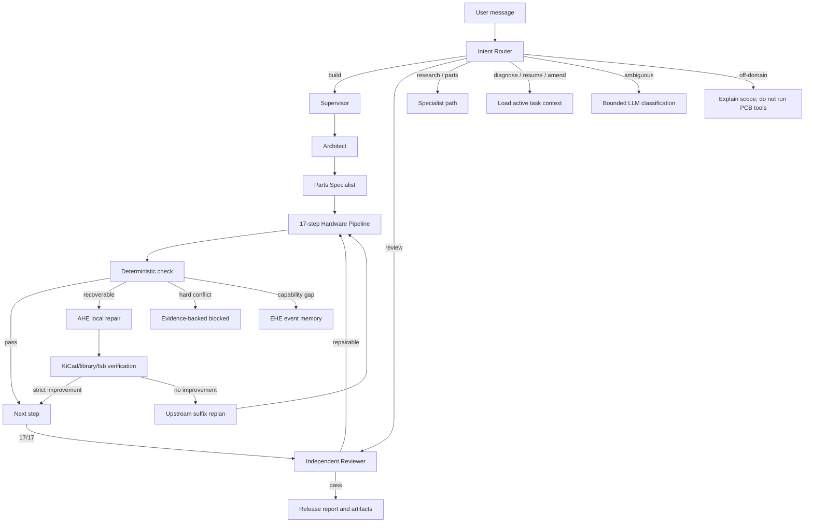

# RatsNestPro Intent + AHE + EHE Architecture

## Goal and boundary

The harness should complete diverse KiCad requests by adapting its execution,
not by accumulating rules for individual boards. “Never blocked” is not a safe
production objective: an impossible electrical constraint, unavailable required
evidence, or an unmanufacturable fixed geometry must still stop. The production
objective is **bounded convergence**:

1. recoverable failure → verify a local repair and continue;
2. downstream failure caused upstream → roll back only the affected suffix and
   replan;
3. recurring capability gap → record cross-project evidence for EHE;
4. hard conflict → return `blocked` with the exact check and artifact evidence.

## Runtime flow

## Intent recognition

The router returns a strict `IntentDecision`, not free-form text:

- `primary_intent`: build, review, research, parts, diagnose, clarify, or
  unsupported;
- `context_relation`: new, resume, amend, or diagnose;
- `source_project_path`, requested outputs, confidence, evidence, and required
  post-actions;
- a clarification question only when the missing choice materially changes the
  execution.

Routing order is:

1. explicit structured mode or tool command;
2. deterministic domain and artifact evidence;
3. active-thread context for short follow-ups such as “继续修复” or “为什么又
   blocked”;
4. a bounded LLM JSON classifier for ambiguous or informal text, including text
   that does not contain an obvious EDA keyword.

The user message is data inside the classifier prompt and cannot override the
classifier schema. A review intent is accepted only when an existing project
artifact can be identified. “Build and then review” remains a build with review
as a post-action.

The classifier system prompt is deliberately compact: it defines the seven
intents, context relation, the existing-project rule for review, and a
single-question clarification policy. Users do not need a requirement template;
requests such as “做个能测温度并通过 USB 上传的小板子” are normalized as build
intent. Greetings and unrelated requests are sent to a separate lightweight LLM
conversation boundary. That boundary answers naturally in the user's language
and never starts or claims a hardware run.

## AHE: task-local convergence

Every failed deterministic check is normalized as a `FailureEnvelope`:

- stable signature: step + check + failure category, without board references;
- category: transient tool, evidence, selection, connectivity, placement,
  routing, verification, hard constraint, or unknown;
- recoverability: retryable, locally repairable, capability gap, or hard
  conflict;
- exact affected references and check evidence.

A repair is accepted only when its step-specific convergence score improves.
The previous artifact remains authoritative until that proof succeeds.

Implemented generic repair classes include:

- bounded selection and netlist deltas, validated against real KiCad symbols and
  footprints;
- grounded connector/crystal normalization based on library metadata;
- functional-anchor placement search with board-boundary and collision checks;
- real ERC-triggered rollback to schematic connectivity;
- deterministic Freerouting strategy portfolios that preserve the best board;
- DRC-monotonic residual gap closure: each copper candidate is kept only if
  unconnected items decrease and no new non-connectivity DRC error appears.

Retries are bounded per failure signature and strategy. A newly introduced
generic strategy receives its own budget; stale failed strategies cannot consume
all future repair capacity. A successful resumed step closes its stale
capability gap.

## EHE: cross-task harness evolution

EHE is append-only experience memory, not uncontrolled runtime source editing.
Each AHE event records:

- project/run identity and a requirement hash (not the prompt or secrets);
- failure signature and category;
- strategy, before/after score, and verified/rejected outcome;
- upstream replan edge and recovered/stagnated/exhausted outcome;
- capability-gap observation or resolution.

EHE changes runtime policy only after evidence from at least two distinct
projects:

- successful repair strategies receive more scheduling budget;
- consistently weak strategies receive less budget;
- successful rollback edges are preferred;
- an unresolved signature seen across projects becomes an evolution candidate.

New executable repair code is promoted through normal code review, tests, and
image build. This prevents one malformed board or prompt from teaching unsafe
global behavior.

## State, checkpoints, and concurrency

There are three state scopes:

1. LangGraph thread state: conversation, current intent, transfers, and agent
   outputs;
2. pipeline state: the ordered 17-step artifact prefix, revision, repairs,
   replans, and active gaps;
3. EHE memory: cross-run append-only outcome events.

Pipeline checkpoints are written after every completed step using atomic
replacement. Restore accepts only the completed, non-blocked canonical prefix;
the failed suffix is regenerated. The same `run_name` is protected by a
cross-thread/cross-process file lock. FastAPI also serializes executions for the
same `(agent, thread)` while allowing different threads to run independently.

## SSE and UI

LangGraph streams `updates`, `messages`, and `custom` events. AHE emits typed
custom events for failure detection, repair outcomes, replans, hard conflicts,
and capability gaps. FastAPI converts every custom dictionary to a typed
`ChatMessage` before SSE serialization. The Next.js client renders known AHE
events and safely displays unknown future extensions instead of terminating the
stream.

## Release truth

A narrative from an LLM cannot override release gates. Build success requires
the real named project artifacts, all 17 steps, actual DSN/SES and SES import,
zero routing unconnected items, KiCad ERC/DRC error count zero, and independent
review. Warnings and unverified manufacturing properties remain visible.

The default JLCPCB 1 oz profile uses a conservative 0.15/0.15 mm working rule,
within the manufacturer’s published
[0.10/0.10 mm capability](https://jlcpcb.com/capabilities/pcb-capabilities/).
Explicit user geometry and a selected manufacturer profile always take
precedence.
