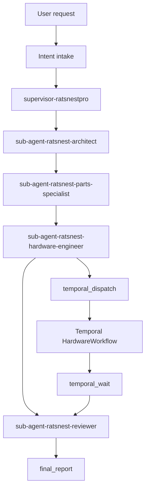

# RatsNestPro LangGraph and Temporal architecture

## Purpose

RatsNestPro uses two orchestration layers with deliberately different responsibilities:

- **LangGraph** owns conversation state, intent routing, specialist delegation, human amendments, and the final user-facing report.
- **Temporal** owns the long-running Hardware Engineer execution: durable step scheduling, activity retry, timeout, cancellation, event history, and compensation.
- **RatsNestPro core** remains the engineering authority. Its typed pipeline state, KiCad checks, artifacts, AHE decisions, and EHE observations are not reimplemented in either orchestrator.

Temporal is therefore not registered as another chat agent. It is an execution service used by the Hardware Engineer sub-agent.

## Multi-agent graph

The service registry and LangGraph configuration expose one public graph named `ratsnestpro-multi-agent`. Internally it contains independently named role subgraphs so checkpoints and stream events retain role ownership.

The Supervisor selects the relevant specialist path but does not fabricate EDA results. Architect evidence, Parts Specialist evidence, Hardware Engineer artifacts, and Reviewer findings remain structured state fields rather than narrative-only handoffs.

## State ownership

| State | Owner | Durable location | Contents |
| --- | --- | --- | --- |
| Conversation and delegation | LangGraph | configured SQLite/PostgreSQL/MongoDB checkpointer | messages, intent, role outputs, Temporal workflow handle, final report |
| Hardware execution | Temporal | Temporal Event History | scheduled steps, attempts, timers, cancellation, compact activity results |
| Engineering state | RatsNestPro | `/data/ratsnestpro/runs/<workspace_run_name>` | pipeline prefix, revisions, issue ledger, AHE/EHE records, KiCad and manufacturing files |
| Live HTTP/SSE replay | FastAPI run registry | process-local bounded buffer | active request status and recent SSE events |

No layer replaces another. In particular, Temporal Event History must not contain KiCad files, complete datasheets, or unbounded LLM transcripts. Activities exchange identifiers and compact summaries; artifacts stay in the shared workspace.

## Hardware workflow

The Hardware Engineer dispatch node starts a workflow using a deterministic workflow ID derived from an internal workspace run key, requirement hash, and bounded hardware-attempt number. The workspace key includes opaque hashes of the validated request's user/thread scope and canonical requirement; the user-facing `run_name` is retained only as a label. Consequently, equal labels submitted by different users cannot attach to the same Workflow or share a KiCad checkpoint. A direct graph caller without user/thread metadata receives a unique scope in intake state, which is persisted by the same LangGraph checkpoint. Legacy state is never allowed to fall back to an unscoped output directory. Its two-node subgraph checkpoints the handle before entering the wait node. A process restart can therefore reconnect to the existing execution instead of creating a duplicate.

The workflow advances the canonical 17-step pipeline in order:

1. requirements;
2. topology;
3. selection;
4. schematic connections;
5. schematic pin map;
6. schematic layout;
7. schematic materialization;
8. ERC;
9. board partition;
10. critical placement;
11. general placement;
12. PCB write;
13. route plan;
14. planes;
15. signal routing;
16. fabrication audit;
17. manufacturing outputs.

One generic Activity implementation receives the expected step and run manifest. The bounded requirement is present once in Workflow input and once in the first Activity command; that invocation persists it in the isolated workspace and binds it to the Workflow ID and requirement digest. Later Activity Event History entries carry only the manifest path. Complete datasheets, KiCad files, and unbounded transcripts never enter Event History. The Activity loads checkpointed engineering state, skips an already completed canonical prefix, atomically checkpoints accepted progress, and returns a compact typed result. Duplicate Activity delivery is consequently safe without maintaining 17 copies of the same wrapper code.

Domain outcomes and execution failures are intentionally different:

- an ERC/DRC finding, unavailable part database, or unsatisfied design rule is a normal structured result;
- a transport timeout, provider throttling response, unavailable worker dependency, or temporary filesystem error can be retryable;
- an invalid requirement, hard electrical conflict, or deterministic schema violation is non-retryable unless AHE has an explicit repair strategy.

## Retry and timeout policy

Temporal owns infrastructure retries for Temporal-backed execution. The existing AHE loop continues to own bounded engineering repair. They must not retry the same failure independently.

| Failure class | Temporal retry | AHE/EHE action |
| --- | --- | --- |
| Network timeout, HTTP 429/5xx, transient worker dependency | bounded exponential backoff | record attempts only |
| LLM output fails a repairable typed contract | no blind activity retry | bounded local repair/replan |
| ERC/DRC or component-selection issue | no infrastructure retry | keep artifact, issue and recommendation |
| Hard requirement conflict | never | evidence-backed blocked result |
| Missing Harness capability | never as the same activity | structured EHE capability gap |

Every activity has a Start-to-Close timeout. Long external processes such as Freerouting also heartbeat so cancellation and worker loss are observable. The workflow execution timeout is longer than any individual activity timeout. The FastAPI request timeout is not used as the source of truth for workflow completion.

## Cancellation and Saga compensation

The workflow exposes pause, resume, and cooperative-cancel signals. Pause is intentionally a **step-boundary pause**: it prevents the next canonical step but does not suspend a KiCad or Freerouting process halfway through a file write. Cooperative cancel interrupts the isolated Activity child process and then runs an idempotent Saga compensation Activity; a direct Temporal cancellation uses the same cleanup path.

The current Saga has one deliberate compensation: preserve generated schematics, PCB files, reports, logs, and checkpoints, and atomically write `temporal_recovery.json` describing the failed step and resumable prefix. It does not invent rollback for irreversible EDA work and never erases evidence merely to make a failed run look clean. The compensation result (including a compensation failure) is attached to the terminal Temporal result rather than silently discarded.

Activities and compensations use the same Workflow-scoped workspace identity. A retried compensation overwrites the same recovery record and is safe.

## Event history and frontend streaming

After each workflow milestone, the Hardware Engineer wait node reads the compact workflow status and emits a LangGraph custom event. FastAPI serializes custom dictionaries as `ChatMessage(type="custom")`, allowing the Next.js client to show queued, running, retrying, compensating, completed-with-issues, and failed states without parsing prose.

LangGraph checkpoints store the Temporal workflow ID. During an active wait, the client queries a monotonic progress version and forwards each changed milestone through the existing custom SSE channel. If the HTTP request is cancelled, only the local result wait is cancelled; the Temporal workflow keeps running and a later graph resume can attach by ID.

This workflow is bounded to 17 compact Activity summaries, so Continue-As-New is unnecessary in the current design. If future versions add unbounded human-review/repair cycles, they must introduce Continue-As-New before that loop is enabled.

## Deployment

The default Compose stack enables Temporal and contains:

- the official `temporalio/temporal` development server, with its embedded SQLite persistence and Web UI;
- one independent, single-concurrency `temporal_worker` using the same service image and RatsNestPro workspace as `agent_service`;
- worker activity concurrency fixed to one by default to prevent simultaneous KiCad/Freerouting jobs from saturating a development workstation.

The bundled development server is for local development and focused integration tests. Production deployments should point `TEMPORAL_ADDRESS` at Temporal Cloud or an independently operated production Temporal cluster and enable the corresponding authentication/TLS configuration.

The Agent Service and worker must run the same application version. Both mount `/data/ratsnestpro`; only the worker executes the long Hardware activities.

For migration safety, a direct host process that does not use Compose keeps Temporal disabled unless `RATSNESTPRO_TEMPORAL_ENABLED=true` is explicitly configured.

## Compatibility and degradation

- With `RATSNESTPRO_TEMPORAL_ENABLED=false`, the legacy in-process Hardware adapter remains available during migration.
- If Temporal is enabled but unavailable before workflow dispatch, the Hardware specialist reports the runtime failure explicitly. It does not silently weaken the requested durability contract.
- After a Temporal workflow has started, execution must reconnect to that workflow. It must not fall back mid-run and execute the same hardware steps a second time.
- A runtime Temporal outage is reported by the Hardware specialist and does not trigger duplicate local execution. In the bundled Compose profile, `agent_service` intentionally waits for Temporal health during startup.

## Verification strategy

Default tests are deliberately lightweight and do not start Docker, KiCad, Freerouting, or a real LLM. They verify registry targets, graph/subgraph names, dependency and Compose contracts, environment documentation, retry classification, idempotent activity inputs, Saga ordering, and typed SSE adaptation using fakes.

A separate opt-in Temporal contract test may use the SDK time-skipping environment. Real KiCad/Freerouting and full UI matrices remain manual or scheduled tests rather than part of each edit cycle. Worker-version compatibility and a real Temporal replay test are release checks, not per-edit checks.

Useful primary references:

- [Temporal Python SDK](https://github.com/temporalio/sdk-python)
- [Temporal CLI development server image](https://hub.docker.com/r/temporalio/temporal)
- [Temporal failure detection and retries](https://docs.temporal.io/encyclopedia/retry-policies)
- [Temporal Event History](https://docs.temporal.io/workflow-execution/event)
