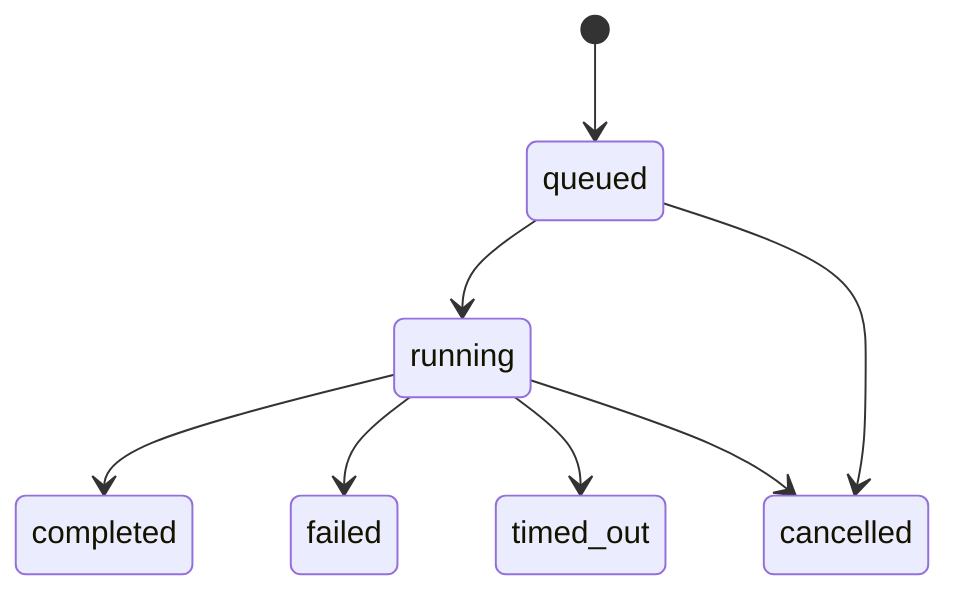

# RatsNestPro production runtime

This document describes the runtime guarantees around the intent router, AHE/EHE workflow, LangGraph state, FastAPI streaming service, and Next.js client.

## State ownership

There are three state layers, each with one responsibility:

1. **LangGraph checkpoint state** is the durable conversation and graph state. Docker Compose uses PostgreSQL. `thread_id` is namespaced by agent and bound to `user_id`.
2. **RatsNestPro pipeline state** is the durable engineering state under `/data/ratsnestpro/runs/<run_name>`. It checkpoints each accepted pipeline step, repair, replan, capability gap, and artifact.
3. **Run registry state** is bounded, short-lived operational state for active HTTP runs and SSE replay. It never replaces either durable state layer.

The request id and a canonical request fingerprint are also stored in the LangGraph runnable configuration. After a process restart, the same request resumes or returns the checkpointed result instead of appending a duplicate human message.

## Run lifecycle

Every invoke or stream request has a caller-provided or client-generated `request_id`.



- Reusing the same id and payload attaches to or returns the same run.
- Reusing the same id with a different payload returns HTTP 409.
- The service admits at most `MAX_CONCURRENT_RUNS + MAX_QUEUED_RUNS` unfinished runs.
- Excess work returns HTTP 429 with `Retry-After`.
- Per-run timeouts are capped by `RUN_TIMEOUT_SECONDS`.
- Status is available at `GET /runs/{request_id}`.
- Cancellation is available at `DELETE /runs/{request_id}`.

The registry keeps completed records only for `RUN_RETENTION_SECONDS`. It uses a bounded event deque, so slow or disconnected clients cannot create unbounded server memory growth.

## SSE reliability and backpressure

The producer is a background task owned by the registry, not by the client socket. Closing or refreshing a browser therefore does not cancel the engineering run.

Each JSON SSE event contains an increasing `event_id`. The client reconnects using the same `request_id` and `last_event_id`; buffered events are replayed without resubmitting the user message. Heartbeat comments keep idle proxies from closing the stream. If a cursor is older than the bounded buffer, the server emits `replay_gap`; the client should reload durable thread history.

`SSE_MAX_EVENT_BYTES` prevents one malformed tool event from consuming unbounded memory.

## Concurrency and state races

- A process-local lock serializes the same `(agent_id, thread_id)`.
- With PostgreSQL, a stable advisory lock also serializes that key across service processes.
- Different threads can execute concurrently, subject to the global admission limit.
- A per-run filesystem lock protects each RatsNestPro run directory across threads and processes.
- Checkpoint and pipeline JSON writes use temporary files followed by atomic replacement.
- EHE writes one immutable UUID-named event file per observation, so concurrent learning events do not overwrite each other.

For multiple service replicas, use sticky routing if operators need live status/cancellation from any request path. Engineering and graph consistency remain protected by PostgreSQL and run-directory locks, but the short-lived SSE buffer and task cancellation handle are intentionally process-local.

## Failure semantics

- Transient or empty tool results use bounded retries.
- Recoverable pipeline failures enter AHE local repair or minimum-suffix rollback.
- Cross-project capability gaps are recorded for EHE only after deterministic evidence.
- Hard constraints and exhausted repairs remain evidence-backed `blocked`.
- A stream-level exception produces a typed error event and a terminal run status; it is not reported as success.
- Unknown agents return HTTP 404 before a background run is created.

## Health and operations

- `/health/live` checks process liveness.
- `/health/ready` becomes ready only after database/store setup and mandatory agent loading.
- `/metrics` exposes bounded run counts and readiness without adding a metrics dependency.
- Every HTTP response receives an `X-Request-ID`.
- Request bodies with a declared size over `MAX_REQUEST_BODY_BYTES` return HTTP 413.

Docker health checks use `/health/ready`, not `/info`. Compose binds PostgreSQL and the FastAPI port to localhost; the Next.js BFF reaches FastAPI on the private Docker network.

## Production configuration

At minimum:

```dotenv
MODE=production
AUTH_SECRET=<strong-random-secret>
REQUIRE_AUTH_IN_PRODUCTION=true
MAX_CONCURRENT_RUNS=4
MAX_QUEUED_RUNS=16
RUN_TIMEOUT_SECONDS=3600
SSE_EVENT_BUFFER_SIZE=4096
```

`MODE=production` refuses to start without `AUTH_SECRET` unless `REQUIRE_AUTH_IN_PRODUCTION=false` is explicitly set behind a trusted authentication proxy.

The repository does not generate or commit an authentication secret. Secret creation and rotation belong to the deployment secret manager.

## Verification

The runtime test suite covers:

- idempotent invoke and payload conflicts;
- disconnect plus event replay;
- timeout and cancellation;
- bounded queue and concurrency;
- thread ownership;
- unknown-agent rejection;
- process-restart checkpoint resumption;
- client reconnect cursors;
- cross-process PostgreSQL advisory locking.

These runtime guarantees do not claim that every physically impossible board can succeed. They guarantee that recoverable failures continue automatically, concurrent state remains consistent, and genuine hard failures are reported truthfully with preserved artifacts.
