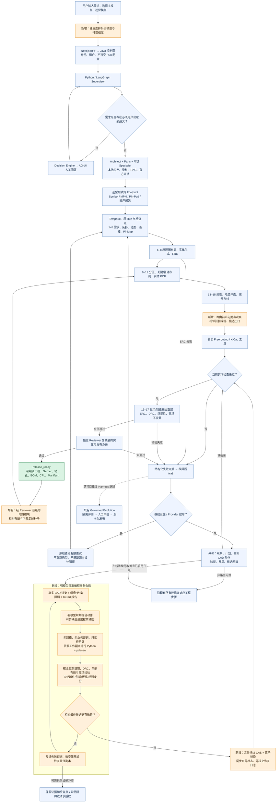

# 从需求到发布：多智能体与隔离强模型执行器

图中橙色为本次新增/增强；蓝色为已有链路。17 步外层顺序不变，候选编辑与反思在所属工程步骤内部完成。没有模型拥有修改发布判定的权限，也不能承诺任意需求都成功。

## 哪些恢复会重跑？

图中回到 Temporal 表示恢复耐久调度入口，不表示从第 1 步重做。前缀检查点仍由既有恢复契约验证并跳过；布局/路由修复只失效受影响的下游制造产物。强模型的提交日志用于处理“PCB 已替换、进程尚未来得及持久化布局状态”的崩溃窗口。

## 新增能力的实际边界

- 路由前拥塞观察提供几何证据，不是新增的刻板阻断门禁。
- 联合搜索为至多 8 个相关引脚同时预留线段和过孔；它可能找不到解，也不代替完整布线。模型可改布局、拆线、换策略，再由真实工具验证。
- 强模型可以编写项目副本内的 Python CAD 修复程序，不能直接改生产生成器、原理图电气身份、发布门禁或用户硬约束。生产代码改进仍走既有受治理发布路径。
- 模块模板需要相同的已验证器件资产，并重查新任务的空间与电气约束；历史成功不是当前任务自动放行凭证。
- 原实例已成功；新执行器的隔离和真实 CAD 读写经过检查，不据此宣称已完成新模型自主端到端成功率评测。
