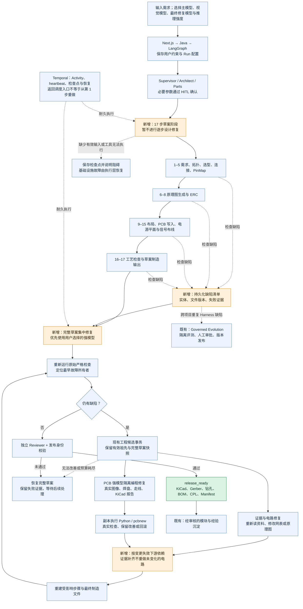

# 从需求到发布：多智能体与隔离强模型执行器

图中橙色为新增/增强；蓝色为已有链路。默认先完成 17 步可执行草案，再集中修复，具体调度与恢复规则见[草案优先策略](DRAFT_THEN_REPAIR.md)。模型修改工程候选，原始严格检查决定发布条件。

## 哪些恢复会重跑？

Temporal 恢复耐久调度时不表示从第 1 步重做。前缀检查点仍由恢复契约验证并跳过；集中修复保留有效祖先，变更工程契约或真实 CAD 文件时保守地重建其后续依赖。仅补充选型资料且器件身份不变时保留电路和 PCB。候选快照与提交日志保护进程中断时的完整草案。

## 新增能力的实际边界

- 路由前拥塞观察提供几何证据，不是新增的刻板阻断门禁。
- 联合搜索为至多 8 个相关引脚同时预留线段和过孔；它可能找不到解，也不代替完整布线。模型可改布局、拆线、换策略，再由真实工具验证。
- 强模型可以编写项目副本内的 Python CAD 修复程序，不能直接改生产生成器、原理图电气身份、发布门禁或用户硬约束。生产代码改进仍走既有受治理发布路径。
- 模块模板需要相同的已验证器件资产，并重查新任务的空间与电气约束；历史成功不是当前任务自动放行凭证。
- 原实例已成功；新执行器的隔离和真实 CAD 读写经过检查，不据此宣称已完成新模型自主端到端成功率评测。
