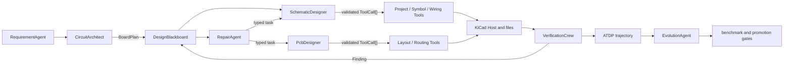

# Autonomous Agent Architecture

## Invariant

LLMs propose decisions. Typed contracts validate them. Deterministic Tool
Services execute them. KiCad files are the source of truth. Checkers judge the
result. AHE may evolve policy assets, but promotion gates govern deployment.

An LLM never writes a `.kicad_sch` or `.kicad_pcb` file directly.

## Design flow

## Agent loop

`SchematicDesigner` and `PcbDesigner` execute a bounded loop:

1. Observe a fresh `DesignState` derived from KiCad files and trusted tool
   outcomes.
2. Ask the configured `LlmBrain` for an `AgentPlan`, or use the deterministic
   recovery planner when LLM mode permits fallback.
3. Validate tool ownership, exact arguments, planned references/nets, geometry,
   initialization order, action budget, and save ordering.
4. Execute each `ToolCall` through the capability-scoped Tool Service.
5. Observe file truth again and evaluate explicit acceptance criteria.
6. Complete, re-plan, or publish a blocked task after the step budget expires.

`RATSNEST_LLM=require` rejects missing, malformed, unsafe, empty, or premature
LLM plans. `auto` records the rejection and switches to deterministic recovery.

## Typed collaboration

`crews/contracts.py` defines the collaboration language:

- `BoardPlan`: topology, immutable solved component catalog, net graph, outline,
  and constraints.
- `AgentPlan` and `ToolCall`: a goal, bounded actions, reasons, and expected
  results.
- `AgentTask` and `AgentMessage`: typed assignments and Blackboard messages.
- `ToolExecution`: success/failure evidence for every action.
- `DesignState`: observed schematic/PCB state, tasks, messages, and history.

`CircuitArchitect` may change bounded layout intent and rationale, but the
current contract does not let it alter solver-authoritative parts, values, or
connections. This is deliberate until more topology families and benchmarks
exist.

## AHE policy surface

The active `StrategyBundle` owns Agent prompts and bounded tool policies.
Trajectory statistics count Agent plans, failed tool calls, and blocked tasks.
`EvolutionAgent` may propose:

- prompt updates for known Agent names;
- `max_steps` and `max_actions_per_step` within fixed limits;
- existing solver, MPN, repair mapping, suppression, and score-weight assets.

It cannot add tool permissions or bypass electrical/contract checks. Every
candidate still runs candidate-vs-incumbent benchmark gates before promotion.

## Current product boundary

The implementation is autonomous within the AP1117 adjustable linear-regulator
board family. Real KiCad smoke verification covers schematic creation, six
footprints, board outline, placement, eight routed connections, previews,
release packaging, and the closed verification loop. Arbitrary topology
synthesis and production thermal/EMC simulation are not yet implemented.
